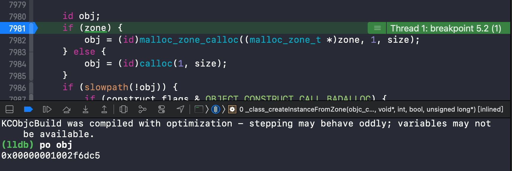
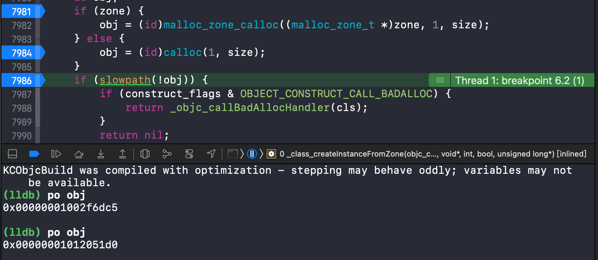
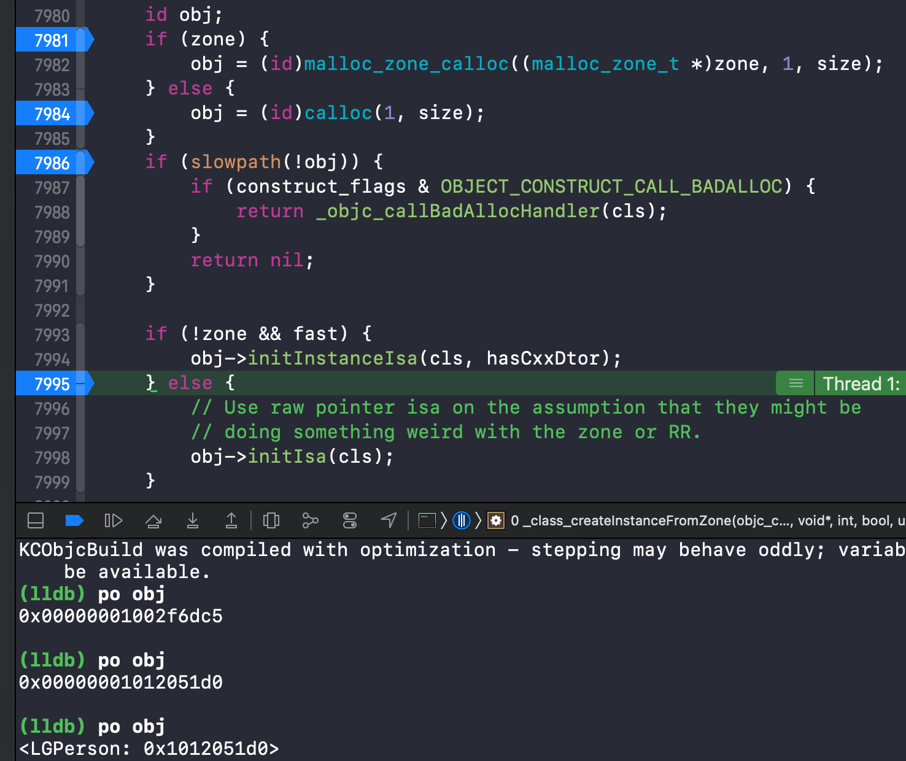
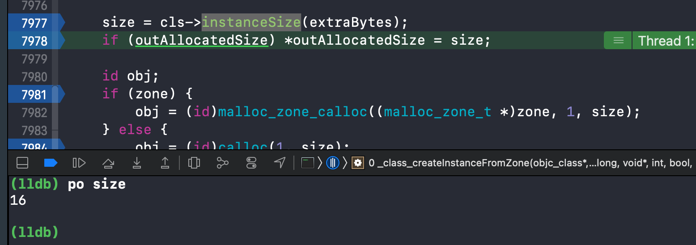
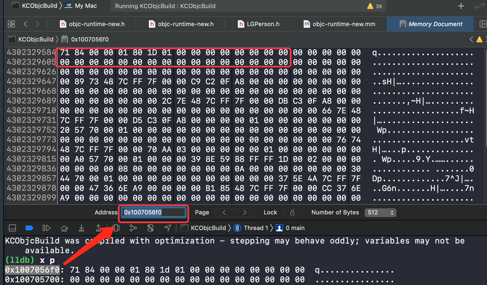
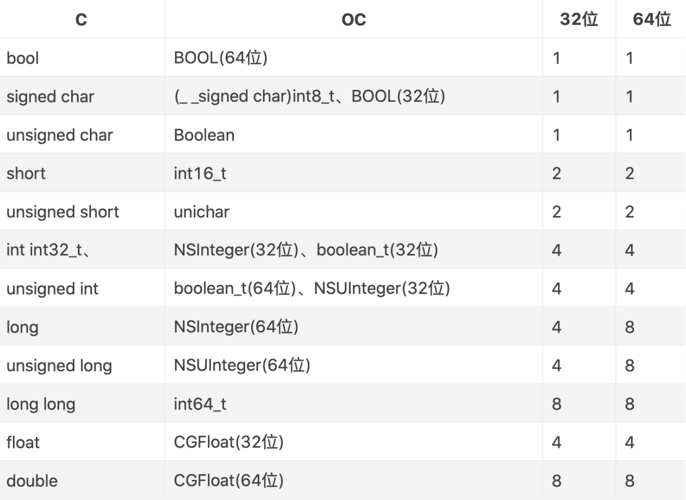

## alloc 与 init

### 初探

**代码：**

```objective-c
LGPerson *p1 = [LGPerson alloc];
LGPerson *p2 = [p1 init];
LGPerson *p3 = [p2 init];

NSLog(@"%@-%p-%p",p1,p1,&p1);
NSLog(@"%@-%p-%p",p2,p2,&p2);
NSLog(@"%@-%p-%p",p3,p3,&p3);
```

**输出：**

```objective-c
<LGPerson: 0x600000e8c120>-0x600000e8c120-0x7ffeee2d30c8
<LGPerson: 0x600000e8c120>-0x600000e8c120-0x7ffeee2d30c0
<LGPerson: 0x600000e8c120>-0x600000e8c120-0x7ffeee2d30b8
```

**思考**

alloc 是不是有了内存，有指针指向

init  内存是否一样！证明 init 没有对指针进行操作

**初步结论：**

- alloc 开辟内存空间 (0x6~ 堆内存地址)

- &p 取指针地址
  - p1/p2/p3 三个指针指向 alloc 开辟的同一内存空间
  - p1/p2/p3 三个指针地址在栈里 (0x7~ 栈内存地址)连续开辟，相差8字节(b8 -- c0 -- c8)

### 查看源码

> 目的是明确
>
> - `alloc` 的实现流程
> - `alloc` 怎样开辟内存的空间，开辟多少

#### 下载地址

[Source Browser][https://opensource.apple.com/tarballs/] -- objc4/ -- objc4-824

[Apple Open Source][https://opensource.apple.com] -- MacOS -- 11.3 -- objc4-824

### 汇编结合源码调试

#### 源码实现

对 alloc 源码实现查看：

##### 1、(id)alloc 方法实现

```objc
+ (id)alloc {
    return _objc_rootAlloc(self);
}
```

##### 2、id _objc_rootAlloc(Class cls) 方法实现

```objc
id
_objc_rootAlloc(Class cls)
{
    return callAlloc(cls, false/*checkNil*/, true/*allocWithZone*/);
}
```

##### 3、callAlloc 方法实现

```objc
static ALWAYS_INLINE id
callAlloc(Class cls, bool checkNil, bool allocWithZone=false)
{
#if __OBJC2__
    if (slowpath(checkNil && !cls)) return nil; //[拓展1]
    if (fastpath(!cls->ISA()->hasCustomAWZ())) {  //AWZ methods: +alloc / +allocWithZone:
        return _objc_rootAllocWithZone(cls, nil);
    }
#endif

    // No shortcuts available.
    if (allocWithZone) {
        return ((id(*)(id, SEL, struct _NSZone *))objc_msgSend)(cls, @selector(allocWithZone:), nil);
    }
    return ((id(*)(id, SEL))objc_msgSend)(cls, @selector(alloc));
}

```

##### 4、分叉执行判断

此时出现 `_objc_rootAllocWithZone` 和 `objc_msgSend` 两个分叉回调，要判断执行方法，可添加符号断点在执行代码时确认执行顺序

- 添加 `_objc_rootAlloc` 、 `callAlloc ` 两个符号断点
- 再次运行 alloc 代码
- 在需要探究的 alloc 代码实现行添加断点，同时 Disable 上述两个符号断点。 (目的是准确定位探究的代码实现，在探究的代码前不开启符号断点，防止符号断点在其他位置的执行)
- 运行程序，在代码断点到达后，开启符号断点 (可用 `register read` 查看当前寄存器信息判断是否到达当前代码位置)
- 得到调试信息

```assembly
//断点汇编信息
libobjc.A.dylib`_objc_rootAlloc:
->  0x7fff2018ec7a <+0>:  movq   (%rdi), %rax
    0x7fff2018ec7d <+3>:  testb  $0x40, 0x1d(%rax)
    0x7fff2018ec81 <+7>:  je     0x7fff2018ec88            ; <+14>
    0x7fff2018ec83 <+9>:  jmp    0x7fff20188a75            ; _objc_rootAllocWithZone
    0x7fff2018ec88 <+14>: movq   0x66bcd831(%rip), %rsi    ; "allocWithZone:"
    0x7fff2018ec8f <+21>: xorl   %edx, %edx
    0x7fff2018ec91 <+23>: jmpq   *0x5fe8eff9(%rip)         ; (void *)0x00007fff20173780: objc_msgSend
```

此时汇编代码存在两个跳转实现  `_objc_rootAllocWithZone` 和 `objc_msgSend`  

得出结论：使用断点执行查看，代码执行先执行了objc_msgSend，再执行了 _objc_rootAllocwithZone

#### 源码编译

在 `4、分叉执行判断` 中，使用断点方式解决了底层的执行判断问题，但是如果判断条件很多，分支又存在分支时，断点方式就比较复杂，需要不停添加断点，这样就很不直观。

因此选择源码编译来直接在源码函数和方法处打断点就是更好的选择。

##### 发现问题

在编译时，发现如下问题：

- `callAlloc` 方法被调用了两次
- 在过掉 `[LGPerson alloc]` 处的断点后，并未跳转  `+ (id)alloc` 以及`_objc_rootAlloc` 方法执行

**此问题探究参见 2-1总结**。

此处简略描述： macho 编译绑定符号时，绑定 `objc_alloc` 到 alloc 上，因此首先执行 `objc_alloc` ，然后其后续的 `callAlloc` 的方法中进行 `objc_msgSend` 消息转发，调起 `NSObject` 的 `alloc`  类方法，从而开始执行当前流程。

> 上接 alloc 流程，在源码中向下继续探索，从 `_objc_rootAllocWithZone`开始

##### _objc_rootAllocWithZone

```c++
NEVER_INLINE
id
_objc_rootAllocWithZone(Class cls, malloc_zone_t *zone __unused)
{
    // allocWithZone under __OBJC2__ ignores the zone parameter
    return _class_createInstanceFromZone(cls, 0, nil,
                                         OBJECT_CONSTRUCT_CALL_BADALLOC);
}
```

##### _class_createInstanceFromZone

```c++
/***********************************************************************
* class_createInstance
* fixme
* Locking: none
*
* Note: this function has been carefully written so that the fastpath
* takes no branch.
**********************************************************************/
static ALWAYS_INLINE id
_class_createInstanceFromZone(Class cls, size_t extraBytes, void *zone,
                              int construct_flags = OBJECT_CONSTRUCT_NONE,
                              bool cxxConstruct = true,
                              size_t *outAllocatedSize = nil)
{
    ASSERT(cls->isRealized());

    // Read class's info bits all at once for performance
    bool hasCxxCtor = cxxConstruct && cls->hasCxxCtor();
    bool hasCxxDtor = cls->hasCxxDtor();
    bool fast = cls->canAllocNonpointer();
    size_t size;

    size = cls->instanceSize(extraBytes);
    if (outAllocatedSize) *outAllocatedSize = size;

    id obj;
    if (zone) {
        obj = (id)malloc_zone_calloc((malloc_zone_t *)zone, 1, size);
    } else {
        obj = (id)calloc(1, size);
    }
    if (slowpath(!obj)) {
        if (construct_flags & OBJECT_CONSTRUCT_CALL_BADALLOC) {
            return _objc_callBadAllocHandler(cls);
        }
        return nil;
    }

    if (!zone && fast) {
        obj->initInstanceIsa(cls, hasCxxDtor);
    } else {
        // Use raw pointer isa on the assumption that they might be
        // doing something weird with the zone or RR.
        obj->initIsa(cls);
    }

    if (fastpath(!hasCxxCtor)) {
        return obj;
    }

    construct_flags |= OBJECT_CONSTRUCT_FREE_ONFAILURE;
    return object_cxxConstructFromClass(obj, cls, construct_flags);
}

```

**分析代码:**

- 当前研究如何创建对象(alloc)，重点在于对象
- 关注函数的 `return`  ，找到其中的对象 -- `obj`
- 找到 `obj` 创建的代码，打断点查看

此时断点如图示：



> **问题：** 在 `lldb` 输出 `obj` 时，存在地址，但当前 `obj` 还未进行初始化分配，为什么存在地址？
>
> **解答：**因为 `obj` 还未初始化分配地址，因此内存分配了一块地址，该地址是脏内存地址简称脏地址，即被使用过的，因此存在地址，实际上 `obj` 依然未初始化开辟出来

- 继续向下执行，经过 `calloc` 方法，在之后再次查看 `obj` ，发现地址变更，已经真正创建，进行新的地址的赋值



> **问题：**此时 `obj` 作为一个对象，对比其他对象的打印 `<LGDPerson: 0x60000140c210>` ，为什么不同？
>
> **分析：** 对比发现 `obj` 缺少前缀部分，说明还未绑定到类里面去，没有与类进行关联。  关联类的是 `isa` 

- 执行到 `initInstanceIsa` 函数之后，再次查看



验证 `isa` 相关方法把类与对象进行了关联绑定

> 此时 `alloc` 的主线流程已经逐渐清晰，依然不清楚的是 **怎么开辟的内存？开辟了多少内存？**

##### 内存分配

在分配内存的 `obj = (id)calloc(1, size)` 方法时发现 size 参数，向上查看获取 size 的方法，找到 `size = cls->instanceSize(extraBytes)` ， 此时参数 `extraBytes` 额外要开辟的内存为0，然后查看函数实现

```c++
    inline size_t instanceSize(size_t extraBytes) const {
        if (fastpath(cache.hasFastInstanceSize(extraBytes))) { //缓存快速计算
            return cache.fastInstanceSize(extraBytes);
        }

        size_t size = alignedInstanceSize() + extraBytes;
        // CF requires all objects be at least 16 bytes.
        if (size < 16) size = 16;
        return size;
    }
```

此方法使用断点查看时，都执行的使用缓存快速计算 `cache.fastInstanceSize(extraBytes)` [拓展2]

> 此处编译器进行优化，使用 `fastpath()` 代码设置 `#define fastpath(x) (__builtin_expect(bool(x), 1))` ，告诉编译器最有可能执行的的分支，避免跳转语句使得编译更高效

查看内存分配结果，可得 size 为 16



##### 梳理首次内存分配流程

###### 1、对象内存大小计算

阅读代码可知，在没有缓存时执行下部分支代码，是无缓存计算内存大小逻辑，进行分析：

```c++
// inline size_t instanceSize(size_t extraBytes) const 方法
    size_t size = alignedInstanceSize() + extraBytes;
------
    // Class's ivar size rounded up to a pointer-size boundary.  ivar: 实例变量、成员变量
    uint32_t alignedInstanceSize() const {
        return word_align(unalignedInstanceSize());  //对未对齐的实例变量尺寸进行内存对齐
    }

```

此时获取对齐后成员变量大小方法 `alignedInstanceSize()` 是内存分配的核心，对其实现分析

1)、参数 **unalignedInstanceSize()**

通过此未对齐的实例大小方法和注释，确认 **对象的内存大小只与成员变量有关，与方法无关，与其它无关**

```C++
    // May be unaligned depending on class's ivars.
    uint32_t unalignedInstanceSize() const {
        ASSERT(isRealized());
        return data()->ro()->instanceSize;
    }
```

此时来确认 LGPerson 的内存大小：

对 LGPerson 进行分析，当前 LGPerson 无任何成员变量，是否表示分配内存大小为 0 呢？ 

注意到 LGPerson 继承于 NSObject ，而 NSObject.h 文件查看可得，存在 isa

```objc
@interface NSObject <NSObject> {
#pragma clang diagnostic push
#pragma clang diagnostic ignored "-Wobjc-interface-ivars"
    Class isa  OBJC_ISA_AVAILABILITY;
#pragma clang diagnostic pop
}
```

而 `Class` 类型又是指的什么呢？ 查看 objc 源码中 `objc.h` 文件

```C++
#if !OBJC_TYPES_DEFINED
/// An opaque type that represents an Objective-C class.
typedef struct objc_class *Class;

/// Represents an instance of a class.
struct objc_object {
    Class _Nonnull isa  OBJC_ISA_AVAILABILITY;
};

/// A pointer to an instance of a class.
typedef struct objc_object *id;
#endif

```

因此可得 `isa` 是一个 `struct * `  类型，即结构体指针类型，指针类型占用 8 字节[参考1]

> 而 `objc_class` 是从哪里来的呢？  在此处是继承于 `objc_object` ，万物皆对象，类也是对象

**结论：** 当前 LGPerson 的大小为 8字节

2)、方法 `word_align` 字节对齐

在确认了未对齐的成员变量们的大小这个参数后，来看 `word_align` 字节对齐方法的实现

```C++
#ifdef __LP64__
#   define WORD_SHIFT 3UL
#   define WORD_MASK 7UL
#   define WORD_BITS 64
#else
#   define WORD_SHIFT 2UL
#   define WORD_MASK 3UL
#   define WORD_BITS 32
#endif

static inline uint32_t word_align(uint32_t x) {
    return (x + WORD_MASK) & ~WORD_MASK;
}
static inline size_t word_align(size_t x) {
    return (x + WORD_MASK) & ~WORD_MASK;
}
```

核心方法替换宏后解析为： `(x + 7) & ~7`  

> 算法归纳为：(size + (align - 1)) & ~(align - 1)
>
>  例如 8 字节对齐要求，后三位为0. 
>
>  (align-1) 表示后三位111
>
>  size + (aling-1) 会导致进位 (后三位有任意一个 1 都会导致进位)
>
>  & ～(aling-1）去除后面多余的三位

```tex
8 字节对齐示例
题目：对 10 字节做字节对齐
(10 + 7) & ~7
        二进制
  10    0000 1010
  7     0000 0111
10 + 7  0001 0001
 ~7     1111 1000
17 & ~7 0001 0000  = 16
结果： 对齐后为 16字节

8 字节对齐还等同于 (size + 7) >>3 <<3 即消除后三位的1
```

根据算法归纳的公式得，此时代码目的是进行 8字节对齐，即取8的整数倍(向上取整)。

此时又产生问题： 

- 为什么要取 8 的倍数，而不是 16、32 或者其他数字呢？
  - 向下兼容，8 是不同数据类型字节中最大的，可以容下所有类型的字节大小[参考1]
  - 8字节在整个内存中使用的最多的，在 ARM64架构下没有比 8字节 更大的数据类型
- 为什么要进行字节对齐？
  - 以空间换时间。在内存读取和存储时，不再需要不断变化内存读取大小，统一以 8 字节进行存取

###### 2、最终分配

```C++
  // CF requires all objects be at least 16 bytes.
  if (size < 16) size = 16;
  return size;
```

根据上述判断可得，最少要 16 bytes.

为什么要取最小 16 字节呢

- 在一个对象中，isa成员变量占据 8字节，为了容错考虑，预留了 8 字节
- 如果不预留，在内存中 isa 与 isa 的内存紧挨着，容易造成指针指向出错

###### 3、内存优化：内存对齐

在上面的字节对齐中，若 LGPerson 存在多种不同类型成员变量，例如 int、char 等类型，按照 8 字节对齐的规则话，对 char 这种1个字节的类型，单独使用 8字节内存，是否造成了空间浪费呢？ 让我们探究下当前的实现

- 给 LGPerson 创建多种类型的成员变量，并在 alloc 方法执行完的下一行打上断点

```objc
@interface LGPerson : NSObject
@property (nonatomic,strong) NSString *name;
@property (nonatomic,strong) NSString *nickName;
@property (nonatomic) int hobby;
@property (nonatomic) long height;
@end
```

运行，跳到断点处，此时

```shell
(lldb) x p
0x1007056f0: 71 84 00 00 01 80 1d 01 00 00 00 00 00 00 00 00  q...............
0x100705700: 00 00 00 00 00 00 00 00 00 00 00 00 00 00 00 00  ................
# x 命令读取内存  展示格式为 首地址：内存
# iOS端，内存以小端格式存放，因此 8个字节地址 0x01ld800100008471

(lldb) p 0x011d800100008471
(long) $1 = 80361110145893489
# 这个地址是 isa 需要 &ISA_MASK才能查看    
# 当前源码在 Mac 上跑，注意使用 x86架构下的宏定义；若使用真机记得替换 
# if __arm64__
#// ARM64 simulators have a larger address space, so use the ARM64e
#// scheme even when simulators build for ARM64-not-e.
#   if __has_feature(ptrauth_calls) || TARGET_OS_SIMULATOR
#     define ISA_MASK        0x007ffffffffffff8ULL
# elif __x86_64__
#   define ISA_MASK        0x00007ffffffffff8ULL

(lldb) po 0x011d800100008471 & 0x00007ffffffffff8
LGPerson
```

首地址后的地址存储其他声明的成员变量，由于 alloc 后未进行赋值，所以当前内存为空，但是空间已经开辟。

使用 Xcode 的工具栏 `Debug -- Debug Workflow -- View Memory`  查看 `0x1007056f0` 地址以及其后的连续内存



- 给 LGPerson 进行赋值后，再进行查看

```objc
//.h
@interface LGPerson : NSObject
@property (nonatomic,strong) NSString *name;
@property (nonatomic,strong) NSString *nickName;
@property (nonatomic) int age;
@property (nonatomic) BOOL young;
@end
// main.m
int main(int argc, const char * argv[]) {
    @autoreleasepool {

        LGPerson *p = [LGPerson alloc] ;
        p.name = @"LGD";
        p.nickName = @"大叔";
        p.age = 18;
        p.young = 1;
        NSLog(@"%@",p);
    }
    return 0;
}

```

此时使用命令查看内存

```shell
(lldb) x/6gx p  # 按十六进制变量，八字节一个地址单元，展示6个内存单元。 [参考2]
0x101219b90: 0x011d800100008491 0x0000001200000001
0x101219ba0: 0x0000000100004010 0x0000000100004030
0x101219bb0: 0x6c6f6f54534e5b2d 0x536c6c7546726162

# 下面两个内存地址可以直接查询到内存存储的内容
(lldb) po 0x0000000100004010
LGD

(lldb) po 0x0000000100004030
大叔

#查看 0x0000001200000001 这片内存，发现是由 Int(4字节) 和 bool(1字节)拼装
(lldb) po 0x0000001200000001
77309411329

(lldb) po 0x00000012
18

(lldb) po 0x00000001
1
```

由此展示的内存对齐效果，回答了提出的问题，系统会进行内存对齐来优化节省空间。[拓展3]


## 参考

### 参考1

不同数据类型字节大小



### 参考2

```
lldb命令 x 
x 的使用 读取内存
x /nuf <addr>
n 表示要显示的内存单元的个数
－－－－－－－－－－－－－－－－－－－－－－－－－－－－－－－－－－－－－－－－－
u 表示一个地址单元的长度：
b表示单字节
h表示双字节
w表示四字节
g表示八字节
－－－－－－－－－－－－－－－－－－－－－－－－－－－－－－－－－－－－－－－－－
f 表示显示方式, 可取如下值：
x 按十六进制格式显示变量
d 按十进制格式显示变量
u 按十进制格式显示无符号整型
o 按八进制格式显示变量
t 按二进制格式显示变量
a 按十六进制格式显示变量
i 指令地址格式
c 按字符格式显示变量
f 按浮点数格式显示变量
```

参考地址：[OC底层探索 02、开辟空间 - 字节对齐 + 内存对齐](https://www.cnblogs.com/zhangzhang-y/p/13627010.html)


## 拓展


### 拓展2  `instanceSize` 缓存分支

`cache.fastInstanceSize(extraBytes)`

文章 `2-3、内存分配补充` 中对此进行了探究

### 拓展3 浮点类型地址输出

内存查看时，出现 `double` 等类型的参数时

```objc
//.h
@interface LGPerson : NSObject
@property (nonatomic,strong) NSString *name;
@property (nonatomic,strong) NSString *nickName;
@property (nonatomic) int age;
@property (nonatomic) BOOL young;
@property (nonatomic) double weight;
@end
// main.m
int main(int argc, const char * argv[]) {
    @autoreleasepool {

        LGPerson *p = [LGPerson alloc] ;
        p.name = @"LGD";
        p.nickName = @"大叔";
        p.age = 18;
        p.young = 1;
        p.weight = 71.5;
        NSLog(@"%@",p);
    }
    return 0;
}
```

此时查看内存

```shell
(lldb) x/6gx p
0x100631120: 0x011d800100008501 0x0000001200000001
0x100631130: 0x0000000100004010 0x0000000100004030
0x100631140: 0x4051e00000000000 0x0000000000000000
(lldb) po 0x0000000100004010
LGD

(lldb) po 0x0000000100004030
大叔

(lldb) po 0x4051e00000000000
4634731782145572864    #此处发现值不为 71.5，怎么回事？
```

查看帮助

```shell
(lldb) help po
     Evaluate an expression on the current thread.  Displays any returned value
     with formatting controlled by the type's author.  Expects 'raw' input (see
     'help raw-input'.)

Syntax: po <expr>

Command Options Usage:
  po <expr>


'po' is an abbreviation for 'expression -O  --'

(lldb) help expression
     Evaluate an expression on the current thread.  Displays any returned value
     with LLDB's default formatting.  Expects 'raw' input (see 'help
     raw-input'.)

Syntax: expression <cmd-options> -- <expr>

Command Options Usage:
  expression [-AFLORTgp] [-f <format>] [-G <gdb-format>] [-a <boolean>] [-j <boolean>] [-X <source-language>] [-v[<description-verbosity>]] [-i <boolean>] [-l <source-language>] [-t <unsigned-integer>] [-u <boolean>] [-d <none>] [-S <boolean>] [-D <count>] [-P <count>] [-Y[<count>]] [-V <boolean>] [-Z <count>] -- <expr>
  expression [-AFLORTgp] [-a <boolean>] [-j <boolean>] [-X <source-language>] [-i <boolean>] [-l <source-language>] [-t <unsigned-integer>] [-u <boolean>] [-d <none>] [-S <boolean>] [-D <count>] [-P <count>] [-Y[<count>]] [-V <boolean>] [-Z <count>] -- <expr>
  expression [-r] -- <expr>
  expression <expr>

       -A ( --show-all-children )
            Ignore the upper bound on the number of children to show.

       -D <count> ( --depth <count> )
            Set the max recurse depth when dumping aggregate types (default is
            infinity).

       -F ( --flat )
            Display results in a flat format that uses expression paths for
            each variable or member.

       -G <gdb-format> ( --gdb-format <gdb-format> )
            Specify a format using a GDB format specifier string.

       -L ( --location )
            Show variable location information.

       -O ( --object-description )
            Display using a language-specific description API, if possible.

       -P <count> ( --ptr-depth <count> )
            The number of pointers to be traversed when dumping values (default
            is zero).

       -R ( --raw-output )
            Don't use formatting options.

       -S <boolean> ( --synthetic-type <boolean> )
            Show the object obeying its synthetic provider, if available.

       -T ( --show-types )
            Show variable types when dumping values.

       -V <boolean> ( --validate <boolean> )
            Show results of type validators.

       -X <source-language> ( --apply-fixits <source-language> )
            If true, simple fix-it hints will be automatically applied to the
            expression.

       -Y[<count>] ( --no-summary-depth=[<count>] )
            Set the depth at which omitting summary information stops (default
            is 1).

       -Z <count> ( --element-count <count> )
            Treat the result of the expression as if its type is an array of
            this many values.

       -a <boolean> ( --all-threads <boolean> )
            Should we run all threads if the execution doesn't complete on one
            thread.

       -d <none> ( --dynamic-type <none> )
            Show the object as its full dynamic type, not its static type, if
            available.
            Values: no-dynamic-values | run-target | no-run-target

       -f <format> ( --format <format> )
            Specify a format to be used for display.

       -g ( --debug )
            When specified, debug the JIT code by setting a breakpoint on the
            first instruction and forcing breakpoints to not be ignored (-i0)
            and no unwinding to happen on error (-u0).

       -i <boolean> ( --ignore-breakpoints <boolean> )
            Ignore breakpoint hits while running expressions

       -j <boolean> ( --allow-jit <boolean> )
            Controls whether the expression can fall back to being JITted if
            it'snot supported by the interpreter (defaults to true).

       -l <source-language> ( --language <source-language> )
            Specifies the Language to use when parsing the expression.  If not
            set the target.language setting is used.

       -p ( --top-level )
            Interpret the expression as a complete translation unit, without
            injecting it into the local context.  Allows declaration of
            persistent, top-level entities without a $ prefix.

       -r ( --repl )
            Drop into Swift REPL

       -t <unsigned-integer> ( --timeout <unsigned-integer> )
            Timeout value (in microseconds) for running the expression.

       -u <boolean> ( --unwind-on-error <boolean> )
            Clean up program state if the expression causes a crash, or raises
            a signal. Note, unlike gdb hitting a breakpoint is controlled by
            another option (-i).

       -v[<description-verbosity>] ( --description-verbosity=[<description-verbosity>] )
            How verbose should the output of this expression be, if the object
            description is asked for.
            Values: compact | full

Single and multi-line expressions:

    The expression provided on the command line must be a complete expression
    with no newlines.  To evaluate a multi-line expression, hit a return after
    an empty expression, and lldb will enter the multi-line expression editor.
    Hit return on an empty line to end the multi-line expression.

Timeouts:

    If the expression can be evaluated statically (without running code) then
    it will be.  Otherwise, by default the expression will run on the current
    thread with a short timeout: currently .25 seconds.  If it doesn't return
    in that time, the evaluation will be interrupted and resumed with all
    threads running.  You can use the -a option to disable retrying on all
    threads.  You can use the -t option to set a shorter timeout.

User defined variables:

    You can define your own variables for convenience or to be used in
    subsequent expressions.  You define them the same way you would define
    variables in C.  If the first character of your user defined variable is a
    $, then the variable's value will be available in future expressions,
    otherwise it will just be available in the current expression.

Continuing evaluation after a breakpoint:

    If the "-i false" option is used, and execution is interrupted by a
    breakpoint hit, once you are done with your investigation, you can either
    remove the expression execution frames from the stack with "thread return
    -x" or if you are still interested in the expression result you can issue
    the "continue" command and the expression evaluation will complete and the
    expression result will be available using the "thread.completed-expression"
    key in the thread format.

Examples:

    expr my_struct->a = my_array[3]
    expr -f bin -- (index * 8) + 5
    expr unsigned int $foo = 5
    expr char c[] = \"foo\"; c[0]
     
     Important Note: Because this command takes 'raw' input, if you use any
     command options you must use ' -- ' between the end of the command options
     and the beginning of the raw input.
```

根据帮助可得 `po` 查看对象的描述，此时对 `double` 类型可能是类型不支持，因此根据 `expression` 命令的帮助使用 `-f <format>` 来对指定类型的值进行展示

```shell
(lldb) e -f f -- 0x4051e00000000000  # e 是 expression 的简写
(long) $4 = 71.5                     # 输出值

(lldb) p/f 0x4051e00000000000        # 另一种方式
(long) $5 = 71.5
```

```shell
# 默认十进制打印
(lldb) p 100
(int) $4 = 100
# 16进制打印
(lldb) p/x 100
(int) $5 = 0x00000064
# 8进制打印
(lldb) p/o 100
(int) $6 = 0144
# 二进制打印
(lldb) p/t 100
(int) $7 = 0b00000000000000000000000001100100
# 字符转十进制数字
(lldb) p/d 'A'
(char) $8 = 65
# 数字转十进制字符
(lldb) p/c 66
(int) $9 = B\0\0\0
```


## 问题

### 问题1： 字节对齐与内存对齐

字节对齐：局部字节与字节之间，单个属性之间

内存对齐：整个对象的内存


## 名词解释

1. AWZ methods:  +alloc / +allocWithZone:
2. ivar : 实例变量、成员变量
3. 小端：

