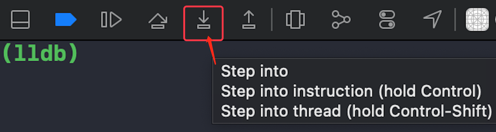
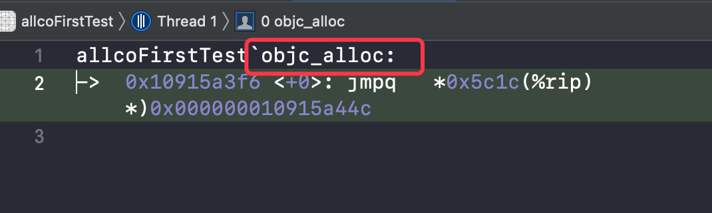
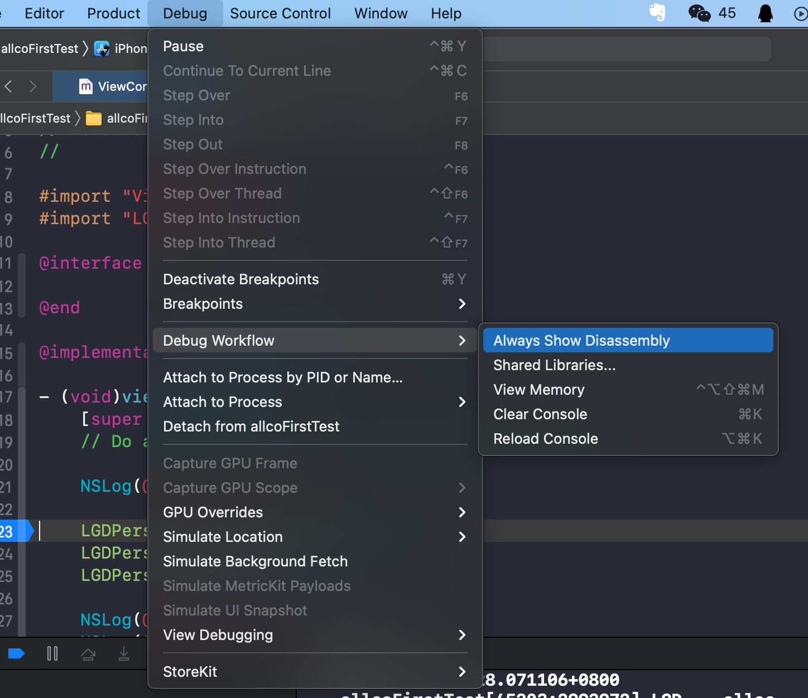

##  底层探索的三种方法

>  方法论，指导探索源码和底层的方法，学会自己去进行探索

此次底层探索以 alloc 的底层实现为示例

三种方式：

- 符号断点
- 汇编 跟流程
- 已知符号(方法名)设置符号断点

### 1、符号断点

使用 Xcode 自带调试工具，ctrl + Step into(如下图)，进入底层方法



#### 方式1

首次工程创建时，使用上述方式可显示底层的源码结构

#### 方式2

- 非首次工程运行时，使用上述方式时，由于内存已经识别完毕，无法显示底层的源码结构，只显示优化后的**底层函数**的汇编。 

  

- 使用底层函数名称(如上图所示位置获取)，创建符号断点：在 Breakpoint navigator，点击左下角加号，添加 Symbolic Breakpoint，在弹出的符号断点编辑框中，Symbol 属性添加此函数名称即可

##### 实操流程

- 添加底层函数的符号断点 (示例：objc_alloc)
- 在需要探究的代码实现行添加断点，同时先点击符号断点末端的蓝色标识来 Disable 这个符号断点。 (目的是准确定位探究的代码实现，在探究的代码前不开启符号断点，防止该符号断点在其他位置的执行)
- 运行程序，在代码断点到达后，点击符号断点末端的淡蓝色标识来开启，执行下一步跳转到符号断点，可发现 示例中  ```libobjc.A.dylib`objc_alloc```底层符号断点的实现

### 2、汇编



- 开启 Debug -- Debug Workflow -- Always Show Disassembly 来显示汇编
- 汇编代码断到对应的类
- 查找 callq 指令(该指令表示调用)，备注有相应的符号名称，示例：```symbol stub for: objc_alloc``` (底层符号反映在上层就是函数或方法)
-  ```ctrl + Step into``` 进行断点单步跳转，跳转到 ``` callq xxx; symbol stub for: objc_alloc``` 指令
- 再次 ```ctrl + Step into``` 进入 ```objc_alloc``` 函数内部

### 3、已知符号设置符号断点

- 对 alloc 方法探究，即添加 alloc 的符号断点
- 在需要探究的代码实现行添加断点，同时 Disable 这个符号断点。 (目的是准确定位探究的代码实现，在探究的代码前不开启符号断点，防止该符号断点在其他位置的执行)
- 运行程序，在代码断点到达后，开启符号断点，在断点列表产生一系列的断点位置(Breakpoint Location)
- 执行下一步跳转到符号断点，可发现如示例中  ```libobjc.A.dylib`+[NSObject alloc]:```底层符号断点
- 此方法与汇编方式结合使用

### 其他方式

反汇编、lldb、堆栈
