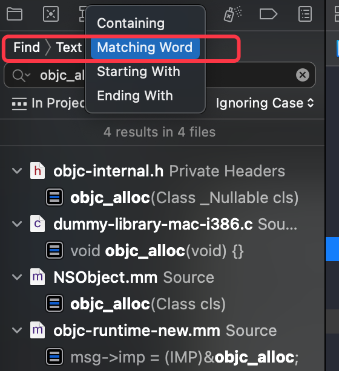

## alloc 流程补充

### 问题发现

在 `objc` 源码编译查看 `alloc` 流程时，发现如下问题：

- `callAlloc` 方法被调用了两次
- 在过掉 `[LGPerson alloc]` 处的断点后，并未跳转  `+ (id)alloc` 以及`_objc_rootAlloc` 方法执行

### 流程分析

#### 1、汇编查看

在 `[LGPerson alloc] `  处打断点，打开 `Always Show Disassembly` 显示汇编代码，执行后显示

```assembly
->  0x1000039bf <+31>:  movq   0x4a82(%rip), %rdi        ; (void *)0x0000000100008500: LGPerson
    0x1000039c6 <+38>:  callq  0x100003d08               ; symbol stub for: objc_alloc
```

发现此时注释 `symbol stub for: objc_alloc` ，可知调用 `objc_alloc` 函数

> `symbol stub` 可理解为符号存根、符号占位 或 符号桩，是链接器把 `objc_alloc` 函数调用翻译成的跳转的地址

查看 `objc`  源码中此函数对应方法

```C++
// Calls [cls alloc].
id
objc_alloc(Class cls)
{
    return callAlloc(cls, true/*checkNil*/, false/*allocWithZone*/);
}
```

其方法实现为调用 `callAlloc` 函数，此时确认 `alloc` 流程是先执行的 `objc_alloc` , 然后执行其内部的实现函数 `callAlloc`， 这解释了发现的问题

#### 2、函数搜索

汇编查到调用 `objc_alloc` 函数，可是为什么呢？

正常的理解下 sel 对应指定的 IMP [拓展1] ，此处 `alloc` 应该对应其自身的 `_objc_rootAlloc` 才对啊，对应到 `objc_alloc` 是篡改了 IMP 么？

为解决这个疑惑，在源码中再仔细查看 `objc_alloc` 的相关调用，此时由于字符类似项过多，在搜索时选择 `Matching Word ` (如下图，默认是 `Containing`)，来进行更细致的匹配搜索



#### 3、溯源

##### 反证溯源

此时在 `objc-runtime-new.mm` 中发现如下方法

```c++
/***********************************************************************
* fixupMessageRef
* Repairs an old vtable dispatch call site. 
* vtable dispatch itself is not supported.
**********************************************************************/
static void 
fixupMessageRef(message_ref_t *msg)
{    
    msg->sel = sel_registerName((const char *)msg->sel);

    if (msg->imp == &objc_msgSend_fixup) { 
        if (msg->sel == @selector(alloc)) {
            msg->imp = (IMP)&objc_alloc; //定位此处
        } else if (msg->sel == @selector(allocWithZone:)) {
            msg->imp = (IMP)&objc_allocWithZone;
        } else if (msg->sel == @selector(retain)) {
            msg->imp = (IMP)&objc_retain;
        } else if (msg->sel == @selector(release)) {
            msg->imp = (IMP)&objc_release;
        } else if (msg->sel == @selector(autorelease)) {
            msg->imp = (IMP)&objc_autorelease;
        } else {
            msg->imp = &objc_msgSend_fixedup;
        }
    } 
    else if ... //省略部分与当前探究无关代码
}
```

通过此处的代码分析：

```c++
  if (msg->imp == &objc_msgSend_fixup) { 
        if (msg->sel == @selector(alloc)) {
            msg->imp = (IMP)&objc_alloc; 
```

- 在 `objc_msgSend_fixup` 时，可理解为消息发送错误进行修正时，对 `msg->sel == @selector(alloc)`  即 `alloc` 方法进行修正时，指定到 `objc_alloc` 的IMP。 

- 在错误修正时大概率是把错误指向修正为正确执行，因此正确的执行应该为 `sel == alloc 时 执行 imp = (IMP)&objc_alloc` 

- 查看 `fixupMessageRef` 函数的调用时机，在 `_read_images` 函数中调用；而 `_read_images` 函数在 dyld 链接之后；
- 而在此时进行修复，那意味着真正的指定(绑定)必在其之前进行，那可能是 llvm 编译阶段，从而引出查看 llvm 源码

##### Mach-O 溯源

###### undo 缺少烂苹果截图图片

查看 Mach-O 文件时，搜索 `objc_alloc` ，查询到 `_objc_alloc` 这个符号(C++符号，因此前面带下划线)。Mach-O文件是编译产生，此时还未进入运行时，因此考虑在编译阶段执行了相关的符号绑定操作，然后就考虑编译阶段有可能涉及到 llvm，因此去查看 llvm源码

#### 4、llvm源码查看

##### 1）搜索 `objc_alloc`

发现相关代码

```c++
/// The ObjC runtime may provide entrypoints that are likely to be faster
/// than an ordinary message send of the appropriate selector.
///
/// The entrypoints are guaranteed to be equivalent to just sending the
/// corresponding message.  If the entrypoint is implemented naively as just a
/// message send, using it is a trade-off: it sacrifices a few cycles of
/// overhead to save a small amount of code.  However, it's possible for
/// runtimes to detect and special-case classes that use "standard"
/// behavior; if that's dynamically a large proportion of all objects, using
/// the entrypoint will also be faster than using a message send.
///
/// If the runtime does support a required entrypoint, then this method will
/// generate a call and return the resulting value.  Otherwise it will return
/// None and the caller can generate a msgSend instead.
static Optional<llvm::Value *>
tryGenerateSpecializedMessageSend(CodeGenFunction &CGF, QualType ResultType,
                                  llvm::Value *Receiver,
                                  const CallArgList& Args, Selector Sel,
                                  const ObjCMethodDecl *method,
                                  bool isClassMessage) {
  auto &CGM = CGF.CGM;
  if (!CGM.getCodeGenOpts().ObjCConvertMessagesToRuntimeCalls)
    return None;

  auto &Runtime = CGM.getLangOpts().ObjCRuntime;
  switch (Sel.getMethodFamily()) {
  case OMF_alloc:
    if (isClassMessage &&
        Runtime.shouldUseRuntimeFunctionsForAlloc() &&
        ResultType->isObjCObjectPointerType()) {
        // [Foo alloc] -> objc_alloc(Foo) or
        // [self alloc] -> objc_alloc(self)
        if (Sel.isUnarySelector() && Sel.getNameForSlot(0) == "alloc")
          return CGF.EmitObjCAlloc(Receiver, CGF.ConvertType(ResultType));
        // [Foo allocWithZone:nil] -> objc_allocWithZone(Foo) or
        // [self allocWithZone:nil] -> objc_allocWithZone(self)
        if (Sel.isKeywordSelector() && Sel.getNumArgs() == 1 &&
            Args.size() == 1 && Args.front().getType()->isPointerType() &&
            Sel.getNameForSlot(0) == "allocWithZone") {
          const llvm::Value* arg = Args.front().getKnownRValue().getScalarVal();
          if (isa<llvm::ConstantPointerNull>(arg))
            return CGF.EmitObjCAllocWithZone(Receiver,
                                             CGF.ConvertType(ResultType));
          return None;
        }
    }
    break;

//... 其他case 暂无关，省略

  default:
    break;
  }
  return None;
}

```

搜索到此处发现存在 `[self alloc] -> objc_alloc(self)` 注释，可得此处与绑定行为有关。 然后以此方法向上向下查看整个流程

##### 2）向上查看流程

- 搜索 `tryGenerateSpecializedMessageSend` 函数调用，其调用方法

```C++
CodeGen::RValue CGObjCRuntime::GeneratePossiblySpecializedMessageSend(
    CodeGenFunction &CGF, ReturnValueSlot Return, QualType ResultType,
    Selector Sel, llvm::Value *Receiver, const CallArgList &Args,
    const ObjCInterfaceDecl *OID, const ObjCMethodDecl *Method,
    bool isClassMessage) {
  if (Optional<llvm::Value *> SpecializedResult =
          tryGenerateSpecializedMessageSend(CGF, ResultType, Receiver, Args,
                                            Sel, Method, isClassMessage)) { //此处调用，用以条件判断
    return RValue::get(SpecializedResult.getValue());
  }
  return GenerateMessageSend(CGF, Return, ResultType, Sel, Receiver, Args, OID,
                             Method);
}

```

- 搜索 `GeneratePossiblySpecializedMessageSend` 函数的调用

```C++
RValue CodeGenFunction::EmitObjCMessageExpr(const ObjCMessageExpr *E,
                                            ReturnValueSlot Return) {
  //...
  
    RValue result;
  if (isSuperMessage) {
    // super is only valid in an Objective-C method
    const ObjCMethodDecl *OMD = cast<ObjCMethodDecl>(CurFuncDecl);
    bool isCategoryImpl = isa<ObjCCategoryImplDecl>(OMD->getDeclContext());
    result = Runtime.GenerateMessageSendSuper(*this, Return, ResultType,
                                              E->getSelector(),
                                              OMD->getClassInterface(),
                                              isCategoryImpl,
                                              Receiver,
                                              isClassMessage,
                                              Args,
                                              method);
  } else {
    // Call runtime methods directly if we can.
    result = Runtime.GeneratePossiblySpecializedMessageSend(
        *this, Return, ResultType, E->getSelector(), Receiver, Args, OID,
        method, isClassMessage); //此处方法调用赋值
  }
  
  //...
```

- `EmitObjCMessageExpr` 方法再进行函数的调用的查询，相关性没有体现，目的也不明确，未再向上查看。探究这个方法大致是在产生 LLVM code 时使用的

```c++
/// CodeGenFunction - This class organizes the per-function state that is used
/// while generating LLVM code.
class CodeGenFunction : public CodeGenTypeCache {
```

##### 3）向下查看流程

- 查看 `alloc` 时的 return 语句 `return CGF.EmitObjCAlloc(Receiver, CGF.ConvertType(ResultType));`

```C++
/// Allocate the given objc object.
///   call i8* \@objc_alloc(i8* %value)
llvm::Value *CodeGenFunction::EmitObjCAlloc(llvm::Value *value,
                                            llvm::Type *resultType) {
  return emitObjCValueOperation(*this, value, resultType,
                                CGM.getObjCEntrypoints().objc_alloc,
                                "objc_alloc");
}

```

- 查看 `emitObjCValueOperation` 函数的实现

```c++
/// Perform an operation having the signature
///   i8* (i8*)
/// where a null input causes a no-op and returns null.
static llvm::Value *emitObjCValueOperation(CodeGenFunction &CGF,
                                           llvm::Value *value,
                                           llvm::Type *returnType,
                                           llvm::FunctionCallee &fn,
                                           StringRef fnName) {
  if (isa<llvm::ConstantPointerNull>(value))
    return value;

  if (!fn) {
    llvm::FunctionType *fnType =
      llvm::FunctionType::get(CGF.Int8PtrTy, CGF.Int8PtrTy, false);
    fn = CGF.CGM.CreateRuntimeFunction(fnType, fnName);

    // We have Native ARC, so set nonlazybind attribute for performance
    if (llvm::Function *f = dyn_cast<llvm::Function>(fn.getCallee()))
      if (fnName == "objc_retain")
        f->addFnAttr(llvm::Attribute::NonLazyBind);
  }

  // Cast the argument to 'id'.
  llvm::Type *origType = returnType ? returnType : value->getType();
  value = CGF.Builder.CreateBitCast(value, CGF.Int8PtrTy);

  // Call the function.
  llvm::CallBase *Inst = CGF.EmitCallOrInvoke(fn, value);

  // Mark calls to objc_autorelease as tail on the assumption that methods
  // overriding autorelease do not touch anything on the stack.
  if (fnName == "objc_autorelease")
    if (auto *Call = dyn_cast<llvm::CallInst>(Inst))
      Call->setTailCall();

  // Cast the result back to the original type.
  return CGF.Builder.CreateBitCast(Inst, origType);
}

```

此处进行 `objc_alloc` 方法的调用，探索到了底部

##### 4）流程汇总

- 在 `LLVM code` 产生的过程中，`CodeGenFunction ` 这个类对 `EmitObjCMessageExpr ` 函数的使用进行组织

- 从 `//Call runtime methods directly if we can.` 的 `GeneratePossiblySpecializedMessageSend` 函数调用开始

- 在 `GeneratePossiblySpecializedMessageSend` 的方法实现中，进行  `tryGenerateSpecializedMessageSend` 返回值的判断，为空的话就执行正常的消息发送流程，不为空的就返回判断方法返回的值

- `tryGenerateSpecializedMessageSend` 针对特殊的 MsgSend 进行处理

  - 针对 `getMethodFamily` 中的相关方法，其内部实现为 `getMethodFamilyImpl`  大致包含如下

  ```C++
  //getMethodFamilyImpl 函数实现部分  
    IdentifierInfo *first = sel.getIdentifierInfoForSlot(0);
    if (!first) return OMF_None;
  
    StringRef name = first->getName();
  // ... 省略部分
    if (name.empty()) return OMF_None;
    switch (name.front()) {
    case 'a':
      if (startsWithWord(name, "alloc")) return OMF_alloc;
      break;
  ```

  其以 `alloc` 起始的方法都判定为 `OMF_alloc` 枚举类型

  - 在 `OMF_alloc` 枚举下，判断条件 `shouldUseRuntimeFunctionsForAlloc` 函数中进行版本判断 

  ```C++
    /// When this method returns true, Clang will turn non-super message sends of
    /// certain selectors into calls to the corresponding entrypoint:
    ///   alloc => objc_alloc
    ///   allocWithZone:nil => objc_allocWithZone
    bool shouldUseRuntimeFunctionsForAlloc() const {
      switch (getKind()) {
      case FragileMacOSX:
        return false;
      case MacOSX:
        return getVersion() >= VersionTuple(10, 10);
      case iOS:
        return getVersion() >= VersionTuple(8);
  
  ```

  此方法注释中，解释了方法调用的转换，在指定系统版本后，Clang 编译器会把(非父类消息发送的、某些确定的)方法转换成相关的入口点(entrypoint)

  > When this method returns true, Clang will turn non-super message sends of certain selectors into calls to the corresponding entrypoint:
  >    alloc => objc_alloc
  >    allocWithZone:nil => objc_allocWithZone

  - 在方法名称 "alloc" 的判断下，调用 `EmitObjCAlloc` 函数

-  `EmitObjCAlloc` 函数调用 `emitObjCValueOperation` 方法来执行 `objc_alloc` 

-  `emitObjCValueOperation` 方法会判断传入 fn 是否存在，不存在则新建，然后调用 `EmitCallOrInvoke` 函数来  `//Call the function` 

##### 5）总结

官方实现在 iOS8以后，在非父类方法的 alloc 方法(以及以 alloc 开头的方法)调用时，Clang 编译器转换其入口点为 `objc_alloc` 方法。

> 相关猜想解释： alloc 方法涉及内存开辟，苹果官方在LLVM时对其 hook 转换入口

#### 5、后续流程

后续流程通过  `objc` 源码查看，执行至 `+ (id)alloc` 函数，接上 《1-1 alloc与init 源码初探》中的起始探索函数

#####  1）`objc_alloc` 方法实现

```objc
// Calls [cls alloc].
id
objc_alloc(Class cls)
{
    return callAlloc(cls, true/*checkNil*/, false/*allocWithZone*/);
}
```

#####  2）`callAlloc` 方法调用和实现

```objc
// Call [cls alloc] or [cls allocWithZone:nil], with appropriate
// shortcutting optimizations.
static ALWAYS_INLINE id
callAlloc(Class cls, bool checkNil, bool allocWithZone=false)
{
#if __OBJC2__
    if (slowpath(checkNil && !cls)) return nil;
    if (fastpath(!cls->ISA()->hasCustomAWZ())) {
        return _objc_rootAllocWithZone(cls, nil);
    }
#endif

    // No shortcuts available.
    if (allocWithZone) {
        return ((id(*)(id, SEL, struct _NSZone *))objc_msgSend)(cls, @selector(allocWithZone:), nil);
    }
    return ((id(*)(id, SEL))objc_msgSend)(cls, @selector(alloc));
}

```

由 return 语句和 《1-1 alloc与init初探 》文章内容可知， 当前分支路线为 `_objc_rootAllocWithZone` 和 `objc_msgSend` 。 而分支执行的判断条件就可确认为 `!cls->ISA()->hasCustomAWZ()` ，查看其实现

###### hasCustomAWZ()

```objc
// class or superclass has default alloc/allocWithZone: implementation
// Note this is is stored in the metaclass.
#define FAST_CACHE_HAS_DEFAULT_AWZ    (1<<14) // 0x4000

//hasCustomAWZ
bool hasCustomAWZ() const {
    return !cache.getBit(FAST_CACHE_HAS_DEFAULT_AWZ);
}

//getBit
#if __LP64__
    bool getBit(uint16_t flags) const {
        return _flags & flags;
    }

//...

#endif

//flags
struct cache_t {
private:
    explicit_atomic<uintptr_t> _bucketsAndMaybeMask;
    union {
        struct {
            explicit_atomic<mask_t>    _maybeMask;
#if __LP64__
            uint16_t                   _flags;
#endif
            uint16_t                   _occupied;
        };
        explicit_atomic<preopt_cache_t *> _originalPreoptCache;
    };

  //...

}
```

### <font color=red> warning  - 遗留问题：</font>

 此处 _flags 的赋值时机不太清晰

当前判断取值时，由于 `_flags` 为 `nil` ，造成 `getBit` 函数返回 `false`， 从而引起 `hasCustomAWZ` 取值为 `true`， 最终造成分支判断条件 `!cls->ISA()->hasCustomAWZ()`  为 `false` ，从而执行外部代码。

深入分析此处逻辑：

- 由于两次取反 `!` ，可认为 `cache.getBit(FAST_CACHE_HAS_DEFAULT_AWZ)` 的取值等同于 `!cls->ISA()->hasCustomAWZ()` 
- `FAST_CACHE_HAS_DEFAULT_AWZ` 根据其宏定义的注释 `class or superclass has default alloc/allocWithZone: implementation` ，理解为 其类或父类存在默认生效或实施的 `alloc/allocWithZone:` 方法
- 综合上述两个观点，此时的判断语句可解析为：存在默认生效的 `alloc/allocWithZone:` 方法时，执行 `if` 内部语句，执行 `_objc_rootAllocWithZone` 来进行后续的实例创建；不存在时，执行外部语句进行 `objc_msgSend` 进行消息转发

##### 3）`objc_msgSend` 调用

上述判断逻辑，由于 `_flags` 为 `nil` ，最终执行 `objc_msgSend `。可理解为此时当前类不存在默认生效的 `alloc/allocWithZone:` 方法。 `objc_msgSend` 的流程过长，后续进行单独展开。

此处根据消息查找机制，查询到 `+ (id)alloc` 方法，进行调用

##### 4）`callAlloc` 方法第二次调用判断

此后在通过 `_objc_rootAlloc` 函数调起的第二次执行的 `callAlloc` 方法中，此时由于 `_flags` 取值不为空 ，使得 `getBit` 函数返回 `true`， 从而引起 `hasCustomAWZ` 取值为 `false`， 最终造成分支判断条件 `!cls->ISA()->hasCustomAWZ()`  为 `true` ，从而执行判断内部代码

>  可否理解为 `objc_alloc` 函数已经实现，存在默认生效的 `alloc`方法

此时 `_flags & flags` 为真，由于 `flags` 在`hasCustomAWZ` 函数调用时传参 `FAST_CACHE_HAS_DEFAULT_AWZ = 0x4000` ，则 `_flags` 取值必大于 `0x4000`。此问题又回到了上述遗留问题 `_flags` 的赋值时机问题

> 为什么 `!cls->ISA()->hasCustomAWZ()`  为 `true` ？ 
>
> cls是类，类在内存中只有一份，类的内存赋值后就存在缓存中，以后就访问到了

## 拓展

### 拓展1、SEL 与 IMP

