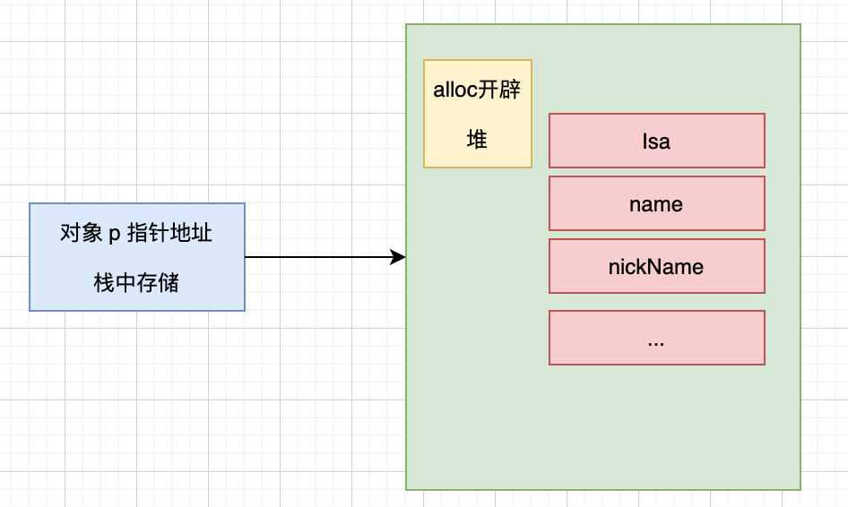

## 再探内存

### 对象内存的影响因素

在 《1-1》中，根据分配内存的源码推断出： **对象的内存大小只与成员变量有关，与方法无关。 ** 此时我们通过 lldb 来进行验证下：

#### 验证方法：

 使用 `class_getInstanceSize(<#Class _Nullable __unsafe_unretained cls#>)` 函数来计算类的大小，其大小是根据其创建对象所需要分配的内存大小(runtime相关，后续详细扩展)。注意此函数的使用需引入头文件 `#import <objc/runtime.h>` 。

#### 验证流程：

1. 属性完全声明的对象，查看其大小

```objc
@interface LGDPerson : NSObject

@property (nonatomic,strong) NSString *name;
@property (nonatomic,strong) NSString *nickName;
@property (nonatomic) int age;
@property (nonatomic) BOOL young;
@property (nonatomic) double weigth;

@end
  
//main函数
  LGDPerson *p = [LGDPerson alloc];
  
(lldb) po class_getInstanceSize(LGDPerson.class)
40
```

2. 只保留 `name` 属性声明，查看其大小

```objc
@interface LGDPerson : NSObject

@property (nonatomic,strong) NSString *name;

@end
  
//main函数
  LGDPerson *p = [LGDPerson alloc];
  
(lldb) po class_getInstanceSize(LGDPerson.class)
16
```

得出结论： **属性会影响对象的内存大小**

3. 增加成员变量声明，查看其大小

```objc
@interface LGDPerson : NSObject {
    
    NSString *nickName;
}

@property (nonatomic,strong) NSString *name;

@end
  
//main函数
  LGDPerson *p = [LGDPerson alloc];
  
(lldb) po class_getInstanceSize(LGDPerson.class)
24
```

得出结论： **成员变量会影响对象的内存大小**

4. 增加方法声明，查看其大小

```objc
@interface LGDPerson : NSObject {
    
    NSString *nickName;
}

@property (nonatomic,strong) NSString *name;
- (void)saySomething;
@end
  
//main函数
  LGDPerson *p = [LGDPerson alloc];
  
(lldb) po class_getInstanceSize(LGDPerson.class)
24
```

得出结论：**方法不会影响对象的内存大小** 

> 方法不存储在对象的内存中，详细内容后续分析

5. 增加类方法，查看其大小

```objc
@interface LGDPerson : NSObject {
    
    NSString *nickName;
}

@property (nonatomic,strong) NSString *name;
+ (void)sayNothing;
@end
  
//main函数
  LGDPerson *p = [LGDPerson alloc];
  
(lldb) po class_getInstanceSize(LGDPerson.class)
24
```

得出结论：**类方法不会影响对象的内存大小** 

#### 验证结论：

- 属性影响
- 成员变量影响
- 对象方法和类方法不影响

综合可得，**是成员变量影响的对象内存分配**。

此时，图形展示当前明确的对象的部分结构如下：



### 查看对象内存

```objc
//对象属性设置
LGDPerson *p = [LGDPerson alloc];
p.name = @"LGD";
p.nickName = @"大叔";
p.age = 18;
p.young = 1;
p.weigth = 71.5;
p.c1 = 'a';
p.c2 = 'b';
```

断点中，控制台打印输出全部属性值：

```shell
(lldb) x/6gx p
0x600002658ae0: 0x000000010a9da7d8 0x0000001200626101
0x600002658af0: 0x000000010a9d5058 0x000000010a9d5078
0x600002658b00: 0x4051e00000000000 0x0000000000000000
(lldb) po 0x000000010a9da7d8
LGDPerson

(lldb) po 0x000000010a9d5058
LGD

(lldb) po 0x000000010a9d5078
大叔

# 或者使用 e -f f -- 0x4051e00000000000
(lldb) p/f 0x4051e00000000000 [拓展1]
(long) $4 = 71.5
(lldb) p 0x61  # ’a'的十六进制 ASCII码值
(int) $5 = 97  # ’a'的十进制 ASCII码值
(lldb) p 0x62  # ’b'的十六进制 ASCII码值
(int) $6 = 98  # ’b'的十进制 ASCII码值
(lldb) p 0x00000012
(int) $7 = 18
(lldb) p 0x01
(int) $8 = 1
(lldb) 
```

分析 `x/6gx p` 打印数据可得 

- `:` 前的是地址， `0x600002658ae0` 为首地址
- `:` 后的是值，其上打印可看出对应的值内容
- 下图展示整体结构


查看值数据时发现有特殊情况 `0x0000001200626101` 可分隔成 4段：`0x12` / `0x62` / `0x61` / `0x01`，这是进行了内存对齐进行的优化操作

接下来就研究下内存对齐

### 内存对齐

研究内存对齐，使用结构体来研究内存对齐，能比较直观展示内存大小和内存对齐后的结果。

#### 内存对齐原则

1. 数据成员对齐规则：结构(struct)(或联合(union))的数据成员，第一个数据成员放在 `offset` 为0的地方，以后每个数据成员存储的起始位置要从该成员大小或者成员的子成员大小（只要该成员有子成员，比如说是数组，结构体等）的整数倍开始（比如 `int` 为4字节，则要从4的整数倍地址开始存储）
2. 结构体作为成员：如果一个结构里有某些结构体成员，则结构体成员要从其内部最大元素大小的整数倍地址开始存储。 (struct a 里存有 struct b，b 里有 `char`, `int`, `double` 等元素，那b应该从8的整数倍开始存储)
3. 首尾工作：结构体的总大小，也就是 `sizeof` 的结构，必须是其内部最大成员的整数倍，不足的要补齐

#### 题目验证

##### 1. 分析和验证内存对齐

针对此结构体分析其内存占用情况

```objc
struct LGDStruct1 {
  double a;
  char b;
  int c;
  short d;
} struct1;

```

分析：

- 分析结构体成员占位，当前为 64位环境：

```tex
//64位
double 占 8字节
char   占 1字节
int    占 4字节
short  占 2字节
```

- 根据 `原则1` 梳理内存占用
  - `double a`  从 0 开始，占用8字节。表示为 [0, 7]
  - `char b`  占用1字节。 当前 `offset`  从 8 开始，验证 8 是其占用大小 1 字节的整数倍，可以从8开始。从 8 开始，占用1字节。表示为 [8]
  - `int c` 占用4字节。 当前 `offset` 从 9 开始，不是其占用大小 4字节的整数倍，因此不能从此位置开始，空出此空间后延，直至 12 符合要求。因此此成员从 12 开始，占用4字节，前面部分空出。 表示为 (9, 10, 11, [12, 15])
  - `short d` 占用2字节。 当前 `offset` 从 16开始，是其占用大小 2字节的整数倍，可以从此位置开始。 从 16 开始，占用2字节。表示为 [16, 17]
- 根据 `原则3` 计算整体大小，当前最后一个成员分配完成后是 [0, 17] 共占用18字节；其内部最大成员变量大小为 8，因此要按8的倍数补全，整体分配应为 24字节
- 输出验证

```objc
NSLog(@"%lu", sizeof(struct1));
// 输出 24
```

验证结果与分析结果一致。

- 画图总结


##### 2. 为什么进行字节对齐

经过上述分析提出问题： 为什么要设定字节对齐规则？还有为什么此例中的 `int` 要从 4 的整数倍开始，即使会在前面造成空间的浪费？

提出问题后，对内存的分配进行观察一下

- 首先，8字节的读取，这个是当前64位处理器一次处理64位==8字节，统一的按照8字节读取，效率就比较高。(不需要计算和变动读取字节数，而且当前 8字节的数据较多)

- 然后，我们对第2个8字节进行观察，内存按8字节读取数据取不出，此时就需要更改读取方式。因为其中的数据是多个数据组合形成的，这种组合是底层进行内存优化产生的
- 此时内存的读取方式就根据其组合数据的对齐方式来进行，即是说字节对齐的规则就决定了cpu 读取内存的方式


此时就要对不同的字节对齐方式进行分析，设置两种方式：

方式1 当前字节对齐规则 ；方式2 顺序排列不进行对齐。

在内存读取上进行对比：

- 方式1 读取流程： 按照当前组合中最大的 4字节进行读取，进行两次内存操作，分别获取到 `char` 和 `int` 的完整数据

- 方式2 读取流程： 

  此时首先要解决的问题是一次内存操作读取多少数据

  - 如果按 1字节方式读取，则 `int` 类型数据需要 4次内存操作才能获取到完整数据
  - 如果按照 4字节方式获取，则 `int` 类型数据需要对 2次内存操作获取的数据进行组合
  - 如果先按 1字节方式读取，再按 4字节方式读取，则需要进行更多的计算来获取当前的读取方式，同时要不断的变更读取方式

对比两种方式，自然体现出字节对齐的优势，用空间换取时间，提高 CPU 访问数据的效率

##### 3. 顺序变化

深入理解 `原则1` ，发现结构体成员变量的顺序也会对内存的分配最终产生影响。

更改上述例子中结构体成员变量的声明顺序如下，再次计算

```objc
struct LGDStruct2 {
  double a;       // 8, [0, 7]
  int b;          // 4, [8, 11]
  char c;         // 1, [12]
  short d;        // 2, (13,[14, 15])
} struct2;        // 16 [0, 15]
```

经计算可得，只占用 16位，再次使用 `sizeof` 打印验证

```objc
NSLog(@"struct2 = %lu", sizeof(struct2));
// 输出： struct2 = 16
```

总结：

由于 `原则1` 的规则造成，第二种排列顺序占用位数较少。同时也确认顺序确实会对内存大小分配造成影响

那实际应用中，需要考虑顺序么？

- 根据 `0x0000001200626101` 这块内存取值来看，苹果官方对其进行了优化
- 也可以进行 二进制重排 和 数据内存的重排等 (以后探究)


##  拓展

### 拓展1 浮点类型与十六进制转换

```shell
(lldb) p/f 0x4051e00000000000 # 浮点数格式打印
(long) $4 = 71.5
```

可通过 C 函数把 浮点数转换成十六进制进行对照

```C
void lg_float2HEX(float f){
    union uuf { float f; char s[4]; } uf;
    uf.f = f;
    printf("0x");
    for (int i=3;i>=0;i--)
        printf("%02x", 0xff & uf.s[i]);
    printf("\n");
}

void lg_double2HEX(double d){
    union uud { double d; char s[8];} ud;
    ud.d = d;
    printf("0x");
    for (int i=7;i>=0;i--)
        printf("%02x",0xff & ud.s[i]);
    printf("\n");
}

//调用输出
lg_float2HEX(71.5);
lg_double2HEX(71.5);
```

查看输出

```shell
0x428f0000
0x4051e00000000000

(lldb) x/6gx p
0x600003ef6a00: 0x00000001091157e0 0x0000001200626101
0x600003ef6a10: 0x0000000109110058 0x0000000109110078
0x600003ef6a20: 0x4051e00000000000 0x0000000000000000
(lldb) p/f 0x4051e00000000000
(long) $1 = 71.5
```

根据输出可确认使用 `double` 类型输出的十六进制值与内存查看中的值相同