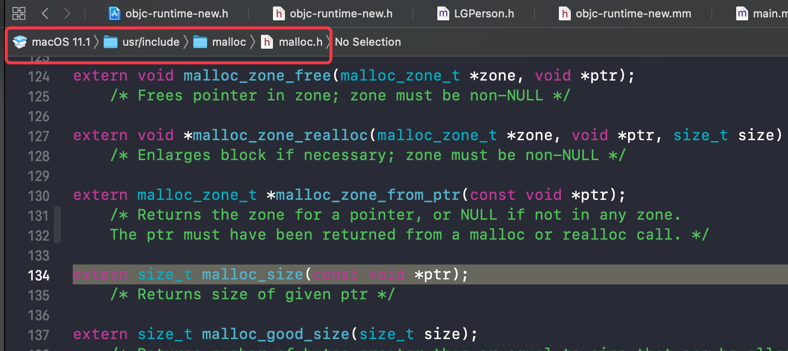

## 内存分配补充

### 起源

在 `1-1 alloc 与 init初探` 中，探查到 内存分配 的源码

```C
// objc-runtime-new.h     
inline size_t instanceSize(size_t extraBytes) const {
        if (fastpath(cache.hasFastInstanceSize(extraBytes))) { //缓存快速计算
            return cache.fastInstanceSize(extraBytes);
        }

        size_t size = alignedInstanceSize() + extraBytes;
        // CF requires all objects be at least 16 bytes.
        if (size < 16) size = 16;
        return size;
    }
```

该篇文章中对首次内存分配的流程(即：if判断语句外的代码)进行了梳理和探究，但是该流程只在无缓存时进行(是否捕捉到该代码的执行？)，大部分时候打断点查看时，都执行的 if 语句内部的缓存快速计算的方法。这次就来探究下这部分的执行

### 探究范例

那我们以一个稍微简洁的类为研究对象，查看其内存分配

```objc
@interface LGPerson : NSObject

@property (nonatomic,strong) NSString *name;
@property (nonatomic) int age;

@end
```

#### 分析内存分配

根据当前学习的知识分析：该类声明一个 `string` 属性和 一个 `int` 属性，再加上一个 `isa` 指针，此类对象创建时占用内存应为 `8 + 8 + 4 = 20` , 再根据 8 字节对齐原则，应该分配的内存是 24

得出结论后就需要执行程序验证

#### 验证分析结果

##### 源码验证

运行 objc 源码，进入 `fastInstanceSize` 方法，在 `return` 处添加断点

```c++
    size_t fastInstanceSize(size_t extra) const
    {
        ASSERT(hasFastInstanceSize(extra));

        if (__builtin_constant_p(extra) && extra == 0) {
            return _flags & FAST_CACHE_ALLOC_MASK16;
        } else {
            size_t size = _flags & FAST_CACHE_ALLOC_MASK;
            // remove the FAST_CACHE_ALLOC_DELTA16 that was added
            // by setFastInstanceSize
            return align16(size + extra - FAST_CACHE_ALLOC_DELTA16);
        }
    }
```

针对 `return` 语句 `align16(size + extra - FAST_CACHE_ALLOC_DELTA16)`

1. 查看参数 `size + extra - FAST_CACHE_ALLOC_DELTA16`

- size

```shell
(lldb) po size  
32             # size 为32
```

- extra

`extra` 是外层传入参数，在 `_class_createInstanceFromZone(cls, 0, nil,OBJECT_CONSTRUCT_CALL_BADALLOC)` 方法调用时以 0 传入，传递多层至此

- FAST_CACHE_ALLOC_DELTA16

查看注释，发现是 `setFastInstanceSize` 方法添加的，在此处移除的

```objc
// remove the FAST_CACHE_ALLOC_DELTA16 that was added
// by setFastInstanceSize
```

查看 `setFastInstanceSize` 方法，发现只是用来作为一个 mask(掩码) 使用

```c++
   void setFastInstanceSize(size_t newSize)
    {
        // Set during realization or construction only. No locking needed.
        uint16_t newBits = _flags & ~FAST_CACHE_ALLOC_MASK;
        uint16_t sizeBits;

        // Adding FAST_CACHE_ALLOC_DELTA16 allows for FAST_CACHE_ALLOC_MASK16
        // to yield the proper 16byte aligned allocation size with a single mask
        sizeBits = word_align(newSize) + FAST_CACHE_ALLOC_DELTA16;
        sizeBits &= FAST_CACHE_ALLOC_MASK;
        if (newSize <= sizeBits) {
            newBits |= sizeBits;
        }
        _flags = newBits;
    }
```

那就只关心其值为 0x08

```c++
#define FAST_CACHE_ALLOC_DELTA16      0x0008
```

- 汇总可得，参数 `size + extra - FAST_CACHE_ALLOC_DELTA16` 值为 32 + 0 - 8 = 24

2. 查看函数 `align16()`

```c++
static inline size_t align16(size_t x) {
    return (x + size_t(15)) & ~size_t(15);
}
// 十六字节对齐
```

3. 由1、2可得，对 24 进行 16字节对齐，结果为 32

**?? 此处验证结果为32，与按理论分析的24 不一样，怎么回事？**

出现问题，为确认结果到底是多少，再次用代码确认下

##### 代码函数确认

```objc
        LGPerson *p = [LGPerson alloc] ;
        p.name = @"LGD";
        p.age = 18;
        NSLog(@"%@ - %lu - %lu - %lu",p, sizeof(p), class_getInstanceSize([LGPerson class]),malloc_size((__bridge const void *)(p)));

// 输出结果：<LGPerson: 0x10075ab30> - 8 - 24 - 32
```

> 注意：p 是个对象，本质上是一个结构体指针地址，因此 sizeof(p) = 8 [拓展2]

结果再次确认了， `malloc_size` 输出结果为 32

##### 验证结果

结果证明，最终申请的内存空间确实是 32，而不是24。 那么问题来了，这是怎么回事？？  

由于 malloc_size 会直接输出结果，那么查看一下其实现吧，点击方法进去



发现无法查看方法具体实现，看一下目录，看来要到 malloc源码一探究竟了

### malloc 源码探究

[拓展3]文件导航中的方法图标

> 当前 malloc 源码版本使用 libmalloc-317.40.8 版本

运行 `malloc` 源码，在 main 函数添加 `calloc`  方法开辟内存

```objc
	void *p = calloc(1, 24);
		NSLog(@"%lu",malloc_size(p));
```

#### 查看 malloc 流程

##### calloc

```c
void *
calloc(size_t num_items, size_t size)
{
	return _malloc_zone_calloc(default_zone, num_items, size, MZ_POSIX);
}
```

##### _malloc_zone_calloc

```c
MALLOC_NOINLINE
static void *
_malloc_zone_calloc(malloc_zone_t *zone, size_t num_items, size_t size,
		malloc_zone_options_t mzo)
{
	MALLOC_TRACE(TRACE_calloc | DBG_FUNC_START, (uintptr_t)zone, num_items, size, 0);

	void *ptr;
	if (malloc_check_start) {
		internal_check();
	}
	ptr = zone->calloc(zone, num_items, size);

	if (os_unlikely(malloc_logger)) {
		malloc_logger(MALLOC_LOG_TYPE_ALLOCATE | MALLOC_LOG_TYPE_HAS_ZONE | MALLOC_LOG_TYPE_CLEARED, (uintptr_t)zone,
				(uintptr_t)(num_items * size), 0, (uintptr_t)ptr, 0);
	}

	MALLOC_TRACE(TRACE_calloc | DBG_FUNC_END, (uintptr_t)zone, num_items, size, (uintptr_t)ptr);
	if (os_unlikely(ptr == NULL)) {
		malloc_set_errno_fast(mzo, ENOMEM);
	}
	return ptr;
}
```

分析此函数，查看 `return` 方法，最终返回指针 `ptr` ，查看其赋值方法 `zone->calloc(zone, num_items, size)` ，点进去查看只有.h文件中的声明


全局搜索 `calloc` 也没找出其具体实现

那就查看其 description 

```shell
(lldb) po zone->calloc
(.dylib`default_zone_calloc at malloc.c:385)
```

> 为什么这样查看呢？
>
> 函数有赋值，就会有**存储值**，就可以进行打印输出。在遇到定位未知实现函数时，存在赋值的函数时，可尝试按此方式探索

##### default_zone_calloc

```c
static void *
default_zone_calloc(malloc_zone_t *zone, size_t num_items, size_t size)
{
	zone = runtime_default_zone();
	
	return zone->calloc(zone, num_items, size);
}
```

又出现了 `zone->calloc` 函数，考虑是调用自身了么？那再次 `po` 打印下

```shell
(lldb) po zone->calloc  #或者使用 p命令查看
(.dylib`nano_calloc at nano_malloc.c:878)
```

##### nano_calloc

```C
static void *
nano_calloc(nanozone_t *nanozone, size_t num_items, size_t size)
{
	size_t total_bytes;

	if (calloc_get_size(num_items, size, 0, &total_bytes)) {
		return NULL;
	}

	if (total_bytes <= NANO_MAX_SIZE) {
		void *p = _nano_malloc_check_clear(nanozone, total_bytes, 1);
		if (p) {
			return p;
		} else {
			/* FALLTHROUGH to helper zone */
		}
	}
	malloc_zone_t *zone = (malloc_zone_t *)(nanozone->helper_zone);
	return zone->calloc(zone, 1, total_bytes);
}
```

分析此函数的 `return` ，丢掉返回 `NULL` 的和存在 `helper` 的不看，查看返回 p 的，同时 `total_bytes <= NANO_MAX_SIZE` 这个系统定义的 `max_size`，一般考虑不会超出。 因此查看 `_nano_malloc_check_clear` 方法

##### _nano_malloc_check_clear

```C
static void *
_nano_malloc_check_clear(nanozone_t *nanozone, size_t size, boolean_t cleared_requested)
{
	MALLOC_TRACE(TRACE_nano_malloc, (uintptr_t)nanozone, size, cleared_requested, 0);

	void *ptr;
	size_t slot_key;
	size_t slot_bytes = segregated_size_to_fit(nanozone, size, &slot_key); // Note slot_key is set here
	mag_index_t mag_index = nano_mag_index(nanozone);

	nano_meta_admin_t pMeta = &(nanozone->meta_data[mag_index][slot_key]);

	ptr = OSAtomicDequeue(&(pMeta->slot_LIFO), offsetof(struct chained_block_s, next));
	if (ptr) {
		unsigned debug_flags = nanozone->debug_flags;
#if NANO_FREE_DEQUEUE_DILIGENCE
		size_t gotSize;
		nano_blk_addr_t p; // the compiler holds this in a register

		p.addr = (uint64_t)ptr; // Begin the dissection of ptr
		//... 省略部分 error处理代码

		gotSize = _nano_vet_and_size_of_free(nanozone, ptr);
		//... 省略部分 error处理代码

#if defined(DEBUG)
		void *next = (void *)(((chained_block_t)ptr)->next);
		if (next) {
			p.addr = (uint64_t)next; // Begin the dissection of next
			//... 省略部分 error处理代码

			gotSize = _nano_vet_and_size_of_free(nanozone, next);
			//... 省略部分 error处理代码
		}
#endif /* DEBUG */
#endif /* NANO_FREE_DEQUEUE_DILIGENCE */

		((chained_block_t)ptr)->double_free_guard = 0;
		((chained_block_t)ptr)->next = NULL; // clear out next pointer to protect free list
	} else {
		ptr = segregated_next_block(nanozone, pMeta, slot_bytes, mag_index);
	}

	if (cleared_requested && ptr) {
		memset(ptr, 0, slot_bytes); // TODO: Needs a memory barrier after memset to ensure zeroes land first?
	}
	return ptr;
}
```

分析此段代码：  

> opt + cmd + 左 收起当前光标位置代码块

>  slot_LIFO  LastInFirstOut 后进先出可验证是在堆区操作

1. 根据 `if (ptr)` 判断的 `else` 语句，在指针地址 `ptr` 不存在时，进行 `ptr = segregated_next_block(nanozone, pMeta, slot_bytes, mag_index);`  根据函数名，大概猜想其分离临近块空间地址来使用，其源码在 [拓展4]中协助理解
2. 指针地址的分配与当前开辟多少无关，我们的目的是查找计算开辟大小的方法，上面的函数源码中，分析出 `为当前需要的 slot_bytes(插槽或缝隙大小)分配空间` , 那此时就聚焦于 `slot_bytes` 的赋值
3. 找到 `size_t slot_bytes = segregated_size_to_fit(nanozone, size, &slot_key); // Note slot_key is set here` 代码，其 size 是外界传入的需要开辟的尺寸，查看此方法实现

```C
static MALLOC_INLINE size_t
segregated_size_to_fit(nanozone_t *nanozone, size_t size, size_t *pKey)
{
	size_t k, slot_bytes;

	if (0 == size) {
		size = NANO_REGIME_QUANTA_SIZE; // Historical behavior
	}
	k = (size + NANO_REGIME_QUANTA_SIZE - 1) >> SHIFT_NANO_QUANTUM; // round up and shift for number of quanta
	slot_bytes = k << SHIFT_NANO_QUANTUM;							// multiply by power of two quanta size
	*pKey = k - 1;													// Zero-based!

	return slot_bytes;
}

#define SHIFT_NANO_QUANTUM		4
#define NANO_REGIME_QUANTA_SIZE	(1 << SHIFT_NANO_QUANTUM)	// 16
```

根据宏定义可知，此算法解析为

```tex
slot_bytes = (size + 15) >> 4 << 4  //十六进制对齐，向上取整
```

#### 总结

根据上述流程可知，堆中对象的对齐是按 16字节对齐，因此 24字节的对象实际占用内存，在申请空间时，进行了16字节对齐，变为了32。 

这就解决了探究范例内存时的分析与验证不一致的问题：在分析内存实际申请大小时要最后进行 16字节对齐

### 衍生问题

当前结论是 对象内部的成员变量是 8字节对齐，堆中的对象之间是 16字节对齐。那么为什么要这样呢，一致不好吗？

- 对于 8字节存满的成员变量，在不同的对象之间，如果继续以 8 字节对齐，这样排列较为紧密，指针容易访问到错误空间造成野指针。以16字节对齐，提供了一些容错
- 任何对象都来自于 `NSObject`，由于 `isa` 的存在其基本就是 8 字节，一般都包含其他成员变量，所以大多数对象都占用16字节以及以上，使用 16字节对齐能提高效率

> 上述两个解释都有些牵强，不够有力，待以后理解更深入后补充


## 拓展

### 拓展1 this

```shell
(lldb) po this  #this表示当前 self，即调用当前方法的对象
```


### 拓展2 sizeof、class_getInstanceSize、malloc_size

1. sizeof  是一个运算符，获取的是类型的大小 (int , size_t, 结构体, 指针变量等)
2. `class_getInstanceSize` 函数，运行时获取创建的对象以及其成员变量实际占有的内存大小。 内存对齐一般以 8 字节对齐。 此函数使用需导入 `#import<objc/runtime.h>`
3. `malloc_size` 函数， 获取在堆中开辟的内存大小，向系统申请的空间大小。使用时需导入 `#import <malloc/malloc.h>`

### 拓展3 方法图标含义


- `T`  标识  `typedef`
- `#`  标识 宏定义 `#define`
- `f`  标识 function
- `s`  标识 `struct` 结构体

### 拓展4 segregated_next_block

```C
static MALLOC_INLINE void *
segregated_next_block(nanozone_t *nanozone, nano_meta_admin_t pMeta, size_t slot_bytes, unsigned int mag_index)
{
	while (1) {
		uintptr_t theLimit = pMeta->slot_limit_addr; // Capture the slot limit that bounds slot_bump_addr right now
		uintptr_t b = OSAtomicAdd64Barrier(slot_bytes, (volatile int64_t *)&(pMeta->slot_bump_addr));
		b -= slot_bytes; // Atomic op returned addr of *next* free block. Subtract to get addr for *this* allocation.

		if (b < theLimit) {   // Did we stay within the bound of the present slot allocation?
			return (void *)b; // Yep, so the slot_bump_addr this thread incremented is good to go
		} else {
			if (pMeta->slot_exhausted) { // exhausted all the bands availble for this slot?
				pMeta->slot_bump_addr = theLimit;
				return 0;				 // We're toast
			} else {
				// One thread will grow the heap, others will see its been grown and retry allocation
				_malloc_lock_lock(&nanozone->band_resupply_lock[mag_index]);
				// re-check state now that we've taken the lock
				if (pMeta->slot_exhausted) {
					_malloc_lock_unlock(&nanozone->band_resupply_lock[mag_index]);
					return 0; // Toast
				} else if (b < pMeta->slot_limit_addr) {
					_malloc_lock_unlock(&nanozone->band_resupply_lock[mag_index]);
					continue; // ... the slot was successfully grown by first-taker (not us). Now try again.
				} else if (segregated_band_grow(nanozone, pMeta, slot_bytes, mag_index)) {
					_malloc_lock_unlock(&nanozone->band_resupply_lock[mag_index]);
					continue; // ... the slot has been successfully grown by us. Now try again.
				} else {
					pMeta->slot_exhausted = TRUE;
					pMeta->slot_bump_addr = theLimit;
					_malloc_lock_unlock(&nanozone->band_resupply_lock[mag_index]);
					return 0;
				}
			}
		}
	}
}
```

理解： 大致理解为当前需要的 `slot_bytes` (插槽或缝隙大小)，是否在当前开辟的 `slot ` 内可分配出，如果可以就分配空间；如果不能就再判断

- exhausted all the bands availble for this slot?  耗尽了就返回0
- One thread will grow the heap, others will see its been grown and retry allocation  没耗尽就尝试增长堆空间或者重新 alloc


OSAtomicAdd64Barrier 大概是 16字节设置分隔

```C
/*! @abstract Atomically adds two 64-bit values with a barrier.
    @discussion
	This function adds the value given by <code>__theAmount</code> to the
	value in the memory location referenced by <code>__theValue</code>,
	storing the result back to that memory location atomically.

	This function is equivalent to {@link OSAtomicAdd64}
	except that it also introduces a barrier.
    @result Returns the new value.
 */
OSATOMIC_BARRIER_DEPRECATED_REPLACE_WITH(atomic_fetch_add)
__OSX_AVAILABLE_STARTING(__MAC_10_4, __IPHONE_3_2)
int64_t	OSAtomicAdd64Barrier( int64_t __theAmount,
		volatile OSAtomic_int64_aligned64_t *__theValue );
```


