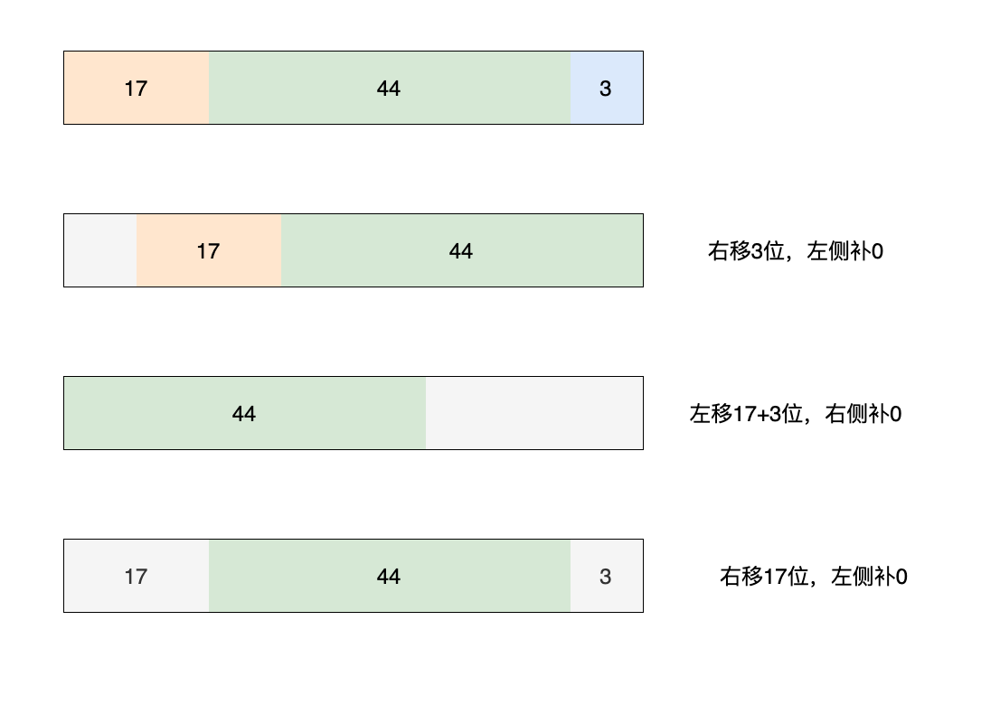

## Isa探索

### 引出

在探索 `alloc` 流程时，在创建实例方法中，我们初步查看了把类与实例对象绑定的 `initInstanceIsa` 方法的结果，在执行该方法后，进行 `po obj` 对象打印时，可看到类名前缀。那么其内部流程和实现具体是怎么样的呢，今天就来探索一下

```C++
static ALWAYS_INLINE id
_class_createInstanceFromZone(Class cls, size_t extraBytes, void *zone,
                              int construct_flags = OBJECT_CONSTRUCT_NONE,
                              bool cxxConstruct = true,
                              size_t *outAllocatedSize = nil)
{
    ASSERT(cls->isRealized());

    // Read class's info bits all at once for performance
    bool hasCxxCtor = cxxConstruct && cls->hasCxxCtor();
    bool hasCxxDtor = cls->hasCxxDtor();
    bool fast = cls->canAllocNonpointer();
    
  // ...省略中间代码

    if (!zone && fast) {
        obj->initInstanceIsa(cls, hasCxxDtor);
    } else {
        // Use raw pointer isa on the assumption that they might be
        // doing something weird with the zone or RR.
        obj->initIsa(cls);
    }

    if (fastpath(!hasCxxCtor)) {
        return obj;
    }

    construct_flags |= OBJECT_CONSTRUCT_FREE_ONFAILURE;
    return object_cxxConstructFromClass(obj, cls, construct_flags);
}

```

### 判断条件分析

查看绑定相关方法，首先看到了 `if` 判断，`zone` 参数当前传入 `nil` 无需关注，着眼于 `fast` 参数，其赋值方法 `canAllocNonpointer()`

```C++
    bool fast = cls->canAllocNonpointer();
    
  // ...省略中间代码

    if (!zone && fast) {
        obj->initInstanceIsa(cls, hasCxxDtor);
    } else {
        // Use raw pointer isa on the assumption that they might be
        // doing something weird with the zone or RR.
        obj->initIsa(cls);
    }
```

查看 `canAllocNonpointer()` 方法以及其后续方法

```c++
    bool canAllocNonpointer() {
        ASSERT(!isFuture());
        return !instancesRequireRawIsa();
    }

// -------- instancesRequireRawIsa

// class's instances requires raw isa
#define FAST_CACHE_REQUIRES_RAW_ISA   (1<<13)  //0x2000  第13位为1

#if FAST_CACHE_REQUIRES_RAW_ISA
    bool instancesRequireRawIsa() {
        return cache.getBit(FAST_CACHE_REQUIRES_RAW_ISA);
    }
    void setInstancesRequireRawIsa() {
        cache.setBit(FAST_CACHE_REQUIRES_RAW_ISA);
    }

// -------- cache_t cache;    getBit    
#if __LP64__
    bool getBit(uint16_t flags) const {
        return _flags & flags;
    }
```

又查探到 `cache_t cache` 的 `getBit` 方法，又见到到了 `_flags` 

> 这个 `cache_t` 和其 `_flags` 用到了很多次，后面要仔细探索下应对这些使用

1. 这里我们先只使用 `_flags` 的值，一步一步 `return` 

```shell
(lldb) po _flags
32800    // 0x8020  //1000 0000 0010 0000
```

二进制 13位上为 0， 与 flags 与运算后为 0，导致 `instancesRequireRawIsa` 方法返回 `false` 

2. `instancesRequireRawIsa` 方法怎么理解合适呢，仔细观察其方法名以及宏和注释 `class's instances requires raw isa` ，可以理解为 **实例对象是否需要原始的/未加工的 `isa`**

3. 继续向外层 `return` ，回到 `canAllocNonpointer` 方法，其实现 `!instancesRequireRawIsa()` 正好与 `RawIsa` 相反，可以理解为这个 `Nonpointer` 与 `Raw` 相反，看来 **`Nonpointer` 对应的 `isa` 应该是加工过的，不原始的，不纯的**

4. 最终返回 `fast` 的赋值，其为 `true` ，因此执行 `obj->initInstanceIsa(cls, hasCxxDtor);`  ，此处也可以看到另一分支 `obj->initIsa(cls)` 方法的注释  `Use raw pointer isa` 使用的是原始 isa 指针，再次证明了上述逻辑

### initInstanceIsa 

继续探查后续流程

```C++
inline void 
objc_object::initInstanceIsa(Class cls, bool hasCxxDtor)
{
    ASSERT(!cls->instancesRequireRawIsa());
    ASSERT(hasCxxDtor == cls->hasCxxDtor());

    initIsa(cls, true, hasCxxDtor);
}
```

咦！此处又调了 `initIsa` ，不过传参不一样，看一下另一分支的实现

```C++
inline void 
objc_object::initIsa(Class cls)
{
    initIsa(cls, false, false);
}

```

果然，中间参数不同，应该就是 `Raw pointer isa` 与 `Nonpointer isa` 的传参区别，查看下这个三参数 `initIsa` 的实现

```C++
#if !SUPPORT_INDEXED_ISA && !ISA_HAS_CXX_DTOR_BIT
#define UNUSED_WITHOUT_INDEXED_ISA_AND_DTOR_BIT __attribute__((unused))
#else
#define UNUSED_WITHOUT_INDEXED_ISA_AND_DTOR_BIT
#endif

inline void 
objc_object::initIsa(Class cls, bool nonpointer, UNUSED_WITHOUT_INDEXED_ISA_AND_DTOR_BIT bool hasCxxDtor)
{ 
    ASSERT(!isTaggedPointer()); 
    
    isa_t newisa(0);

    if (!nonpointer) {
        newisa.setClass(cls, this);
    } else {
        ASSERT(!DisableNonpointerIsa);
        ASSERT(!cls->instancesRequireRawIsa());


#if SUPPORT_INDEXED_ISA
        ASSERT(cls->classArrayIndex() > 0);
        newisa.bits = ISA_INDEX_MAGIC_VALUE;
        // isa.magic is part of ISA_MAGIC_VALUE
        // isa.nonpointer is part of ISA_MAGIC_VALUE
        newisa.has_cxx_dtor = hasCxxDtor;
        newisa.indexcls = (uintptr_t)cls->classArrayIndex();
#else
        newisa.bits = ISA_MAGIC_VALUE;
        // isa.magic is part of ISA_MAGIC_VALUE
        // isa.nonpointer is part of ISA_MAGIC_VALUE
#   if ISA_HAS_CXX_DTOR_BIT
        newisa.has_cxx_dtor = hasCxxDtor;
#   endif
        newisa.setClass(cls, this);
#endif
        newisa.extra_rc = 1;
    }

    // This write must be performed in a single store in some cases
    // (for example when realizing a class because other threads
    // may simultaneously try to use the class).
    // fixme use atomics here to guarantee single-store and to
    // guarantee memory order w.r.t. the class index table
    // ...but not too atomic because we don't want to hurt instantiation
    isa = newisa;
}

```

芜湖，第二个参数果然是 `bool nonpointer`。接下来分析下这个函数

### 分析 initIsa( , , )

#### isa_t

大部分代码都是对  `isa_t newisa(0);`  的操作，看来 `isa_t` 是这个方法的核心了，那我们去查看下这个 `isa_t` 类型的实现

```C++
union isa_t {
    isa_t() { }
    isa_t(uintptr_t value) : bits(value) { }

    uintptr_t bits;

private:
    // Accessing the class requires custom ptrauth operations, so
    // force clients to go through setClass/getClass by making this
    // private.
    Class cls;

public:
#if defined(ISA_BITFIELD)
    struct {
        ISA_BITFIELD;  // defined in isa.h
    };

    bool isDeallocating() {
        return extra_rc == 0 && has_sidetable_rc == 0;
    }
    void setDeallocating() {
        extra_rc = 0;
        has_sidetable_rc = 0;
    }
#endif

    void setClass(Class cls, objc_object *obj);
    Class getClass(bool authenticated);
    Class getDecodedClass(bool authenticated);
};
```

`union` ，这是个联合体/共用体，那么根据 《3-3》了解的知识，内部的成员是使用同一块内存的，来看看都有谁：

```C++
union isa_t {
    uintptr_t bits;

private:
    Class cls;

public:
#if defined(ISA_BITFIELD)
    struct {
        ISA_BITFIELD;  // defined in isa.h
    };
#endif
};
```

ok，记住这三个成员是使用同一块内存的(**`union` 的成员"互斥"不重要，重要的是对同一块内存操作**)

有个结构体类型的成员，看一下内部的成员，没能点进去，那就在 `isa.h` 中搜索一下 `ISA_BITFIELD` ，查到4个，查看当前架构的，当前 demo 用 Mac 跑的，那就看 `__x86_64__` 

```c
// isa.h
# elif __x86_64__
#   define ISA_MASK        0x00007ffffffffff8ULL
#   define ISA_MAGIC_MASK  0x001f800000000001ULL
#   define ISA_MAGIC_VALUE 0x001d800000000001ULL
#   define ISA_HAS_CXX_DTOR_BIT 1
#   define ISA_BITFIELD                                          \
      uintptr_t nonpointer        : 1;                           \
      uintptr_t has_assoc         : 1;                           \
      uintptr_t has_cxx_dtor      : 1;                           \
      uintptr_t shiftcls          : 44; /*MACH_VM_MAX_ADDRESS 0x7fffffe00000*/ \
      uintptr_t magic             : 6;                           \
      uintptr_t weakly_referenced : 1;                           \
      uintptr_t unused            : 1;                           \
      uintptr_t has_sidetable_rc  : 1;                           \
      uintptr_t extra_rc          : 8
#   define RC_ONE   (1ULL<<56)
#   define RC_HALF  (1ULL<<7)
```

[拓展1]此结构体的成员的具体分析我们稍后再看。

当前了解，这个结构体是位域方式设置了这么些成员。了解这些之后，我们继续返回 `initIsa` 函数查看实现

#### if 判断

##### nonpointer (本章重点)

当前传入 `nonpointer` 是 `true` ，那我们先来看这部分的实现

```C++
#if SUPPORT_INDEXED_ISA
        ASSERT(cls->classArrayIndex() > 0);
        newisa.bits = ISA_INDEX_MAGIC_VALUE;
        // isa.magic is part of ISA_MAGIC_VALUE
        // isa.nonpointer is part of ISA_MAGIC_VALUE
        newisa.has_cxx_dtor = hasCxxDtor;
        newisa.indexcls = (uintptr_t)cls->classArrayIndex();
#else
        newisa.bits = ISA_MAGIC_VALUE;
        // isa.magic is part of ISA_MAGIC_VALUE
        // isa.nonpointer is part of ISA_MAGIC_VALUE
#   if ISA_HAS_CXX_DTOR_BIT
        newisa.has_cxx_dtor = hasCxxDtor;
#   endif
        newisa.setClass(cls, this);
#endif
        newisa.extra_rc = 1;
```

###### 1. 查看 `SUPPORT_INDEXED_ISA` 

```c++
// Define SUPPORT_INDEXED_ISA=1 on platforms that store the class in the isa 
// field as an index into a class table.
// Note, keep this in sync with any .s files which also define it.
// Be sure to edit objc-abi.h as well.
#if __ARM_ARCH_7K__ >= 2  ||  (__arm64__ && !__LP64__)
#   define SUPPORT_INDEXED_ISA 1
#else
#   define SUPPORT_INDEXED_ISA 0
#endif
```

 `SUPPORT_INDEXED_ISA` 看实现来看是区分架构的，当前是 Mac ，那值为0。

> 此处的架构区分，正好对应了 `ISA_BITFIELD` 的架构区分，所以分析一个分支代码，另一部分逻辑上一致(M1的Mac 应该走这一部分)。

> `__LP64__` 指的是Unix 和 Unix 类的系统 （Linux，Mac OS X)

###### 2.  `newisa` 的赋值流程 (重点的重点)

此时代码又向下进行至进行 `newisa` 的赋值

我们打断点来研究下具体流程，断点如图


<font color=red>**核心流程**</font>

首页明确 `newisa` 作为一个  `isa_t` 是一个 `union` 联合体，其内部的三个成员共同操作同一块内存地址。

**1) 断点1  L359** 未赋值，此时全为 0 或 nil

```shell
(lldb) p newisa
(isa_t) $1 = {
  bits = 0
  cls = nil
   = {
    nonpointer = 0
    has_assoc = 0
    has_cxx_dtor = 0
    shiftcls = 0
    magic = 0
    weakly_referenced = 0
    unused = 0
    has_sidetable_rc = 0
    extra_rc = 0
  }
}
```

**2) 断点2  L363** 执行  `newisa.bits = ISA_MAGIC_VALUE;` 后

```c++
# elif __x86_64__
#   define ISA_MAGIC_VALUE 0x001d800000000001ULL
#   define ISA_HAS_CXX_DTOR_BIT 1
```

`ISA_MAGIC_VALUE` 值为 `0x001d800000000001ULL` 赋值给 `isa_t` 的 `bits` 成员

`ISA_HAS_CXX_DTOR_BIT` 当前架构下为 1 ，因此跳进来

再次输出 `newisa`

```shell
(lldb) p newisa
(isa_t) $3 = {
  bits = 8303511812964353 # 十六进制 0x001d800000000001
  cls = 0x001d800000000001
   = {
    nonpointer = 1
    has_assoc = 0
    has_cxx_dtor = 0
    shiftcls = 0
    magic = 59
    weakly_referenced = 0
    unused = 0
    has_sidetable_rc = 0
    extra_rc = 0
  }
}

(lldb) p/t newisa.bits  #二进制输出
(uintptr_t) $5 = 0b0000000000011101100000000000000000000000000000000000000000000001
```

分析：

- `bits` 为 `0x001d800000000001` 是 `8303511812964353` 的十六进制形式
- `cls` 直接就是  `0x001d800000000001` 
- 位域结构体 `ISA_BITFIELD` ，其按二进制的位进行区分取值，也是同一块内存的取值，结构如下图(小端法： 最低有效字节在最前面)


**3) 断点3  L365**  执行 `newisa.has_cxx_dtor = hasCxxDtor;` 后

`hasCxxDtor` 值是一级一级从上层传入，追溯到 `_class_createInstanceFromZone` 方法中的 `bool hasCxxDtor = cls->hasCxxDtor();` 赋值， 追溯其实现

```c++
#if FAST_CACHE_HAS_CXX_DTOR
    bool hasCxxDtor() {
        ASSERT(isRealized());
        return cache.getBit(FAST_CACHE_HAS_CXX_DTOR);
    }
    void setHasCxxDtor() {
        cache.setBit(FAST_CACHE_HAS_CXX_DTOR);
    }
#else

// ---- 
// 非 arm64下
#define FAST_CACHE_HAS_CXX_DTOR       (1<<2)

// --- getBit
    bool getBit(uint16_t flags) const {
        return _flags & flags;
    }
```

又追溯到 `_flags` 了，此时打印下输出

```shell
(lldb) p flags
(uint16_t) $0 = 4   #验证确实是 1<<2  0b0100
(lldb) p _flags
(uint16_t) $1 = 32800
(lldb) p/t _flags
(uint16_t) $2 = 0b1000000000100000 
# _flags & flags 结果明显为 false
```

此时返回值为 `false`， 传递至  `newisa.has_cxx_dtor = hasCxxDtor;` ，即表示为位域中  `has_cxx_dtor` 使用位的值为 `0` ，对内存未造成任何改变。(参照断点2的图示)

打印验证

```shell
(lldb) p newisa
(isa_t) $9 = {
  bits = 8303511812964353
  cls = 0x001d800000000001
   = {
    nonpointer = 1
    has_assoc = 0
    has_cxx_dtor = 0
    shiftcls = 0
    magic = 59
    weakly_referenced = 0
    unused = 0
    has_sidetable_rc = 0
    extra_rc = 0
  }
}
```


**4) 断点4 L367**  执行 `newisa.setClass(cls, this);` 

- 分析代码

查看 `setClass(,)` 方法的实现，其方法在 `isa_t` 联合体中声明

```c++
union isa_t {
    // ... 省略成员变量
    void setClass(Class cls, objc_object *obj);
    Class getClass(bool authenticated);
    Class getDecodedClass(bool authenticated);
};

// objc-object.h 中
 
// Set the class field in an isa. Takes both the class to set and
// a pointer to the object where the isa will ultimately be used.
// This is necessary to get the pointer signing right.
//
// Note: this method does not support setting an indexed isa. When
// indexed isas are in use, it can only be used to set the class of a
// raw isa.
inline void
isa_t::setClass(Class newCls, UNUSED_WITHOUT_PTRAUTH objc_object *obj)
{
    // Match the conditional in isa.h.
#if __has_feature(ptrauth_calls) || TARGET_OS_SIMULATOR
#   if ISA_SIGNING_SIGN_MODE == ISA_SIGNING_SIGN_NONE
    // No signing, just use the raw pointer.
    uintptr_t signedCls = (uintptr_t)newCls;

#   elif ISA_SIGNING_SIGN_MODE == ISA_SIGNING_SIGN_ONLY_SWIFT
    // We're only signing Swift classes. Non-Swift classes just use
    // the raw pointer
    uintptr_t signedCls = (uintptr_t)newCls;
    if (newCls->isSwiftStable())
        signedCls = (uintptr_t)ptrauth_sign_unauthenticated((void *)newCls, ISA_SIGNING_KEY, ptrauth_blend_discriminator(obj, ISA_SIGNING_DISCRIMINATOR));

#   elif ISA_SIGNING_SIGN_MODE == ISA_SIGNING_SIGN_ALL
    // We're signing everything
    uintptr_t signedCls = (uintptr_t)ptrauth_sign_unauthenticated((void *)newCls, ISA_SIGNING_KEY, ptrauth_blend_discriminator(obj, ISA_SIGNING_DISCRIMINATOR));

#   else
#       error Unknown isa signing mode.
#   endif

    shiftcls_and_sig = signedCls >> 3;

#elif SUPPORT_INDEXED_ISA
    // Indexed isa only uses this method to set a raw pointer class.
    // Setting an indexed class is handled separately.
    cls = newCls;

#else // Nonpointer isa, no ptrauth
    shiftcls = (uintptr_t)newCls >> 3;
#endif
}
```

代码实现这么多，最后发现对应 `Nonpointer isa`  来说只执行一句代码

```C++
#else // Nonpointer isa, no ptrauth
    shiftcls = (uintptr_t)newCls >> 3;
```

这句代码是对 `newCls` 强转类型并进行右移三位操作，然后赋值给 位域 `ISA_BITFIELD` 的 `shiftcls` 成员。

那么这个 `newCls` 是什么呢？ 

再向上层看下传入的是 `cls` 参数，这是个 `Class` 类型数据，怎么进行位操作了？？

哦哦，想起来了，在《3-1》的拓展中查看了 `Class` 的本质是结构体指针

`typedef struct objc_class *Class;` 

那么来查看下 `newCls` 即赋值流程方法中的 `cls` ，和其右移结果

```shell
(lldb) p/x newCls
(Class) $10 = 0x00000001000083c8 LGPerson #十进制 4295001032
(lldb) p (uintptr_t)newCls
(uintptr_t) $11 = 4295001032   

# 右移三位
# 536875129 
# 十六进制：0x20001079
# 二进制  0b0000000000000000000000000000000000100000000000000001000001111001
```


- 分析取值

分析完代码，再分析下输出值验证下。 输出 `newisa` 的值

```shell
(lldb) p newisa
(isa_t) $15 = {
  bits = 8303516107965385
  cls = LGPerson
   = {
    nonpointer = 1
    has_assoc = 0
    has_cxx_dtor = 0
    shiftcls = 536875129
    magic = 59
    weakly_referenced = 0
    unused = 0
    has_sidetable_rc = 0
    extra_rc = 0
  }
}
```

此处使用联合体 `isa_t` 的成员-位域 ` ISA_BITFIELD` 的赋值操作更改的内存，此时  `shiftcls` 取值 `536875129` 与上段分析代码一致，此时内存结构如图：


此时这块内存存值如下，

```shell
(lldb) p/x newisa.cls
(Class) $16 = 0x001d8001000083c9 LGPerson
(lldb) p/d newisa.cls
(Class) $17 = 8303516107965385 LGPerson
(lldb) p/t newisa.cls
(Class) $18 = 0b0000000000011101100000000000000100000000000000001000001111001001 LGPerson
```

联合体`isa_t` 中的 `bits` 取值为 `8303516107965385` ，一致；

对另个一成员 `Class cls` 显示为 `LGPerson` ，有点奇怪，在代码分析中 `LGPerson` 的输出好像不一样啊？ 这个问题我们稍后探索

```shell
(lldb) p/x newCls
(Class) $10 = 0x00000001000083c8 LGPerson #十进制 4295001032
```

**5)  断点5 L376 ** 执行 `newisa.extra_rc = 1;` 

整完断点4，感觉这个好简单，就是在位域 `ISA_BITFIELD` 的高8位的最低位加上1就行。

最终赋值时的这块内存结构如图


查看输出验证下

```shell
(lldb) p newisa
(isa_t) $20 = {
  bits = 80361110145893321
  cls = LGPerson
   = {
    nonpointer = 1
    has_assoc = 0
    has_cxx_dtor = 0
    shiftcls = 536875129
    magic = 59
    weakly_referenced = 0
    unused = 0
    has_sidetable_rc = 0
    extra_rc = 1
  }
}
(lldb) p/t newisa.bits
(uintptr_t) $21 = 0b0000000100011101100000000000000100000000000000001000001111001001
```

OK，完全没有问题，这个联合体的操作真是犀利，简直亮瞎我了。

额，那现在到哪了？该干啥来着？我在做什么呢这会？？？

还在 `if判断` 中，该走另一分支了

##### Raw isa

这个和 `nonpointer isa` 对应的分支，就是纯/原始 `isa` 的情况了

`!nonpointer`  即是 `Raw pointer isa`  

```c++
  if (!nonpointer) {
        newisa.setClass(cls, this);
    }
```

哦...，这不就和上面分析 `nonpointer` 的  `4) 断点4 L367 执行 newisa.setClass(cls, this);` 步骤一致么

稍等，好像方法实现有区别，来看下

```C++
inline void
isa_t::setClass(Class newCls, UNUSED_WITHOUT_PTRAUTH objc_object *obj)
{
    // Match the conditional in isa.h.
#if __has_feature(ptrauth_calls) || TARGET_OS_SIMULATOR
  #   if ISA_SIGNING_SIGN_MODE == ISA_SIGNING_SIGN_NONE
    // No signing, just use the raw pointer.
    uintptr_t signedCls = (uintptr_t)newCls;
  
  //... 省略 swift class 使用

  #   elif ISA_SIGNING_SIGN_MODE == ISA_SIGNING_SIGN_ALL
    // We're signing everything
    uintptr_t signedCls = (uintptr_t)ptrauth_sign_unauthenticated((void *)newCls, ISA_SIGNING_KEY, ptrauth_blend_discriminator(obj, ISA_SIGNING_DISCRIMINATOR));

  #   else
  #       error Unknown isa signing mode.
  #   endif

    shiftcls_and_sig = signedCls >> 3;

#elif SUPPORT_INDEXED_ISA
    // Indexed isa only uses this method to set a raw pointer class.
    // Setting an indexed class is handled separately.
    cls = newCls;

#else // Nonpointer isa, no ptrauth
    shiftcls = (uintptr_t)newCls >> 3;
#endif
}
```

查看下判断条件

```C++
#ifndef __has_feature
#   define __has_feature(x) 0  //据说在 A12以上芯片才为1
#endif

/*
 *  “-target=x86_64-apple-ios12-simulator”
 *      TARGET_OS_MAC=1
 *      TARGET_OS_IPHONE=1
 *      TARGET_OS_IOS=1
 *      TARGET_OS_SIMULATOR=1  //在指定模拟器上为1，其他都为9
*/

// Define SUPPORT_INDEXED_ISA=1 on platforms that store the class in the isa 
// field as an index into a class table.
// Note, keep this in sync with any .s files which also define it.
// Be sure to edit objc-abi.h as well.
#if __ARM_ARCH_7K__ >= 2  ||  (__arm64__ && !__LP64__)
#   define SUPPORT_INDEXED_ISA 1
#else
#   define SUPPORT_INDEXED_ISA 0
#endif
```

？？这些判断在当前好像都进不去来着。  好吧，这部分暂时没法执行验证，先留存以后配置 `Raw isa` 的时候再整  ╮(╯▽╰)╭

#### 结语

探索到这里，`alloc`  把类与实例对象绑定的 `initInstanceIsa` 方法的已经基本完成。此时实例对象的 `isa` ，本质上的 `isa_t` 联合体的内存赋值已经基本完成，并且通过 `Class cls` 成员完成了与类的绑定。

orz，回顾整个流程，还有个问题还没弄清楚，在 `4) 断点4 L367` 分析输出结果时，发现 `isa.cls` 和 传入的 `Class cls` 都能描述成 `LGPerson` 但是地址却不一样

```Shell
# --- isa_t cls
(lldb) p/x newisa.cls
(Class) $16 = 0x001d8001000083c9 LGPerson
(lldb) p/d newisa.cls
(Class) $17 = 8303516107965385 LGPerson
(lldb) p/t newisa.cls
(Class) $18 = 0b0000000000011101100000000000000100000000000000001000001111001001 LGPerson

# ----  入参 Class cls
(lldb) p/x newCls
(Class) $10 = 0x00000001000083c8 LGPerson #十进制 4295001032
```

好吧，那还需要延伸下

### 延伸

我们知道的是， cls 的地址通过右移三位赋值给了 `shiftcls` ，所以  `shiftcls`  当前也是存储类指针的值， 而同一内存地址下的 `isa_t` 的 `Class cls` 直接显示与 cls 相同的类描述  `LGPerson` 。

这时产生两个问题：

- 为什么 cls 的地址右移三位还可以使用？
-  为什么 `ISA_BITFIELD` 中只有  `shiftcls`  是指针值的部分，使用 `Class` 类型显示的时候还能是 `LGPerson` 

这会感觉没有什么思绪，不过这个明显与类相关，我们稍后在探索类的时候再看看

现在我们只能先研究下这两个地址间的关系，通过 cls 转换至 `shiftcls` 的流程很明晰了，那么反过来呢，通过 `isa` 来获取类的地址呢?

我们经常通过 `x  (memory read)` 来读取对象内存来查看，而其 `isa` 就是首地址

```shell
(lldb) x/4gx p
0x10071be30: 0x011d8001000083b9 0x0000000000000000
0x10071be40: 0x0000000000000000 0x0000000000000000
```

#### 源码分析

`isa` 本质上是 `isa_t` ，那我们来看下内部有没有方法可以使用

```C++
union isa_t {
    // ... 省略成员变量
    void setClass(Class cls, objc_object *obj);
    Class getClass(bool authenticated); 
    Class getDecodedClass(bool authenticated);
};
```

确实有 `getClass()` 方法，查看下实现

```C++
// Get the class pointer out of an isa. When ptrauth is supported,
// this operation is optionally authenticated. Many code paths don't
// need the authentication, so it can be skipped in those cases for
// better performance.
//
// Note: this method does not support retrieving indexed isas. When
// indexed isas are in use, it can only be used to retrieve the class
// of a raw isa.
#if SUPPORT_INDEXED_ISA || (ISA_SIGNING_AUTH_MODE != ISA_SIGNING_AUTH)
#define MAYBE_UNUSED_AUTHENTICATED_PARAM __attribute__((unused))
#else
#define MAYBE_UNUSED_AUTHENTICATED_PARAM UNUSED_WITHOUT_PTRAUTH
#endif

inline Class
isa_t::getClass(MAYBE_UNUSED_AUTHENTICATED_PARAM bool authenticated) {
#if SUPPORT_INDEXED_ISA
    return cls;
#else

    uintptr_t clsbits = bits;

#   if __has_feature(ptrauth_calls)
#       if ISA_SIGNING_AUTH_MODE == ISA_SIGNING_AUTH
    // Most callers aren't security critical, so skip the
    // authentication unless they ask for it. Message sending and
    // cache filling are protected by the auth code in msgSend.
    if (authenticated) {
        // Mask off all bits besides the class pointer and signature.
        clsbits &= ISA_MASK;
        if (clsbits == 0)
            return Nil;
        clsbits = (uintptr_t)ptrauth_auth_data((void *)clsbits, ISA_SIGNING_KEY, ptrauth_blend_discriminator(this, ISA_SIGNING_DISCRIMINATOR));
    } else {
        // If not authenticating, strip using the precomputed class mask.
        clsbits &= objc_debug_isa_class_mask;
    }
#       else
    // If not authenticating, strip using the precomputed class mask.
    clsbits &= objc_debug_isa_class_mask;
#       endif

#   else
    clsbits &= ISA_MASK;
#   endif

    return (Class)clsbits;
#endif
}
```

恩，又是很多代码，看下条件判断，`SUPPORT_INDEXED_ISA` 为0，`__has_feature` 为0，那就只执行下面两句

```C++
uintptr_t clsbits = bits;
clsbits &= ISA_MASK;
return (Class)clsbits;
```

`bits` 我们知道是 `isa_t` 的成员，其值就是内存地址的值；那就剩下 `ISA_MASK` 这个 `mask` ，翻译过来应该是掩码的意思，查看下取值

```C++
# elif __x86_64__
#   define ISA_MASK        0x00007ffffffffff8ULL
```

在不同架构下取值不同，而且与 `ISA_BITFIELD` 放在一块，看起来好像是对应的。现在来运算输出下

```shell
(lldb) p 0x011d8001000083b9 & 0x00007ffffffffff8
(long) $1 = 4295001016
(lldb) p/x 0x011d8001000083b9 & 0x00007ffffffffff8
(long) $2 = 0x00000001000083b8
(lldb) p (Class)$2
(Class) $3 = LGPerson

(lldb) p/x LGPerson.class
(Class) $5 = 0x00000001000083b8 LGPerson
```

果然取到了类 `LGPerson` ，再对比下输出的类地址完全一致，分析的流程是没问题的。那么这是怎么回事，为什么 `与` 上一个这个称为掩码的东西就能得到类了？

#### 算法分析

那么我们来看下这个掩码 `ISA_MASK` 到底是什么？ 

```C++
# elif __x86_64__
#   define ISA_MASK        0x00007ffffffffff8ULL
```

其后的 `ULL` 是 `unsigned long long` ，再查看下二进制值

```shell
(lldb) p/t 0x00007ffffffffff8 #二进制格式输出
(long) $4 = 0b0000000000000000011111111111111111111111111111111111111111111000
```

这些个 1 的位置有点熟悉，查下正好 44位，前有3位0，后有17位0，这完全是 `shiftcls` 在 `ISA_BITFIELD` 位域中的位置，这进行 `与` 操作，不就是取了 `shiftcls` 存储的指针地址，其他的都置为0么，怪不得能取到 `LGPerson` 这个类的地址。

这也验证了掩码的作用，掩码就是遮掩其他不用的部分，只取出需要的部分位置的值。

##### 平移方法

某个奇奇怪怪的讲师提供了另一种获取 `shiftcls` 的方式，通过位运算平移获取

由于知道当前 isa_t 的内存结构，偷懒用下旧图


可以使用位运算的左右平移，把 `shiftcls` 左右的值全部重置为0 来实现效果

具体流程如图示：



输出验证：

```shel
(lldb) x/4gx p
0x10071be30: 0x011d8001000083b9 0x0000000000000000
0x10071be40: 0x0000000000000000 0x0000000000000000

(lldb) p/x 0x011d8001000083b9>>3
(long) $7 = 0x0023b00020001077
(lldb) p/x 0x0023b00020001077<<20
(long) $8 = 0x0002000107700000
(lldb) p/x 0x0002000107700000>>17
(long) $9 = 0x00000001000083b8

(lldb) p/x LGPerson.class
(Class) $5 = 0x00000001000083b8 LGPerson
```

结果一致，这种方式也可以得到

### 总结

这章我们通过对象的 `isa` 的探究，引出 `isa` 中存储的核心 `shiftcls` 成员，其值存储的指针，最终指向类，那么接下来我们就探究下类的相关实现


## 拓展

### 拓展1  ISA_BITFIELD

针对 x86_64 架构下分析，其他雷同

``` C++
// isa.h
# elif __x86_64__
#   define ISA_MASK        0x00007ffffffffff8ULL
#   define ISA_MAGIC_MASK  0x001f800000000001ULL
#   define ISA_MAGIC_VALUE 0x001d800000000001ULL
#   define ISA_HAS_CXX_DTOR_BIT 1
#   define ISA_BITFIELD                                          \
      uintptr_t nonpointer        : 1;                           \
      uintptr_t has_assoc         : 1;                           \
      uintptr_t has_cxx_dtor      : 1;                           \
      uintptr_t shiftcls          : 44; /*MACH_VM_MAX_ADDRESS 0x7fffffe00000*/ \
      uintptr_t magic             : 6;                           \
      uintptr_t weakly_referenced : 1;                           \
      uintptr_t unused            : 1;                           \
      uintptr_t has_sidetable_rc  : 1;                           \
      uintptr_t extra_rc          : 8
#   define RC_ONE   (1ULL<<56)
#   define RC_HALF  (1ULL<<7)
```

1. 为什么存储了这么多东西，这个 `isa_t` 不是 `isa` 么？

这个通常说的 `nonpointer isa ` ，一般通过 `isa` 来获取对象的类，本质上作为一个指针，占用8字节，共 8*8 = 64 位( 符合上面的位域 `1+1+1+44+6+1+1+1+8` 总位数)，这么大的空间肯定要充分利用，因此存储了类的一些共通的信息

```tex
uintptr_t nonpointer        : 1;  //是否对 isa 指针开启指针优化 0:纯isa指针，1:不止是类对象地址,isa 中包含了类信息、对象的引用计数等
uintptr_t has_assoc         : 1;  //关联对象标志位，0没有，1存在
uintptr_t has_cxx_dtor      : 1;  //该对象是否有 C++ 或者 Objc 的析构器,如果有析构函数,则需要做析构逻辑, 如果没有,则可以更快的释放对象
uintptr_t shiftcls          : 44; /*MACH_VM_MAX_ADDRESS 0x7fffffe00000*/   //存储类指针的值。开启指针优化的情况下，在 arm64 架构中有 33 位用来存储类指针
uintptr_t magic             : 6; //用于调试器判断当前对象是真的对象还是没有初始化的空间
uintptr_t weakly_referenced : 1; //标志对象是否被指向或者曾经指向一个 ARC 的弱变量，没有弱引用的对象可以更快释放。
uintptr_t unused            : 1; //unused
uintptr_t has_sidetable_rc  : 1; //散列表： 当对象引用技术大于 10 时，则需要借用该变量存储进位
uintptr_t extra_rc          : 8  //引用计数：当表示该对象的引用计数值，实际上是引用计数值减 1， 例如，如果对象的引用计数为 10，那么 extra_rc 为 9。如果引用计数大于 10， 则需要使用到下面的 has_sidetable_rc
```

