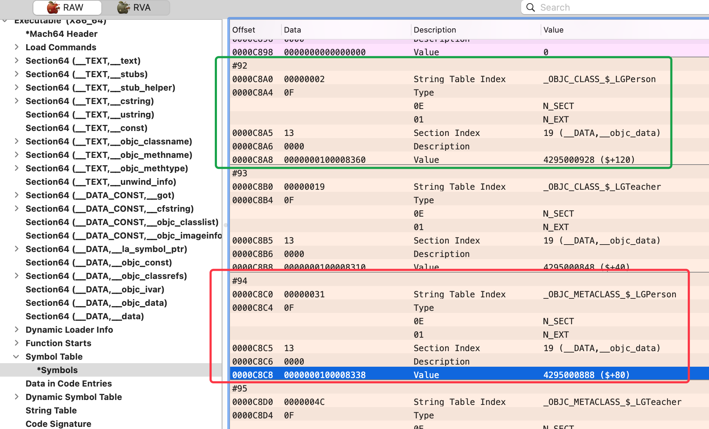
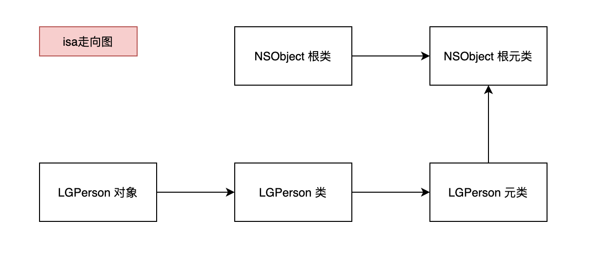
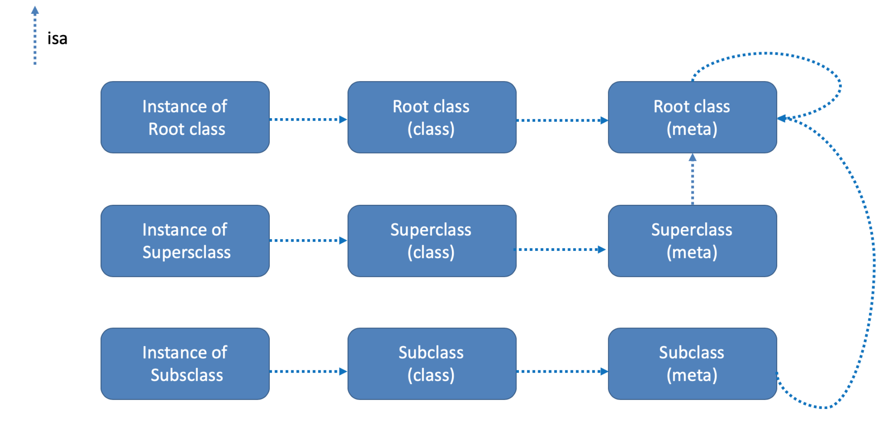
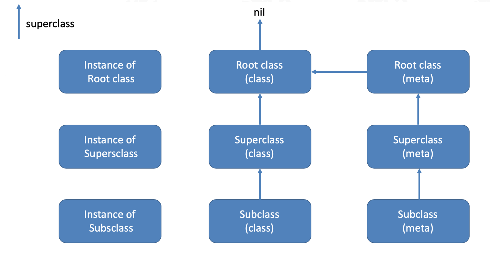

## isa分析

### 获取对象的 isa

代码

```objc
//main 函数中

LGPerson *p = [LGPerson alloc];
NSLog(@"%@", p);
```

`lldb` 输出和查看

```shell
(lldb) x p
0x10221efe0: 65 83 00 00 01 80 1d 01 00 00 00 00 00 00 00 00  e...............
0x10221eff0: 00 00 00 00 00 00 00 00 00 00 00 00 00 00 00 00  ................

(lldb) x/4gx p
0x10221efe0: 0x011d800100008365 0x0000000000000000
0x10221eff0: 0x0000000000000000 0x0000000000000000
```

可以得到 `isa` 的地址 `0x011d800100008365` 

### 分析类地址

根据 《3-4 isa的探索》中的延伸内容，我们知道可以根据 `ISA_MASK` 掩码来获取类的地址，那么来查看下

```shell
(lldb) p 0x011d800100008365 & 0x00007ffffffffff8
(long) $3 = 4295000928
(lldb) p/x 0x011d800100008365 & 0x00007ffffffffff8
(long) $4 = 0x0000000100008360
(lldb) po 0x0000000100008360
LGPerson
```

获取到类的地址 `0x0000000100008360`  。接下来我们按照查看 `isa` 的方式，查看下类地址的内存结构

```shell
(lldb) x/4gx 0x0000000100008360
0x100008360: 0x0000000100008338 0x00007fff88b1fcc8
0x100008370: 0x00007fff203ccaf0 0x0000802c00000000

# 顺便研究下 类的值的首地址是不是也是和对象一样的 isa
(lldb) p/x 0x0000000100008338 & 0x00007ffffffffff8
(long) $6 = 0x0000000100008338
(lldb) po 0x0000000100008338
LGPerson
```

研究类地址指向内存的值的首地址时，发现了两个问题

1. 模仿对象 `isa` 进行掩码 `与` 操作时，结果没有变化，依然是 `与` 之前的值 `0x0000000100008338` 
2. `po` 输出 `description` 时，输出 `LGPerson` 与 类地址的 `po` 输出相同，即 `0x0000000100008360`  与 `0x0000000100008338` 均输出了 `LGPeron`

我们先针对问题2来分析，两个地址均输出了 `LGPeron` ，是否是因为类和对象一样都创建了多份呢？

### 类分析

那我们来验证下

```objc
Class class1 = [LGPerson class];
Class class2 = [LGPerson alloc].class;
Class class3 = object_getClass([LGPerson alloc]);
NSLog(@"\n%p-\n%p-\n%p", class1, class2, class3);
```

输出结果如下：

```shell
0x100008360-
0x100008360-
0x100008360
```

输出结果只有 `0x100008360` ，看来只有这个地址的是类，而且类的地址是唯一的。

那么 `0x0000000100008338` 是什么呢？

分析当前打印结果的结构：

- 对象的 `isa`  指向 类
- 类的 `isa` 指向了当前这个地址

额，针对这个地址，在代码中无法知道具体的结构。那就尝试使用 MachOView 查看和地址相关的符号有没有能给出名称的

> 直接拖动当前工程的可执行文件到 MachOView 软件上进行打开

经过一番查找，在 `Symbol Table` 全部符号表，中找到了相应地址




1. 首先在 `#92` 条目数据中，找到了 `0x0000000100008360` ，查看其对应的字符，是 `_OBJC_CLASS_$_LGPerson`  ，确认是 `类` 没错
2. 然后在 `#94` 条目中，找到了 `0x0000000100008338` ，查看其对应的字符，是 `_OBJC_METACLASS_$_LGPerson` ，那应该是 `metaclass` ，是称作**元类** 的类型

> $ 符号只是一个连接符号

我们代码并没有手动进行元类的创建，意味着是系统和编译器帮我们生成的，此时补充一下结构： 类的 `isa` 指向 元类

#### 当前结构总结

总结一下当前的结构

对象的 `isa`  指向 类，类的 `isa` 指向元类

### 元类分析

当前分析类的 `isa` 指向了元类，那么元类有么有 `isa` ，有的话又指向谁呢？

带着问题，我们又仿照对象 `isa` 的分析方式对元类进行输出

```shell
(lldb) x/4gx 0x0000000100008338 # METACLASS 
0x100008338: 0x00007fff88b1fca0 0x00007fff88b1fca0
0x100008348: 0x00000001021064b0 0x0001e03500000007
# & ISA_MASK 获取其 isa 
(lldb) p/x 0x00007fff88b1fca0 & 0x00007ffffffffff8
(long) $11 = 0x00007fff88b1fca0

(lldb) po 0x00007fff88b1fca0
NSObject
```

进行 `isa` 获取后，`po` 一下，发现竟然是 `NSObject`，这是指向 `NSObject` 类了么，赶紧验证下

```shell
(lldb) p/x NSObject.class
(Class) $9 = 0x00007fff88b1fcc8 NSObject
```

? 这地址不一样啊，由于类只存一份且一般不改变，那么上面的 `NSObject` 的不是指类，那么是什么和 `NSObject` 又是什么关系呢？

和 `NSObject` 类有关，又不是类，那有么有可能是 `NSObject` 的元类呢，这个猜想赶紧有点靠谱，验证下

```shell
(lldb) x/4gx 0x00007fff88b1fcc8
0x7fff88b1fcc8: 0x00007fff88b1fca0 0x0000000000000000
0x7fff88b1fcd8: 0x000000010052ef20 0x0002801000000003
```

猜想验证成功， `NSObject` 类的 `isa` 的地址是 `0x00007fff88b1fca0` 与 上面 `LGPerson METACLASS` 的 `isa` 指向地址相同。

由于 `NSObject` 是作为根类存在(万物皆对象嘛)，那么 `NSObject` 的元类就称作根元类，好像没什么问题。

OK，那么梳理总结下

#### 当前结构总结

1. 对于 `LGPerson` 来说

- 对象的 isa 指向类
- 类的 isa 指向元类
- 元类的 isa 指向根元类

2. 对于 `NSObject` 这个根类来说

- 根类的 isa 指向根元类

文字描述不太直观，为了加深理解和记忆，我们来画个图吧



ok，完美体现了上面的总结描述

元类分析结束，那么接下来就该其 `isa` 指向根元类

### 根元类分析

直接上输出

```shell
(lldb) x/4gx 0x00007fff88b1fca0
0x7fff88b1fca0: 0x00007fff88b1fca0 0x00007fff88b1fcc8
0x7fff88b1fcb0: 0x000000010240f470 0x0005e03100000007
```

得到的结果竟然没变，还是 `0x00007fff88b1fca0` 根元类的地址，看来结构已经到顶了，那么此时着整个流程的分析算是阶段性结束

#### isa 走位总结

那么阶段性总结下，顺便增加下一个父类层面的走向，我们就得到了那张很经典的 `isa走位图` (不知道哪位大佬画的，某个奇奇怪怪的人说是他画的，我不太信，引用下)



这个图解很清晰直观，nice，给大佬点赞

##### 代码验证

再结合代码的输出验证一波

```objc
// NSObject实例对象
NSObject *object1 = [NSObject alloc];
// NSObject类
Class class = object_getClass(object1);
// NSObject元类
Class metaClass = object_getClass(class);
// NSObject根元类
Class rootMetaClass = object_getClass(metaClass);
// NSObject根根元类
Class rootRootMetaClass = object_getClass(rootMetaClass);
NSLog(@"\n%p 实例对象\n%p 类\n%p 元类\n%p 根元类\n%p 根根元类",object1,class,metaClass,rootMetaClass,rootRootMetaClass);
```

先分析下结果再跑

> `object_getClass`  的注释 `Returns the class of an object.`  

- 对象输出和类输出都没有问题
- 类再取他的类是什么值？不清楚啊，得去源码查看下 `object_getClass`  的具体实现

```c++
Class object_getClass(id obj)
{
    if (obj) return obj->getIsa(); // getIsa()分析见 [拓展1]
    else return Nil;
}
```

哦，原来是获取 `isa` ，那很清楚，类的 `isa` 指向 元类 `metaClass`，接下来就很流畅了

- 元类再取 `isa` ，由于当前类是根类 `NSObject` 那么这个元类就是根元类了，其后再取 `isa` 都指向自身了

查看输出结果

```shell
0x10221fef0 实例对象
0x7fff88b1fcc8 类
0x7fff88b1fca0 元类
0x7fff88b1fca0 根元类
0x7fff88b1fca0 根根元类
```

验证无误。

总结过了 `isa` 的走位图，那根据图上的这些 对象啊、类啊、元类啊、根类啊，天然就存在了另一种关系：继承关系，那么我们要在图上添加上这个原本的关系。

有些继承关系已经烂熟于心了，不过还有新增的结构--元类的继承关系没了解过，所以我们还是要进行探索分析一下

### 元类继承链分析

整点代码来分析下

首先因为根类和根元类的输出描述都是 `NSObject` ，那么我们只能根据地址来区分它们，所以先从上面取了放着，下面探索方便对照

```shell
0x7fff88b1fcc8 类   # NSObject 根类
0x7fff88b1fca0 元类 # NSObject 根元类
```

#### 元类的父类

```objc
// LGPerson元类
Class pMetaClass = object_getClass(LGPerson.class);
Class psuperClass = class_getSuperclass(pMetaClass);
NSLog(@"%@ - %p",psuperClass,psuperClass);
```

不废话直接看输出(理论不知道)

```shell
NSObject - 0x7fff88b1fca0 #根元类地址
```

分析下：

`LGPerson` 元类的父类是 `NSObject` ，对比下地址，确认其是根元类

**结论： 元类的父类是根元类**

#### 子类元类的父类

既然探索了继承链，那么继承 `LGPerson` 类的 `LGTeacher` 就不能略过，来来来我们探索下他的元类的继承关系

```objc
  // LGTeacher -> LGPerson -> NSObject
  // 元类
  Class tMetaClass = object_getClass(LGTeacher.class);
  Class tsuperClass = class_getSuperclass(tMetaClass);
  NSLog(@"%@ - %p",tsuperClass,tsuperClass);
```

输出结果

```shell
LGPerson - 0x100008338  #元类地址
```

确认下这个地址是哪种结构，上面搜下，这个是元类地址。

**得出结论：子类元类的父类 是父类的元类**

#### 根类和根元类的父类

```objc
// NSObject元类--根元类
Class metaClass = object_getClass(class);
// NSObject 根类特殊情况
Class nsuperClass = class_getSuperclass(NSObject.class);
NSLog(@"%@ - %p",nsuperClass,nsuperClass);
// 根元类 -> NSObject
Class rnsuperClass = class_getSuperclass(metaClass);
NSLog(@"%@ - %p",rnsuperClass,rnsuperClass);
```

上输出

```shell
(null) - 0x0
NSObject - 0x7fff88b1fcc8 # 类地址
```

根据结果分析可得：

- **根类的父类是 `nil`**
- **根元类的父类是根类(根据地址确认)**

其他没有什么特殊的了吧，那我们再总结下

#### 继承链总结

文字描述上面都已经在结论中输出，那么我们直接上图理解下



> 左侧的三个对象那当然是没有关系的

### 汇总

继承链总结后，再结合上面的 `isa` 走位图，最终形成了官方文档中经典的图片


这会看这张图就理解的清晰多了


## 拓展

### 拓展1  `getIsa() ` 实现

#### 源码实现

```C++
inline Class
objc_object::getIsa() 
{
    if (fastpath(!isTaggedPointer())) return ISA();

    extern objc_class OBJC_CLASS_$___NSUnrecognizedTaggedPointer;
    uintptr_t slot, ptr = (uintptr_t)this;
    Class cls;

    slot = (ptr >> _OBJC_TAG_SLOT_SHIFT) & _OBJC_TAG_SLOT_MASK;
    cls = objc_tag_classes[slot];
    if (slowpath(cls == (Class)&OBJC_CLASS_$___NSUnrecognizedTaggedPointer)) {
        slot = (ptr >> _OBJC_TAG_EXT_SLOT_SHIFT) & _OBJC_TAG_EXT_SLOT_MASK;
        cls = objc_tag_ext_classes[slot];
    }
    return cls;
}
```

执行 `fastpath` 判断语句的大多数非 `TaggedPointer` 类型，返回 `ISA()` 函数的返回值，继续追溯

#### 追溯

```c++
inline Class
objc_object::ISA(bool authenticated)
{
    ASSERT(!isTaggedPointer());
    return isa.getDecodedClass(authenticated);
}

// getDecodedClass()
inline Class
isa_t::getDecodedClass(bool authenticated) {
#if SUPPORT_INDEXED_ISA
    if (nonpointer) {
        return classForIndex(indexcls);
    }
    return (Class)cls;
#else
    return getClass(authenticated);
#endif
}

// --- SUPPORT_INDEXED_ISA
#if __ARM_ARCH_7K__ >= 2  ||  (__arm64__ && !__LP64__) 
// armv7k or arm64_32 watchOS架构 [拓展2]
#   define SUPPORT_INDEXED_ISA 1
#else
#   define SUPPORT_INDEXED_ISA 0
#endif
// --- SUPPORT_INDEXED_ISA 当前按0执行，因此执行 getClass()

// getClass()
inline Class
isa_t::getClass(MAYBE_UNUSED_AUTHENTICATED_PARAM bool authenticated) {
#if SUPPORT_INDEXED_ISA
    return cls;
#else

    uintptr_t clsbits = bits;

#   if __has_feature(ptrauth_calls)
#       if ISA_SIGNING_AUTH_MODE == ISA_SIGNING_AUTH
    // Most callers aren't security critical, so skip the
    // authentication unless they ask for it. Message sending and
    // cache filling are protected by the auth code in msgSend.
    if (authenticated) {
        // Mask off all bits besides the class pointer and signature.
        clsbits &= ISA_MASK;
        if (clsbits == 0)
            return Nil;
        clsbits = (uintptr_t)ptrauth_auth_data((void *)clsbits, ISA_SIGNING_KEY, ptrauth_blend_discriminator(this, ISA_SIGNING_DISCRIMINATOR));
    } else {
        // If not authenticating, strip using the precomputed class mask.
        clsbits &= objc_debug_isa_class_mask;
    }
#       else
    // If not authenticating, strip using the precomputed class mask.
    clsbits &= objc_debug_isa_class_mask;
#       endif

#   else
    clsbits &= ISA_MASK;
#   endif

    return (Class)clsbits;
#endif
}
```

最终找到了 `isa_t::getClass()` ，这个方法在 《3-4、isa探索》中进行了详细的探索，核心代码就是 `clsbits &= ISA_MASK;` 进行了与ISA掩码的 `与` 操作

### 拓展2  armv7k or arm64_32 架构

在源码探索中出现很多如下的宏判断

`#if __ARM_ARCH_7K__ >= 2  ||  (__arm64__ && !__LP64__) `

在源码 `isa.h` 中查看到注释 `// armv7k or arm64_32` 

其应对这两种架构，再搜索了下，发现是 watchOS 的架构

```tex
watchOS

On watchOS, Elements supports two architectures each for device deployment and for the Simulator

    arm64_32 is a variant of arm64 with 32-bit pointer sizes, used on Apple Watch Series 4 and later.
    armv7k is a 32-bit variant of regular armv7, and used from the orginal Apple Watch up to Series 3.
    x86_64 (i.e. 64-bit Intel) is used in the Simulator
    i386 (i.e. 32-bit Intel) is used in the Simulator
```

参考文档：

[CPU Architectures][https://docs.elementscompiler.com/Platforms/Cocoa/CpuArchitectures/]


