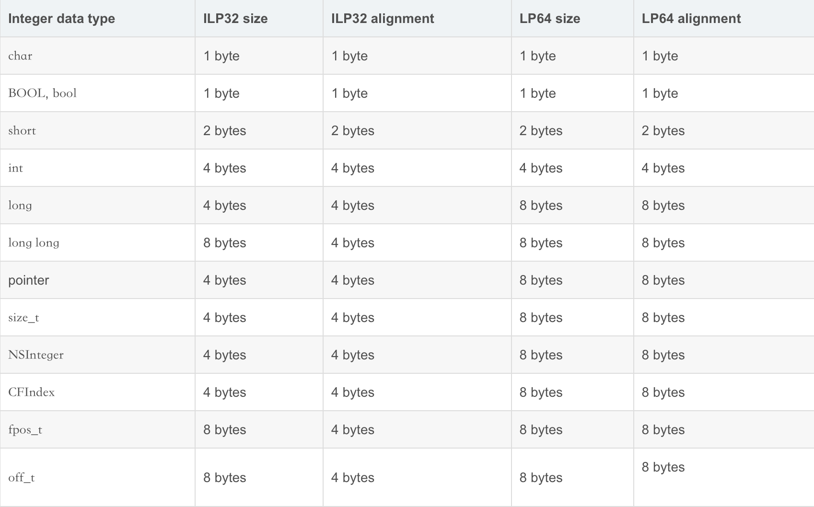

## 类的结构初探

------ `bits` 探究

### 引文

通过研究 `isa` 的走位图，我们从对象找到了类，研究过了对象的底层结构，自然不能放过对类的结构的探究

### 源码

类 -- Class 的根本是什么呢？

在源码中查看其底层声明，本质上时 `objc_class * ` 类型，是一个结构体指针

```C++
typedef struct objc_class *Class;
```

那么自然，我们转向探索 `objc_class` 这个结构体上了，进行源码搜索

在 `runtime.h` 中找到一个

```c++
struct objc_class {
    Class _Nonnull isa  OBJC_ISA_AVAILABILITY;

#if !__OBJC2__  //[拓展1]
    //...  省略无关代码
#endif

} OBJC2_UNAVAILABLE;
/* Use `Class` instead of `struct objc_class *` */
```

由于其 `OBJC2_UNAVAILABLE` 在当前环境下不适用，就忽略不看了

```c++
/* OBJC2_UNAVAILABLE: unavailable in objc 2.0, deprecated in Leopard */
```

在 `objc-runtime-new.h` 找到了可以用的，该结构体代码太长就不全部显示了(L1688-2180)，在研究对应结构时再显示指定部分

```C++
struct objc_class : objc_object {
  objc_class(const objc_class&) = delete;
  objc_class(objc_class&&) = delete;
  void operator=(const objc_class&) = delete;
  void operator=(objc_class&&) = delete;
    // Class ISA;
    Class superclass;
    cache_t cache;             // formerly cache pointer and vtable
    class_data_bits_t bits;    // class_rw_t * plus custom rr/alloc flags
  
//... 省略方法
}
```

其继承自 `objc_object` 

点击进去查看，是 `objc-private.h` 中的

```C++
struct objc_object {
private:
    isa_t isa;

public:
  //... 省略方法
}
```

全局搜索 ` struct objc_object` , 在 `objc.h` 中也发现了一种定义样式

```C++
/// Represents an instance of a class.
struct objc_object {
    Class _Nonnull isa  OBJC_ISA_AVAILABILITY;
};
```

怎么`isa` 存在两种类型呢？

回忆一下 `isa` 的结构，和我们对 `isa` 的探索

```c++
//简化版本，省略方法
union isa_t {
  
    uintptr_t bits;

private:
    // Accessing the class requires custom ptrauth operations, so
    // force clients to go through setClass/getClass by making this
    // private.
    Class cls;

public:
#if defined(ISA_BITFIELD)
    struct {
        ISA_BITFIELD;  // defined in isa.h
    };

#endif
};
```

由于指向同一块内存地址，那么 `isa_t` 是可以由 `Class cls` 来代表的，同时这个 `Class cls` 所代表的指针也是，那么这个 `Class isa` 应该是 `isa_t` 使用 `Class cls` 这个类型来展示给外界，这样进行 `po` 输出会输出类名

再回到 `objc_class` ，就可以理解这个注释掉的 `// Class ISA;` 表明的是继承下来的隐藏成员 `isa` ，那么当前结构体中的成员应该是下面这四个

```C++
Class ISA;
Class superclass;
cache_t cache;             // formerly cache pointer and vtable
class_data_bits_t bits;    // class_rw_t * plus custom rr/alloc flags
```

- `isa` 已经研究过了
- `superclass` 很好理解，就是父类

- `cache` 只能字面理解为缓存，具体是什么也不清楚

- `bits` 也不清楚

那么现在研究探索的方向就很明确了，就是 `cache`  和 `bits` 了，那么首先就来探索下 `bits` 了

### class_data_bits_t bits

首先看到他后面的注释 `// class_rw_t * plus custom rr/alloc flags` ，看起来是由 `class_rw_t *`  与 `custom rr/alloc flags` 组成，那么这个专门的指针 `class_rw_t *` 是什么呢，专门提出的估计有点重要，翻看下面的代码

```C++
    class_rw_t *data() const {
        return bits.data();
    }
    void setData(class_rw_t *newData) {
        bits.setData(newData);
    }
```

是 `bits.data()` ，字面意思就是 `data` 了，再看下下面方法也有很多用到 `bits.data()` ，感觉很重要的样子，那就来看下 `class_rw_t ` ，点进去看看

```C++
struct class_rw_t {
    // Be warned that Symbolication knows the layout of this structure.
    uint32_t flags;
    uint16_t witness;
#if SUPPORT_INDEXED_ISA
    uint16_t index;
#endif

    explicit_atomic<uintptr_t> ro_or_rw_ext;

    Class firstSubclass;
    Class nextSiblingClass;
  
  //... 省略部分方法和实现
  
    const method_array_t methods() const {
      //... 省略实现
    }
  
    const property_array_t properties() const {
      //... 省略实现
    }

    const protocol_array_t protocols() const {
      //... 省略实现
    }
};
```

在其中发现了 `method_array_t` 、`property_array_t` 、`protocol_array_t` 这些方法，根据名称能知道这些应该是 方法列表，属性列表和协议列表，这里确实存在很重要的数据，那么我们现在怎么获取和展示这些列表数据来验证当前的结构呢？

看看我们当前有什么，我们从类探索过来的，类的内存地址和值是知道的，那么 `bits` 的数据我们能获取到么，如果能获取到，那么 `bits.data()` 应该能很容易获取到。

我们在探索 `isa` 的时候，发现其值是存在对象或者类的首地址的，那么依据内存平移(参考《4-3、指针和内存平移》)，我们可以进行平移得到我们想要的 `bits` 的值

#### 偏移量

那么应该偏移多少呢？查看当前类的结构体这个结构，那么影响偏移的应该就只有内部成员了，查看成员

```C++
Class ISA;
Class superclass;
cache_t cache;          
class_data_bits_t bits;    
```

那么偏移量应该就是 上面三个成员的大小了

`Class` 类型的是结构体指针，那么大小是 8 字节，这样 `ISA` 和 `superclass` 就确定了，我们先验证下

```shell
(lldb) x/4gx LGPerson.class
0x100008120: 0x00000001000080f8 0x00007fff88b1fcc8
0x100008130: 0x00007fff203ccaf0 0x0000801000000000

(lldb) po 0x00000001000080f8
LGPerson
(lldb) po 0x00007fff88b1fcc8
NSObject
```

验证无误，由于 `LGPerson` 的父类是 `NSObject` 所以第二个值地址 `po` 输出 `NSObject` 

##### cache_t  大小

接下来是 `cache_t cahce;` ，这个类型没研究过，只能查看下其结构再做判断了

```c++
struct cache_t {
private:
    explicit_atomic<uintptr_t> _bucketsAndMaybeMask;
    union {
        struct {
            explicit_atomic<mask_t>    _maybeMask;
#if __LP64__
            uint16_t                   _flags;
#endif
            uint16_t                   _occupied;
        };
        explicit_atomic<preopt_cache_t *> _originalPreoptCache;
    };
 
  //... 省略方法和 static
}
```

分析大小：

1. 方法不占用结构体内存，那就无需计算，所有方法都先忽略

2. static 修饰的属性在全局区存储，也不占用当前结构体内存，也都可以忽略

3. 当前只需要计算 `explicit_atomic<uintptr_t>` 这个成员变量和 `union` 这个联合体的大小就能得出 `cache_t` 的大小

###### explicit_atomic<uintptr_t> 大小

`explicit_atomic<uintptr_t>`  这个分成两部分类型，看下前面的 `explicit_atomic` 类型，点击去看下源码实现

```C++
// Version of std::atomic that does not allow implicit conversions
// to/from the wrapped type, and requires an explicit memory order
// be passed to load() and store().
template <typename T>
struct explicit_atomic : public std::atomic<T> {
    explicit explicit_atomic(T initial) noexcept : std::atomic<T>(std::move(initial)) {}
    operator T() const = delete;
    
    T load(std::memory_order order) const noexcept {
        return std::atomic<T>::load(order);
    }
    void store(T desired, std::memory_order order) noexcept {
        std::atomic<T>::store(desired, order);
    }
    
    // Convert a normal pointer to an atomic pointer. This is a
    // somewhat dodgy thing to do, but if the atomic type is lock
    // free and the same size as the non-atomic type, we know the
    // representations are the same, and the compiler generates good
    // code.
    static explicit_atomic<T> *from_pointer(T *ptr) {
        static_assert(sizeof(explicit_atomic<T> *) == sizeof(T *),
                      "Size of atomic must match size of original");
        explicit_atomic<T> *atomic = (explicit_atomic<T> *)ptr;
        ASSERT(atomic->is_lock_free());
        return atomic;
    }
};
```

看到  `<T>` 就大约知道和泛型有关，这个应该是对泛型的封装，那么最终决定大小的应该是 `uintptr_t` 的大小，这个类型点进去看下

```c++
#ifndef _UINTPTR_T
#define _UINTPTR_T
typedef unsigned long           uintptr_t;
#endif /* _UINTPTR_T */
```

`unsigned long` 与 `long` 在 64位系统下是大小 `8` 字节 [拓展3]

###### union 大小

union整体结构如下：

```C++
    union {
        struct {
            explicit_atomic<mask_t>    _maybeMask;
#if __LP64__
            uint16_t                   _flags;
#endif
            uint16_t                   _occupied;
        };
        explicit_atomic<preopt_cache_t *> _originalPreoptCache;
    };
```

由于 union 是对同一块内存区域的操作，就只需考虑其一个成员变量的大小即可

`explicit_atomic<preopt_cache_t *> _originalPreoptCache;` 看下这个单独的成员，指针那就是大小为 `8 `字节了

这么随意么？再使用 `struct` 验证下，

- `explicit_atomic<mask_t>` 就查看 `mask_t`

```C++
#if __LP64__
typedef uint32_t mask_t;  // x86_64 & arm64 asm are less efficient with 16-bits
#else
typedef uint16_t mask_t;
#endif
```

当前系统就是 `__LP64__` ，因此查看 `uint32_t` 

```C++
#ifndef _UINT32_T
#define _UINT32_T
typedef unsigned int uint32_t;
#endif /* _UINT32_T */
```

是`int` 的别名， `int` 类型在64位系统中大小为 `4`

- `uint16_t` 查看下

```c++
#ifndef _UINT16_T
#define _UINT16_T
typedef unsigned short uint16_t;
#endif /* _UINT16_T */
```

是 `short` 的别名，`short` 类型在64位系统中大小为 2

- 计算可得 4 + 2 + 2 = 8 ，验证无误

###### 汇总 cache_t 大小

汇总这两个结构大小，`cache_t` 的大小为 8 + 8 = 16 字节

###### 简便方法获取大小

由于当前源码可以编译，那么打断点后，在控制台使用 `sizeof` 也可直接打印对应类型的大小

```shell
(lldb) po sizeof(cache_t)
16

(lldb) po sizeof(class_data_bits_t)
8

(lldb) po sizeof(uintptr_t)
8
```

##### 偏移量汇总

此时汇总偏移量

- `Class ISA;` 大小 8字节
- `Class superclass;` 大小 8字节
- `cache_t cache;  ` 大小16字节
- 总共应偏移 32 字节，十六进制表示为 `0x20`，即地址进行 `0x20` 大小的偏移即可

 #### 获取 bits

知道了偏移量之后，那我们就尝试通过偏移获取 `bits` 进行查看和验证

运行+断点+输出

```shell
(lldb) x/6gx LGPerson.class
0x100008380: 0x00000001000083a8 0x000000010036a140
0x100008390: 0x0000000100362370 0x0000802800000000
0x1000083a0: 0x0000000101d0aec4 0x000000010036a0f0
```

对首地址进行偏移

```shell
(lldb) p/x 0x100008380+0x20  #直接在倒数第2位进行十六进制加2，以后快速计算
(long) $6 = 0x00000001000083a0
```

> <font color=red>**温馨提示**：</font>请使用地址 `0x100008380` 进行偏移，而不是使用值 `0x00000001000083a8` 进行偏移

对指针地址进行类型强转

```shell
(lldb) p (class_data_bits_t *)0x00000001000083a0
(class_data_bits_t *) $7 = 0x00000001000083a0
```

- 为什么强转？ 此处强转是方便访问 对应类型的方法，理论上已经验证偏移后是此类型，但是输出未带类型，我们就强转尝试一番验证能否使用此类型方法取到内部数据
- 为什么添加 `*` ?  此处是指向 `class_data_bits_t bits` 数据的指针地址，参考《4-3内存偏移》中的数组偏移，我们是对指向数据的指针进行偏移而不是对数据本身的值进行偏移，那么偏移后的自然还是指向数据的指针，因此...

验证内部数据

- 验证理论

查看 `class_data_bits_t`  内部实现，存在如下成员变量和方法

```C++
// Values are the FAST_ flags above.
uintptr_t bits; 

class_rw_t* data() const {
    return (class_rw_t *)(bits & FAST_DATA_MASK);
}

// ---  FAST_DATA_MASK  ---
#if __LP64__

// data pointer
#define FAST_DATA_MASK          0x00007ffffffffff8UL
```

- 验证实操

 我们通过此 `data()` 的方法实现验证下

```shell
# 获取data()成功，且得到 class_rw_t * 类型数据
(lldb) p $7->data() 
(class_rw_t *) $9 = 0x0000000101d0aec0 
# 获取 bits 成功，得到 uintptr_t 类型数据
(lldb) p/x $7->bits
(uintptr_t) $11 = 0x0000000101d0aec4
# 进行 bits & FAST_DATA_MASK 实现得到地址与 data()地址相同
(lldb) p/x 0x0000000101d0aec4 & 0x00007ffffffffff8UL
(unsigned long) $12 = 0x0000000101d0aec0
```

> 指针使用 `->` 访问内部的属性和方法；结构体使用 `.`

实际操作符合理论，验证成功

当前我们就可以认为强转后的地址指针，确实是指向 `class_data_bits_t bits` 数据的

获取到 `bits` 数据之后，我们终于可以回到探索的原路上来了，我们的目标是星辰大海，啊不，是 `class_rw_t` 的相关方法列表

### class_rw_t

先通过获取到的 `bits`  查看下实际数据

```shell
(lldb) p $7->data() 
(class_rw_t *) $9 = 0x0000000101d0aec0 

(lldb) p *$9
(class_rw_t) $13 = {
  flags = 2148007936
  witness = 0
  ro_or_rw_ext = {
    std::__1::atomic<unsigned long> = {
      Value = 4295000344
    }
  }
  firstSubclass = nil
  nextSiblingClass = NSUUID
}
```

> 使用 `*` 来查看指针指向的数据

和 `class_rw_t` 的结构对照下，确实是下面的这些成员变量数据

```C++
struct class_rw_t {
    // Be warned that Symbolication knows the layout of this structure.
    uint32_t flags;
    uint16_t witness;
#if SUPPORT_INDEXED_ISA   // 0
    uint16_t index;
#endif

    explicit_atomic<uintptr_t> ro_or_rw_ext;

    Class firstSubclass;
    Class nextSiblingClass;
  
  //... 省略部分方法和实现
    const method_array_t methods() const {
      //... 省略实现
    }
  
    const property_array_t properties() const {
      //... 省略实现
    }

    const protocol_array_t protocols() const {
      //... 省略实现
    }
};
```

ok , 数据是没错，那么下面我们试着获取这些列表数据

```shell
(lldb) p $13.methods()
(const method_array_t) $14 = {
  list_array_tt<method_t, method_list_t, method_list_t_authed_ptr> = {
     = {
      list = {
        ptr = 0x0000000100008160
      }
      arrayAndFlag = 4295000416
    }
  }
}
(lldb) p $13.properties()
(const property_array_t) $15 = {
  list_array_tt<property_t, property_list_t, RawPtr> = {
     = {
      list = {
        ptr = 0x0000000100008260
      }
      arrayAndFlag = 4295000672
    }
  }
}
(lldb) p $13.protocols()
(const protocol_array_t) $16 = {
  list_array_tt<unsigned long, protocol_list_t, RawPtr> = {
     = {
      list = {
        ptr = 0x0000000000000000
      }
      arrayAndFlag = 0
    }
  }
}
```

#### properties 属性列表

由于当前类中声明了属性，所以属性列表会有值，我们就先验证下这个列表的数据，目标是看到声明的属性的名称

```shell
(lldb) p $13.properties()
(const property_array_t) $15 = {
  list_array_tt<property_t, property_list_t, RawPtr> = {
     = {
      list = {
        ptr = 0x0000000100008260
      }
      arrayAndFlag = 4295000672
    }
  }
}
```

查看这个数据的结构，根据方法声明中  `property_array_t properties()` 的类型可知，当前结构时 `property_array_t` 这个类型结构，点进去查看实现

```C++
class property_array_t : 
    public list_array_tt<property_t, property_list_t, RawPtr>
{
    typedef list_array_tt<property_t, property_list_t, RawPtr> Super;

 public:
    property_array_t() : Super() { }
    property_array_t(property_list_t *l) : Super(l) { }
};
```

继承自 `list_array_tt` ，继续向下查看

```C++
/***********************************************************************
* list_array_tt<Element, List, Ptr>
* Generic implementation for metadata that can be augmented by categories.
*
* Element is the underlying metadata type (e.g. method_t)
* List is the metadata's list type (e.g. method_list_t)
* List is a template applied to Element to make Element*. Useful for
* applying qualifiers to the pointer type.
*
* A list_array_tt has one of three values:
* - empty
* - a pointer to a single list
* - an array of pointers to lists
*
* countLists/beginLists/endLists iterate the metadata lists
* count/begin/end iterate the underlying metadata elements
**********************************************************************/
template <typename Element, typename List, template<typename> class Ptr>  //RawPtr 第三个参数作为 Class Ptr 的别名
class list_array_tt {
    struct array_t {
        uint32_t count;
        Ptr<List> lists[0];
      
      //... 省略方法
    };
  
  //... 省略部分
  
    public:
      union {
          Ptr<List> list;
          uintptr_t arrayAndFlag;
      };
     //... 省略部分方法
  
  //... 省略后面 
}
```

分析此段源码和当前的数据的结构

根据注释中的语句知道 `list_array_tt` 存在三种类型的数据

```C++
/* ...
* A list_array_tt has one of three values:
* - empty
* - a pointer to a single list
* - an array of pointers to lists
...  */
//[拓展5]
```

对应当前的数据结构，没有发现数组的标志，那当前的结构应该是 `a pointer to a single list` 类型的，那么属性列表的数据应当存储在这个 `list` 中

那么根据入参 `property_list_t` 和上述结构 ,   `Ptr<List>` 这个应当对应的是 `property_list_t` 数据对应的指针 `a pointer` ，在数据中显示为 `ptr = 0x0000000100008260`

获取这个数据

```shell
(lldb) p $15.list
(const RawPtr<property_list_t>) $20 = {
  ptr = 0x0000000100008260
}

(lldb) p $20.ptr
(property_list_t *const) $21 = 0x0000000100008260
```

> 异常数据参考：[拓展4]

由于出现了数据异常，我们重新获取了一遍

```shell
(lldb) p $20.ptr
(property_list_t *const) $25 = 0x0000004000000000 # 异常数据

(lldb) p $15.list
(const RawPtr<property_list_t>) $26 = {
  ptr = 0x0000000100008260
}
(lldb) p $26.ptr
(property_list_t *const) $27 = 0x0000000100008260
```

这是一个指向 `property_list_t` 数据的指针，那么可以查看指针指向的数据

```shell
(lldb) p *$27
(property_list_t) $28 = {
  entsize_list_tt<property_t, property_list_t, 0, PointerModifierNop> = (entsizeAndFlags = 16, count = 2)
}
```

存在 `count = 2` 两个数据，恩，那么怎么取出来呢，查看下源码里有没有方法

```C++
struct property_list_t : entsize_list_tt<property_t, property_list_t, 0> {
};

//继承自 entsize_list_tt 继续查看
/***********************************************************************
* entsize_list_tt<Element, List, FlagMask, PointerModifier>
* Generic implementation of an array of non-fragile structs.
*
* Element is the struct type (e.g. method_t)
* List is the specialization of entsize_list_tt (e.g. method_list_t)
* FlagMask is used to stash extra bits in the entsize field
*   (e.g. method list fixup markers)
* PointerModifier is applied to the element pointers retrieved from
* the array.
**********************************************************************/
template <typename Element, typename List, uint32_t FlagMask, typename PointerModifier = PointerModifierNop>
struct entsize_list_tt {
    uint32_t entsizeAndFlags;
    uint32_t count;
  
    //... 省略部分方法

    Element& getOrEnd(uint32_t i) const { 
        ASSERT(i <= count);
        return *PointerModifier::modify(*this, (Element *)((uint8_t *)this + sizeof(*this) + i*entsize()));
    }
    Element& get(uint32_t i) const { 
        ASSERT(i < count);
        return getOrEnd(i);
    }
  
    //... 省略部分方法

    struct iterator { //迭代器
        uint32_t entsize;
        uint32_t index;  // keeping track of this saves a divide in operator-
        Element* element;
      //... 省略声明和方法
    };
};
```

在源码里找到了 `get(uint32_t i) ` 方法，那就直接访问吧

```shell
(lldb) p $28.get(0)
(property_t) $33 = (name = "name", attributes = "T@\"NSString\",C,N,V_name")
(lldb) p $28.get(1)
(property_t) $35 = (name = "hobby", attributes = "T@\"NSString\",C,N,V_hobby")
(lldb) p $28.get(2)  #数组越界
Assertion failed: (i < count), function get, file /xxx/runtime/objc-runtime-new.h, line 624.
error: Execution was interrupted, reason: signal SIGABRT.
The process has been returned to the state before expression evaluation.
```

这里是~~数组结构~~(后面验证与数组有区别)，那我们同时可以通过指针偏移来访问第二个数据，来验证查看下 (注意使用首地址进行偏移，不要使用值)

```shell
(lldb) p *($27+ 1)  # 首地址是 $27
(property_list_t) $29 = {
  entsize_list_tt<property_t, property_list_t, 0, PointerModifierNop> = (entsizeAndFlags = 16099, count = 1)
}

(lldb) p $29.get(0)
(property_t) $34 = (name = "T@\"NSString\",C,N,V_name", attributes = "hobby")
```

##### 指针偏移异常排查

??? 这个 `$34` 怎么不太对，对比下

```text
(name = "name", attributes = "T@\"NSString\",C,N,V_name")   $33
(name = "hobby", attributes = "T@\"NSString\",C,N,V_hobby") $35

(name = "T@\"NSString\",C,N,V_name", attributes = "hobby") $34
```

这个是使用两个数据进行拼接的，感觉像是步长只取了一半的样子，是不是还能向下偏移，再尝试下

```shell
(lldb) p $26.ptr   #数据异常，重新获取
(property_list_t *const) $57 = 0x00007fff21496f2a
(lldb) p $15.list
(const RawPtr<property_list_t>) $58 = {
  ptr = 0x0000000100008260
}
(lldb) p $58.ptr
(property_list_t *const) $59 = 0x0000000100008260
(lldb) p *$59
(property_list_t) $60 = {
  entsize_list_tt<property_t, property_list_t, 0, PointerModifierNop> = (entsizeAndFlags = 16, count = 2)
}
(lldb) p *($59 + 1)
(property_list_t) $61 = {
  entsize_list_tt<property_t, property_list_t, 0, PointerModifierNop> = (entsizeAndFlags = 16099, count = 1)
}
(lldb) p *($59 + 2)
(property_list_t) $62 = {
  entsize_list_tt<property_t, property_list_t, 0, PointerModifierNop> = (entsizeAndFlags = 16104, count = 1)
}
(lldb) p *($59 + 3)
error: Couldn't apply expression side effects : Couldn't dematerialize a result variable: couldn't read its memory
# 竟然偏移了2个步长，到第3个步长才找不到数据

(lldb) p $62.get(0) #偏移两个步长的数据正确，找到第二个属性
(property_t) $63 = (name = "hobby", attributes = "T@\"NSString\",C,N,V_hobby")
(lldb) p $61.get(0) #偏移1个步长的数据异常，数据拼装形成
(property_t) $64 = (name = "T@\"NSString\",C,N,V_name", attributes = "hobby")
```

本来以为偏移一个步长就能得到数组第二个元素来着，看来这个数组的步长不是我以为的元素，来分析下当前状况

- 当前对`(property_list_t *const) $59`  这个指针进行偏移，偏移 1个步长后的值为 `$61`，取地址查看下指向他的指针地址

```shell
(lldb) p &$61
(property_list_t *) $73 = 0x0000000100008268
#  对比 $59 = 0x0000000100008260
```

对比首地址，偏移了 8字节

- 再来分析下这个 `list` 中的元素 `property_list_t` 

```C++
struct property_t {
    const char *name;
    const char *attributes;
};
```

两个指针，应该是占用 16个字节大小，再直接 `sizeof` 一下

```shell
(lldb) p sizeof(property_t)
(unsigned long) $70 = 16
```

这个和步长竟然不一样，这就导致了出现当前偏移后取值异常的原因

- 那为什么这个 `property_list_t` 结构中都存储着 `property_t` 元素，步长却不是 `property_t` 的大小？

向上翻下，再仔细查看下  `property_list_t`  的实现， 在其继承的 `entsize_list_tt` 结构体中找到对应的迭代器 `iterator`

```C++
    struct iterator { //迭代器
        uint32_t entsize;
        uint32_t index;  // keeping track of this saves a divide in operator-
        Element* element;
      //... 省略声明和方法
    };
```

他的元素是指针，疑问终于得到解决

###### 偏移总结

问题排查完成了，总结一下当前的状况： 

- 当前 `list` 中存储元素是指针，偏移按 8字节进行
- 当前元素为 16字节的结构体
- 使用~~首地址~~偏移获取 -- 等等，探索的时候为了查看内存的具体存值，查看了首地址指针的内存地址，发现了问题，这个结构不是数组！！！首地址偏移是错误的，不适用的

#####  `property_list_t` 内存分析

查看内存地址

```shell
# (property_list_t *const) $59 = 0x0000000100008260
(lldb) x/8gx $59 
0x100008260: 0x0000000200000010 0x0000000100003ee3
0x100008270: 0x0000000100003ee8 0x0000000100003eb1
0x100008280: 0x0000000100003f00 0x0000002800000001
0x100008290: 0x0000000000000028 0x0000000000000000
```

由于内存最终存储的是 `property_t` 结构体的数据，

```C++
struct property_t {
    const char *name;
    const char *attributes;
};
```

其成员变量都是 `const char *` 类型，那么来强转下

```shell
(lldb) p (const char *)0x0000000200000010
(const char *) $72 = 0x0000000200000010 <no value available>
(lldb) p (const char *)0x0000000100003ee3
(const char *) $82 = 0x0000000100003ee3 "name"
(lldb) p (const char *)0x0000000100003ee8
(const char *) $84 = 0x0000000100003ee8 "T@"NSString",C,N,V_name"
(lldb) p (const char *)0x0000000100003eb1
(const char *) $83 = 0x0000000100003eb1 "hobby"
(lldb) p (const char *)0x0000000100003f00
(const char *) $89 = 0x0000000100003f00 "T@"NSString",C,N,V_hobby"
(lldb) p (const char *)0x0000002800000001
(const char *) $90 = 0x0000002800000001 <no value available>
```

首地址确实不是第一个元素的地址 orz，前面又被奇奇怪怪的人坑了，再也不能相信他的话了

但是我们通过首地址取值时确实能取到来着，这是怎么回事？还原下事故现场

```shell
(lldb) p $28.get(0)
(property_t) $33 = (name = "name", attributes = "T@\"NSString\",C,N,V_name")
(lldb) p $28.get(1)
(property_t) $35 = (name = "hobby", attributes = "T@\"NSString\",C,N,V_hobby")
```

这是用 `get()` 方法获取的，查看其父类 `entsize_list_tt` 结构体中的方法实现

```C++
    Element& getOrEnd(uint32_t i) const { 
        ASSERT(i <= count);
        return *PointerModifier::modify(*this, (Element *)((uint8_t *)this + sizeof(*this) + i*entsize()));
    }
    Element& get(uint32_t i) const { 
        ASSERT(i < count);
        return getOrEnd(i);
    }
```

最终实现语句是 `return *PointerModifier::modify(*this, (Element *)((uint8_t *)this + sizeof(*this) + i*entsize()))` 

分析这段代码

- 输出下 `entsize()`

```shell
# (property_list_t) $60 = {
#  entsize_list_tt<property_t, property_list_t, 0, PointerModifierNop> = (entsizeAndFlags = 16, count = 2)
# }

(lldb) p $60.entsize()
(uint32_t) $69 = 16
```

这个是当前元素的大小

- 最终实现这个语句里进行了偏移设置，进行了首个 8字节数据的偏移，所以传入 0 时能获取到首个数据；传入 1 时，自动按照元素大小进行偏移获取，自然全部数据都是正确的

- 同时也清楚了 `0x0000000200000010` 这个地址存的就是 `this` 指针了

###### 分析结论

经过分析，此结构体`property_list_t` 继承于 `entsize_list_tt`，不能按照数组首地址即首个元素地址思想直接套上去，要按照当前结构的方式进行认知，同时可以使用其方法 `get()` 来正确获取数据

##### 输出属性结果验证

回首查看下类的声明

```objc
@interface LGPerson : NSObject{
    NSString *subject;
}
@property (nonatomic, copy) NSString *name;
@property (nonatomic, copy) NSString *hobby;

- (void)sayNB;
+ (void)say666;
@end
```

确实存在 `name` 和 `hobby` 两个属性，在属性列表没错。

不过还有个成员变量 `subject` ，这个怎么不在这个 `list` 中，看来成员变量 `ivar` 不存在这个 `list` 中，那么稍后找一找

`properties` 属性列表我们查看过了，那么接下来查看下方法列表 `methods`

#### methods 方法列表

##### 实现源码

首先查看下源码中的 `method_array_t`  方法数据数组的实现

```C++
class method_array_t : 
    public list_array_tt<method_t, method_list_t, method_list_t_authed_ptr>
{
    typedef list_array_tt<method_t, method_list_t, method_list_t_authed_ptr> Super;

 public:
    method_array_t() : Super() { }
    method_array_t(method_list_t *l) : Super(l) { }

    const method_list_t_authed_ptr<method_list_t> *beginCategoryMethodLists() const {
        return beginLists();
    }
    
    const method_list_t_authed_ptr<method_list_t> *endCategoryMethodLists(Class cls) const;
};
```

这个结构和 `property_array_t` 类似，先尝试仿照  `properties` 的流程来查看数据

##### 流程

这个查找应该很 easy，仿照 `properties` 的流程，Let‘s go

> 前面都到 `$90` 了，太多了，我们重新来一遍，顺便复习下流程

```shell
(lldb) x/4gx LGPerson.class
0x100008380: 0x00000001000083a8 0x000000010036a140
0x100008390: 0x0000000100362370 0x0000802800000000
(lldb) p/x 0x10083a0
(int) $2 = 0x010083a0
(lldb) p (class_data_bits_t *)$2
(class_data_bits_t *) $3 = 0x00000000010083a0
(lldb) p $3->data()
error: Execution was interrupted, reason: EXC_BAD_ACCESS (code=1, address=0x10083a0).
The process has been returned to the state before expression evaluation.
```

??? 怎么回事怎么才走两步就野指针了，是数据异常么，那么再重新获取下 `class_data_bits_t` ，又来两遍还是 `error` (重复错误不显示了)，看来不是数据异常，这怎么回事?

重新运行下，好了，看来又遇到了一种异常，遇事不决就重来吧

```shell
(lldb) x/4gx LGPerson.class
0x100008380: 0x00000001000083a8 0x000000010036a140
0x100008390: 0x0000000100362370 0x0000802800000000
(lldb) p (class_data_bits_t *)0x1000083a0
(class_data_bits_t *) $1 = 0x00000001000083a0
(lldb) p $1->data()
(class_rw_t *) $2 = 0x0000000100627aa0
(lldb) p *$2
(class_rw_t) $3 = {
  flags = 2148007936
  witness = 0
  ro_or_rw_ext = {
    std::__1::atomic<unsigned long> = {
      Value = 4295000344
    }
  }
  firstSubclass = nil
  nextSiblingClass = NSUUID
}
(lldb) p $3.methods()
(const method_array_t) $4 = {
  list_array_tt<method_t, method_list_t, method_list_t_authed_ptr> = {
     = {
      list = {
        ptr = 0x0000000100008160
      }
      arrayAndFlag = 4295000416
    }
  }
}
(lldb) p $4.list
(const method_list_t_authed_ptr<method_list_t>) $5 = {
  ptr = 0x0000000100008160
}
(lldb) p $5.ptr
(method_list_t *const) $6 = 0x0000000100008160
(lldb) p *$6
(method_list_t) $7 = {
  entsize_list_tt<method_t, method_list_t, 4294901763, method_t::pointer_modifier> = (entsizeAndFlags = 27, count = 6)
}
```

ok，获取到了 `method_list_t` 结构体类型的数据，那么接下来查看下单条数据，至少要看的方法名称不是么

```shell
(lldb) p $7.get(0)
(method_t) $8 = {}
(lldb) p $7.get(1)
(method_t) $9 = {}
(lldb) p $7.get(5)
(method_t) $10 = {}
(lldb) p $7.get(6)
Assertion failed: (i < count), function get, file /xxx/runtime/objc-runtime-new.h, line 624.
error: Execution was interrupted, reason: signal SIGABRT.
The process has been returned to the state before expression evaluation.
(lldb) 
```

？？这怎么空的，应该有数据吧，上面 `count = 6` 来着，索引值 6 越界也没问题。嗯(平声)嗯(二声)，这个 `get()` 方法哪里来的，翻一下，是 `property_list_t` 的父类结构体 `entsize_list_tt` 里的方法，好吧，现在是 `method_list_t` 了，去看下实现，

```C++
struct method_list_t : entsize_list_tt<method_t, method_list_t, 0xffff0003, method_t::pointer_modifier> {
    bool isUniqued() const;
    bool isFixedUp() const;
    void setFixedUp();

    uint32_t indexOfMethod(const method_t *meth) const {
        uint32_t i = 
            (uint32_t)(((uintptr_t)meth - (uintptr_t)this) / entsize());
        ASSERT(i < count);
        return i;
    }

    bool isSmallList() const {
        return flags() & method_t::smallMethodListFlag;
    }

    bool isExpectedSize() const {
        if (isSmallList())
            return entsize() == method_t::smallSize;
        else
            return entsize() == method_t::bigSize;
    }

    method_list_t *duplicate() const {
        method_list_t *dup;
        if (isSmallList()) {
            dup = (method_list_t *)calloc(byteSize(method_t::bigSize, count), 1);
            dup->entsizeAndFlags = method_t::bigSize;
        } else {
            dup = (method_list_t *)calloc(this->byteSize(), 1);
            dup->entsizeAndFlags = this->entsizeAndFlags;
        }
        dup->count = this->count;
        std::copy(begin(), end(), dup->begin());
        return dup;
    }
};

```

这个 `method_list_t` 也继承于 `entsize_list_tt` ，就是这个`list` 有自己的实现，与 `property_list_t` 不同，不过不影响父类方法继承啊，哦，对了，这个方法正常执行了，取出了 `method_t` 对象了，只是没输出他的内容

回忆一下： `property_list_t` 中取出的 `property_t` 结构体中只有两个 `char *` 成员，内存结构直接存储的名称值，结构简单所以直接输出了

ok，那么就需要看下 `method_t` 的结构了，上源码实现

```C++
struct method_t {
    static const uint32_t smallMethodListFlag = 0x80000000;

    method_t(const method_t &other) = delete;

    // The representation of a "big" method. This is the traditional
    // representation of three pointers storing the selector, types
    // and implementation.
    struct big {
        SEL name;
        const char *types;
        MethodListIMP imp;
    };

private:
    bool isSmall() const {
        return ((uintptr_t)this & 1) == 1;
    }

    // The representation of a "small" method. This stores three
    // relative offsets to the name, types, and implementation.
    struct small {
        // The name field either refers to a selector (in the shared
        // cache) or a selref (everywhere else).
        RelativePointer<const void *> name;
        RelativePointer<const char *> types;
        RelativePointer<IMP> imp;

        bool inSharedCache() const {
            return (CONFIG_SHARED_CACHE_RELATIVE_DIRECT_SELECTORS &&
                    objc::inSharedCache((uintptr_t)this));
        }
    };

    small &small() const {
        ASSERT(isSmall());
        return *(struct small *)((uintptr_t)this & ~(uintptr_t)1);
    }

    IMP remappedImp(bool needsLock) const;
    void remapImp(IMP imp);
    objc_method_description *getSmallDescription() const;

public:
    static const auto bigSize = sizeof(struct big);
    static const auto smallSize = sizeof(struct small);

    // The pointer modifier used with method lists. When the method
    // list contains small methods, set the bottom bit of the pointer.
    // We use that bottom bit elsewhere to distinguish between big
    // and small methods.
    struct pointer_modifier {
        template <typename ListType>
        static method_t *modify(const ListType &list, method_t *ptr) {
            if (list.flags() & smallMethodListFlag)
                return (method_t *)((uintptr_t)ptr | 1);
            return ptr;
        }
    };

    big &big() const {
        ASSERT(!isSmall());
        return *(struct big *)this;
    }

    SEL name() const {
        if (isSmall()) {
            return (small().inSharedCache()
                    ? (SEL)small().name.get()
                    : *(SEL *)small().name.get());
        } else {
            return big().name;
        }
    }
    //... 省略部分方法
};
```

发现了 `big` 结构体存储这 `name` 、`types` 、`IMP` 这些信息，那就试下

```shell
(lldb) p $7.get(0)
(method_t) $8 = {}

(lldb) p $8.big   #使用 big()
(method_t::big) $11 = {
  name = "sayNB"
  types = 0x0000000100003f77 "v16@0:8"
  imp = 0x0000000100003d40 (KCObjcBuild`-[LGPerson sayNB])
}
  Fix-it applied, fixed expression was:  #系统提示了，自动修复了
    $8.big()

# 也可以直接连点
(lldb) p $7.get(1).big()
(method_t::big) $14 = {
  name = "hobby"
  types = 0x0000000100003f6f "@16@0:8"
  imp = 0x0000000100003db0 (KCObjcBuild`-[LGPerson hobby])
}
```

OK，得到这些信息了

不过这个 `small` 是干什么的，有没有也存储来着，稍微分心查探下

```shell
(lldb) p $8.small()
Assertion failed: (isSmall()), function small, file /xxx/runtime/objc-runtime-new.h, line 761.
error: Execution was interrupted, reason: signal SIGABRT.
The process has been returned to the state before expression evaluation.
# 看错误里面有 isSmall()
(lldb) p $8.isSmall()
(bool) $13 = false
```

好吧，看来没这个结构

> 据说M1芯片的 Mac，此处没有 `big` 结构体可供使用，需要使用 small，等买新电脑了我也试试，哈哈哈 (节约节约，MBP还能再战5年)

##### 输出所有方法

那接下来就把这所有方法都输出出来，看看都有谁？

稍等，我有个奇奇怪怪的想法(呀，被带坏了)，属性列表都用偏移搞了，这不得也试试(哎，事爸)

吸取经验教训，

- 先查看下步长。还是同一个父类方法，那个迭代器都是指针为元素来着，那步长还是 8字节没错。 
- 然后看下元素长度，记得有个方法 `entsize()`  可以直接输出，试试 

```shell
# 记得使用 method_list_t 来调用这个方法，这是他父类的方法
# (method_list_t) $7
(lldb) p $7.entsize()
(uint32_t) $15 = 24  
#芜湖拿到了，太容易真没劲，再看看内存里的取值状况
```

###### 查看内存

```shell
# (method_list_t *const) $6 = 0x0000000100008160
(lldb) x/8gx $6
0x100008160: 0x000000060000001b 0x0000000100003f44
0x100008170: 0x0000000100003f77 0x0000000100003d40
0x100008180: 0x0000000100003f58 0x0000000100003f6f
0x100008190: 0x0000000100003db0 0x0000000100003f5e
```

根据上次对父类 `entsize_list_tt` 结构体的分析，首个 8 字节是 `this *`，查看后续 24 字节

```shell
(lldb) p (SEL)0x0000000100003f44
(SEL) $19 = "sayNB"
 # 后面两个地址在 big() 中直接输出了
(lldb) p (const char *)0x0000000100003f77
(const char *) $20 = 0x0000000100003f77 "v16@0:8"
(lldb) p (MethodListIMP)0x0000000100003d40
(MethodListIMP) $21 = 0x0000000100003d40 (KCObjcBuild`-[LGPerson sayNB])
```

OK，最后再验证下下个数据

```shell
#方式1 数组索引取值
(lldb) p $7.get(1).big()
(method_t::big) $14 = {
  name = "hobby"
  types = 0x0000000100003f6f "@16@0:8"
  imp = 0x0000000100003db0 (KCObjcBuild`-[LGPerson hobby])
}

#方式2 指针偏移地址取值
# 地址又被玩坏了，只好重新取了一遍
(lldb) p $4.list
(const method_list_t_authed_ptr<method_list_t>) $32 = {
  ptr = 0x0000000100008160
}
(lldb) p $32.ptr
(method_list_t *const) $33 = 0x0000000100008160
(lldb) p *$33
(method_list_t) $34 = {
  entsize_list_tt<method_t, method_list_t, 4294901763, method_t::pointer_modifier> = (entsizeAndFlags = 27, count = 6)
}
(lldb) p *($33+3)
(method_list_t) $35 = {
  entsize_list_tt<method_t, method_list_t, 4294901763, method_t::pointer_modifier> = (entsizeAndFlags = 15680, count = 1)
}
(lldb) p $35.get(0).big()
(method_t::big) $36 = {
  name = "hobby"
  types = 0x0000000100003f6f "@16@0:8"
  imp = 0x0000000100003db0 (KCObjcBuild`-[LGPerson hobby])
  
#方式3 内存地址
(lldb) p (SEL)0x0000000100003f58
(SEL) $22 = "hobby"
(lldb) p (const char *)0x0000000100003f6f
(const char *) $23 = 0x0000000100003f6f "@16@0:8"
(lldb) p (MethodListIMP)0x0000000100003db0
(MethodListIMP) $24 = 0x0000000100003db0 (KCObjcBuild`-[LGPerson hobby])
```

nice，存值的地址都相同，数据也没问题

又扯远了，回归正题，输出所有方法来着

###### 打印全部方法

```shell
(lldb) p $34.get(0).big()
(method_t::big) $37 = {
  name = "sayNB"
  types = 0x0000000100003f77 "v16@0:8"
  imp = 0x0000000100003d40 (KCObjcBuild`-[LGPerson sayNB])
}
(lldb) p $34.get(1).big()
(method_t::big) $38 = {
  name = "hobby"
  types = 0x0000000100003f6f "@16@0:8"
  imp = 0x0000000100003db0 (KCObjcBuild`-[LGPerson hobby])
}
(lldb) p $34.get(2).big()
(method_t::big) $39 = {
  name = "setHobby:"
  types = 0x0000000100003f8b "v24@0:8@16"
  imp = 0x0000000100003de0 (KCObjcBuild`-[LGPerson setHobby:])
}
(lldb) p $34.get(3).big()
(method_t::big) $40 = {
  name = "init"
  types = 0x0000000100003f6f "@16@0:8"
  imp = 0x0000000100003ce0 (KCObjcBuild`-[LGPerson init])
}
(lldb) p $34.get(4).big()
(method_t::big) $41 = {
  name = "name"
  types = 0x0000000100003f6f "@16@0:8"
  imp = 0x0000000100003d50 (KCObjcBuild`-[LGPerson name])
}
(lldb) p $34.get(5).big()
(method_t::big) $42 = {
  name = "setName:"
  types = 0x0000000100003f8b "v24@0:8@16"
  imp = 0x0000000100003d80 (KCObjcBuild`-[LGPerson setName:])
}
(lldb) p $34.get(6).big()
Assertion failed: (i < count), function get, file /xxx/runtime/objc-runtime-new.h, line 624.
error: Execution was interrupted, reason: signal SIGABRT.
The process has been returned to the state before expression evaluation.
```

总共 6 个方法：实例方法 `sayNB` ；两个属性 `name` 和 `hobby` 各自的 `set` 和 `get` ；还有个 `init` 方法；

再回首查看下类的声明

```objc
@interface LGPerson : NSObject{
    NSString *subject;
}
@property (nonatomic, copy) NSString *name;
@property (nonatomic, copy) NSString *hobby;

- (void)sayNB;
+ (void)say666;
@end
```

发现缺少了类方法 `say666` ，这个方法又跑哪去了？

##### 寻找类方法

思考下，根据 `isa` 的走位图，以及方法在底层不区分 `+` 和 `-`，推测类方法应该在元类的 `methods` 列表中，那就来验证下

###### 查找和验证

流程都熟悉了，那就快速进行了

```shell
(lldb) x/4gx LGPerson.class
0x100008380: 0x00000001000083a8 0x000000010036a140
0x100008390: 0x0000000100362370 0x0000802800000000
(lldb) po 0x00000001000083a8 # 类的 isa 指向元类
LGPerson

(lldb) x/6gx 0x00000001000083a8
0x1000083a8: 0x000000010036a0f0 0x000000010036a0f0
0x1000083b8: 0x0000000100604140 0x0001e03100000003
0x1000083c8: 0x0000000100604124 0x00000001000b9960
(lldb) p (class_data_bits_t *)0x1000083c8
(class_data_bits_t *) $2 = 0x00000001000083c8

(lldb) p $2->data()
(class_rw_t *) $4 = 0x0000000100604120
(lldb) p *$4
(class_rw_t) $5 = {
  flags = 2684878849
  witness = 1
  ro_or_rw_ext = {
    std::__1::atomic<unsigned long> = {
      Value = 4318240081
    }
  }
  firstSubclass = nil
  nextSiblingClass = 0x00007fff8859d640
}
(lldb) p $5.methods()
(const method_array_t) $6 = {
  list_array_tt<method_t, method_list_t, method_list_t_authed_ptr> = {
     = {
      list = {
        ptr = 0x00000001000082d0
      }
      arrayAndFlag = 4295000784
    }
  }
}
(lldb) p $6.list
(const method_list_t_authed_ptr<method_list_t>) $7 = {
  ptr = 0x00000001000082d0
}
(lldb) p $7.ptr
(method_list_t *const) $8 = 0x00000001000082d0
(lldb) p *$8
(method_list_t) $9 = {
  entsize_list_tt<method_t, method_list_t, 4294901763, method_t::pointer_modifier> = (entsizeAndFlags = 27, count = 1)
}
(lldb) p $9.get(0).big()
(method_t::big) $10 = {
  name = "say666"
  types = 0x0000000100003f77 "v16@0:8"
  imp = 0x0000000100003e10 (KCObjcBuild`+[LGPerson say666])
}
(lldb) 
```

验证成功，找到 `say666` 类方法了，确实在元类的 `methods` 中

方法列表完成验证之后，就是 `protocols` 协议列表了

#### protocols 协议列表

##### 未遵守协议样式

协议列表，那就需要当前类遵守协议，没遵守的那列表为空，当前 `LGPerson` 还没有遵守任何协议，我们来看下

```shell
(lldb) x/6gx LGPerson.class
0x100008790: 0x00000001000087b8 0x000000010036a140
0x1000087a0: 0x0000000100362370 0x0000803400000000
0x1000087b0: 0x0000000101504874 0x000000010036a0f0
(lldb) p (class_data_bits_t *)0x1000087b0
(class_data_bits_t *) $1 = 0x00000001000087b0
(lldb) p $1->data()
(class_rw_t *) $2 = 0x0000000101504870
(lldb) p *$2
(class_rw_t) $3 = {
  flags = 2148007936
  witness = 0
  ro_or_rw_ext = {
    std::__1::atomic<unsigned long> = {
      Value = 4295001256
    }
  }
  firstSubclass = nil
  nextSiblingClass = NSUUID
}
(lldb) p $3.protocols()
(const protocol_array_t) $4 = {
  list_array_tt<unsigned long, protocol_list_t, RawPtr> = {
     = {
      list = {
        ptr = 0x0000000000000000
      }
      arrayAndFlag = 0
    }
  }
}
```

得到了意料之中的结果，`ptr` 就为空了

##### 添加协议

ok，那么来添加个协议，选个系统的协议，额，熟悉的有 `NSCopying` ，看下代理方法，只有一个，比较简单

```objc
@protocol NSCopying

- (id)copyWithZone:(nullable NSZone *)zone;

@end
```

那我们来加上

```objc
@interface LGPerson : NSObject <NSCopying>
```

##### 查找流程

相同步骤快速进行

```shell
(lldb) x/6gx LGPerson.class
0x1000087d0: 0x00000001000087f8 0x000000010036a140
0x1000087e0: 0x0000000100362370 0x0000803400000000
0x1000087f0: 0x0000000101213784 0x000000010036a0f0
(lldb) p (class_data_bits_t *)0x1000087f0
(class_data_bits_t *) $1 = 0x00000001000087f0
(lldb) p $1->data()
(class_rw_t *) $2 = 0x0000000101213780
(lldb) p *$2
(class_rw_t) $3 = {
  flags = 2148007936
  witness = 0
  ro_or_rw_ext = {
    std::__1::atomic<unsigned long> = {
      Value = 4295001256
    }
  }
  firstSubclass = nil
  nextSiblingClass = NSUUID
}
(lldb) p $3.protocols()
(const protocol_array_t) $4 = {
  list_array_tt<unsigned long, protocol_list_t, RawPtr> = {
     = {
      list = {
        ptr = 0x00000001000085d0
      }
      arrayAndFlag = 4295001552
    }
  }
}
(lldb) p $4.list
(const RawPtr<protocol_list_t>) $5 = {
  ptr = 0x00000001000085d0
}
(lldb) p $5.ptr
(protocol_list_t *const) $6 = 0x00000001000085d0
(lldb) p *$6
(protocol_list_t) $7 = (count = 1, list = protocol_ref_t [] @ 0x00007f9fa9d8f7a8)
```

找到了这里，发现这个指针指向的地址和其他两个不一样，看来又要在源码里分析查找一番了

###### 源码分析

`protocol_array_t` 与属性列表和方法列表结构类似

也很容易就找到了   `protocol_list_t`  

```C++
class protocol_array_t : 
    public list_array_tt<protocol_ref_t, protocol_list_t, RawPtr>
{
    typedef list_array_tt<protocol_ref_t, protocol_list_t, RawPtr> Super;

 public:
    protocol_array_t() : Super() { }
    protocol_array_t(protocol_list_t *l) : Super(l) { }
};

// ---  protocol_list_t ---
struct protocol_list_t {
    // count is pointer-sized by accident.
    uintptr_t count;
    protocol_ref_t list[0]; // variable-size

    size_t byteSize() const {
        return sizeof(*this) + count*sizeof(list[0]);
    }

    protocol_list_t *duplicate() const {
        return (protocol_list_t *)memdup(this, this->byteSize());
    }

    typedef protocol_ref_t* iterator;
    typedef const protocol_ref_t* const_iterator;

    const_iterator begin() const {
        return list;
    }
    iterator begin() {
        return list;
    }
    const_iterator end() const {
        return list + count;
    }
    iterator end() {
        return list + count;
    }
};
```

1. 获取 `protocol_ref_t`

那么问题来了，该怎么通过 `protocol_list_t` 获取内部元素 `protocol_ref_t` 

看到有 `list` 尝试获取下

```shell
(lldb) p $7.list
error: error: incomplete type 'protocol_ref_t []' where a complete type is required
```

根据提示，类型其实是个 `protocol_ref_t []` 类型，再看下源码中存在 `protocol_ref_t list[0]` 这种方式的使用，那是要加上索引值，那么来试试

```shell
(lldb) p $7.list[0]
(protocol_ref_t) $11 = 4295002344

# 那如果多个怎么办，试试下一个索引
(lldb) p $7.list[1]
(protocol_ref_t) $17 = 0
# OK，取值类型无误，只是当前无值，稍后尝试多个协议
```

> 注意此处获取到的数据要与类型相符 `protocol_ref_t` ，使用其他方式获取时若类型不符，那么后续查看取值可能存在问题

2. `protocol_ref_t` 内的数据展示

获取到了 `protocol_ref_t` ,来查看下内部数据

```C++
// --- protocol_ref_t ---
typedef uintptr_t protocol_ref_t;  // protocol_t *, but unremapped
```

?纳尼，这 `uintptr_t` 类型数据，没有内部数据啊

看下注释 `protocol_t *, but unremapped` ，`unremapped` 是未映射，这是提示虽然未映射，但是 `protocol_t *` 其实是 `protocol_ref_t` 的映射

这理解对么，虽然自我感觉应该没问题，不过还是看官方有没有这样实现过，全局搜一搜 `protocol_ref_t` 

```C++
static ALWAYS_INLINE protocol_t *remapProtocol(protocol_ref_t proto)
{
    runtimeLock.assertLocked();

    // Protocols in shared cache images have a canonical bit to mark that they
    // are the definition we should use
    if (((protocol_t *)proto)->isCanonical())
        return (protocol_t *)proto;

    protocol_t *newproto = (protocol_t *)
        getProtocol(((protocol_t *)proto)->mangledName);
    return newproto ? newproto : (protocol_t *)proto;
}
```

不去管这个方法是干什么的，只管怎么处理入参 `protocol_ref_t proto` ，直接强转使用了 `((protocol_t *)proto` ，那我们就有样学样来强转就行

稍等，先查看下 `protocol_t *` ，别取出来也没东西看了，随便找个点击去就找到实现

```C++
struct protocol_t : objc_object {
    const char *mangledName;
    struct protocol_list_t *protocols;
    method_list_t *instanceMethods;
    method_list_t *classMethods;
    method_list_t *optionalInstanceMethods;
    method_list_t *optionalClassMethods;
    property_list_t *instanceProperties;
    uint32_t size;   // sizeof(protocol_t)
    uint32_t flags;
    // Fields below this point are not always present on disk.
    const char **_extendedMethodTypes;
    const char *_demangledName;
    property_list_t *_classProperties;

    const char *demangledName();

    const char *nameForLogging() {
        return demangledName();
    }

//... 省略方法
};
```

恩，数据很多，应该能拿到数据

###### 流程验证

分析完成，来实践验证

```shell
(lldb) p $7.list[0]
(protocol_ref_t) $11 = 4295002344
(lldb) p (protocol_t *)$11   #强转
(protocol_t *) $12 = 0x00000001000088e8
(lldb) p *$12
(protocol_t) $13 = {
  objc_object = {
    isa = {
      bits = 0
      cls = nil
       = {
        nonpointer = 0
        has_assoc = 0
        has_cxx_dtor = 0
        shiftcls = 0
        magic = 0
        weakly_referenced = 0
        unused = 0
        has_sidetable_rc = 0
        extra_rc = 0
      }
    }
  }
  mangledName = 0x0000000100003c01 "NSCopying" # 获取到名称了
  protocols = 0x0000000000000000
  instanceMethods = 0x00000001000086a8
  classMethods = 0x0000000000000000
  optionalInstanceMethods = 0x0000000000000000
  optionalClassMethods = 0x0000000000000000
  instanceProperties = 0x0000000000000000
  size = 96
  flags = 0
  _extendedMethodTypes = 0x00000001000086c8
  _demangledName = 0x0000000000000000
  _classProperties = 0x0000000000000000
}

```

看到协议名称了，还想看下协议方法，看下后续的 `Methods` ，只有 `instanceMethods` 有数据，那大概率在这里了

```shell
(lldb) p $13.instanceMethods  
(method_list_t *) $14 = 0x00000001000086a8
(lldb) p *$14
(method_list_t) $15 = {
  entsize_list_tt<method_t, method_list_t, 4294901763, method_t::pointer_modifier> = (entsizeAndFlags = 24, count = 1)
}
(lldb) p $15.get(0).big()
(method_t::big) $16 = {
  name = "copyWithZone:"
  types = 0x0000000100003dcf "@24@0:8^{_NSZone=}16"
  imp = 0x0000000000000000
}
```

nice，找到了，没问题

##### 多个协议获取

整个流程清晰了，我们再尝试下多个协议的获取，验证下索引值获取，顺便的话也探究下这个的偏移获取

###### 协议声明

简化代码

```objc
// LGPerson 新增协议方法
@protocol PersonTestDelegate <NSObject>

- (void)lgdTest;

@end
@interface LGPerson : NSObject
@end

// LGTeacher 遵守协议
@interface LGTeacher : NSObject <NSCopying, PersonTestDelegate>
@end
  
// main 函数代码
LGTeacher *p1 = [[LGTeacher alloc] init];
```

###### 流程

前述同样流程就能省则省了

```shell
(lldb) x/4gx LGTeacher.class
0x100008770: 0x0000000100008798 0x000000010036a140
0x100008780: 0x0000000100362370 0x0000801000000000
# ...省略部分
(protocol_list_t *const) $6 = 0x00000001000080e8
(lldb) p *$6
(protocol_list_t) $7 = (count = 2, list = protocol_ref_t [] @ 0x00007f9fa9dd2bc8)
(lldb) p $7.list[0]
(protocol_ref_t) $8 = 4295002136
(lldb) p $7.list[1]
(protocol_ref_t) $9 = 4295002232
(lldb) p (protocol_t *)$8
(protocol_t *) $10 = 0x0000000100008818
(lldb) p *$10
(protocol_t) $11 = {
  objc_object = {
    isa = {
      bits = 0
      cls = nil
       = {
        nonpointer = 0
        has_assoc = 0
        has_cxx_dtor = 0
        shiftcls = 0
        magic = 0
        weakly_referenced = 0
        unused = 0
        has_sidetable_rc = 0
        extra_rc = 0
      }
    }
  }
  mangledName = 0x0000000100003bf6 "NSCopying" #找到第一个，看过方法了，不展开了
  protocols = 0x0000000000000000
  instanceMethods = 0x0000000100008468
  classMethods = 0x0000000000000000
  optionalInstanceMethods = 0x0000000000000000
  optionalClassMethods = 0x0000000000000000
  instanceProperties = 0x0000000000000000
  size = 96
  flags = 0
  _extendedMethodTypes = 0x0000000100008488
  _demangledName = 0x0000000000000000
  _classProperties = 0x0000000000000000
}
(lldb) p (protocol_t *)$9
(protocol_t *) $12 = 0x0000000100008878
(lldb) p *$12
(protocol_t) $13 = {
  objc_object = {
    isa = {
      bits = 4298547400
      cls = Protocol
       = {
        nonpointer = 0
        has_assoc = 0
        has_cxx_dtor = 0
        shiftcls = 537318425
        magic = 0
        weakly_referenced = 0
        unused = 0
        has_sidetable_rc = 0
        extra_rc = 0
      }
    }
  }
  mangledName = 0x0000000100003bda "PersonTestDelegate"
  protocols = 0x0000000100008150
  instanceMethods = 0x0000000100008168
  classMethods = 0x0000000000000000
  optionalInstanceMethods = 0x0000000000000000
  optionalClassMethods = 0x0000000000000000
  instanceProperties = 0x0000000000000000
  size = 96
  flags = 0
  _extendedMethodTypes = 0x0000000100008188
  _demangledName = 0x0000000000000000
  _classProperties = 0x0000000000000000
}
(lldb) p $13.instanceMethods
(method_list_t *) $14 = 0x0000000100008168
(lldb) p *$14
(method_list_t) $15 = {
  entsize_list_tt<method_t, method_list_t, 4294901763, method_t::pointer_modifier> = (entsizeAndFlags = 24, count = 1)
}
(lldb) p $15.get(0).big()
(method_t::big) $16 = {
  name = "lgdTest"
  types = 0x0000000100003cf6 "v16@0:8"
  imp = 0x0000000000000000
}
```

获取数据上没有问题，那么看下偏移

###### 偏移分析

等等，当前结构是 `protocol_list_t`  并未继承   `entsize_list_tt` ，里面没有迭代器来着，试试看能否通过偏移获取吧

先看下内存结构

```shell
(lldb) x/8gx $6
0x1000080e8: 0x0000000000000002 0x0000000100008818
0x1000080f8: 0x0000000100008878 0x0000000000000000
0x100008108: 0x0000000400000010 0x0000000100003c0b
0x100008118: 0x0000000100003c10 0x0000000100003c15
```

对比下两个 `protocol_t *` 指针值地址

```shell
(lldb) p (protocol_t *)$8
(protocol_t *) $10 = 0x0000000100008818

(lldb) p (protocol_t *)$9
(protocol_t *) $12 = 0x0000000100008878
```

就在首地址后，这样符合 `protocol_ref_t` 的 `typedef unsigned long      uintptr_t;` 的类型声明，8字节；同时也符合强转后的 `protocol_t *` 指针8字节

地址都清楚了，那偏移应该没啥问题

###### 偏移验证

```shell
# (protocol_list_t *const) $6 = 0x00000001000080e8
(lldb) p *($6+1)
error: Couldn't apply expression side effects : Couldn't dematerialize a result variable: couldn't read its memory
```

直接试了一下地址偏移，果然不行，没有迭代器应该是不能这样用的，那是不是结束了

又看了下 `protocol_list_t` 内部实现，里面也有迭代器

```C++
  typedef protocol_ref_t* iterator;
  typedef const protocol_ref_t* const_iterator;

  const_iterator begin() const {
      return list;
  }
  iterator begin() {
      return list;
  }
  const_iterator end() const {
      return list + count;
  }
  iterator end() {
      return list + count;
  }
```

好吧，看来这次的偏移可以在更内层实现，聊胜于无

```shell
(lldb) p $7.begin()
(protocol_list_t::iterator) $19 = 0x00000001000080f0
(lldb) p $19+1
(protocol_list_t::iterator) $20 = 0x00000001000080f8
```

取得迭代器后，怎么获取下层数据呢，回顾了下 `iterator` 的声明语句，好吧，是 `protocol_ref_t *` 类型，直接查看指针对应数据就行

```shell
(lldb) p *$19
(protocol_ref_t) $21 = 4295002136
(lldb) p *$20
(protocol_ref_t) $22 = 4295002232

# 对照组
(lldb) p $7.list[0]
(protocol_ref_t) $8 = 4295002136
(lldb) p $7.list[1]
(protocol_ref_t) $9 = 4295002232
```

ok，这两个值与 `$8` 、`$9` 相同，类型又一致，后续取值就不看了，肯定没区别


### 补充

#### ivars 成员变量列表

##### 遗留问题

我们在探索 `properties` 属性列表时，发现成员变量并不在列表内，就存在疑问了，成员变量被放在哪里了？

问题分析：  成员变量在代码中的名称是 `ivar` ，在查看 `property_list_t` 时，我们在代码上面看到了 `ivar_list_t` 

```C++
struct ivar_list_t : entsize_list_tt<ivar_t, ivar_list_t, 0> {
    bool containsIvar(Ivar ivar) const {
        return (ivar >= (Ivar)&*begin()  &&  ivar < (Ivar)&*end());
    }
};
```

猜的没错的话， `ivar_list_t`  这个应该就是成员变量列表的 `list` 的结构，那就反向查找下路径

##### 路径查找

1. 搜索下 `ivar_list_t` ，在 `struct class_ro_t` 结构体中，发现了 `const ivar_list_t * ivars;` ，那继续向上查找 `class_ro_t`
2. 根据命名的对比 `class_rw_t` 和 `class_ro_t` ，这分别是可读写和只读，他们应该是同一级的结构，那么应该在 `class_rw_t` 的更外层结构 `class_data_bits_t` 中查找
3. 找到代码

```C++
    // Get the class's ro data, even in the presence of concurrent realization.
    // fixme this isn't really safe without a compiler barrier at least
    // and probably a memory barrier when realizeClass changes the data field
    const class_ro_t *safe_ro() const {
        class_rw_t *maybe_rw = data();
        if (maybe_rw->flags & RW_REALIZED) {
            // maybe_rw is rw
            return maybe_rw->ro();
        } else {
            // maybe_rw is actually ro
            return (class_ro_t *)maybe_rw;
        }
    }
```

仔细一看，存在这句代码 `maybe_rw->ro();` ，这证明是通过 `class_rw_t` 的 `ro()` 方法获取的

那么再去 `class_rw_t` 中找找方法实现

```C++
    const class_ro_t *ro() const {
        auto v = get_ro_or_rwe();
        if (slowpath(v.is<class_rw_ext_t *>())) {
            return v.get<class_rw_ext_t *>(&ro_or_rw_ext)->ro;
        }
        return v.get<const class_ro_t *>(&ro_or_rw_ext);
    }

    void set_ro(const class_ro_t *ro) {
        auto v = get_ro_or_rwe();
        if (v.is<class_rw_ext_t *>()) {
            v.get<class_rw_ext_t *>(&ro_or_rw_ext)->ro = ro;
        } else {
            set_ro_or_rwe(ro);
        }
    }
```

恩，确实存在，很容易就找到了

这样我们的路径就向上找到已知的地方了，接下来就向下分析下

再次查看 `ivar_list_t` 的结构

```C++
struct ivar_list_t : entsize_list_tt<ivar_t, ivar_list_t, 0> {
    bool containsIvar(Ivar ivar) const {
        return (ivar >= (Ivar)&*begin()  &&  ivar < (Ivar)&*end());
    }
};
```

也是继承 `entsize_list_tt` ，那么 `get()` 方法可以用。 

再查看下 `ivar_t` ，来看看需要偏移几个步长来获取元素

```C++
struct ivar_t {
#if __x86_64__
    // *offset was originally 64-bit on some x86_64 platforms.
    // We read and write only 32 bits of it.
    // Some metadata provides all 64 bits. This is harmless for unsigned 
    // little-endian values.
    // Some code uses all 64 bits. class_addIvar() over-allocates the 
    // offset for their benefit.
#endif
    int32_t *offset;
    const char *name;
    const char *type;
    // alignment is sometimes -1; use alignment() instead
    uint32_t alignment_raw;
    uint32_t size;

    uint32_t alignment() const {
        if (alignment_raw == ~(uint32_t)0) return 1U << WORD_SHIFT;
        return 1 << alignment_raw;
    }
};
```

计算下，3个指针和2个 `uint32_t` ，总共 3 * 8 + 2 * 4 = 32 ，等会实操的时候再使用 `sizeof` 验证下

根据这个结构，`get()` 方法应该能直接显示对应的数据

那么就来实践验证下

##### 验证

都已经实操好几次了，那就快速展示

```shell
(lldb) x/6gx LGPerson.class
0x100008380: 0x00000001000083a8 0x000000010036a140
0x100008390: 0x0000000100362370 0x0000802800000000
0x1000083a0: 0x0000000100623ba4 0x000000010036a0f0
(lldb) p (class_data_bits_t *)0x1000083a0
(class_data_bits_t *) $1 = 0x00000001000083a0
(lldb) p $1->data()
(class_rw_t *) $2 = 0x0000000100623ba0
(lldb) p $2->ro()
(const class_ro_t *) $3 = 0x0000000100008118
(lldb) p $1->safe_ro()
(const class_ro_t *) $4 = 0x0000000100008118
```

此处验证了 `class_ro_t` 的两种获取方式，使用 `class_rw_t` 的 `ro()` 方法或者使用 `class_data_bits_t` 的 `safe_ro()` 方法，获取到的地址都是相同的  `0x0000000100008118` 

继续

```shell
(lldb) p *$3
(const class_ro_t) $5 = {
  flags = 0
  instanceStart = 8
  instanceSize = 32
  reserved = 0
   = {
    ivarLayout = 0x0000000000000000
    nonMetaclass = nil
  }
  name = {
    std::__1::atomic<const char *> = "LGPerson" {
      Value = 0x0000000100003ea8 "LGPerson"
    }
  }
  baseMethodList = 0x0000000100008160
  baseProtocols = 0x0000000000000000
  ivars = 0x00000001000081f8
  weakIvarLayout = 0x0000000000000000
  baseProperties = 0x0000000100008260
  _swiftMetadataInitializer_NEVER_USE = {}
}
(lldb) p $5.ivars
(const ivar_list_t *const) $6 = 0x00000001000081f8
(lldb) p *$6
(const ivar_list_t) $8 = {
  entsize_list_tt<ivar_t, ivar_list_t, 0, PointerModifierNop> = (entsizeAndFlags = 32, count = 3)
}
```

OK，获取到 `ivar_list_t` 了，顺便验证下 `ivar_t` 的大小

```shell
(lldb) p sizeof(ivar_t)
(unsigned long) $7 = 32
```

 `ivar_t`  大小验证无误，是32字节，那么使用偏移获取的时候是 4个步长(8)

接下来直接查看数据

```shell
(lldb) p $8.get(0)
(ivar_t) $9 = {
  offset = 0x0000000100008318
  name = 0x0000000100003f2f "subject"
  type = 0x0000000100003f7f "@\"NSString\""
  alignment_raw = 3
  size = 8
}
(lldb) p $8.get(1)
(ivar_t) $11 = {
  offset = 0x0000000100008320
  name = 0x0000000100003f37 "_name"
  type = 0x0000000100003f7f "@\"NSString\""
  alignment_raw = 3
  size = 8
}
(lldb) p $8.get(2)
(ivar_t) $12 = {
  offset = 0x0000000100008328
  name = 0x0000000100003f3d "_hobby"
  type = 0x0000000100003f7f "@\"NSString\""
  alignment_raw = 3
  size = 8
}
(lldb) p $8.get(3)
Assertion failed: (i < count), function get, file /xxxx/runtime/objc-runtime-new.h, line 624.
error: Execution was interrupted, reason: signal SIGABRT.
The process has been returned to the state before expression evaluation.
```

查看到了数据，3个数据与 `count` 一致，还存在有属性的实例变量

再使用偏移验证

```shell
(lldb) p *($6+4)
(const ivar_list_t) $10 = {
  entsize_list_tt<ivar_t, ivar_list_t, 0, PointerModifierNop> = (entsizeAndFlags = 3, count = 8)
}
(lldb) p $10.get(0)
(ivar_t) $17 = {
  offset = 0x0000000100008320
  name = 0x0000000100003f37 "_name"
  type = 0x0000000100003f7f "@\"NSString\""
  alignment_raw = 3
  size = 8
}
(lldb) p *($6+8)
(const ivar_list_t) $18 = {
  entsize_list_tt<ivar_t, ivar_list_t, 0, PointerModifierNop> = (entsizeAndFlags = 3, count = 8)
}
(lldb) p $18.get(0)
(ivar_t) $19 = {
  offset = 0x0000000100008328
  name = 0x0000000100003f3d "_hobby"
  type = 0x0000000100003f7f "@\"NSString\""
  alignment_raw = 3
  size = 8
}
```

数据验证成功

##### 发现问题

偏移验证数据的时候中间少输入了 `$`  ，导致以为数据错误，在排查的时候为了验证偏移数据地址和正常取值的地址一致，进行了取地址操作

```shell
(lldb) p &$10
(const ivar_list_t *) $14 = 0x0000000100008218

# (const ivar_list_t *const) $6 = 0x00000001000081f8
(lldb) x/8gx 0x00000001000081f8 
0x1000081f8: 0x0000000300000020 0x0000000100008318
0x100008208: 0x0000000100003f2f 0x0000000100003f7f
0x100008218: 0x0000000800000003 0x0000000100008320
0x100008228: 0x0000000100003f37 0x0000000100003f7f
```

发现 `0x0000000100008218` 指向的值地址是 `0x0000000800000003` ，这是上个数据的后两个 `uint32_t`  的值啊，不应该是当前数据相关的啊

分析与结论：

再次仔细查看了类型，当前 `$14` 是 `const ivar_list_t *` 类型，回想一下 `ivar_list_t ` 以及其父类 `entsize_list_tt` 的结构，以及当时根据 `get()` 方法推导的其结构首地址为 `*this` 指针

好吧，破案了，是理解不到位，其实使用偏移地址后的 `ivar_list_t` 把首位地址中的上个元素的最后 8字节数据作为了自己的 `*this` 指针，所以才能正常使用 `get(0)` 获取当前数据

不过根据这个结果，由于 ` *this` 指针是乱取的，这个数据还是凑合形成的，所以还是推荐使用 **首地址+get(索引值)** 的方式，首地址偏移方式还是慎用，可能会出现奇奇怪怪的问题


## 拓展

### 拓展1 OBJC2

在2006年7月苹果全球开发者会议中，Apple宣布了“Objective-C 2.0”的发布，其增加了“现代的垃圾收集，语法改进，运行时性能改进，以及64位支持”。2007年10月发布的 Mac OS X v10.5 中包含了Objective-C 2.0的编译器。

### 拓展2 `__has_feature(ptrauth_calls)`

#### `__has_feature()`

clang 文档中定义

`__has_feature` and `__has_extension`

These function-like macros take a single identifier argument that is the name of a feature. `__has_feature` evaluates to 1 if the feature is both supported by Clang and standardized in the current language standard or 0 if not (but see [below](https://clang.llvm.org/docs/LanguageExtensions.html#langext-has-feature-back-compat)), while `__has_extension` evaluates to 1 if the feature is supported by Clang in the current language (either as a language extension or a standard language feature) or 0 if not. They can be used like this:

```
#ifndef __has_feature         // Optional of course.
  #define __has_feature(x) 0  // Compatibility with non-clang compilers.
#endif
#ifndef __has_extension
  #define __has_extension __has_feature // Compatibility with pre-3.0 compilers.
#endif

...
#if __has_feature(cxx_rvalue_references)
// This code will only be compiled with the -std=c++11 and -std=gnu++11
// options, because rvalue references are only standardized in C++11.
#endif

#if __has_extension(cxx_rvalue_references)
// This code will be compiled with the -std=c++11, -std=gnu++11, -std=c++98
// and -std=gnu++98 options, because rvalue references are supported as a
// language extension in C++98.
#endif
```

For backward compatibility, `__has_feature` can also be used to test for support for non-standardized features, i.e. features not prefixed `c_`, `cxx_` or `objc_`.

Another use of `__has_feature` is to check for compiler features not related to the language standard, such as e.g. [AddressSanitizer](https://clang.llvm.org/docs/AddressSanitizer.html).

If the `-pedantic-errors` option is given, `__has_extension` is equivalent to `__has_feature`.

The feature tag is described along with the language feature below.

The feature name or extension name can also be specified with a preceding and following `__` (double underscore) to avoid interference from a macro with the same name. For instance, `__cxx_rvalue_references__` can be used instead of `cxx_rvalue_references`.

理解总结：

`__has_feature(x)` 指的是 Clang 编译器和 当前语言标准的规格支持 x

延伸：

`__has_feature(x)` 、 `__has_extension `中的部分 key 可查询 [Clang API Documentation 的PPMacroExpansion_8cpp_source](http://docs.huihoo.com/doxygen/clang/r222231/PPMacroExpansion_8cpp_source.html) 在 `00865` 行开始

参考：

[使用Clang作为编译器 —— Clang 语言拓展][https://blog.csdn.net/qq_23599965/article/details/90790744]

[Clang Language Extensions][https://clang.llvm.org/docs/LanguageExtensions.html#langext-has-feature-back-compat]

[NSObjCRuntime.h中你不知道的宏][https://blog.csdn.net/fishmai/article/details/108314527]


#### `ptrauth_calls`

```C++
 ptrauth.h - Pointer authentication
```

`ptrauth` 指的是 `Pointer authentication` 

根据 [Preparing Your App to Work with Pointer Authentication][https://developer.apple.com/documentation/security/preparing_your_app_to_work_with_pointer_authentication/] 官方文档

```tex
The arm64e architecture introduces pointer authentication codes (PACs) to detect and guard against unexpected changes to pointers in memory.

Devices using the Apple A12 or later A-series processor — like the iPhone XS, iPhone XS Max, and iPhone XR — support the arm64e architecture
```

在 `objc-ptrauth.h` 中也有一段宏可以侧面证实了

```C++
#if __has_feature(ptrauth_calls)

#if !__arm64__
#error ptrauth other than arm64e is unimplemented
#endif
```

可以得出的结论是该宏定义在 `arm64e` 架构下存在

参考：

 [OC对象原理之对象的本质][https://juejin.cn/post/6973925785778257933]

[[iOS知识简记]-dyld-源码分享][https://blog.csdn.net/demondev/article/details/100939761]

[Xcode arm64 Vs arm64e][https://stackoverflow.com/questions/52624308/xcode-arm64-vs-arm64e/52624441#52624441]

延伸相关问题参考：

[arm64e符号翻译与PAC问题][https://www.jianshu.com/p/03580e3a1a05]


#### 总结

综合上面两部分的信息可以得出

`__has_feature(ptrauth_calls)` 这个判断是在 `arm64e` 架构基础之上才存在

### 拓展3 数据类型大小图




### 拓展4 lldb异常数据处理

```shell
(lldb) p $20.ptr
(property_list_t *const) $21 = 0x0000000100008260

(lldb) po $21.get(0)
error: Execution was interrupted, reason: EXC_BAD_ACCESS (code=1, address=0x4000000004).
The process has been returned to the state before expression evaluation.
```

在处理 `ptr` 这个数据时，由于胡乱步骤，使用 `get(0)` 方法，导致了程序执行中断，此后我们再使用 `$21` 时发现获取不到了

```shell
(lldb) p *$21
error: Couldn't apply expression side effects : Couldn't dematerialize a result variable: couldn't read its memory
(lldb) p $20.ptr
(property_list_t *const) $25 = 0x0000004000000000
```

此时查看的这个 `$25` 的地址明显是异常地址，那么只能找更早的数据来重新获取一遍

```shell
(lldb) p $15.list
(const RawPtr<property_list_t>) $26 = {
  ptr = 0x0000000100008260
}
```

其他的类似的数据异常，都可以查找更早的正常数据来重新获取的这种方式来重新获取正常数据

### 拓展5 `list_array_tt` 的二维判定

这个后面还会详细探讨，这里只进行简要拓展

```C++
template <typename Element, typename List, template<typename> class Ptr>
class list_array_tt {
  
  //... 省略
  
 public:
    union {
        Ptr<List> list;
        uintptr_t arrayAndFlag;
    };

    bool hasArray() const {
        return arrayAndFlag & 1;
    }
  
}
```

可以根据 `hasArray()` 来判断当前结构是否存在二维

> 据大佬说存在分类时是二维，以后确认下

通过查看其它方法验证

```C++
    void attachLists(List* const * addedLists, uint32_t addedCount) {
        if (addedCount == 0) return;

        if (hasArray()) { //根据此处的判断逻辑，可验证
            // many lists -> many lists
            uint32_t oldCount = array()->count;
            uint32_t newCount = oldCount + addedCount;
            array_t *newArray = (array_t *)malloc(array_t::byteSize(newCount));
            newArray->count = newCount;
            array()->count = newCount;

            for (int i = oldCount - 1; i >= 0; i--)
                newArray->lists[i + addedCount] = array()->lists[i];
            for (unsigned i = 0; i < addedCount; i++)
                newArray->lists[i] = addedLists[i];
            free(array());
            setArray(newArray);
            validate();
        }
        else if (!list  &&  addedCount == 1) {
            // 0 lists -> 1 list
            list = addedLists[0];
            validate();
        } 
        else {
            // 1 list -> many lists
            Ptr<List> oldList = list;
            uint32_t oldCount = oldList ? 1 : 0;
            uint32_t newCount = oldCount + addedCount;
            setArray((array_t *)malloc(array_t::byteSize(newCount)));
            array()->count = newCount;
            if (oldList) array()->lists[addedCount] = oldList;
            for (unsigned i = 0; i < addedCount; i++)
                array()->lists[i] = addedLists[i];
            validate();
        }
    }
```


### 拓展6  `firstSubclass` 赋值

简要拓展，以后再详细探索

当前使用的类中 `firstSubclass` 的值都为空的，即使对于 存在子类 `LGTeacher` 的  `LGPerson` 也是一样

```shell
(lldb) p *$9
(class_rw_t) $13 = {
  flags = 2148007936
  witness = 0
  ro_or_rw_ext = {
    std::__1::atomic<unsigned long> = {
      Value = 4295000344
    }
  }
  firstSubclass = nil  # nil
  nextSiblingClass = NSUUID
}
```

简述原因： 由于类是懒加载的，当前未使用 `LGTeacher ` 所以未加载造成此处无值

实现有值的两种方法

1. 使用 `LGTeacher` 声明个对象

```objc
// main函数
LGPerson *p = [[LGPerson alloc] init];
LGTeacher *p1 = [[LGTeacher alloc] init];
```

输出

```shell
(lldb) x/6gx LGPerson.class
0x100008420: 0x0000000100008448 0x000000010036a140
0x100008430: 0x0000000101208700 0x0002803400000003
0x100008440: 0x0000000101206ab4 0x000000010036a0f0
(lldb) p (class_data_bits_t *)0x100008440
(class_data_bits_t *) $5 = 0x0000000100008440
(lldb) p $5->data()
(class_rw_t *) $6 = 0x0000000101206ab0
(lldb) p *$6
(class_rw_t) $7 = {
  flags = 2148007936
  witness = 1
  ro_or_rw_ext = {
    std::__1::atomic<unsigned long> = {
      Value = 4295000368
    }
  }
  firstSubclass = LGTeacher #有值，验证赋值成功
  nextSiblingClass = NSUUID
}
```

2. 在 `LGTeacher` 的 `.m` 文件中添加 `+(void)load()` 

```objc
// LGTeacher.m
@implementation LGTeacher
+ (void)load {
    
}
//... 省略其他
@end
  
// main函数
         LGPerson *p = [[LGPerson alloc] init];
//        LGTeacher *p1 = [[LGTeacher alloc] init];
```

再次输出

```shell
(lldb) x/6gx LGPerson.class
0x100008438: 0x0000000100008460 0x000000010036a140
0x100008448: 0x0000000101236a80 0x0002803400000003
0x100008458: 0x00000001006472d4 0x000000010036a0f0
(lldb) p (class_data_bits_t *)0x100008458
(class_data_bits_t *) $1 = 0x0000000100008458
(lldb) p $1->data()
(class_rw_t *) $2 = 0x00000001006472d0
(lldb) p *$2
(class_rw_t) $3 = {
  flags = 2156396544
  witness = 1
  ro_or_rw_ext = {
    std::__1::atomic<unsigned long> = {
      Value = 4295000400
    }
  }
  firstSubclass = LGTeacher #有值
  nextSiblingClass = NSBinder
}
(lldb) 
```

验证成功