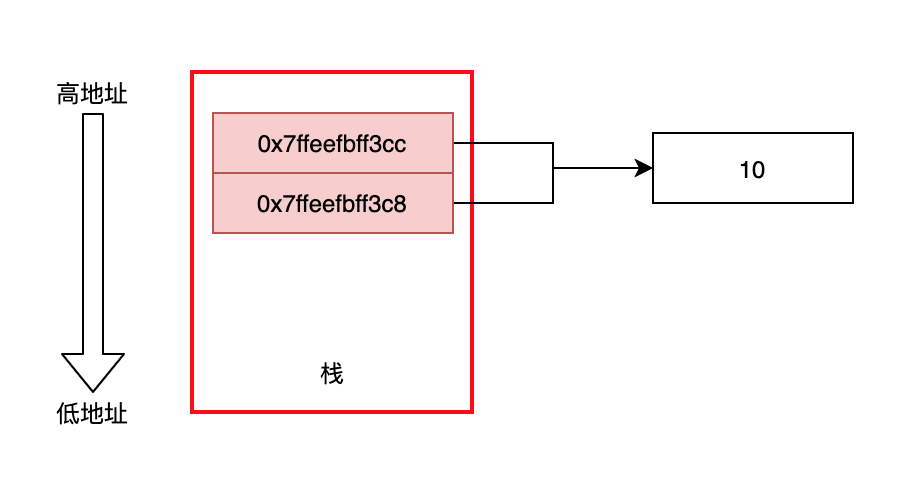
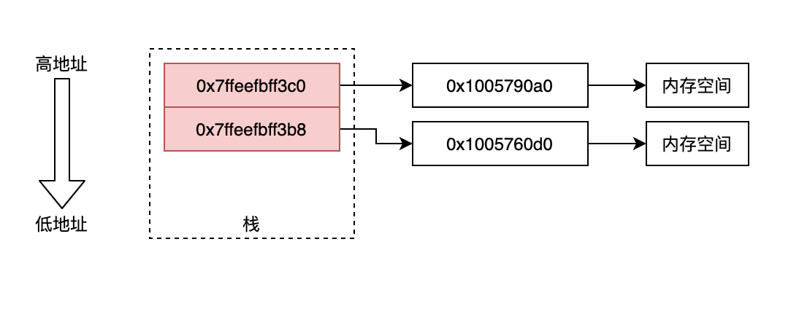
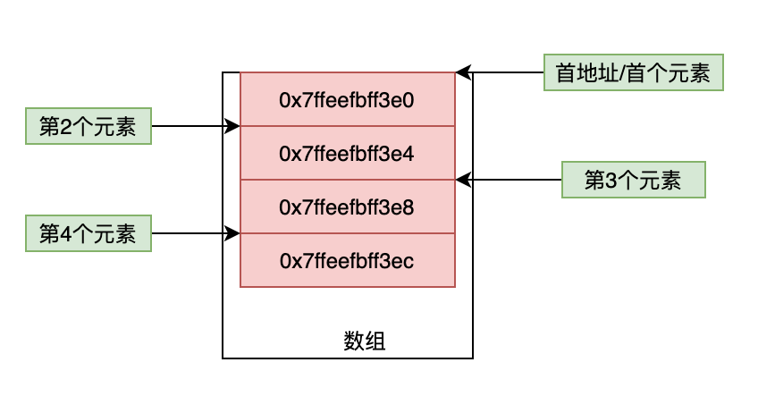

## 指针和内存平移

### 普通指针

```objc
int a = 10;
int b = 10;
NSLog(@"%d -- %p", a, &a);
NSLog(@"%d -- %p", b, &b);
```

输出结果

```shell
10 -- 0x7ffeefbff3cc
10 -- 0x7ffeefbff3c8
```

分析此时的指针和值



- 10 这个数据可以被任何的指针指向来访问使用
- 两个指针连续存储时，步长为其类型大小：此处 0x8 -- 0xc ，距离 4 为 Int 类型大小

### 对象

```objc
LGPerson *p1 = [LGPerson alloc];
LGPerson *p2 = [LGPerson alloc];
NSLog(@"%@ -- %p",p1,&p1);
NSLog(@"%@ -- %p",p2,&p2);
```

输出结果

```shell
<LGPerson: 0x1005790a0> -- 0x7ffeefbff3c0
<LGPerson: 0x1005760d0> -- 0x7ffeefbff3b8
```

分析此时结果



- 对象分配内存地址来存储数据，使用对象指针来指向地址来寻址
- 对象的指针通过取地址符，又获取到指向对象指针的指针
- 此时指针若是连续存储，步长为其类型大小：0xc0 -- 0xb8，距离 8 为指针大小

### 数组指针

```C++
int c[4] = {1,2,3,4};
int *d   = c;
NSLog(@"%p - %p - %p",&c,&c[0],&c[1]);
NSLog(@"%p - %p - %p",d,d+1,d+2);
```

把数组赋值给指针，输出结果

```shell
0x7ffeefbff3e0 - 0x7ffeefbff3e0 - 0x7ffeefbff3e4
0x7ffeefbff3e0 - 0x7ffeefbff3e4 - 0x7ffeefbff3e8
```

分析结果



- 分析第一行输出，很明显验证了数组的首地址就是第一个元素的地址
- 分析第二行输出，可以得出，首地址指针进行偏移可以取得后续其他元素的值，偏移步长是数组的元素类型大小，此处是 `int` 大小为4

依据此分析，应该可以通过指针偏移来获取数组的值，验证一下

```objc
for (int i = 0; i<4; i++) {
    int value =  *(d+i);
    NSLog(@"%d",value);
}
```

输出结果

```shell
1
2
3
4
```

输出结果验证了分析

**在连续内存存取是，可以通过指向内存的指针进行偏移来获取内存的值**

