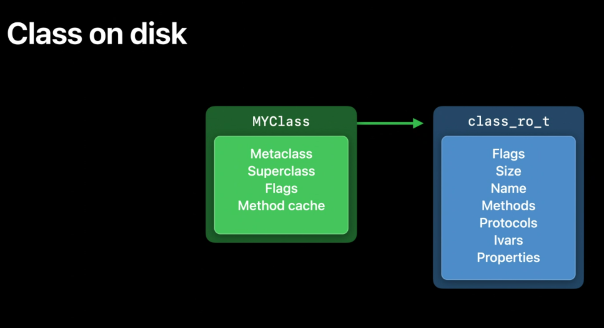
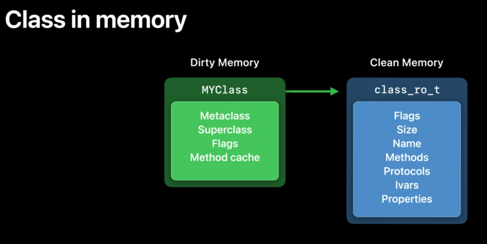
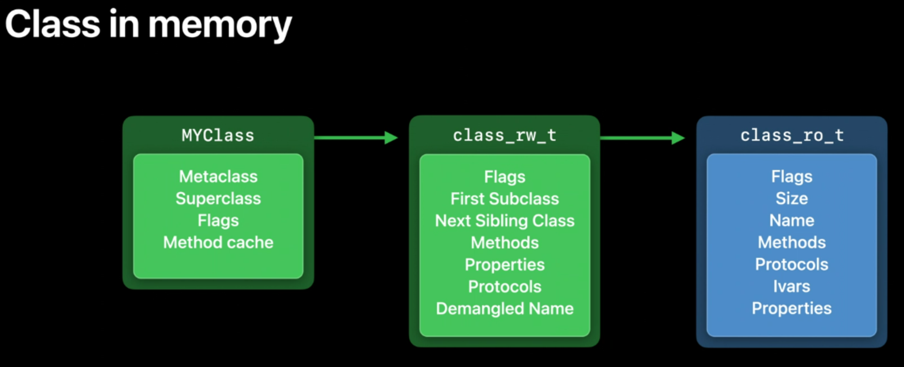
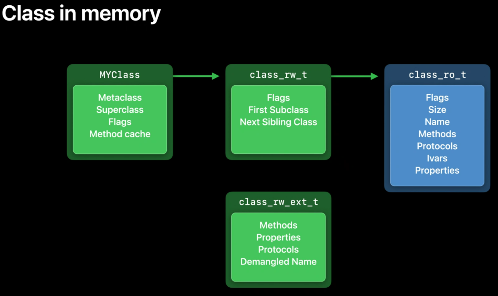
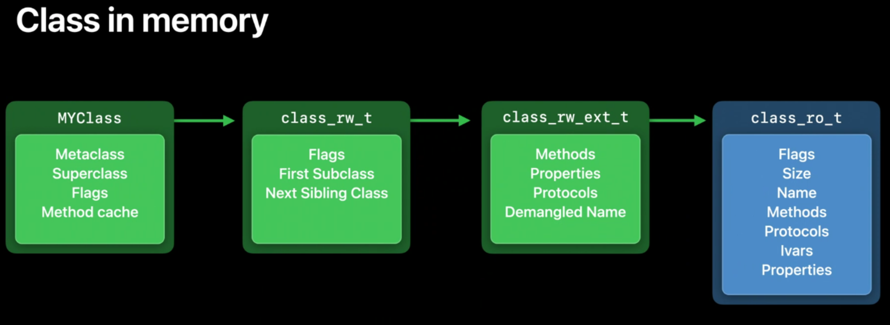
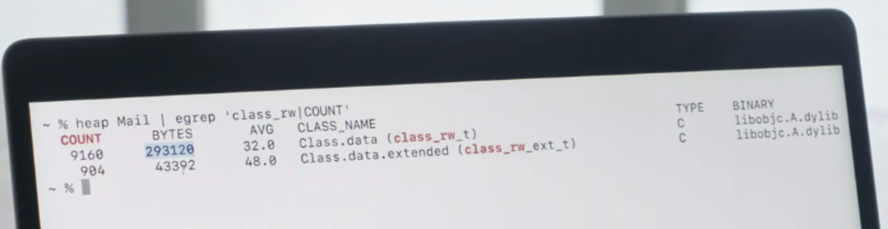

## WWDC2020 - ro/rw/rwe

WWDC2020 - Advancements in the Objective-C runtime

链接地址： https://developer.apple.com/videos/play/wwdc2020/10163/


### Class Data Structures Changes

> 类的运行时数据的变化

On disk, in your application binary (二进制文件), classes look like this



First, there’s the class object itself, which contains the information that's most frequently accessed: pointers to the metaclass, superclass, and the method cache.

It also has a pointer to more data where additional information is stored, called the **class_ro_t**. "Ro" stands for read only. And this includes things like the class's name and information about methods, protocols, and instance variables.

...

When classes are first loaded from disk into memory, they start off like this too, but they change once they're used. 

Now, to understand what happens then, it’s useful to know about the difference between clean memory and dirty memory.

**Clean memory** is memory that isn’t changed once it’s loaded.

The class_ro_t is clean because it’s read only.

**Dirty memory** is memory that’s changed while the process is running.

The class structure is dirtied once the class gets used because the runtime writes new data into it. For example, it creates a fresh method cache and points to it from the class.



Dirty memory is much more expensive than clean memory. It has to be kept around for as long as the process is running.

Clean memory, on the other hand, can be evicted(移除) to make room for other things because you if you need it, the system can always just reload it from disk.

macOS has the option to swap out[拓展1] dirty memory, but dirty memory is especially costly in iOS because it doesn’t use swap.

Dirty memory is the reason why this class data is split into two pieces.

The more data that can be kept clean, the better. By separating out data that never changes, that allows for most of the class data to be kept as clean memory.

This data is enough to get us started, but the runtime needs to track more information about each class.

 So, when a class first gets used, the runtime allocates additional storage for it.

This runtime allocated storage is the class_rw_t, for read/write data.



 In this data structure, we store new information only generated (生成) at runtime. 

For example, all classes get linked into a tree structure using these First Subclass and Next Sibling Class pointers, and this allows the runtime to traverse(遍历) all the classes currently in use, which is useful for invalidating(使无效) method caches.

But why do we have methods and properties here when they're in the read only data too? Well, because they can be changed at runtime.

 When a **category** is loaded, it can add new methods to the class, and the programmer can add them dynamically using runtime APIs.

Since the class_ro_t is read only, we need to track these things in the class_rw_t.
Now, it turns out that this takes up quite a bit of memory.
 There are a lot of classes in use in any given device.
 We measured about 30 megabytes of these class_rw_t structures across the system on an iPhone.
So, how could we shrink these down(缩小)? Remember we need these things in the read/write part because they can be changed at runtime.
But examining usage on real devices, we found that only around 10% of classes ever actually have their methods changed.
And this demangled name field is only used by Swift classes, and isn't even needed for Swift classes unless something asks for their Objective-C name.

So, we can split off the parts that aren't usually used, and this cuts the size of the class_rw_t in half.



For the classes that do need the additional information, we can allocate one of these extended records and slide it in for the class to use.



Approximately 90% of classes never need this extended data, saving around 14 megabytes system wide.
 This is memory that’s now available for more productive uses, like storing your app’s data.


 So, you can actually see the impact of this change yourself on your Mac by running some simple commands in the terminal.
 Let’s take a look at that now.
 I'm gonna go into the terminal on my MacBook here, and I'm gonna run a command that's available on any Mac, called heap.
 And it lets you inspect the heap memory in use by a running process.
 So, I'm gonna run it against the Mail app on my Mac.
 Now, if I just ran this, it would output thousands of lines showing every heap allocation made by Mail.
 So, instead I'm just gonna grep it for the types we've been talking about today.
The class_rw_t types.
 And I'm also gonna search for the header.

```shell
heap Mail | egrep 'class_rw|COUNT'
Found process 8164 (MailCacheDelete) from partial name Mail
   COUNT      BYTES       AVG   CLASS_NAME                                        TYPE    BINARY
     654      20928      32.0   Class.data (class_rw_t)                           C       libobjc.A.dylib
     123       5904      48.0   Class.data.extended (class_rw_ext_t)              C       libobjc.A.dylib
```



And from the results that come back, we can see that we're using about 9000 of these class_rw_t types in the Mail app, but only about a tenth of them, a little over 900, actually needed this extended information.
 So, we can easily calculate the savings we've made by this change.
This is the type that's halved(减半) in size.
 So, if we subtract from this number the amount of memory we've had to allocate to the extended types, we can see that we've saved about a quarter of a meg(兆-M) of data just for the Mail app.
 If we extend that system wide, that's a real savings in terms of dirty memory.
Now, a lot of code that fetches data out of the class now has to deal with classes that both do and don't have this extended data.
 Of course, the runtime handles all of that for you, and from the outside, everything just keeps working like it always did, just using less memory.
This works because the code that reads these structures is all within the runtime, and it's updated at the same time.


Sticking to these APIs is really important because any code that tried to access these data structures directly is going to stop working in this year's OS release since things have moved around, and that code won't know about the new layout.
 We saw some real code that broke due to these changes, and, in addition to your own code, watch out for external dependencies you might be bringing into your app that might be digging into these data structures without you realizing.
All of the information in these structures is available through official APIs.
 There are functions like class_getName and class_getSuperclass.
 When you use these APIs to access this information, you know they'll keep working no matter what we change behind the scenes.
 All of these APIs can be found in the Objective-C runtime documentation on developer.apple.com.


### 总结

#### Dirty Memory / Clean Memory

##### Clean Memory

- 加载后不再改变
- 可以被移除，腾出空间来使用，再次使用时可从磁盘重新加载

示例：

`class_ro_t` 是 readOnly 因此是  Clean Memory


##### Dirty Memory

- 程序运行时改变的内存
- 程序只要在运行就需要一直保存，代价昂贵


程序中越多 Clean Memory 越好


#### 类的结构变化

##### 类首次加载时

类首次从磁盘加载到内存时，结构如图：


除了类对象自身的信息，还包含指向更多附加信息的指针 -- class_ro_t，这些附加信息包含方法、协议和实例变量的列表


##### 类首次被使用时

1、由于运行时要追踪类中的部分信息，这些变化的数据就形成了 -- dirty memory，因此此时类的结构发生变化

runtime 给类分配了额外的存储容量，这就是 class_rw_t  (read/write data)

此时类的结构变化成下图样式：


在 `class_rw_t`  这个数据结构中，只存储运行时产生的新信息

例如：`First Subclass` 和 `Next Sibling Class` 指针

同时我们也发现了 `methods` 和 `properties` ，为什么这个也在这里？

因为他们能在运行时被改变。例如 当 category(分类) 加载时，可以给类添加新的方法，因此需要在 `class_rw_t` 中追踪这些数据

2、为了追踪这些数据，就造成了内存的更多占用，那么怎么缩小这些结构，减少内存占用呢？

根据实际使用状况，发现只有部分类进行了方法变动；同时还有部分数据字段只在 Swift 中使用

因此再次进行分割，分割出不经常使用的数据，这些使用 `class_rw_ext_t` 来追踪，此时类的结构可再次变化


只在使用到这些扩展的类中添加，这样对于整个程序来说就节省了大量内存空间，减少了很多 dirty memory

对系统来说需要处理 包含扩展与不包含扩展的不同类型的类，不过这些都是系统处理，不需要开发人员处理


## 拓展

### 拓展1 swap out

**swap是干嘛的？** 

在Linux下，SWAP的作用类似Windows系统下的“虚拟内存”。当物理内存不足时，拿出部分硬盘空间当SWAP分区（虚拟成内存）使用，从而解决内存容量不足的情况。

SWAP意思是交换，顾名思义，**当某进程向OS请求内存发现不足时，OS会把内存中暂时不用的数据交换出去，放在SWAP分区中，这个过程称为SWAP OUT**。**当某进程又需要这些数据且OS发现还有空闲物理内存时，又会把SWAP分区中的数据交换回物理内存中，这个过程称为SWAP IN**。

当然，swap大小是有上限的，一旦swap使用完，操作系统会触发OOM-Killer机制，把消耗内存最多的进程kill掉以释放内存。

参考链接：

[HBase最佳实践-用好你的操作系统][http://hbasefly.com/2017/05/24/hbase-linux/]

