## 成员变量 VS 属性

类中的成员变量 Ivars 存储位置，在 WWDC 的视频中看到存储位置

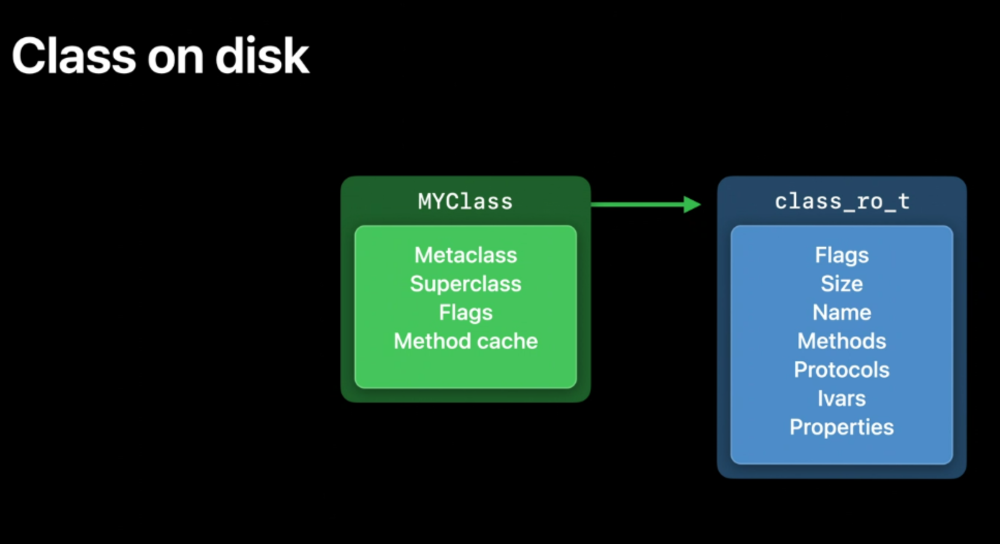

其存储在 `class_ro_t` 中

我们也已经在 《4-2、类的结构初探》中进行了探索，对 `Ivars` 的数据进行了输出查看

```shell
# (const class_ro_t) $5
(lldb) p $5.ivars
(const ivar_list_t *const) $6 = 0x00000001000081f8
(lldb) p *$6
(const ivar_list_t) $8 = {
  entsize_list_tt<ivar_t, ivar_list_t, 0, PointerModifierNop> = (entsizeAndFlags = 32, count = 3)
}

(lldb) p $8.get(0)
(ivar_t) $9 = {
  offset = 0x0000000100008318
  name = 0x0000000100003f2f "subject"
  type = 0x0000000100003f7f "@\"NSString\""
  alignment_raw = 3
  size = 8
}
(lldb) p $8.get(1)
(ivar_t) $11 = {
  offset = 0x0000000100008320
  name = 0x0000000100003f37 "_name"
  type = 0x0000000100003f7f "@\"NSString\""
  alignment_raw = 3
  size = 8
}
(lldb) p $8.get(2)
(ivar_t) $12 = {
  offset = 0x0000000100008328
  name = 0x0000000100003f3d "_hobby"
  type = 0x0000000100003f7f "@\"NSString\""
  alignment_raw = 3
  size = 8
}
```

此处 `ivars` 中既有声明的成员变量的，也有系统为属性生成的带下划线的成员变量

### 概念

那顺便总结下 成员变量和属性，以便于区分

- **属性** 由带下划线的成员变量 + `set、get` 方法组成
- **成员变量**  可分为基本数据类型的成员变量 与 对象类型的特殊的成员变量(可称为 **实例变量** `instance` )

然后我们查看下底层结构，先声明一些属性和成员变量

```objc
@interface LGPerson : NSObject
{
    NSString *hobby; // 字符串
    int a;
    NSObject *objc;  // 结构体
}

@property (nonatomic, copy) NSString *nickName;
@property (nonatomic, strong) NSString *name;
@property (atomic, strong) NSString *aname;

@end
```

#### 验证

总结了属性和成员变量的区分，那么接下来用代码实际输出验证下总结的是否正确

使用 `runtime` 中的相关方法[拓展3]

```objc
void lgObjc_copyIvar_copyProperies(Class pClass){
    
    unsigned int count = 0;
    Ivar *ivars = class_copyIvarList(pClass, &count);
    for (unsigned int i=0; i < count; i++) {
        Ivar const ivar = ivars[i];
        //获取实例变量名
        const char*cName = ivar_getName(ivar);
        NSString *ivarName = [NSString stringWithUTF8String:cName];
        NSLog(@"class_copyIvarList:%@",ivarName);
    }
    free(ivars);

    unsigned int pCount = 0;
    objc_property_t *properties = class_copyPropertyList(pClass, &pCount);
    for (unsigned int i=0; i < pCount; i++) {
        objc_property_t const property = properties[i];
        //获取属性名
        NSString *propertyName = [NSString stringWithUTF8String:property_getName(property)];
        //获取属性值
        NSLog(@"class_copyProperiesList:%@",propertyName);
    }
    free(properties);
}

// main函数调用此方法
lgObjc_copyIvar_copyProperies([LGPerson class]);
```

输出打印

```shell
# 成员变量
class_copyIvarList:hobby
class_copyIvarList:a
class_copyIvarList:objc
class_copyIvarList:_nickName
class_copyIvarList:_name
class_copyIvarList:_aname
# 属性
class_copyProperiesList:nickName
class_copyProperiesList:name
class_copyProperiesList:aname
```

验证了属性在底层的一部分是 带下划线的成员变量了，至于 `get` 和 `set` 我们通过 C++ 的代码实现查看下

### 底层实现

通过 `clang` 查看上面的声明代码

```shell
clang -rewrite-objc main.m -o main.cpp
```

在生成的 cpp 文件中我们查看相应的实现

> 在查看 `list` 数据时，例如 `_method_list_t` 时，发现了一些符号，`"i"`、 `"@16@0:8"`、`"v24@0:8@16"` 等，这些是什么意思呢？ [拓展2]

```C++
#ifndef _REWRITER_typedef_LGPerson
#define _REWRITER_typedef_LGPerson
typedef struct objc_object LGPerson;
typedef struct {} _objc_exc_LGPerson;
#endif

extern "C" unsigned long OBJC_IVAR_$_LGPerson$_nickName;
extern "C" unsigned long OBJC_IVAR_$_LGPerson$_name;
extern "C" unsigned long OBJC_IVAR_$_LGPerson$_aname;
struct LGPerson_IMPL {
	struct NSObject_IMPL NSObject_IVARS;
	NSString *hobby;
	int a;
	NSObject *objc;
	NSString *_nickName;
	NSString *_name;
	NSString *_aname;
};

// @property (nonatomic, copy) NSString *nickName;
// @property (nonatomic, strong) NSString *name;
// @property (atomic, strong) NSString *aname;

/* @end */


// @implementation LGPerson

static NSString * _I_LGPerson_nickName(LGPerson * self, SEL _cmd) { return (*(NSString **)((char *)self + OBJC_IVAR_$_LGPerson$_nickName)); }
extern "C" __declspec(dllimport) void objc_setProperty (id, SEL, long, id, bool, bool);

static void _I_LGPerson_setNickName_(LGPerson * self, SEL _cmd, NSString *nickName) { objc_setProperty (self, _cmd, __OFFSETOFIVAR__(struct LGPerson, _nickName), (id)nickName, 0, 1); }

static NSString * _I_LGPerson_name(LGPerson * self, SEL _cmd) { return (*(NSString **)((char *)self + OBJC_IVAR_$_LGPerson$_name)); }
static void _I_LGPerson_setName_(LGPerson * self, SEL _cmd, NSString *name) { (*(NSString **)((char *)self + OBJC_IVAR_$_LGPerson$_name)) = name; }

static NSString * _I_LGPerson_aname(LGPerson * self, SEL _cmd) { return (*(NSString **)((char *)self + OBJC_IVAR_$_LGPerson$_aname)); }
static void _I_LGPerson_setAname_(LGPerson * self, SEL _cmd, NSString *aname) { (*(NSString **)((char *)self + OBJC_IVAR_$_LGPerson$_aname)) = aname; }
// @end
```

分析这些代码，验证了：属性在底层是由 带下划线的成员变量 + get/set 方法

也找到了对属性的 `set` 和 `get` 的底层实现，在查看时候发现对于 `set` 方法，存在了两种实现方式

```C++
//方式1  objc_setProperty
static void _I_LGPerson_setNickName_(LGPerson * self, SEL _cmd, NSString *nickName) { objc_setProperty (self, _cmd, __OFFSETOFIVAR__(struct LGPerson, _nickName), (id)nickName, 0, 1); }

//方式2 内存平移形式
static void _I_LGPerson_setName_(LGPerson * self, SEL _cmd, NSString *name) { (*(NSString **)((char *)self + OBJC_IVAR_$_LGPerson$_name)) = name; }
```

既然有两种实现方式，那么应该是声明方式不同造成的，接下来就来探索一下

### set 方法实现

#### 实现结构分析

set 方法，在手动实现时，我们会以  `setName:`  的形式进行声明一个赋值方法

那么官方在底层也是这么对每一个属性进行声明么？ 显然这么做是个巨大的工作量，而且效率很低，只有像我这样的菜鸡才会这么做吧  ╮(╯▽╰)╭  

根据上面的 C++ 代码得知，官方调用了 `objc_setProperty` 方法进行了实现 (内存平移进行地址偏移赋值，暂不考虑)，我们从架构层次上来分析下这一实现

- 首先 `set` 方法的本质是一个赋值方法，不同的属性方法的区别只是 _ cmd 方法的名称不同，那么可以抽取封装一个统一方法实现，只需要传入方法名进行实现就可以了
- 进行基类方法抽取剥离后，set 方法调用的层级就分为 3级，从顶层的 `setName` 具体方法动态指向中间层 `objc_setProperty` 方法实现，而中间层 `objc_setProperty` 进行的相关底层方法使用就封装完好固定，不必随顶层的方法名称的变化而变动

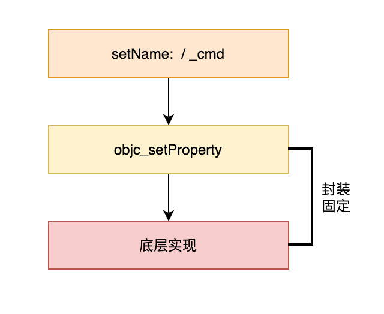

- 底层的那部分封装不变，我们稍后查看源码实现。那么怎样进行把 `_cmd`动态的指向中间层呢，也就是在整个类加载的流程中，应该怎样实现类中所有的 set 方法从 `SEL` 解析成对应 `IMP` ？

  - 当前我们从查看可执行文件的 cpp 格式，看到 `set` 方法已经转换为调用 `objc_setProperty` 方法了，那么这个关联关系应该在编译时就进行了
  - 同时思考下如果不在编译时，而在运行时进行关联。那么
    - 首先是效率低，运行时等待所有的 set 方法设置完关联实现，这样不太可行
    - 其次如果不等待的话，那么运行时调用没关联完成的方法，可能会走错、执行错

  根据上述的思考，认为应该是在编译时进行的此步骤

  大致自己思考下整个流程的实现，做一个简单的流程实现：

  - 首先可以从类中获取全部的 `ivars` 信息，那么就能找到全部需要实现 `set` 方法的方法名 `cmd`
  - 在编译时，把这些没有实现的 `set` 方法，重定向至 `objc_setProperty` 的 `IMP` 方法地址进行实现

分析过后，就要验证下分析的是否正确以及实现的细节，那么我们就要去编译时查找，一想到编译时期，自然就离不开 `llvm` 的源码，那么接下来我们就去 `llvm` 找一找有没有我们想要的

### LLVM 源码实现

#### 探索目的

探索源码的目的先确认下

1. 确认 `objc_setProperty`  是否在 `LLVM` 源码中进行使用
2. 验证下 自己思考的简单流程是否正确
3. 确认下属性 `set` 方法的两种实现是怎么区分的

##### objc_setProperty

首先全局查找 `objc_setProperty` ，搜索到了一些数据，

```C++
// CGObjCMac.cpp 中 
llvm::FunctionCallee getSetPropertyFn() {
    CodeGen::CodeGenTypes &Types = CGM.getTypes();
    ASTContext &Ctx = CGM.getContext();
    // void objc_setProperty (id, SEL, ptrdiff_t, id, bool, bool)
    CanQualType IdType = Ctx.getCanonicalParamType(Ctx.getObjCIdType());
    CanQualType SelType = Ctx.getCanonicalParamType(Ctx.getObjCSelType());
    CanQualType Params[] = {
        IdType,
        SelType,
        Ctx.getPointerDiffType()->getCanonicalTypeUnqualified(),
        IdType,
        Ctx.BoolTy,
        Ctx.BoolTy};
    llvm::FunctionType *FTy =
        Types.GetFunctionType(
          Types.arrangeBuiltinFunctionDeclaration(Ctx.VoidTy, Params));
    //重点
    return CGM.CreateRuntimeFunction(FTy, "objc_setProperty");
  }

//CodeGenModule.cpp 中
/// CreateRuntimeFunction - Create a new runtime function with the specified
/// type and name.
llvm::FunctionCallee
CodeGenModule::CreateRuntimeFunction(llvm::FunctionType *FTy, StringRef Name,
                                     llvm::AttributeList ExtraAttrs, bool Local,
                                     bool AssumeConvergent) {
 //...省略方法实现
}
```

根据这个方法调用和创建方法的注释，确认了 `目的1` ，此方法的使用是在编译时在 `LLVM` 中创建的

此时已经创建了 `objc_setProperty` 方法，已经确认了当前使用此方式实现，那么进行 `set` 方法重定位的过程应该已经执行过了，需要顺着方法调用向上查找

#### 探索流程

搜索 `getSetPropertyFn()` 的调用

```C++
// CGObjCMac.cpp 中  
llvm::FunctionCallee GetPropertySetFunction() override {
    return ObjCTypes.getSetPropertyFn();
  }

llvm::FunctionCallee CGObjCMac::GetPropertySetFunction() {
  return ObjCTypes.getSetPropertyFn();
}
```

搜索到一个中间层的重写，继续搜索这个 `GetPropertySetFunction` 方法

```C++
// CGObjc.cpp 

void
CodeGenFunction::generateObjCSetterBody(const ObjCImplementationDecl *classImpl,
                                        const ObjCPropertyImplDecl *propImpl,
                                        llvm::Constant *AtomicHelperFn) {
  
  // ... 省略代码
  PropertyImplStrategy strategy(CGM, propImpl);
  switch (strategy.getKind()) {
      // ... 省略代码
  case PropertyImplStrategy::GetSetProperty:
  case PropertyImplStrategy::SetPropertyAndExpressionGet: {

    llvm::FunctionCallee setOptimizedPropertyFn = nullptr;
    llvm::FunctionCallee setPropertyFn = nullptr;
    if (UseOptimizedSetter(CGM)) {
      // 10.8 and iOS 6.0 code and GC is off
      setOptimizedPropertyFn =
          CGM.getObjCRuntime().GetOptimizedPropertySetFunction(
              strategy.isAtomic(), strategy.isCopy());
      if (!setOptimizedPropertyFn) {
        CGM.ErrorUnsupported(propImpl, "Obj-C optimized setter - NYI");
        return;
      }
    }
    else {
      setPropertyFn = CGM.getObjCRuntime().GetPropertySetFunction();  //方法调用位置
      if (!setPropertyFn) {
        CGM.ErrorUnsupported(propImpl, "Obj-C setter requiring atomic copy");
        return;
      }
    }

    // ... 省略代码

}
```

在这里发现了是在 `GetSetProperty` 枚举值下执行的，查看 `switch` 语句，是根据 `PropertyImplStrategy` 的策略相关值确定的，点进去看下

```C++
  class PropertyImplStrategy {
  public:
    enum StrategyKind {
      /// The 'native' strategy is to use the architecture's provided
      /// reads and writes.
      Native,

      /// Use objc_setProperty and objc_getProperty.
      GetSetProperty,

      /// Use objc_setProperty for the setter, but use expression
      /// evaluation for the getter.
      SetPropertyAndExpressionGet,

      /// Use objc_copyStruct.
      CopyStruct,

      /// The 'expression' strategy is to emit normal assignment or
      /// lvalue-to-rvalue expressions.
      Expression
    };
    
    //... 省略
  }
```

这里看到枚举值的定义，这个是区分使用 `objc_setProperty` 的，好像与 `目标3` 有关，稍后可以探索，我们先继续探索验证流程

继续向上搜索 `generateObjCSetterBody` 函数的调用

```C++
// CodeGenFunction.h

  /// GenerateObjCSetter - Synthesize an Objective-C property setter function
  /// for the given property.
  void GenerateObjCSetter(ObjCImplementationDecl *IMP,
                          const ObjCPropertyImplDecl *PID);
  void generateObjCSetterBody(const ObjCImplementationDecl *classImpl,
                              const ObjCPropertyImplDecl *propImpl,
                              llvm::Constant *AtomicHelperFn);
```

搜索到方法声明中，看到注释，这些方法都是给属性合成 `setter` 方法的

```C++
/// Generate an Objective-C property setter function.
///
/// The given Decl must be an ObjCImplementationDecl. \@synthesize
/// is illegal within a category.
void CodeGenFunction::GenerateObjCSetter(ObjCImplementationDecl *IMP,
                                         const ObjCPropertyImplDecl *PID) {
  llvm::Constant *AtomicHelperFn =
      CodeGenFunction(CGM).GenerateObjCAtomicSetterCopyHelperFunction(PID);
  ObjCMethodDecl *OMD = PID->getSetterMethodDecl();
  assert(OMD && "Invalid call to generate setter (empty method)");
  StartObjCMethod(OMD, IMP->getClassInterface());

  generateObjCSetterBody(IMP, PID, AtomicHelperFn); //方法调用位置

  FinishFunction(OMD->getEndLoc());
}
```

在其同组方法中看到调用，看注释入参 `IMP` 必须是 `ObjCImplementationDecl`  类型的，我们查看下

> 这里还提到  `\@synthesize is illegal within a category.` ，这是提示我们分类不能自动实现 setter 和 getter 方法

```C++
/// ObjCImplementationDecl - Represents a class definition - this is where
/// method definitions are specified. For example:
///
/// @code
/// \@implementation MyClass
/// - (void)myMethod { /* do something */ }
/// \@end
/// @endcode
///
/// In a non-fragile runtime, instance variables can appear in the class
/// interface, class extensions (nameless categories), and in the implementation
/// itself, as well as being synthesized as backing storage for properties.
///
/// In a fragile runtime, instance variables are specified in the class
/// interface, \em not in the implementation. Nevertheless (for legacy reasons),
/// we allow instance variables to be specified in the implementation. When
/// specified, they need to be \em identical to the interface.
class ObjCImplementationDecl : public ObjCImplDecl {
  // ...
}
```

咦，这个参数是 .m 文件中的 `@implementation ` 方法实现中的，继续向上看看，这里感觉没有判断是否生成 `Setter` 方法

##### 流程开始方法 - EmitObjCPropertyImplementations

搜索 `GenerateObjCSetter` 的调用，找到如下方法

```C++
/// EmitObjCPropertyImplementations - Emit information for synthesized
/// properties for an implementation.
void CodeGenModule::EmitObjCPropertyImplementations(const
                                                    ObjCImplementationDecl *D) {
  for (const auto *PID : D->property_impls()) {
    // Dynamic is just for type-checking.
    if (PID->getPropertyImplementation() == ObjCPropertyImplDecl::Synthesize) {
      ObjCPropertyDecl *PD = PID->getPropertyDecl();

      // Determine which methods need to be implemented, some may have
      // been overridden. Note that ::isPropertyAccessor is not the method
      // we want, that just indicates if the decl came from a
      // property. What we want to know is if the method is defined in
      // this implementation.
      auto *Getter = PID->getGetterMethodDecl();
      if (!Getter || Getter->isSynthesizedAccessorStub())
        CodeGenFunction(*this).GenerateObjCGetter(
            const_cast<ObjCImplementationDecl *>(D), PID);
      auto *Setter = PID->getSetterMethodDecl();
      if (!PD->isReadOnly() && (!Setter || Setter->isSynthesizedAccessorStub()))
        CodeGenFunction(*this).GenerateObjCSetter(
                                 const_cast<ObjCImplementationDecl *>(D), PID);
    }
  }
}
```

根据注释，理解为为`implementation` 中要合成方法的属性发送一些信息，根据内部的注释，这里存在能判定哪些方法生效的判断，那么这就是我们想找到的方法了，那么我们现在开始从这里正向梳理 `Setter` 方法的生成流程

来仔细看下代码

###### 外层 for 循环

首先看到 for 循环，这里使用了入参的 `property_impls` 列表数据，那么 `property_impls` 是表示什么数据呢？ 

```C++
  propimpl_range property_impls() const {
    return propimpl_range(propimpl_begin(), propimpl_end());
  }
```

首先点进去，看到类型是 `propimpl_range` 这是个什么，单纯的 `range` 么，再继续查看

```C++
using propimpl_range =
      llvm::iterator_range<specific_decl_iterator<ObjCPropertyImplDecl>>;
```

外层是个迭代器，那这个等同于一个数组，关键在于数组内部的元素

内部元素是 `ObjCPropertyImplDecl` 类型的，查看一下这个类型

```C++
/// ObjCPropertyImplDecl - Represents implementation declaration of a property
/// in a class or category implementation block. For example:
/// \@synthesize prop1 = ivar1;
///
class ObjCPropertyImplDecl : public Decl {
public:
  enum Kind {
    Synthesize,
    Dynamic
  };
  // ... 省略
}
```

根据注释，这元素是类似 `\@synthesize prop1 = ivar1;` 这样的声明实现数据，

有点明白了，`property_impls` 这个数据列表是系统默认生成的或者我们手动添加的属性的 `@synthesize` 实现

既然这样，那取出的 `PID` 就是单个的 `ObjCPropertyImplDecl` 类型数据，即是单个属性的 `@synthesize` 实现数据

###### 首个 if 判断

再来看首个 if 判断，这个很清晰就是判断属性的实现是 `@Synthesize` 还是 `@Dynamic` 的

注释也表明了 `// Dynamic is just for type-checking`  ，`Dynamic ` 情况下就不执行了

```C++

    // Dynamic is just for type-checking.
    if (PID->getPropertyImplementation() == ObjCPropertyImplDecl::Synthesize)

//getPropertyImplementation
  Kind getPropertyImplementation() const {
    return PropertyIvarDecl ? Synthesize : Dynamic;
  }

// PropertyIvarDecl
  /// Null for \@dynamic. Required for \@synthesize.
  ObjCIvarDecl *PropertyIvarDecl;

// -------  ObjCIvarDecl
/// ObjCIvarDecl - Represents an ObjC instance variable. In general, ObjC
/// instance variables are identical to C. The only exception is Objective-C
/// supports C++ style access control. For example:
///
///   \@interface IvarExample : NSObject
///   {
///     id defaultToProtected;
///   \@public:
///     id canBePublic; // same as C++.
///   \@protected:
///     id canBeProtected; // same as C++.
///   \@package:
///     id canBePackage; // framework visibility (not available in C++).
///   }
///
class ObjCIvarDecl : public FieldDecl
```

这里也很有趣，直接使用 `Ivar` 实例变量来判断了，原来 `@dynamic ` 的时候系统连实例变量都不给生成了，等会验证下

###### PD 赋值

接下来是  ` ObjCPropertyDecl *PD = PID->getPropertyDecl();` 这个数据取值，查看一下 `ObjCPropertyDecl ` 这个类型有哪些数据

```C++
/// Represents one property declaration in an Objective-C interface.
///
/// For example:
/// \code{.mm}
/// \@property (assign, readwrite) int MyProperty;
/// \endcode
class ObjCPropertyDecl : public NamedDecl {
  void anchor() override;

public:
  enum SetterKind { Assign, Retain, Copy, Weak };
  enum PropertyControl { None, Required, Optional };

//...
}
```

喔，surprise ,这里是 `interface` 中属性的相关声明的信息，有属性声明的关键字，还有很多与属性相关的方法，感觉比较重要，记下来记下来

###### Setter 指针赋值

接下来查看 `Setter` 指针的赋值

```C++
auto *Setter = PID->getSetterMethodDecl();
```

这个获取 `Setter` 方法的指针，查看下实现

```C++
  ObjCMethodDecl *getSetterMethodDecl() const { return SetterMethodDecl; }

// 查看返回值  SetterMethodDecl

 /// The getter's definition, which has an empty body if synthesized.
  ObjCMethodDecl *SetterMethodDecl = nullptr;
// nullptr 是c++中空指针类型的关键字。并非整型类别，甚至也不是指针类型，但是能转换成任意指针类型
```

这里的 `getter` 应该是写错了，是 `setter` 

根据注释，在 `synthesized` 时，存在空的 `body` 

再查看下类型  `ObjCMethodDecl` 

```C++
/// ObjCMethodDecl - Represents an instance or class method declaration.
/// ObjC methods can be declared within 4 contexts: class interfaces,
/// categories, protocols, and class implementations. While C++ member
/// functions leverage C syntax, Objective-C method syntax is modeled after
/// Smalltalk (using colons to specify argument types/expressions).
/// Here are some brief examples:
///
/// Setter/getter instance methods:
/// - (void)setMenu:(NSMenu *)menu;
/// - (NSMenu *)menu;
///
/// Instance method that takes 2 NSView arguments:
/// - (void)replaceSubview:(NSView *)oldView with:(NSView *)newView;
///
/// Getter class method:
/// + (NSMenu *)defaultMenu;
///
/// A selector represents a unique name for a method. The selector names for
/// the above methods are setMenu:, menu, replaceSubview:with:, and defaultMenu.
///
class ObjCMethodDecl : public NamedDecl, public DeclContext
```

那么这个 `Setter` 指针是个指向 方法声明类 的指针

###### 最后的 if 判断

最后查看 `GenerateObjCSetter` 调用的方法判断

```C++
if (!PD->isReadOnly() && (!Setter || Setter->isSynthesizedAccessorStub()))
```

看这个判断

- 首先可知，如果属性是 ReadOnly 时，不会生成 `Setter` 方法
- 然后在 `&&` 后面，可知第二种条件，`Setter` 指针不存在或者存在但是需要是 `isSynthesizedAccessorStub()` 即是等同于方法未被重写 [拓展4]
- 符合上述两个条件的才进行 `Setter` 方法的生成

接下来要 `GenerateObjCSetter` 函数 ，是要生成 `Setter` 方法么，来查看下

#####GenerateObjCSetter

```C++
/// Generate an Objective-C property setter function.
///
/// The given Decl must be an ObjCImplementationDecl. \@synthesize
/// is illegal within a category.
void CodeGenFunction::GenerateObjCSetter(ObjCImplementationDecl *IMP,
                                         const ObjCPropertyImplDecl *PID) {
  llvm::Constant *AtomicHelperFn =
      CodeGenFunction(CGM).GenerateObjCAtomicSetterCopyHelperFunction(PID);
  ObjCMethodDecl *OMD = PID->getSetterMethodDecl();
  assert(OMD && "Invalid call to generate setter (empty method)");
  StartObjCMethod(OMD, IMP->getClassInterface());

  generateObjCSetterBody(IMP, PID, AtomicHelperFn); //方法调用位置

  FinishFunction(OMD->getEndLoc());
}
```

这个方法我们在反向推导的时候看到过，那么再认真分析下，看看有什么要注意的

首先看到 `AtomicHelperFn` 根据经验这些带 `Helper` 的一般都是协助容错的，再具体看下方法实现

```C++
/// GenerateObjCAtomicSetterCopyHelperFunction - Given a c++ object type with
/// non-trivial copy assignment function, produce following helper function.
/// static void copyHelper(Ty *dest, const Ty *source) { *dest = *source; }
///
llvm::Constant *
CodeGenFunction::GenerateObjCAtomicSetterCopyHelperFunction(
                                        const ObjCPropertyImplDecl *PID)
```

针对的是 `C++ object type` 和我们当前探究的内容不一致，就先不管他了

接下来是 `OMD` 指针的赋值，这个我们在上面 `Setter 指针赋值` 的章节查看了下，这个指针是指向 `ObjCMethodDecl - Represents an instance or class method declaration.`  实例方法或类方法声明数据的，这里就是 `Setter` 方法的声明信息

###### StartObjCMethod

接下来是 `StartObjCMethod(OMD, IMP->getClassInterface())` 方法，

1、入参

这里传入了 `Setter` 方法的声明信息和  `getClassInterface()` 的取值

```C++
// getClassInterface
  ObjCInterfaceDecl *getClassInterface() { return ClassInterface; }

  /// Class interface for this class/category implementation
  ObjCInterfaceDecl *ClassInterface;

//---------- ObjCInterfaceDecl
/// Represents an ObjC class declaration.
///
/// For example:
///
/// \code
///   // MostPrimitive declares no super class (not particularly useful).
///   \@interface MostPrimitive
///     // no instance variables or methods.
///   \@end
///
///   // NSResponder inherits from NSObject & implements NSCoding (a protocol).
///   \@interface NSResponder : NSObject \<NSCoding>
///   { // instance variables are represented by ObjCIvarDecl.
///     id nextResponder; // nextResponder instance variable.
///   }
///   - (NSResponder *)nextResponder; // return a pointer to NSResponder.
///   - (void)mouseMoved:(NSEvent *)theEvent; // return void, takes a pointer
///   \@end                                    // to an NSEvent.
/// \endcode
///
///   Unlike C/C++, forward class declarations are accomplished with \@class.
///   Unlike C/C++, \@class allows for a list of classes to be forward declared.
///   Unlike C++, ObjC is a single-rooted class model. In Cocoa, classes
///   typically inherit from NSObject (an exception is NSProxy).
///
class ObjCInterfaceDecl : public ObjCContainerDecl
                        , public Redeclarable<ObjCInterfaceDecl>
```

此处的 `IMP` 是入参，追溯一下就可以看到是当前类的 `@implementation ` 信息，这就表明这个 `IMP->getClassInterface()` 是当前类的 `@implementation` 中的 `@interface `信息

2、函数中主线方法

```C++
/// StartObjCMethod - Begin emission of an ObjCMethod. This generates
/// the LLVM function and sets the other context used by
/// CodeGenFunction.
void CodeGenFunction::StartObjCMethod(const ObjCMethodDecl *OMD,
                                      const ObjCContainerDecl *CD) 
  
```

根据注释，这个方法开始发送 ObjC 方法，生成了 LLVM 方法同时设置了 `CodeGenFunction` 使用的上下文

在另一个方法中也使用到了，看来这是生成方法的开始步骤

```C++
/// Generate an Objective-C method.  An Objective-C method is a C function with
/// its pointer, name, and types registered in the class structure.
void CodeGenFunction::GenerateObjCMethod(const ObjCMethodDecl *OMD) {
  StartObjCMethod(OMD, OMD->getClassInterface()); //调用位置
  PGO.assignRegionCounters(GlobalDecl(OMD), CurFn);
  assert(isa<CompoundStmt>(OMD->getBody()));
  incrementProfileCounter(OMD->getBody());
  EmitCompoundStmtWithoutScope(*cast<CompoundStmt>(OMD->getBody()));
  FinishFunction(OMD->getBodyRBrace());
}
```


看下主线方法

```C++
  llvm::Function *Fn = CGM.getObjCRuntime().GenerateMethod(OMD, CD);

//-------  GenerateMethod
  /// Generate a function preamble(前导) for a method with the specified(指定的)
  /// types.
  virtual llvm::Function *GenerateMethod(const ObjCMethodDecl *OMD,
                                         const ObjCContainerDecl *CD) = 0;
```

开始对指定类型的 method 生成 function preamble(方法前导)，为生成方法做准备了

```C++
  StartFunction(OMD, OMD->getReturnType(), Fn, FI, args,
                OMD->getLocation(), StartLoc);

// --- CodeGenFunction.h
    /// Emit code for the start of a function.
  /// \param Loc       The location to be associated with the function.
  /// \param StartLoc  The location of the function body.
    void StartFunction(GlobalDecl GD,
                     QualType RetTy,
                     llvm::Function *Fn,
                     const CGFunctionInfo &FnInfo,
                     const FunctionArgList &Args,
                     SourceLocation Loc = SourceLocation(),
                     SourceLocation StartLoc = SourceLocation());
```

这个方法就是开始进行定义和生成 `Function` 

在全局搜索 `StartFunction`  时，也发现了其在方法进行生成后调用，开始生成方法的 body

```C++
// --- CodeGenFunction.cpp 

// Emit the standard function prologue.
  StartFunction(GD, ResTy, Fn, FnInfo, Args, Loc, BodyRange.getBegin());

  // Generate the body of the function.
```

这也和我们接下来的流程对应上了，接下来就 `generateObjCSetterBody(IMP, PID, AtomicHelperFn);` 生成 `Setter` 方法的 `body`

至于方法中后续的方法 `FinishFunction()` 就不管了，大概率是一些收尾工作

##### generateObjCSetterBody

```C++
void
CodeGenFunction::generateObjCSetterBody(const ObjCImplementationDecl *classImpl,
                                        const ObjCPropertyImplDecl *propImpl,
                                        llvm::Constant *AtomicHelperFn) {
  ObjCIvarDecl *ivar = propImpl->getPropertyIvarDecl();
  ObjCMethodDecl *setterMethod = propImpl->getSetterMethodDecl();

  // Just use the setter expression if Sema gave us one and it's
  // non-trivial.
// ... 省略

  PropertyImplStrategy strategy(CGM, propImpl);
  switch (strategy.getKind()) {
  case PropertyImplStrategy::Native: {
    
    //... 省略
  }

  case PropertyImplStrategy::GetSetProperty:
  case PropertyImplStrategy::SetPropertyAndExpressionGet: {

    llvm::FunctionCallee setOptimizedPropertyFn = nullptr;
    llvm::FunctionCallee setPropertyFn = nullptr;
    if (UseOptimizedSetter(CGM)) {
      // 10.8 and iOS 6.0 code and GC is off
      setOptimizedPropertyFn =
          CGM.getObjCRuntime().GetOptimizedPropertySetFunction(
              strategy.isAtomic(), strategy.isCopy());
      if (!setOptimizedPropertyFn) {
        CGM.ErrorUnsupported(propImpl, "Obj-C optimized setter - NYI");
        return;
      }
    }
    else {
      setPropertyFn = CGM.getObjCRuntime().GetPropertySetFunction();
      if (!setPropertyFn) {
        CGM.ErrorUnsupported(propImpl, "Obj-C setter requiring atomic copy");
        return;
      }
    }

    // Emit objc_setProperty((id) self, _cmd, offset, arg,
    //                       <is-atomic>, <is-copy>).
    llvm::Value *cmd =
      Builder.CreateLoad(GetAddrOfLocalVar(setterMethod->getCmdDecl()));
    llvm::Value *self =
      Builder.CreateBitCast(LoadObjCSelf(), VoidPtrTy);
    llvm::Value *ivarOffset =
      EmitIvarOffset(classImpl->getClassInterface(), ivar);
    Address argAddr = GetAddrOfLocalVar(*setterMethod->param_begin());
    llvm::Value *arg = Builder.CreateLoad(argAddr, "arg");
    arg = Builder.CreateBitCast(arg, VoidPtrTy);

    CallArgList args;
    args.add(RValue::get(self), getContext().getObjCIdType());
    args.add(RValue::get(cmd), getContext().getObjCSelType());
    if (setOptimizedPropertyFn) {
      args.add(RValue::get(arg), getContext().getObjCIdType());
      args.add(RValue::get(ivarOffset), getContext().getPointerDiffType());
      CGCallee callee = CGCallee::forDirect(setOptimizedPropertyFn);
      EmitCall(getTypes().arrangeBuiltinFunctionCall(getContext().VoidTy, args),
               callee, ReturnValueSlot(), args);
    } else {
      args.add(RValue::get(ivarOffset), getContext().getPointerDiffType());
      args.add(RValue::get(arg), getContext().getObjCIdType());
      args.add(RValue::get(Builder.getInt1(strategy.isAtomic())),
               getContext().BoolTy);
      args.add(RValue::get(Builder.getInt1(strategy.isCopy())),
               getContext().BoolTy);
      // FIXME: We shouldn't need to get the function info here, the runtime
      // already should have computed it to build the function.
      CGCallee callee = CGCallee::forDirect(setPropertyFn);
      EmitCall(getTypes().arrangeBuiltinFunctionCall(getContext().VoidTy, args),
               callee, ReturnValueSlot(), args);
    }

    return;
  }

  case PropertyImplStrategy::CopyStruct:
    emitStructSetterCall(*this, setterMethod, ivar);
    return;

  case PropertyImplStrategy::Expression:
    break;
  }

  //... 省略
}
```

在这个方法中，找到了不同策略 `PropertyImplStrategy` 对应的逻辑，当前是 `Setter` 方法的生成，无意外的话执行的是 `GetSetProperty` 枚举，查看枚举值定义对应 `objc_getProperty` 没有问题

```C++
  class PropertyImplStrategy {
  public:
    enum StrategyKind {
      /// The 'native' strategy is to use the architecture's provided
      /// reads and writes.
      Native,

      /// Use objc_setProperty and objc_getProperty.
      GetSetProperty,

      /// Use objc_setProperty for the setter, but use expression
      /// evaluation for the getter.
      SetPropertyAndExpressionGet,

      /// Use objc_copyStruct.
      CopyStruct,

      /// The 'expression' strategy is to emit normal assignment or
      /// lvalue-to-rvalue expressions.
      Expression
    };
```

此时出现了条件判断

###### GetOptimizedPropertySetFunction

出现了一种 Optimized 优化方案，我们稍微偏下看看这个是怎么实现的

1. 入口判断

首先查看下入口判断

```C++
if (UseOptimizedSetter(CGM))
  
//-------  UseOptimizedSetter
static bool UseOptimizedSetter(CodeGenModule &CGM) {
  if (CGM.getLangOpts().getGC() != LangOptions::NonGC)
    return false;
  return CGM.getLangOpts().ObjCRuntime.hasOptimizedSetter();
}
```

当前大部分情况的 `ARC` 是符合 `NonGC` 的，那么执行外层代码

```C++
  /// Does this runtime supports optimized setter entrypoints?
  bool hasOptimizedSetter() const {
    switch (getKind()) {
      case MacOSX:
        return getVersion() >= VersionTuple(10, 8);
      case iOS:
        return (getVersion() >= VersionTuple(6));
      case WatchOS:
        return true;
      case GNUstep:
        return getVersion() >= VersionTuple(1, 7);
      default:
        return false;
    }
  }
```

ok，这是表示的 iOS6 以后都返回 `YES` 执行优化代码，当前应该是主要执行优化代码了

2. 具体实现

```C++
      setOptimizedPropertyFn =
          CGM.getObjCRuntime().GetOptimizedPropertySetFunction(
              strategy.isAtomic(), strategy.isCopy());
```

根据入参，此时情况应该是 `atomic` 和 `isCopy() ` 的不同取值存在不同的实现

进入方法实现

```C++
  /// Return the runtime function for optimized setting properties.
  virtual llvm::FunctionCallee GetOptimizedPropertySetFunction(bool atomic,
                                                               bool copy) = 0;
```

找到其他文件中的同名方法实现

```C++
// CGObjCMac
llvm::FunctionCallee CGObjCMac::GetOptimizedPropertySetFunction(bool atomic,
                                                                bool copy) {
  return ObjCTypes.getOptimizedSetPropertyFn(atomic, copy);
}

```

这是中间层代码，继续向下 `getOptimizedSetPropertyFn`

```C++
  llvm::FunctionCallee getOptimizedSetPropertyFn(bool atomic, bool copy) {
    CodeGen::CodeGenTypes &Types = CGM.getTypes();
    ASTContext &Ctx = CGM.getContext();
    // void objc_setProperty_atomic(id self, SEL _cmd,
    //                              id newValue, ptrdiff_t offset);
    // void objc_setProperty_nonatomic(id self, SEL _cmd,
    //                                 id newValue, ptrdiff_t offset);
    // void objc_setProperty_atomic_copy(id self, SEL _cmd,
    //                                   id newValue, ptrdiff_t offset);
    // void objc_setProperty_nonatomic_copy(id self, SEL _cmd,
    //                                      id newValue, ptrdiff_t offset);

    SmallVector<CanQualType,4> Params;
    CanQualType IdType = Ctx.getCanonicalParamType(Ctx.getObjCIdType());
    CanQualType SelType = Ctx.getCanonicalParamType(Ctx.getObjCSelType());
    Params.push_back(IdType);
    Params.push_back(SelType);
    Params.push_back(IdType);
    Params.push_back(Ctx.getPointerDiffType()->getCanonicalTypeUnqualified());
    llvm::FunctionType *FTy =
        Types.GetFunctionType(
          Types.arrangeBuiltinFunctionDeclaration(Ctx.VoidTy, Params));
    const char *name;
    if (atomic && copy)
      name = "objc_setProperty_atomic_copy";
    else if (atomic && !copy)
      name = "objc_setProperty_atomic";
    else if (!atomic && copy)
      name = "objc_setProperty_nonatomic_copy";
    else
      name = "objc_setProperty_nonatomic";

    return CGM.CreateRuntimeFunction(FTy, name);
  }
```

哦，这里看来进行了对 `objc_setProperty` 的更细区分优化，生成了四种方法：

- `objc_setProperty_atomic_copy` 
- `objc_setProperty_atomic`
- `objc_setProperty_nonatomic_copy`
- `objc_setProperty_nonatomic`

当前主要执行的是优化逻辑，对应类型下的声明应该就是执行的这四种方式，稍后实操时候进行验证下

再回到旧的普通方法实现上去

###### GetPropertySetFunction

在此枚举下，我们又找到了探索流程初始时候的 中间层的函数的调用

```C++
setPropertyFn = CGM.getObjCRuntime().GetPropertySetFunction();
```

点击方法查看

```C++
// CGObjcRuntime.h

/// Return the runtime function for setting properties.
  virtual llvm::FunctionCallee GetPropertySetFunction() = 0;
```

果然与最开始搜索到的 `CGObjCMac.cpp` 中的方法有稍微出入，很遗憾没有方法的实现，不过根据注释和 `CGObjCMac` 中的同名方法的流程，我们可以认为这里返回了属性的如下 `set` 方法

```C++
// void objc_setProperty (id, SEL, ptrdiff_t, id, bool, bool)
```

最后就执行到了 `Emit`

```C++
    // Emit objc_setProperty((id) self, _cmd, offset, arg,
    //                       <is-atomic>, <is-copy>).
```

这时候进行了参数的拼接，看代码中 `args` 中也添加了不少参数，然后在 `setPropertyFn` 的最后处理上

```C++
CGCallee callee = CGCallee::forDirect(setPropertyFn);

// ----  forDirect
  static CGCallee forDirect(llvm::FunctionCallee functionPtr,
                            const CGCalleeInfo &abstractInfo = CGCalleeInfo()) {
    return CGCallee(abstractInfo, functionPtr.getCallee());
  }

// ----- FunctionCallee
/// A handy container for a FunctionType+Callee-pointer pair, which can be
/// passed around as a single entity. This assists in replacing the use of
/// PointerType::getElementType() to access the function's type, since that's
/// slated for removal as part of the [opaque pointer types] project.
class FunctionCallee
```

根据实现，通过一个调起方法的泛型类接收了 `setPropertyFn` 的相关信息，最终通过 `EmitCall` 进行了方法调起

##### 总结

此时流程已经基本探索完成，总结一下

对比之前分析猜想的流程，有些不一致，来进行调整下

当前流程调整为：

- 首先 `set` 方法信息的来源是类的  `@implentation` 即 `IMPL`  中的相关声明，包括在 `@synthesized` 下系统生成的包括实例变量以及 `set`和 `get` 方法

> 注意此时是编译时，不要认为数据来源是运行时 类中的 `ivars` 

- 其次我们针对 `set` 方法重定位的具体实现是： 
  - 在生成 `function preamble` (我理解为方法前导)时，使用的是指定的 `setter` 方法的类型
  - 在之后的生成 `Setter` 的 `body` 时，根据策略 `GetSetProperty` ，直接返回了 `objc_setProperty` 函数作为指定的方法类型，传入对应的参数数据，进行了方法 `Emit`
  - 同时在 iOS6 以后都进行了代码优化，执行优化部分代码，基本不使用 `objc_setProperty` 了，当前使用的是优化后的`objc_setProperty_atomic_copy`、`objc_setProperty_atomic`、`objc_setProperty_nonatomic_copy`、`objc_setProperty_nonatomic` 函数

到此，流程的探索告一段落，`目的2` 也算有个交代，接下来看看与上层实现密切相关的 `目的3`  ，其本质上是探索属性的不同声明下的 `set` 的不同实现方式

#### set 实现方式的判断

我们在 `generateObjCSetterBody` 方法中发现了属性策略 `PropertyImplStrategy` ，其实现中存在不同的枚举值

```C++
namespace {
  class PropertyImplStrategy {
  public:
    enum StrategyKind {
      /// The 'native' strategy is to use the architecture's provided
      /// reads and writes.
      Native,

      /// Use objc_setProperty and objc_getProperty.
      GetSetProperty,

      /// Use objc_setProperty for the setter, but use expression
      /// evaluation for the getter.
      SetPropertyAndExpressionGet,

      /// Use objc_copyStruct.
      CopyStruct,

      /// The 'expression' strategy is to emit normal assignment or
      /// lvalue-to-rvalue expressions.
      Expression
    };

    StrategyKind getKind() const { return StrategyKind(Kind); }

    bool hasStrongMember() const { return HasStrong; }
    bool isAtomic() const { return IsAtomic; }
    bool isCopy() const { return IsCopy; }

    CharUnits getIvarSize() const { return IvarSize; }
    CharUnits getIvarAlignment() const { return IvarAlignment; }

    PropertyImplStrategy(CodeGenModule &CGM,
                         const ObjCPropertyImplDecl *propImpl);

  private:
    unsigned Kind : 8;
    unsigned IsAtomic : 1;
    unsigned IsCopy : 1;
    unsigned HasStrong : 1;

    CharUnits IvarSize;
    CharUnits IvarAlignment;
  };
}
```

这里我们明白当策略设置不同的枚举值时，进行不同的代码执行，那么这个策略是根据什么赋值的，他的赋值时机或者说初始化时应该就有我们想找的判断

##### 判断策略源码

那么来搜索下这个策略 `PropertyImplStrategy` ，寻找他的赋值和初始化相关代码

找到了一个策略选择的方法，来查看下

```C++
/// Pick an implementation strategy for the given property synthesis.
PropertyImplStrategy::PropertyImplStrategy(CodeGenModule &CGM,
                                     const ObjCPropertyImplDecl *propImpl) {
  const ObjCPropertyDecl *prop = propImpl->getPropertyDecl();
  ObjCPropertyDecl::SetterKind setterKind = prop->getSetterKind();

  IsCopy = (setterKind == ObjCPropertyDecl::Copy);
  IsAtomic = prop->isAtomic();
  HasStrong = false; // doesn't matter here.

  // Evaluate the ivar's size and alignment.
  ObjCIvarDecl *ivar = propImpl->getPropertyIvarDecl();
  QualType ivarType = ivar->getType();
  auto TInfo = CGM.getContext().getTypeInfoInChars(ivarType);
  IvarSize = TInfo.Width;
  IvarAlignment = TInfo.Align;

  // If we have a copy property, we always have to use getProperty/setProperty.
  // TODO: we could actually use setProperty and an expression for non-atomics.
  if (IsCopy) {
    Kind = GetSetProperty;
    return;
  }

  // Handle retain.
  if (setterKind == ObjCPropertyDecl::Retain) {
    // In GC-only, there's nothing special that needs to be done.
    if (CGM.getLangOpts().getGC() == LangOptions::GCOnly) {
      // fallthrough

    // In ARC, if the property is non-atomic, use expression emission,
    // which translates to objc_storeStrong.  This isn't required, but
    // it's slightly nicer.
    } else if (CGM.getLangOpts().ObjCAutoRefCount && !IsAtomic) {
      // Using standard expression emission for the setter is only
      // acceptable if the ivar is __strong, which won't be true if
      // the property is annotated with __attribute__((NSObject)).
      // TODO: falling all the way back to objc_setProperty here is
      // just laziness, though;  we could still use objc_storeStrong
      // if we hacked it right.
      if (ivarType.getObjCLifetime() == Qualifiers::OCL_Strong)
        Kind = Expression;
      else
        Kind = SetPropertyAndExpressionGet;
      return;

    // Otherwise, we need to at least use setProperty.  However, if
    // the property isn't atomic, we can use normal expression
    // emission for the getter.
    } else if (!IsAtomic) {
      Kind = SetPropertyAndExpressionGet;
      return;

    // Otherwise, we have to use both setProperty and getProperty.
    } else {
      Kind = GetSetProperty;
      return;
    }
  }

  // If we're not atomic, just use expression accesses.
  if (!IsAtomic) {
    Kind = Expression;
    return;
  }

  // Properties on bitfield ivars need to be emitted using expression
  // accesses even if they're nominally atomic.
  if (ivar->isBitField()) {
    Kind = Expression;
    return;
  }

  // GC-qualified or ARC-qualified ivars need to be emitted as
  // expressions.  This actually works out to being atomic anyway,
  // except for ARC __strong, but that should trigger the above code.
  if (ivarType.hasNonTrivialObjCLifetime() ||
      (CGM.getLangOpts().getGC() &&
       CGM.getContext().getObjCGCAttrKind(ivarType))) {
    Kind = Expression;
    return;
  }

  // Compute whether the ivar has strong members.
  if (CGM.getLangOpts().getGC())
    if (const RecordType *recordType = ivarType->getAs<RecordType>())
      HasStrong = recordType->getDecl()->hasObjectMember();

  // We can never access structs with object members with a native
  // access, because we need to use write barriers.  This is what
  // objc_copyStruct is for.
  if (HasStrong) {
    Kind = CopyStruct;
    return;
  }

  // Otherwise, this is target-dependent and based on the size and
  // alignment of the ivar.

  // If the size of the ivar is not a power of two, give up.  We don't
  // want to get into the business of doing compare-and-swaps.
  if (!IvarSize.isPowerOfTwo()) {
    Kind = CopyStruct;
    return;
  }

  llvm::Triple::ArchType arch =
    CGM.getTarget().getTriple().getArch();

  // Most architectures require memory to fit within a single cache
  // line, so the alignment has to be at least the size of the access.
  // Otherwise we have to grab a lock.
  if (IvarAlignment < IvarSize && !hasUnalignedAtomics(arch)) {
    Kind = CopyStruct;
    return;
  }

  // If the ivar's size exceeds the architecture's maximum atomic
  // access size, we have to use CopyStruct.
  if (IvarSize > getMaxAtomicAccessSize(CGM, arch)) {
    Kind = CopyStruct;
    return;
  }

  // Otherwise, we can use native loads and stores.
  Kind = Native;
}
```

##### 源码分析

###### 分析目的

这段代码信息很多，在这种情况下要首先确认查看的目的是什么？我们此时在探究  `objc_setProperty` ，那就先专注于此方法调用的策略返回上

对应 `objc_setProperty` 的使用，存在两种策略 `GetSetProperty` 和 `SetPropertyAndExpressionGet` ，那就先只关注这两种策略的回调判断

```C++
      /// Use objc_setProperty and objc_getProperty.
      GetSetProperty,

      /// Use objc_setProperty for the setter, but use expression
      /// evaluation for the getter.
      SetPropertyAndExpressionGet
```

###### 分析流程

根据上面两种策略的搜索，进行这两种策略返回的逻辑，全部在这些部分

```C++
  // If we have a copy property, we always have to use getProperty/setProperty.
  // TODO: we could actually use setProperty and an expression for non-atomics.
  if (IsCopy) {
    Kind = GetSetProperty;
    return;
  }

  // Handle retain.
  if (setterKind == ObjCPropertyDecl::Retain) {
    // In GC-only, there's nothing special that needs to be done.
    if (CGM.getLangOpts().getGC() == LangOptions::GCOnly) {
      // fallthrough

    // In ARC, if the property is non-atomic, use expression emission,
    // which translates to objc_storeStrong.  This isn't required, but
    // it's slightly nicer.
    } else if (CGM.getLangOpts().ObjCAutoRefCount && !IsAtomic) {
      // Using standard expression emission for the setter is only
      // acceptable if the ivar is __strong, which won't be true if
      // the property is annotated(阐释) with __attribute__((NSObject)).[拓展5]
      // TODO: falling all the way back to objc_setProperty here is
      // just laziness, though;  we could still use objc_storeStrong
      // if we hacked it right.
      if (ivarType.getObjCLifetime() == Qualifiers::OCL_Strong)
        Kind = Expression;
      else
        Kind = SetPropertyAndExpressionGet;
      return;

    // Otherwise, we need to at least use setProperty.  However, if
    // the property isn't atomic, we can use normal expression
    // emission for the getter.
    } else if (!IsAtomic) {
      Kind = SetPropertyAndExpressionGet;
      return;

    // Otherwise, we have to use both setProperty and getProperty.
    } else {
      Kind = GetSetProperty;
      return;
    }
  }
```

1、在代码的首个判断就发现了阻断性的条件，此代码在所有判断之前，直接表明了 `copy` 类型声明的特殊性，总要使用 `setProperty` 

2、接下来看 `ObjCPropertyDecl::Retain` 类型的判断

- 首个条件 `GC-only` ，垃圾回收机制，这应该是 MRC 下使用的，当前正常开发都使用 ARC ，先搁置
- 再看 `else if` 第二个条件， `ObjCAutoRefCount`  ARC 条件下，且是 `!IsAtomic` ，那么就是当前 ARC 下，声明 `nonatomic` 
  - 再查看内部的判断，根据注释和判断语句，在 `strong` 强引用下的都使用 `Expression` 类型 (当前大多数情况下 `strong` 等同于 `retain` ，除了声明 block 时)
  - 其他的才使用 `SetPropertyAndExpressionGet` 类型
- 接下来 `else if` 第三个判断，`!IsAtomic` 条件下即 `nonatomic` 修饰下，使用 `SetPropertyAndExpressionGet` 类型
- 最后 `else` 就是 `GetSetProperty` 类型返回

3、`Retain` 代码分析完成了，那么哪些声明能进入当前枚举判断的代码

查看下枚举值 `getSetterKind` 的赋值方法

```C++
  /// getSetterKind - Return the method used for doing assignment in
  /// the property setter. This is only valid if the property has been
  /// defined to have a setter.
  SetterKind getSetterKind() const {
    if (PropertyAttributes & ObjCPropertyAttribute::kind_strong)
      return getType()->isBlockPointerType() ? Copy : Retain;
    if (PropertyAttributes & ObjCPropertyAttribute::kind_retain)
      return Retain;
    if (PropertyAttributes & ObjCPropertyAttribute::kind_copy)
      return Copy;
    if (PropertyAttributes & ObjCPropertyAttribute::kind_weak)
      return Weak;
    return Assign;
  }
```

看起来 `strong` 类型在非 `BlockPointerType()` 时，也是返回 `Retain`

###### 代码验证

分析完成后就进行代码验证，首先根据上面的分析做一下测试用例

1、 `copy` 权重最大，只要带 `copy` ，实现时就使用 `objc_setProperty`

2、`retain` 修饰时

- `nonatomic` 下使用 `Expression` 类型，以偏移形式实现
- `atomic` 下使用 `GetSetProperty` 类型返回，以 `objc_setProperty` 实现

3、`strong` 修饰时

非 `Block` 下是与 `retain` 相同，`Block` 下是与 `copy` 相同(当前暂不验证 `Block` ，不扩展这么多)


那么上代码

```C++
@property (nonatomic, copy) NSString *nickName;
@property (atomic, copy) NSString *acnickName;

@property (nonatomic) NSInteger nnickName;
@property (atomic) NSInteger anickName;

@property (nonatomic, retain) NSString *nrname;
@property (atomic, retain) NSString *arname;

@property (nonatomic, strong) NSString *nsname;
@property (atomic, strong) NSString *asname;
```

先分析结果

- 第一组必定使用 `objc_setProperty` 实现
- 第二组默认 `assign` 类型，根据策略源码判断，`nonatomic` 返回的 `Expression` 枚举代码；`atomic` 修饰的，根据源码中的判断，除了 `copy` 和  `retain` 类型之外的都不存在 `objc_setProperty` 方式，因此其实现应该以直接偏移方式 (此处更换为基础数据类型)
- 第三组和第四组均不使用 `objc_setProperty` 实现

clang 一下验证

```C++

extern "C" __declspec(dllimport) void objc_setProperty (id, SEL, long, id, bool, bool);

// (nonatomic, copy)
static void _I_LGPerson_setNickName_(LGPerson * self, SEL _cmd, NSString *nickName) { objc_setProperty (self, _cmd, __OFFSETOFIVAR__(struct LGPerson, _nickName), (id)nickName, 0, 1); }
// (atomic, copy)
static void _I_LGPerson_setAcnickName_(LGPerson * self, SEL _cmd, NSString *acnickName) { objc_setProperty (self, _cmd, __OFFSETOFIVAR__(struct LGPerson, _acnickName), (id)acnickName, 1, 1); }

// (nonatomic)
static void _I_LGPerson_setNnickName_(LGPerson * self, SEL _cmd, NSInteger nnickName) { (*(NSInteger *)((char *)self + OBJC_IVAR_$_LGPerson$_nnickName)) = nnickName; }
// (atomic)
static void _I_LGPerson_setAnickName_(LGPerson * self, SEL _cmd, NSInteger anickName) { (*(NSInteger *)((char *)self + OBJC_IVAR_$_LGPerson$_anickName)) = anickName; }

// (nonatomic, retain)
static void _I_LGPerson_setNrname_(LGPerson * self, SEL _cmd, NSString *nrname) { objc_setProperty (self, _cmd, __OFFSETOFIVAR__(struct LGPerson, _nrname), (id)nrname, 0, 0); }
// (atomic, retain)
static void _I_LGPerson_setArname_(LGPerson * self, SEL _cmd, NSString *arname) { objc_setProperty (self, _cmd, __OFFSETOFIVAR__(struct LGPerson, _arname), (id)arname, 1, 0); }

// (nonatomic, strong)
static void _I_LGPerson_setNsname_(LGPerson * self, SEL _cmd, NSString *nsname) { (*(NSString **)((char *)self + OBJC_IVAR_$_LGPerson$_nsname)) = nsname; }
// (atomic, strong)
static void _I_LGPerson_setAsname_(LGPerson * self, SEL _cmd, NSString *asname) { (*(NSString **)((char *)self + OBJC_IVAR_$_LGPerson$_asname)) = asname; }
```

前两组验证无误，后两组？？？ `retain` 不仅不符合，还与 `strong` 不一样

这问题大发了呀 orz

好吧，一个一个的来，先分析下为什么 `retain` 与 `strong` 输出不一致

###### 输出逻辑分析

经过到处询问和多方搜索，终于找到了原因(orz 第8课视频答疑中找到此原因)

> 此处援引 jr 大佬的文章 [OC类的原理之属性的底层实现][https://juejin.cn/post/6976149521080418312] 中的内容

在搜索 `objc_setProperty` 时，在 `RewriteModerObjc.cpp` 中发现了存在部分代码

```C++
void RewriteModernObjC::RewritePropertyImplDecl(ObjCPropertyImplDecl *PID,
                                          ObjCImplementationDecl *IMD,
                                          ObjCCategoryImplDecl *CID) {
  static bool objcGetPropertyDefined = false;
  static bool objcSetPropertyDefined = false;
  SourceLocation startGetterSetterLoc;

 // ... 省略部分代码

  // Generate the 'setter' function.
  std::string Setr;
  bool GenSetProperty = Attributes & (ObjCPropertyAttribute::kind_retain |
                                      ObjCPropertyAttribute::kind_copy);
  if (GenSetProperty && !objcSetPropertyDefined) {
    objcSetPropertyDefined = true;
    // FIXME. Is this attribute correct in all cases?
    Setr = "\nextern \"C\" __declspec(dllimport) "
    "void objc_setProperty (id, SEL, long, id, bool, bool);\n";
  }

  RewriteObjCMethodDecl(OID->getContainingInterface(),
                        PID->getSetterMethodDecl(), Setr);
  Setr += "{ ";
  // Synthesize an explicit cast to initialize the ivar.
  // See objc-act.c:objc_synthesize_new_setter() for details.
  if (GenSetProperty) {
    Setr += "objc_setProperty (self, _cmd, ";
    RewriteIvarOffsetComputation(OID, Setr);
    Setr += ", (id)";
    Setr += PD->getName();
    Setr += ", ";
    if (Attributes & ObjCPropertyAttribute::kind_nonatomic)
      Setr += "0, ";
    else
      Setr += "1, ";
    if (Attributes & ObjCPropertyAttribute::kind_copy)
      Setr += "1)";
    else
      Setr += "0)";
  }
  else {
    Setr += getIvarAccessString(OID) + " = ";
    Setr += PD->getName();
  }
  Setr += "; }\n";
  InsertText(startGetterSetterLoc, Setr);
}
```

研究此处代码 `if (GenSetProperty) {` 判断条件下的 `Text` 组装后可以发现，这个就是 `clang` 转换后的 `setter` 方法的输出，对比下

```C++
 { objc_setProperty (self, _cmd, __OFFSETOFIVAR__(struct LGPerson, _arname), (id)arname, 1, 0); }
```

确实是一样的，观察此处的代码，确实是在生成 `Setter` 方法的输出内容，再观察 `GenSetProperty` 的赋值，发现

```C++
  bool GenSetProperty = Attributes & (ObjCPropertyAttribute::kind_retain | ObjCPropertyAttribute::kind_copy);
```

这里只判断了 `kind_retain` 与 `kind_copy` ，在 `kind_strong` 时进行与操作的结构为 `false` , 那么就执行 else 后的方法

```C++
    Setr += getIvarAccessString(OID) + " = ";
    Setr += PD->getName();
```

直接输出偏移形式

```C++
{ (*(NSString **)((char *)self + OBJC_IVAR_$_LGPerson$_asname)) = asname; }
```

这下搞清楚了，原来是输出时的判断逻辑造成的 `retain` 与 `strong` 在 `clang` 重写后输出不一致

那么他们具体实现到底是怎么样的呢？ 是与分析一致，还是与 `clang` 输出一致，这时候我已经隐约感知 `clang` 的输出逻辑可能是有坑了

###### 实现逻辑验证

那么在运行时具体执行的什么逻辑，是按分析的逻辑还是按输出的逻辑呢？来验证一下，具体执行的逻辑那就必须通过运行的代码来分析

1、验证前导

**目标**

首先目标是验证运行时 `strong` 和 `retain` 修饰词下的属性的实现方式，那么属性的代码设置和代码赋值分别为

```Objc
@property (nonatomic, copy) NSString *nickName;
@property (atomic, copy) NSString *acnickName;
@property (nonatomic) NSInteger nNum;
@property (atomic) NSInteger aNum;

@property (nonatomic, retain) NSString *nrname;
@property (atomic, retain) NSString *arname;
@property (nonatomic, strong) NSString *nsName;
@property (atomic, strong) NSString *asName;

// main 函数代码实现
  LGPerson *p = [[LGPerson alloc] init];
//进行对应参数的赋值
```

**方式**

- 通过正常的 Xcode demo 进行验证

> [趟坑1]：使用了一个可运行的 Objc 源码，坑了好久

- 通过 `objc_setProperty`  相关的符号断点进行断点验证，由于存在优化方法，因此符号断点为 `objc_setProperty` 、`objc_setProperty_atomic_copy`、`objc_setProperty_atomic`、`objc_setProperty_nonatomic_copy`、`objc_setProperty_nonatomic`、
- 通过对照组反证 `retain` 类型下未执行 `objc_setProperty` 来证明使用的是非 `objc_setProperty` 方式

2、验证

1) 首先验证比较明确无问题的 `copy` 以及 `assign` 类型

```objc
// main函数代码
LGPerson *person = [LGPerson alloc];
person.nickName = @"nc";     //此位置设置断点1
person.acnickName = @"ac";
person.nNum = 1;
person.aNum = 2;
// 赋值后设置断点2
```

- 执行后，在断点1后跳下一步

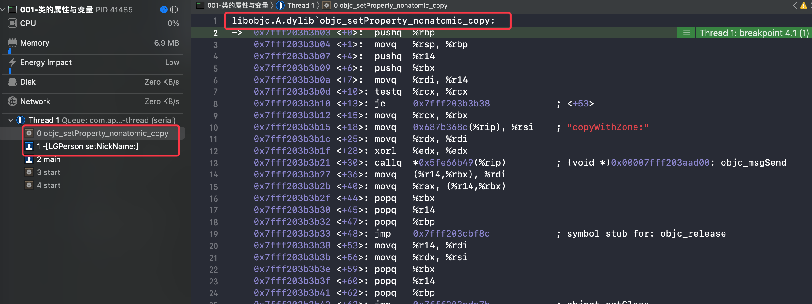

可发现被符号断点 `objc_setProperty_nonatomic_copy` 捕捉到，从左侧的线程信息可确认是 `@property (nonatomic, copy) NSString *nickName;`  的 `set` 方法

- 再下一步 `@property (atomic, copy) NSString *acnickName;` 被符号断点  `objc_setProperty_atomic_copy` (图类似不上了)
- 再下一步则直接跳到断点2位置

这里验证了 使用 `objc_setProperty` 方式会被当前的相关符号断点断到，而 `assign` 类型的偏移方式则捕捉不到直接跳转走

2. 接下来验证目标类型逻辑

```objc
//断点2后接如下代码
person.nrname  = @"nr";
person.arname  = @"ar";
person.nsname  = @"ns";
person.asname  = @"as";
```

- 断点2 后执行下一步

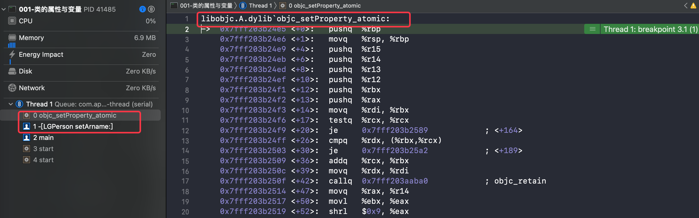

可发现被 `objc_setProperty_atomic` 符号断点捕捉，同时左侧线程信息显示是 `setArname:`  方法，这是 `@property (atomic, retain) NSString *arname;` 的 `set` 方法

分析这里可知，跳过了`@property (nonatomic, retain) NSString *nrname;` 的赋值，这就证明此方式声明的不以 `objc_setProperty` 方式实现，不执行其系列方法

这里的逻辑就与根据源码分析的 `retain` 相关逻辑一致

- 再执行下一步，查看 `strong` 修饰的赋值情况

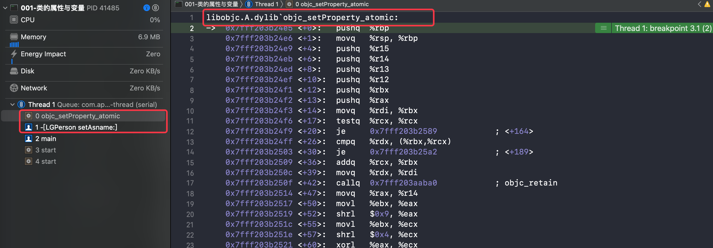

此时情况与 `retain` 相同，不赘述了

分析 `strong` 的实际实现，依然验证了源码分享的逻辑，与 `retain` 一致；同时这个符号断点的捕捉，也证实了 `clang` 输出时 `strong` 类型的实现与输出不一致

#### 总结

根据上述验证可得结论：由于 `clang` 重写输出时候存在特有逻辑，造成其输出与真正的实现方式有部分出入，还是需要以实际情况为准


### get 实现类比

`set` 方法整理完了，`get` 方法就好整多了，直接类比大多数部分，这里快速进行

#### LLVM 源码实现

##### 流程

流程开启方法与 `Setter` 相同，都是 `EmitObjCPropertyImplementations`

###### EmitObjCPropertyImplementations

```C++
/// EmitObjCPropertyImplementations - Emit information for synthesized
/// properties for an implementation.
void CodeGenModule::EmitObjCPropertyImplementations(const
                                                    ObjCImplementationDecl *D) {
  for (const auto *PID : D->property_impls()) {
    // Dynamic is just for type-checking.
    if (PID->getPropertyImplementation() == ObjCPropertyImplDecl::Synthesize) {
      ObjCPropertyDecl *PD = PID->getPropertyDecl();

      // Determine which methods need to be implemented, some may have
      // been overridden. Note that ::isPropertyAccessor is not the method
      // we want, that just indicates if the decl came from a
      // property. What we want to know is if the method is defined in
      // this implementation.
      auto *Getter = PID->getGetterMethodDecl();
      if (!Getter || Getter->isSynthesizedAccessorStub())
        CodeGenFunction(*this).GenerateObjCGetter(
            const_cast<ObjCImplementationDecl *>(D), PID);
      //...省略 Setter方法
    }
  }
}
```

这里前置流程都与 `setter` 相同

不同的在判断时，没有可读的判断，而是 `!Getter` ，如果没有声明 `getter` 方法就进行生产 `getter` 方法

###### GenerateObjCGetter

接下来中间方法

```C++
/// Generate an Objective-C property getter function.
///
/// The given Decl must be an ObjCImplementationDecl. \@synthesize
/// is illegal within a category.
void CodeGenFunction::GenerateObjCGetter(ObjCImplementationDecl *IMP,
                                         const ObjCPropertyImplDecl *PID) {
  llvm::Constant *AtomicHelperFn =
      CodeGenFunction(CGM).GenerateObjCAtomicGetterCopyHelperFunction(PID);
  ObjCMethodDecl *OMD = PID->getGetterMethodDecl();
  assert(OMD && "Invalid call to generate getter (empty method)");
  StartObjCMethod(OMD, IMP->getClassInterface());

  generateObjCGetterBody(IMP, PID, OMD, AtomicHelperFn);

  FinishFunction(OMD->getEndLoc());
}
```

这个与 `Setter` 方法基本一致，只是在向 `generateObjCGetterBody` 传参数时，多传入了 `OMD` ，稍后看看有没有影响

######  generateObjCGetterBody

核心判断是 `GetSetProperty` 

```C++
  case PropertyImplStrategy::GetSetProperty: {
    llvm::FunctionCallee getPropertyFn =
        CGM.getObjCRuntime().GetPropertyGetFunction();
    if (!getPropertyFn) {
      CGM.ErrorUnsupported(propImpl, "Obj-C getter requiring atomic copy");
      return;
    }
    CGCallee callee = CGCallee::forDirect(getPropertyFn);

    // Return (ivar-type) objc_getProperty((id) self, _cmd, offset, true).
    // FIXME: Can't this be simpler? This might even be worse than the
    // corresponding gcc code.
    llvm::Value *cmd =
      Builder.CreateLoad(GetAddrOfLocalVar(getterMethod->getCmdDecl()), "cmd");
    llvm::Value *self = Builder.CreateBitCast(LoadObjCSelf(), VoidPtrTy);
    llvm::Value *ivarOffset =
      EmitIvarOffset(classImpl->getClassInterface(), ivar);

    CallArgList args;
    args.add(RValue::get(self), getContext().getObjCIdType());
    args.add(RValue::get(cmd), getContext().getObjCSelType());
    args.add(RValue::get(ivarOffset), getContext().getPointerDiffType());
    args.add(RValue::get(Builder.getInt1(strategy.isAtomic())),
             getContext().BoolTy);

    // FIXME: We shouldn't need to get the function info here, the
    // runtime already should have computed it to build the function.
    llvm::CallBase *CallInstruction;
    RValue RV = EmitCall(getTypes().arrangeBuiltinFunctionCall(
                             getContext().getObjCIdType(), args),
                         callee, ReturnValueSlot(), args, &CallInstruction);
    if (llvm::CallInst *call = dyn_cast<llvm::CallInst>(CallInstruction))
      call->setTailCall();

    // We need to fix the type here. Ivars with copy & retain are
    // always objects so we don't need to worry about complex or
    // aggregates.
    RV = RValue::get(Builder.CreateBitCast(
        RV.getScalarVal(),
        getTypes().ConvertType(getterMethod->getReturnType())));

    EmitReturnOfRValue(RV, propType);

    // objc_getProperty does an autorelease, so we should suppress ours.
    AutoreleaseResult = false;

    return;
  }
```

此处没有优化逻辑，直接执行 `GetPropertyGetFunction`

其内部实现也无法看到

```C++
 /// Return the runtime function for getting properties.
  virtual llvm::FunctionCallee GetPropertyGetFunction() = 0;
```

类比 `setter` 在其他同名方法实现下查看

```C++
llvm::FunctionCallee CGObjCMac::GetPropertyGetFunction() {
  return ObjCTypes.getGetPropertyFn();
}

//------- getGetPropertyFn()
 llvm::FunctionCallee getGetPropertyFn() {
    CodeGen::CodeGenTypes &Types = CGM.getTypes();
    ASTContext &Ctx = CGM.getContext();
    // id objc_getProperty (id, SEL, ptrdiff_t, bool)
    CanQualType IdType = Ctx.getCanonicalParamType(Ctx.getObjCIdType());
    CanQualType SelType = Ctx.getCanonicalParamType(Ctx.getObjCSelType());
    CanQualType Params[] = {
        IdType, SelType,
        Ctx.getPointerDiffType()->getCanonicalTypeUnqualified(), Ctx.BoolTy};
    llvm::FunctionType *FTy =
        Types.GetFunctionType(
          Types.arrangeBuiltinFunctionDeclaration(IdType, Params));
    return CGM.CreateRuntimeFunction(FTy, "objc_getProperty");
  }
```

找到了 `objc_getProperty` 

#### 判断条件

判断条件方法与 `Setter` 是同一个，核心还是这段，主要区分是 `SetPropertyAndExpressionGet` 类型，此时不调用 `objc_getProperty` 

```C++
  // If we have a copy property, we always have to use getProperty/setProperty.
  // TODO: we could actually use setProperty and an expression for non-atomics.
  if (IsCopy) {
    Kind = GetSetProperty;
    return;
  }

  // Handle retain.
  if (setterKind == ObjCPropertyDecl::Retain) {
    // In GC-only, there's nothing special that needs to be done.
    if (CGM.getLangOpts().getGC() == LangOptions::GCOnly) {
      // fallthrough

    // In ARC, if the property is non-atomic, use expression emission,
    // which translates to objc_storeStrong.  This isn't required, but
    // it's slightly nicer.
    } else if (CGM.getLangOpts().ObjCAutoRefCount && !IsAtomic) {
      // Using standard expression emission for the setter is only
      // acceptable if the ivar is __strong, which won't be true if
      // the property is annotated with __attribute__((NSObject)).
      // TODO: falling all the way back to objc_setProperty here is
      // just laziness, though;  we could still use objc_storeStrong
      // if we hacked it right.
      if (ivarType.getObjCLifetime() == Qualifiers::OCL_Strong)
        Kind = Expression;
      else
        Kind = SetPropertyAndExpressionGet;
      return;

    // Otherwise, we need to at least use setProperty.  However, if
    // the property isn't atomic, we can use normal expression
    // emission for the getter.
    } else if (!IsAtomic) {
      Kind = SetPropertyAndExpressionGet;
      return;

    // Otherwise, we have to use both setProperty and getProperty.
    } else {
      Kind = GetSetProperty;
      return;
    }
  }
```

1、在代码的首个判断就发现了阻断性的条件，此代码在所有判断之前，直接表明了 `copy` 类型声明的特殊性，总要使用 `getProperty` 

2、接下来看 `ObjCPropertyDecl::Retain` 类型的判断

- 看 `else if` 第二个条件， `ObjCAutoRefCount`  ARC 条件下，且是 `!IsAtomic` ，那么就是当前 ARC 下，声明 `nonatomic` 。再查看内部的判断，根据 kind 的赋值无论使用 `Expression` 类型 还是 `SetPropertyAndExpressionGet` 类型，都不执行 `getProperty`
- 接下来 `else if` 第三个判断，`!IsAtomic` 条件下即 `nonatomic` 修饰下，使用 `SetPropertyAndExpressionGet` 类型，也不执行 `getProperty`
- 最后 `else` 就是 `GetSetProperty` 类型返回，执行 `getProperty`


#### 分析与验证

总结起来就是只有 `copy` 或 `(atmoic, retain/strong)` 声明时才使用 `getProperty` 

使用符号断点 `objc_getProperty`  验证

> 这次使用 `Objc` 源码应该也可以，错误逻辑不影响，^_^
>
> clang 就不看了

实现代码

```objc
NSString *nc = person.nickName;
NSString *ac = person.acnickName;
NSInteger n = person.nNum;
NSInteger a = person.aNum;

NSString *nr = person.nrname;
NSString *ar = person.arname;
NSString *ns = person.nsname;
NSString *as = person.asname;
```

这次使用查看汇编形式验证

针对首个 `nc` 赋值分析，其被 `objc_getProperty` 捕捉

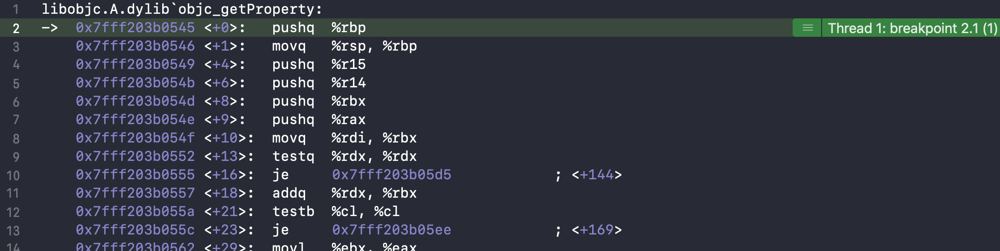

查看进入当前代码之前的位置，可发现是在 `nickName` 下的 `objc_msgSeng` ，可证实此次是由于 `nickName` 的 `getter` 方法造成

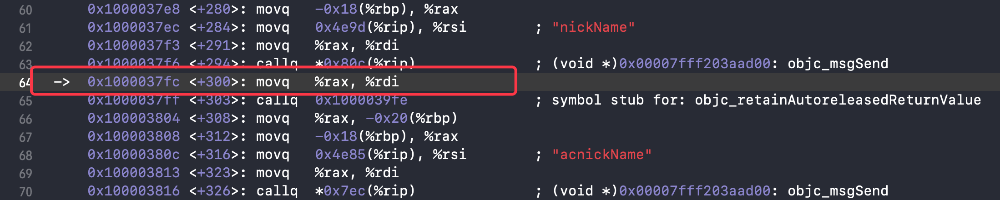

其他三个 `ac` 、`ar` 和 `as ` 也同样得到验证

验证与分析结果一致，验证完成

### set/get 汇总

set 与 get 的实现汇总

- copy 下均使用 `objc_set/getProperty`
- 通常情况下，retain 下(包括 strong)，`atmoic` 时使用，`nonatomic` 时不使用

> 从另一方面来讲，`atmoic` 加原子锁的需求，造成无法直接使用偏移方式实现，需要在 set/get 方法实现中进行额外操作，进行加锁和解锁；`copy` 进行深/浅拷贝的需求，造成需要对指针或值进行拷贝，不直接指向原数据或指针的地址，同样无法直接使用偏移方式实现[拓展5]

#### 延伸

延伸点： **`nonatomic` 声明下使用 `objc_getProperty` 本质上依旧是进行偏移方式获取**

查看 `objc` 源码中的 `objc_getProperty` 实现方法

```C++
// objc-accessors.mm
id objc_getProperty(id self, SEL _cmd, ptrdiff_t offset, BOOL atomic) {
    if (offset == 0) {
        return object_getClass(self);
    }

    // Retain release world
    id *slot = (id*) ((char*)self + offset);
    if (!atomic) return *slot;
        
    // Atomic retain release world
    spinlock_t& slotlock = PropertyLocks[slot];
    slotlock.lock();
    id value = objc_retain(*slot);
    slotlock.unlock();
    
    // for performance, we (safely) issue the autorelease OUTSIDE of the spinlock.
    return objc_autoreleaseReturnValue(value);
}
```

其内部对 `!atomic` 做了判断，根据其返回值的赋值方法

```C++
    // Retain release world
    id *slot = (id*) ((char*)self + offset);
    if (!atomic) return *slot;
```

本质上也是进行了偏移


## 拓展

### 拓展1、`ro` 与 `rw` 的相关列表区别

#### 引文

在探索 `method` 等列表数据时，是使用 `class_rw_t` 结构体访问的

源码

```C++
struct class_rw_t {
  // ... 省略其他
     const method_array_t methods() const {
        auto v = get_ro_or_rwe();
        if (v.is<class_rw_ext_t *>()) {
            return v.get<class_rw_ext_t *>(&ro_or_rw_ext)->methods;
        } else {
            return method_array_t{v.get<const class_ro_t *>(&ro_or_rw_ext)->baseMethods()};
        }
    }

    const property_array_t properties() const {
        auto v = get_ro_or_rwe();
        if (v.is<class_rw_ext_t *>()) {
            return v.get<class_rw_ext_t *>(&ro_or_rw_ext)->properties;
        } else {
            return property_array_t{v.get<const class_ro_t *>(&ro_or_rw_ext)->baseProperties};
        }
    }

    const protocol_array_t protocols() const {
        auto v = get_ro_or_rwe();
        if (v.is<class_rw_ext_t *>()) {
            return v.get<class_rw_ext_t *>(&ro_or_rw_ext)->protocols;
        } else {
            return protocol_array_t{v.get<const class_ro_t *>(&ro_or_rw_ext)->baseProtocols};
        }
    } 
}
```


在探索 `ivars` 成员变量列表时，是使用 `class_ro_t` 结构体访问的，在探索 `class_ro_t` 的数据时，发现其结构体内部存在 `baseMethodList`、`baseProtocols`、`baseProperties` 

源码

```C++
struct class_ro_t {
    uint32_t flags;
    uint32_t instanceStart;
    uint32_t instanceSize;
#ifdef __LP64__
    uint32_t reserved;
#endif

    union {
        const uint8_t * ivarLayout;
        Class nonMetaclass;
    };

    explicit_atomic<const char *> name;
    // With ptrauth, this is signed if it points to a small list, but
    // may be unsigned if it points to a big list.
    void *baseMethodList;
    protocol_list_t * baseProtocols;
    const ivar_list_t * ivars;

    const uint8_t * weakIvarLayout;
    property_list_t *baseProperties;

// ... 省略部分方法
};

```


那么这三个列表数据有什么区别呢，是不是指向同一地址呢，我们存在这样的疑问，所以就来探索下

#### 理论分析

首先根据当前所知进行分析

##### WWDC相关视频知识分析

在 《5-1、WWDC2020-ro/rw/rwe》中，我们学习了官方对 `ro/rw/rwe` 的讲解

根据官方的讲解

###### 1、 `class_rw_ext_t` 不存在

结构图如下

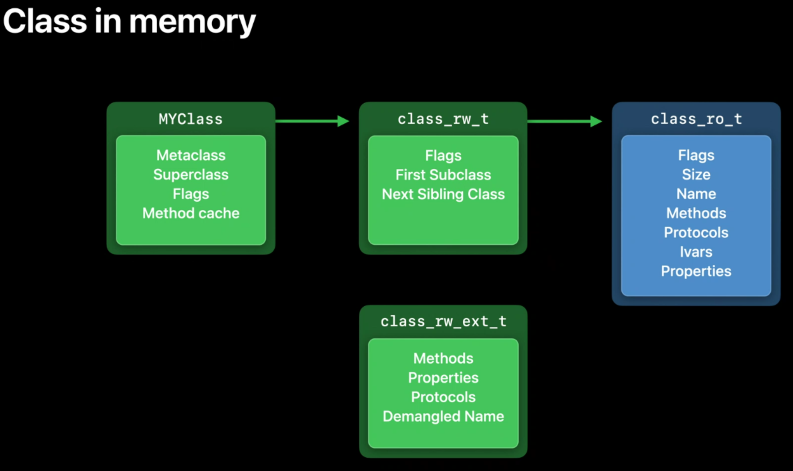

此时的 相关列表数据都存在 `ro` 中，从 `rw` 中获取的数据也是从 `ro` 中获取的，那么此时从 `rw` 和 `ro` 获取的列表数据是同一份数据

###### 2、 `class_rw_ext_t` 存在

官方举例在使用分类时，由于 dirtyMemory 的需要，此时把 `class_rw_ext_t` 滑入了整个结构

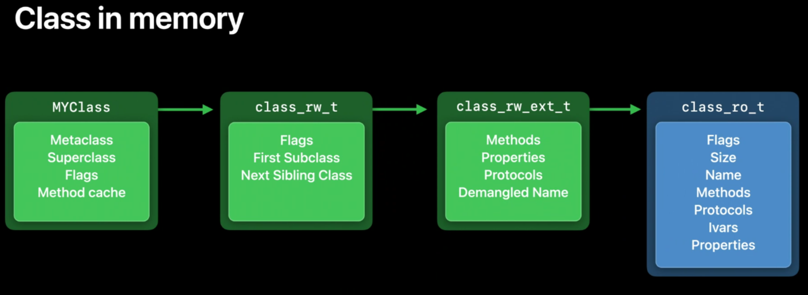

同时 `class_rw_ext_t` 中的列表数据可以在运行时通过分类进行添加

根据这些理论可知，此时 `ext` 中的列表数据与 `ro` 中的列表数据是不完全相同的，那么由于此时 `rw` 获取的列表数据是 `ext` 中的列表数据，那么必然与 `ro` 中的不相同

> 由于 `ro` 是只读的，那么这些 `ro` 中的列表数据是不可变更的，那么 `ro` 中的方法列表的数据是不能删除，所以你的大胆想法(删除方法)可以收起了，
>
> 一般不会删除原有方法，只进行新增方法就可以了，删除还可能造成访问不到的相关问题，确实不合适

##### 源码分析

```C++
     const method_array_t methods() const {
        auto v = get_ro_or_rwe();
        if (v.is<class_rw_ext_t *>()) {
            return v.get<class_rw_ext_t *>(&ro_or_rw_ext)->methods;
        } else {
            return method_array_t{v.get<const class_ro_t *>(&ro_or_rw_ext)->baseMethods()};
        }
    }
```

拿方法列表的实现源码进行分析，阅读代码可知

- 在 `class_rw_ext_t` 存在时直接从其内部获取
- 在 `class_rw_ext_t` 不存在时，从 `class_ro_t` 内部获取 `baseMethods` 

那么根据这些源码逻辑我们来推导下结论

###### 1、 `class_rw_ext_t` 不存在

**结论1：** 在 `class_rw_ext_t` 不存在时，`ro` 与 `rw` 的列表数据是同一份数据

###### 2、 `class_rw_ext_t` 存在

那么再来看 `class_rw_ext_t`  存在时

查看下 `class_rw_ext_t` 的源码实现

```C++
struct class_rw_ext_t {
    DECLARE_AUTHED_PTR_TEMPLATE(class_ro_t)
    class_ro_t_authed_ptr<const class_ro_t> ro;
    method_array_t methods;
    property_array_t properties;
    protocol_array_t protocols;
    char *demangledName;
    uint32_t version;
};
```

那么他内部的这些方法是怎么赋值的呢？继续查看源码

```C++
// class_rw_t 结构体内部

    class_rw_ext_t *extAllocIfNeeded() {
        auto v = get_ro_or_rwe();
        if (fastpath(v.is<class_rw_ext_t *>())) {
            return v.get<class_rw_ext_t *>(&ro_or_rw_ext);
        } else {
            return extAlloc(v.get<const class_ro_t *>(&ro_or_rw_ext));
        }
    }

    class_rw_ext_t *deepCopy(const class_ro_t *ro) {
        return extAlloc(ro, true);
    }
```

发现在 `class_rw_ext_t` 的获取方法附近，存在 `alloc` 方法，根据逻辑 `ext` 不存在时，调用了 `extAlloc` 进行开辟，那么查看下这个方法实现

```C++
class_rw_ext_t *
class_rw_t::extAlloc(const class_ro_t *ro, bool deepCopy)
{
    runtimeLock.assertLocked();

    auto rwe = objc::zalloc<class_rw_ext_t>();

    rwe->version = (ro->flags & RO_META) ? 7 : 0;

    method_list_t *list = ro->baseMethods();
    if (list) {
        if (deepCopy) list = list->duplicate();
        rwe->methods.attachLists(&list, 1);
    }

    // See comments in objc_duplicateClass
    // property lists and protocol lists historically
    // have not been deep-copied
    //
    // This is probably wrong and ought to be fixed some day
    property_list_t *proplist = ro->baseProperties;
    if (proplist) {
        rwe->properties.attachLists(&proplist, 1);
    }

    protocol_list_t *protolist = ro->baseProtocols;
    if (protolist) {
        rwe->protocols.attachLists(&protolist, 1);
    }

    set_ro_or_rwe(rwe, ro);
    return rwe;
}
```

其中的 `attachLists` 是以前查看过的方法，是 `class list_array_tt` 内部的方法，用来添加 `list` 数据

```C++
//class list_array_tt 内部方法    
void attachLists(List* const * addedLists, uint32_t addedCount) {
        if (addedCount == 0) return;

        if (hasArray()) {
            // many lists -> many lists
            uint32_t oldCount = array()->count;
            uint32_t newCount = oldCount + addedCount;
            array_t *newArray = (array_t *)malloc(array_t::byteSize(newCount));
            newArray->count = newCount;
            array()->count = newCount;

            for (int i = oldCount - 1; i >= 0; i--)
                newArray->lists[i + addedCount] = array()->lists[i];
            for (unsigned i = 0; i < addedCount; i++)
                newArray->lists[i] = addedLists[i];
            free(array());
            setArray(newArray);
            validate();
        }
        else if (!list  &&  addedCount == 1) {
            // 0 lists -> 1 list
            list = addedLists[0];
            validate();
        } 
        else {
            // 1 list -> many lists
            Ptr<List> oldList = list;
            uint32_t oldCount = oldList ? 1 : 0;
            uint32_t newCount = oldCount + addedCount;
            setArray((array_t *)malloc(array_t::byteSize(newCount)));
            array()->count = newCount;
            if (oldList) array()->lists[addedCount] = oldList;
            for (unsigned i = 0; i < addedCount; i++)
                array()->lists[i] = addedLists[i];
            validate();
        }
    }
```

根据这些源码的实现，可以得知：

`ext` 从 `ro` 中拷贝了对应的列表数据(进行了深拷贝 deepCopy)，添加到自己的列表中

那么可以得出结论：

**结论2：**在 `class_rw_ext_t` 存在时，`ro` 与 `rw` 的列表数据不同： 

- 地址不同
- 数据上，`rw` 的数据包含 `ro` 的数据


#### 打印验证

#####  `class_rw_ext_t` 不存在

输出时数据

```shell
# ... 省略前序流程
#  (class_rw_t) $3
(lldb) p $3.methods()
(const method_array_t) $4 = {
  list_array_tt<method_t, method_list_t, method_list_t_authed_ptr> = {
     = {
      list = {
        ptr = 0x0000000100008198
      }
      arrayAndFlag = 4295000472
    }
  }
}
(lldb) p $3.properties()
(const property_array_t) $7 = {
  list_array_tt<property_t, property_list_t, RawPtr> = {
     = {
      list = {
        ptr = 0x0000000100008300
      }
      arrayAndFlag = 4295000832
    }
  }
}
(lldb) p $3.protocols()
(const protocol_array_t) $8 = {
  list_array_tt<unsigned long, protocol_list_t, RawPtr> = {
     = {
      list = {
        ptr = 0x0000000000000000
      }
      arrayAndFlag = 0
    }
  }
}

#  class_ro_t 
(lldb) p $3.ro()
(const class_ro_t *) $5 = 0x0000000100008150
(lldb) p *$5
(const class_ro_t) $6 = {
  #... 省略部分
  baseMethodList = 0x0000000100008198
  baseProtocols = 0x0000000000000000
  ivars = 0x0000000100008278
  weakIvarLayout = 0x0000000100003e23 "1"
  baseProperties = 0x0000000100008300
  _swiftMetadataInitializer_NEVER_USE = {}
}
```

对比验证

- `methods()` 的 `ptr` 地址与 `baseMethodList` 相同
- `properties()` 的 `ptr` 地址与 `baseProperties` 相同
- `protocols()` 的 `ptr` 地址与 `baseProtocols` 相同 (偷懒，没加协议，下次一定 orz)

 ##### `class_rw_ext_t` 存在

需要添加分类，后面验证 分类时候再验证下


### 拓展2 编码与数字

在 `clang` 生成的 cpp 文件中，发现了一些符号，`"i"`、 `"@16@0:8"`、`"v24@0:8@16"` 等，这些是什么意思呢？

>  在 `cmd + shift + 0` 调起的帮助中，搜索  `ivar_getTypeEncoding` ，点击底部的 [Type Encodings](https://developer.apple.com/library/archive/documentation/Cocoa/Conceptual/ObjCRuntimeGuide/Articles/ocrtTypeEncodings.html#//apple_ref/doc/uid/TP40008048-CH100) 跳转编码的官方文档中查看

文档中有个主要的表格，可用来查询相关编码的含义

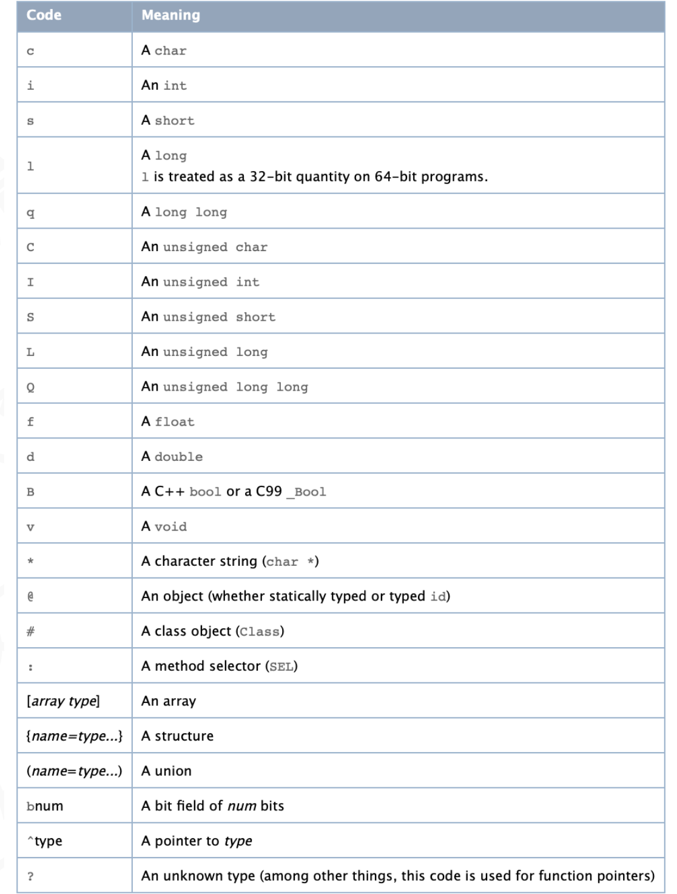

那么编码的部分清楚了，那数字与编码混合的字符又表示什么呢？

#### 示例解析

通过示例来详细解析

##### 示例1： "@16@0:8"

1. `@` 表示 An object ，是表示对象
2. 16 表示所占用的内存
3. `@` 表示一个对象
4. 0 ：从0号位置开始
5. `:` 表示 SEL
6. 8 :  从8号位置开始

结合这个字符串对应的 `nickName` 的 `get` 方法在 cpp 文件中的实现

```C++
static NSString * _I_LGPerson_nickName(LGPerson * self, SEL _cmd) { return (*(NSString **)((char *)self + OBJC_IVAR_$_LGPerson$_nickName)); }
```

再次对照分析

1. `@` 表示返回值是个对象
2. 16 表示整个方法所占用的内存

上面两个对整体进行描述，下面是对内部的成员的全部描述

3. `@` 表示一个对象，是默认首个参数 `self` 

4. 0 ：从0号位置开始

5. `:` 表示第二个参数  `SEL _cmd`

6. 8 :  从8号位置开始

##### 示例2："v24@0:8@16"

结合 "setNickName" 方法的底层实现

```C++
static void _I_LGPerson_setNickName_(LGPerson * self, SEL _cmd, NSString *nickName) { objc_setProperty (self, _cmd, __OFFSETOFIVAR__(struct LGPerson, _nickName), (id)nickName, 0, 1); }
```

1. 返回值 void -- `v`
2. 整个方法占用内存 -- `24`
3. 首个参数 `self` -- `@`
4. 首个参数 从 0 号位置开始 -- `0` 
5. 第二个参数 `SEL _cmd` -- `:`
6. 第二个参数重 8 号位置开始 -- `8`
7. 第三个参数 `NSString *nickName` -- `@`
8. 第三个参数从 16 号位置开始 -- `16`

通过对照解析就完全明白了，以后也可以根据这个字符反推方法的大致结构


#### 输出对照

进行一些结构的编码输出，对照加深理解 (基本表中的一个类型对应的一个编码就省略不说了)

```objc

    int array[] = {1,2,3};
    NSLog(@"int[] --> %s",@encode(typeof(array)));
    typedef struct person{
        char *name;
        int age;
    }Person;
    NSLog(@"struct --> %s",@encode(Person));
    
    typedef union union_type{
        char *name;
        int a;
    }Union;
    NSLog(@"union --> %s",@encode(Union));

    int a = 2;
    int *b = {&a};
    NSLog(@"int[] --> %s",@encode(typeof(b)));

```

输出:

```shell
int[] --> [3i]            #[array type]   array
struct --> {person=*i}    #{name=type...} structure
union --> (union_type=*i) #(name=type...) union
int[] --> ^i              #^type          A pointer to type
```


### 拓展3 使用的 `runtime` 方法

#### class_copyIvarList

```c++
/** 
 * Describes the instance variables declared by a class.
 * 
 * @param cls The class to inspect.
 * @param outCount On return, contains the length of the returned array. 
 *  If outCount is NULL, the length is not returned.
 * 
 * @return An array of pointers of type Ivar describing the instance variables declared by the class. 
 *  Any instance variables declared by superclasses are not included. The array contains *outCount 
 *  pointers followed by a NULL terminator. You must free the array with free().
 * 
 *  If the class declares no instance variables, or cls is Nil, NULL is returned and *outCount is 0.
 */
OBJC_EXPORT Ivar _Nonnull * _Nullable
class_copyIvarList(Class _Nullable cls, unsigned int * _Nullable outCount) 
    OBJC_AVAILABLE(10.5, 2.0, 9.0, 1.0, 2.0);

```

#### ivar_getName

```C++
/** 
 * Returns the name of an instance variable.
 * 
 * @param v The instance variable you want to enquire about.
 * 
 * @return A C string containing the instance variable's name.
 */
OBJC_EXPORT const char * _Nullable
ivar_getName(Ivar _Nonnull v) 
    OBJC_AVAILABLE(10.5, 2.0, 9.0, 1.0, 2.0);
```


### 拓展4 `isSynthesizedAccessorStub` 的含义探索

查看下 `isSynthesizedAccessorStub()` 方法

```C++
  bool isSynthesizedAccessorStub() const {
    return ObjCMethodDeclBits.IsSynthesizedAccessorStub;
  }

  void setSynthesizedAccessorStub(bool isSynthesizedAccessorStub) {
    ObjCMethodDeclBits.IsSynthesizedAccessorStub = isSynthesizedAccessorStub;
  }

```

最内部的实现是个位域

```C++
/// True if this method is a synthesized property accessor stub.
    uint64_t IsSynthesizedAccessorStub : 1; //位域
```

找找看在哪里赋值的，在 `setSynthesizedAccessorStub` 方法所在代码块向上查看的代码里发现了

```C++
  ObjCMethodDecl(SourceLocation beginLoc, SourceLocation endLoc,
                 Selector SelInfo, QualType T, TypeSourceInfo *ReturnTInfo,
                 DeclContext *contextDecl, bool isInstance = true,
                 bool isVariadic = false, bool isPropertyAccessor = false,
                 bool isSynthesizedAccessorStub = false, 
                 bool isImplicitlyDeclared = false, bool isDefined = false,
                 ImplementationControl impControl = None,
                 bool HasRelatedResultType = false);
```

这里是赋值的 false ，看下整个定义方法，false 果然传递到赋值方法了

```C++
ObjCMethodDecl::ObjCMethodDecl(
    SourceLocation beginLoc, SourceLocation endLoc, Selector SelInfo,
    QualType T, TypeSourceInfo *ReturnTInfo, DeclContext *contextDecl,
    bool isInstance, bool isVariadic, bool isPropertyAccessor,
    bool isSynthesizedAccessorStub, bool isImplicitlyDeclared, bool isDefined,
    ImplementationControl impControl, bool HasRelatedResultType)
    : NamedDecl(ObjCMethod, contextDecl, beginLoc, SelInfo),
      DeclContext(ObjCMethod), MethodDeclType(T), ReturnTInfo(ReturnTInfo),
      DeclEndLoc(endLoc) {

  // Initialized the bits stored in DeclContext.
  ObjCMethodDeclBits.Family =
      static_cast<ObjCMethodFamily>(InvalidObjCMethodFamily);
  setInstanceMethod(isInstance);
  setVariadic(isVariadic);
  setPropertyAccessor(isPropertyAccessor);
  setSynthesizedAccessorStub(isSynthesizedAccessorStub); //方法定位
  //...
}
```

那么搜一搜 `bool isSynthesizedAccessorStub = ` 看哪里是赋值 true 的

好吧，搜到的全是 false，orz

此路不通，那么直接搜索下 `setSynthesizedAccessorStub` 方法，看看哪里有赋值，还是都是 false，orz

好吧，那我搜索下  `synthesized property accessor stub` 这个看看有没有

还真找到了一个方法

```C++
/// Create a synthesized property accessor stub inside the \@implementation.
static ObjCMethodDecl *
RedeclarePropertyAccessor(ASTContext &Context, ObjCImplementationDecl *Impl,
                          ObjCMethodDecl *AccessorDecl, SourceLocation AtLoc,
                          SourceLocation PropertyLoc) {
  ObjCMethodDecl *Decl = AccessorDecl;
  ObjCMethodDecl *ImplDecl = ObjCMethodDecl::Create(
      Context, AtLoc.isValid() ? AtLoc : Decl->getBeginLoc(),
      PropertyLoc.isValid() ? PropertyLoc : Decl->getEndLoc(),
      Decl->getSelector(), Decl->getReturnType(),
      Decl->getReturnTypeSourceInfo(), Impl, Decl->isInstanceMethod(),
      Decl->isVariadic(), Decl->isPropertyAccessor(),
      /* isSynthesized*/ true, Decl->isImplicit(), Decl->isDefined(),
      Decl->getImplementationControl(), Decl->hasRelatedResultType());
  ImplDecl->getMethodFamily();
  if (Decl->hasAttrs())
    ImplDecl->setAttrs(Decl->getAttrs());
  ImplDecl->setSelfDecl(Decl->getSelfDecl());
  ImplDecl->setCmdDecl(Decl->getCmdDecl());
  SmallVector<SourceLocation, 1> SelLocs;
  Decl->getSelectorLocs(SelLocs);
  ImplDecl->setMethodParams(Context, Decl->parameters(), SelLocs);
  ImplDecl->setLexicalDeclContext(Impl);
  ImplDecl->setDefined(false);
  return ImplDecl;
}

// 此处的  /* isSynthesized*/ true 对应位置就是 isSynthesizedAccessorStub 

// ---------  ObjCMethodDecl::Create(...)
ObjCMethodDecl *ObjCMethodDecl::Create(
    ASTContext &C, SourceLocation beginLoc, SourceLocation endLoc,
    Selector SelInfo, QualType T, TypeSourceInfo *ReturnTInfo,
    DeclContext *contextDecl, bool isInstance, bool isVariadic,
    bool isPropertyAccessor, bool isSynthesizedAccessorStub,
    bool isImplicitlyDeclared, bool isDefined, ImplementationControl impControl,
    bool HasRelatedResultType) {
  return new (C, contextDecl) ObjCMethodDecl(
      beginLoc, endLoc, SelInfo, T, ReturnTInfo, contextDecl, isInstance,
      isVariadic, isPropertyAccessor, isSynthesizedAccessorStub,
      isImplicitlyDeclared, isDefined, impControl, HasRelatedResultType);
}

```

那就再搜索下  `RedeclarePropertyAccessor` 方法在哪有调用

```C++
if (ObjCMethodDecl *getterMethod = property->getGetterMethodDecl()) {
    getterMethod->createImplicitParams(Context, IDecl);

    // Redeclare the getter within the implementation as DeclContext.
    if (Synthesize) {
      // If the method hasn't been overridden, create a synthesized implementation.
      ObjCMethodDecl *OMD = ClassImpDecl->getMethod(
          getterMethod->getSelector(), getterMethod->isInstanceMethod());
      if (!OMD)
        OMD = RedeclarePropertyAccessor(Context, IC, getterMethod, AtLoc,
                                        PropertyLoc); //方法调用位置
      PIDecl->setGetterMethodDecl(OMD);
    }
 //... 
}

//-------  getMethod(,)
// Get the local instance/class method declared in this interface.
ObjCMethodDecl *
ObjCContainerDecl::getMethod(Selector Sel, bool isInstance,
                             bool AllowHidden) const
```

根据这里的注释方法没有被重写就可以调用 `RedeclarePropertyAccessor` 方法，调用此方法意味着  `isSynthesizedAccessorStub` 设置为 true

那我们就暂且理解为 `isSynthesizedAccessorStub`  等同于方法未被重写

### 拓展5 为什么 copy 使用 objc_setProperty 方式实现？

`copy` 进行深/浅拷贝的需求，造成需要对指针或值进行拷贝，不直接指向原数据或指针的地址，因此无法直接使用偏移方式实现

在 `Objc` 源码中查看

```C++
void objc_setProperty_nonatomic_copy(id self, SEL _cmd, id newValue, ptrdiff_t offset)
{
    reallySetProperty(self, _cmd, newValue, offset, false, true, false);
}
```

`objc_setProperty` 系列的相关方法都调用了 `reallySetProperty()` 函数

```C++
static inline void reallySetProperty(id self, SEL _cmd, id newValue, ptrdiff_t offset, bool atomic, bool copy, bool mutableCopy)
{
    if (offset == 0) {
        object_setClass(self, newValue);
        return;
    }

    id oldValue;
    id *slot = (id*) ((char*)self + offset);

    if (copy) {
        newValue = [newValue copyWithZone:nil];  //copy相关处理
    } else if (mutableCopy) {
        newValue = [newValue mutableCopyWithZone:nil]; //copy相关处理
    } else {
        if (*slot == newValue) return;
        newValue = objc_retain(newValue);
    }

    if (!atomic) {
        oldValue = *slot;
        *slot = newValue;
    } else {
        spinlock_t& slotlock = PropertyLocks[slot];
        slotlock.lock();  //加锁相关处理
        oldValue = *slot;
        *slot = newValue;        
        slotlock.unlock();
    }

    objc_release(oldValue);
}

```

上述代码中就体现了在 `setProperty` 相关方法中，对 `copy` 和 `atmoic` 进行了相应的处理，来符合对应的实现需求，从而造成其实现需要调用 `setProperty` ，不能应用直接偏移获取原数据或指针


## 趟坑

### 趟坑1  使用 Objc 源码验证理论趟坑

> 注意：当前使用的可编译 `Objc` 源码，由 LG 提供，并非泛指所有 `Objc` 源码，未验证其他源码是否正常

#### 现象

使用 `Objc` 源码验证 ` retain` 和 `strong` 声明属性的实现时

```objc
@property (nonatomic, strong) NSString *nsName;

@property (nonatomic, retain) NSString *nrname;

// main 函数赋值
LGPerson *p = [[LGPerson alloc] init];
p.nsName = @"RNG";  //设置断点1
p.nrname = @"JDG";
```

在源码中 `objc_setProperty` 的优化相关方法打上断点

运行执行，在断点1后跳转下一步

发现被 `objc_setProperty_nonatomic` 方法断点捕获，查看汇编信息

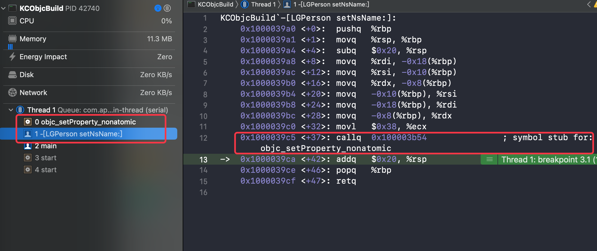

发现其符号确实与 `objc_setProperty_nonatomic` 绑定

再跳转下一步的 `nrname` 也是同样逻辑

#### 问题

这就很让人迷惑了，这里逻辑与源码分析的不执行 `objc_setProperty` 实现的逻辑不一致

起初我以为是我遗漏了逻辑，在 `llvm` 源码中左右横跳，百思不得其解

#### 分析

根据当前的现象又重新阅读源码，只关注核心的相关判断部分代码

```C++
if (ivarType.getObjCLifetime() == Qualifiers::OCL_Strong)
  Kind = Expression;
else
  Kind = SetPropertyAndExpressionGet;
return;
```

当前的 `Objc` 源码执行的是 `SetPropertyAndExpressionGet` 在源码中也验证了取值时 `objc_getProperty` 方法未调用

此时的怀疑就是 if 判断条件理解错误

##### 怀疑1 ivarType.getObjCLifetime() != Qualifiers::OCL_Strong

此时就发出了首个怀疑，`retain` 和 `strong` 时，`getObjCLifetime()` 取值不为 `OCL_Strong` 

然后就查看和验证

首先根据注释 

```C++
      // Using standard expression emission for the setter is only
      // acceptable if the ivar is __strong, which won't be true if
      // the property is annotated with __attribute__((NSObject)).
```

这很明显 `the ivar is __strong` 这时候应该是 `__strong` 没错来着

查看方法实现

```C++
  /// Returns lifetime attribute of this type.
  Qualifiers::ObjCLifetime getObjCLifetime() const {
    return getQualifiers().getObjCLifetime();
  }

//----- Type.h  getObjCLifetime()
  bool hasObjCLifetime() const { return Mask & LifetimeMask; }
  ObjCLifetime getObjCLifetime() const {
    return ObjCLifetime((Mask & LifetimeMask) >> LifetimeShift);
  }
  void setObjCLifetime(ObjCLifetime type) {
    Mask = (Mask & ~LifetimeMask) | (type << LifetimeShift);
  }
```

看到这里一脸位运算，懵啊，只好另寻他法，开始各种搜索对比

搜索 `Qualifiers::OCL_Strong`

```C++
/// getImpliedARCOwnership - Given a set of property attributes and a
/// type, infer an expected lifetime.  The type's ownership qualification
/// is not considered.
///
/// Returns OCL_None if the attributes as stated do not imply an ownership.
/// Never returns OCL_Autoreleasing.
static Qualifiers::ObjCLifetime
getImpliedARCOwnership(ObjCPropertyAttribute::Kind attrs, QualType type) {
  // retain, strong, copy, weak, and unsafe_unretained are only legal
  // on properties of retainable pointer type.
  if (attrs &
      (ObjCPropertyAttribute::kind_retain | ObjCPropertyAttribute::kind_strong |
       ObjCPropertyAttribute::kind_copy)) {
    return Qualifiers::OCL_Strong;
  } else if (attrs & ObjCPropertyAttribute::kind_weak) {
    return Qualifiers::OCL_Weak;
  } else if (attrs & ObjCPropertyAttribute::kind_unsafe_unretained) {
    return Qualifiers::OCL_ExplicitNone;
  }

  // assign can appear on other types, so we have to check the
  // property type.
  if (attrs & ObjCPropertyAttribute::kind_assign &&
      type->isObjCRetainableType()) {
    return Qualifiers::OCL_ExplicitNone;
  }

  return Qualifiers::OCL_None;
}
```

这里看到 `ObjCPropertyAttribute` 在 `kind_retain`、`kind_strong`、`kind_copy` 下均返回的 `OCL_Strong` 类型枚举，那么这个声明对应的类型的转换逻辑是没错的啊

搜索 `setObjcLifetime` ，查看哪里赋值 `strong` 看能不能有所收获

```C++
// SemaObjcProperty.cpp
static void checkARCPropertyImpl(Sema &S, SourceLocation propertyImplLoc,
                                 ObjCPropertyDecl *property,
                                 ObjCIvarDecl *ivar) {
  if (property->isInvalidDecl() || ivar->isInvalidDecl()) return;

  QualType ivarType = ivar->getType();
  Qualifiers::ObjCLifetime ivarLifetime = ivarType.getObjCLifetime();

  // The lifetime implied by the property's attributes.
  Qualifiers::ObjCLifetime propertyLifetime =
    getImpliedARCOwnership(property->getPropertyAttributes(),
                           property->getType());

  // We're fine if they match.
  if (propertyLifetime == ivarLifetime) return;

  // None isn't a valid lifetime for an object ivar in ARC, and
  // __autoreleasing is never valid; don't diagnose twice.
  if ((ivarLifetime == Qualifiers::OCL_None &&
       S.getLangOpts().ObjCAutoRefCount) ||
      ivarLifetime == Qualifiers::OCL_Autoreleasing)
    return;

  // If the ivar is private, and it's implicitly __unsafe_unretained
  // because of its type, then pretend it was actually implicitly
  // __strong.  This is only sound because we're processing the
  // property implementation before parsing any method bodies.
  if (ivarLifetime == Qualifiers::OCL_ExplicitNone &&
      propertyLifetime == Qualifiers::OCL_Strong &&
      ivar->getAccessControl() == ObjCIvarDecl::Private) {
    SplitQualType split = ivarType.split();
    if (split.Quals.hasObjCLifetime()) {
      assert(ivarType->isObjCARCImplicitlyUnretainedType());
      split.Quals.setObjCLifetime(Qualifiers::OCL_Strong);
      ivarType = S.Context.getQualifiedType(split);
      ivar->setType(ivarType);
      return;
    }
  }
  
  //...省略后续无关
  
}

```

这里的 `strong` 赋值是个容错处理，与逻辑没关系，不过在上面的代码发现

```C++
  // We're fine if they match.
  if (propertyLifetime == ivarLifetime) return;
```

这表明大部分情况下 属性的 Lifetime 与 ivar 的 Lifetime 是相同的，不过也会存在异常的情况，这就给了我另一种猜想，此时是不是 `ivar` 不是 `__strong` 类型呢

##### 猜想2  ivar != __strong

这里突然想到(在面向百度解决问题时发现)，可以通过如下方法获取哪些是 strong 的 ivar

```C++
const uint8_t *class_getIvarLayout(Class cls)
const uint8_t *class_getWeakIvarLayout(Class cls)
```

我如获至宝，立马尝试起来，希望就在眼前

```shell
(lldb) p class_getIvarLayout(LGPerson.class)
(const uint8_t *) $0 = 0x0000000000000000 <no value available>
```

??? 怎么是空的，这方法有问题么，那通过数据结构访问看看

```shell
(lldb) x/4gx LGTeacher.class #这里在各种尝试，用的子类
0x1000086f0: 0x0000000100008718 0x000000010036a140
0x100008700: 0x0000000101323c50 0x0003802000000007
(lldb) p/x 0x100008710
(long) $5 = 0x0000000100008710
(lldb) p (class_data_bits_t *)$5
(class_data_bits_t *) $6 = 0x0000000100008710
(lldb) p $6->data()
(class_rw_t *) $7 = 0x0000000100704200
(lldb) p *$7
(class_rw_t) $8 = {
  flags = 2156396544
  witness = 1
  ro_or_rw_ext = {
    std::__1::atomic<unsigned long> = {
      Value = 4295000160
    }
  }
  firstSubclass = nil
  nextSiblingClass = NSBinder
}
(lldb) p $8.ro()
(const class_ro_t *) $9 = 0x0000000100008060
(lldb) p *$9
(const class_ro_t) $10 = {
  flags = 0
  instanceStart = 8
  instanceSize = 24
  reserved = 0
   = {
    ivarLayout = 0x0000000000000000  # 依然是空的
    nonMetaclass = nil
  }
  name = {
    std::__1::atomic<const char *> = "LGTeacher" {
      Value = 0x0000000100003f36 "LGTeacher"
    }
  }
  baseMethodList = 0x00000001000080a8
  baseProtocols = 0x0000000000000000
  ivars = 0x0000000100008158
  weakIvarLayout = 0x0000000000000000
  baseProperties = 0x00000001000081a0
  _swiftMetadataInitializer_NEVER_USE = {}
}
```

??? 还是空的，难道我 `strong` 类型的实例变量都声明错了，又经过各种尝试还是空的

##### 怀疑3 代码有问题

是不是代码有问题，我又重开了一个 `Objc` 源码的工程，还是空的

？难道源码工程有问题，我又重开了一个普通的非源码 demo

```shell
(lldb) p class_getIvarLayout(LGPerson.class)
(const uint8_t * _Nullable) $0 = 0x0000000100003f3d "\x01\x13$"
```

我就说吗，这什么奇奇怪怪的问题，肯定不是我声明 `strong` 类型声明错的

好吧，现在验证了是 `Objc` 源码的 `ivar` 数据有问题，所以后来验证改用普通demo 使用符号断点来验证了

#### 错误逻辑论证

此时 `ivar ` 数据获取的 实例变量为空，

```C++
if (ivarType.getObjCLifetime() == Qualifiers::OCL_Strong)
  Kind = Expression;
else
  Kind = SetPropertyAndExpressionGet;
return;
```

这里的 `ivarTyp` 应该获取为空了，至于前面的判断由于是取的 `property` 相关属性可能是没问题的，这里为空就执行了 `else` 中的判断，这就导致了当前调用 `obic_setProperty` 相关

坑啊，这坑真深，爬了好几天 (╥﹏╥)
