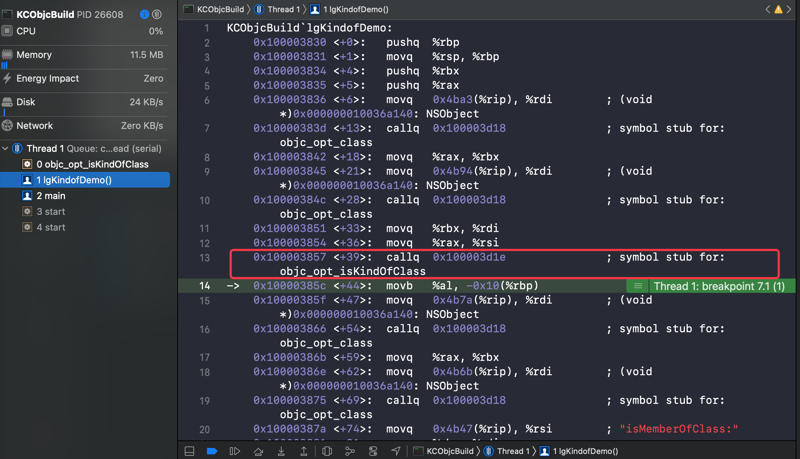

## 类方法补充

在 《4-2、类的结构初探》中我们探索了 `class_rw_t` 中的 `methods` 方法列表，我们确实在类的内存结构中找到了这些对象方法，这就衍生出了问题：

**为什么对象方法在类里？**

避免在对象中存储多份，这个答案感觉回答的比较充分

那么类方法呢？

在《4-2》中我们也已经验证了这个分析，类方法存储在元类里

类在内存中只存储一份，不存在对象的多份的问题，那么为什么存在元类中呢？

类方法和对象方法在底层统一都是函数，并无区别，只是上层封装添加了 `-` 和 `+` ，按照类似对象方法存储在类中样式存储

- 首先便于元类和类使用同样的结构
- 同时也区分了类方法和对象方法，不需要专门再加标识区分了

上面这些分析也只是根据当前结构的分析，具体缘由可能要去 Apple 里问问开发人员

查看内存结构需要在源码中进行，那如果没有源码要怎样进行验证呢？

### runtime API 验证

苹果官方提供了 `runtime` 的 API，可以协助我们来侧面验证下类和类的方法等

接下来我们尝试使用验证下

#### OC 代码

首先我们针对固定的代码进行分析

```objc
@interface LGPerson : NSObject
{
    NSObject *objc; 
    NSString *nickName;
}
@property (nonatomic, copy) NSString *name;
@property (nonatomic, strong) NSObject *obj;

- (void)sayHello;
+ (void)sayHappy;
@end
```

这个类实现有包含 实例对象、属性、对象方法和类方法，比较全了，开整

#### class_copyMethodList

方法释义

```C++
/** 
 * Describes the instance methods implemented by a class.
 * 
 * @param cls The class you want to inspect.
 * @param outCount On return, contains the length of the returned array. 
 *  If outCount is NULL, the length is not returned.
 * 
 * @return An array of pointers of type Method describing the instance methods 
 *  implemented by the class—any instance methods implemented by superclasses are not included. (不包含父类的对象方法)
 *  The array contains *outCount pointers followed by a NULL terminator. You must free the array with free().
 * 
 *  If cls implements no instance methods, or cls is Nil, returns NULL and *outCount is 0.
 * 
 * @note To get the class methods of a class, use \c class_copyMethodList(object_getClass(cls), &count).
 * @note To get the implementations of methods that may be implemented by superclasses, 
 *  use \c class_getInstanceMethod or \c class_getClassMethod.
 */
OBJC_EXPORT Method _Nonnull * _Nullable
class_copyMethodList(Class _Nullable cls, unsigned int * _Nullable outCount) 
    OBJC_AVAILABLE(10.5, 2.0, 9.0, 1.0, 2.0);

```

首先来打印所有的方法

```objc
void objc_copyMethodList(Class pClass){
    unsigned int count = 0;
    Method *methods = class_copyMethodList(pClass, &count);
    for (unsigned int i=0; i < count; i++) {
        Method const method = methods[i];
        //获取方法名
        NSString *key = NSStringFromSelector(method_getName(method));
        
        NSLog(@"Method, name: %@", key);
    }
    free(methods);
}
```

在main函数来打印所有的对象方法和类方法

```objc
  LGPerson *person = [LGPerson alloc];
  Class pClass     = object_getClass(person);
  objc_copyMethodList(pClass);
// 类方法为 元类的对象方法
  const char *className = class_getName(pClass);
  Class metaClass = objc_getMetaClass(className);
  NSLog(@"*************");
  objc_copyMethodList(metaClass);
```

输出结果

```shell
Method, name: sayHello
Method, name: name
Method, name: .cxx_destruct  # C++ 析构函数 [拓展1]
Method, name: setName:
Method, name: obj
Method, name: setObj:
*************
Method, name: sayHappy
```

#### class_getInstanceMethod

接下来使用获取实例方法接口验证对象方法和类方法

```C++
void instanceMethod_classToMetaclass(Class pClass){
    
    const char *className = class_getName(pClass);
    Class metaClass = objc_getMetaClass(className);
    
  //    - (void)sayHello;
  //    + (void)sayHappy;
    Method method1 = class_getInstanceMethod(pClass, @selector(sayHello));
    Method method2 = class_getInstanceMethod(metaClass, @selector(sayHello));

    Method method3 = class_getInstanceMethod(pClass, @selector(sayHappy));
    Method method4 = class_getInstanceMethod(metaClass, @selector(sayHappy));
    
    LGLog(@"%s - %p-%p-%p-%p",__func__,method1,method2,method3,method4);
}

//输出结果：
//instanceMethod_classToMetaclass - 0x1000081c8-0x0-0x0-0x100008160
```

根据结果可以验证，使用 `class_getInstanceMethod` 接口

- `sayHello` 对象方法只能从类中获取，无法从元类中取得
- `sayHappy` 类方法只能从元类中获取，无法从类中取得

#### class_getClassMethod

然后使用获取类方法接口验证

```objc
void classMethod_classToMetaclass(Class pClass){
    
    const char *className = class_getName(pClass);
    Class metaClass = objc_getMetaClass(className);
    
  //    - (void)sayHello;
  //    + (void)sayHappy;
    Method method1 = class_getClassMethod(pClass, @selector(sayHello));
    Method method2 = class_getClassMethod(metaClass, @selector(sayHello));

    Method method3 = class_getClassMethod(pClass, @selector(sayHappy));
    Method method4 = class_getClassMethod(metaClass, @selector(sayHappy));
    
    LGLog(@"%s-%p-%p-%p-%p",__func__,method1,method2,method3,method4);
}

//输出结果：
//classMethod_classToMetaclass-0x0-0x0-0x100008160-0x100008160
```

根据结果可以验证，使用 `class_getClassMethod` 接口

- `sayHello` 对象方法从类和元类中都取不到
- `sayHappy` 类方法只能从类和元类中都能取到

这里就有疑问了，为什么从元类获取类方法依然能取到类方法？查看一下源码实现

```C++
/***********************************************************************
* class_getClassMethod.  Return the class method for the specified
* class and selector.
**********************************************************************/
Method class_getClassMethod(Class cls, SEL sel)
{
    if (!cls  ||  !sel) return nil;

    return class_getInstanceMethod(cls->getMeta(), sel);
}
```

这里的直接实现表明，获取类方法就是取元类的实例方法，同时也证明了底层中不存在类方法，没有 `+`  与 `-` 的区分，全都是对象方法

那么这里看下 元类获取函数  

```C++
    // NOT identical to this->ISA when this is a metaclass
    Class getMeta() {
        if (isMetaClassMaybeUnrealized()) return (Class)this;
        else return this->ISA();
    }

//-----  isMetaClassMaybeUnrealized
    // Like isMetaClass, but also valid on un-realized classes
    bool isMetaClassMaybeUnrealized() {
        static_assert(offsetof(class_rw_t, flags) == offsetof(class_ro_t, flags), "flags alias");
        static_assert(RO_META == RW_META, "flags alias");
        if (isStubClass())
            return false;
        return data()->flags & RW_META;
    }

```

根据注释语句表明，如果当前是元类的话，就不再取 ISA 了，直接返回了当前元类；再查看其判断实现，也是一个通过 `flags`  来判断元类标识的逻辑

那么这里**最终还是获取当前元类的对象方法**，那么自然就获取到了这个对象的类方法

#### class_getMethodImplementation

最后我们来获取一下 `IMP` 

先查看下方法注释

```C++
/** 
 * Returns the function pointer that would be called if a 
 * particular message were sent to an instance of a class.
 * 
 * @param cls The class you want to inspect.
 * @param name A selector.
 * 
 * @return The function pointer that would be called if \c [object name] were called
 *  with an instance of the class, or \c NULL if \e cls is \c Nil.
 *
 * @note \c class_getMethodImplementation may be faster than \c method_getImplementation(class_getInstanceMethod(cls, name)).
 * @note The function pointer returned may be a function internal to the runtime instead of
 *  an actual method implementation. For example, if instances of the class do not respond to
 *  the selector, the function pointer returned will be part of the runtime's message forwarding machinery.
 */
OBJC_EXPORT IMP _Nullable
class_getMethodImplementation(Class _Nullable cls, SEL _Nonnull name) 
    OBJC_AVAILABLE(10.5, 2.0, 9.0, 1.0, 2.0);
```

`IMP` 本质上是方法指针，指向方法的具体实现；同时这里也提到如果实例对象没有响应这个方法，返回值会是运行时消息转发机制的部分

输出加深下理解

```objc
void IMP_classToMetaclass(Class pClass){
    
    const char *className = class_getName(pClass);
    Class metaClass = objc_getMetaClass(className);

    //    - (void)sayHello;
    //    + (void)sayHappy;
    IMP imp1 = class_getMethodImplementation(pClass, @selector(sayHello));
    IMP imp2 = class_getMethodImplementation(metaClass, @selector(sayHello));
  
    IMP imp3 = class_getMethodImplementation(pClass, @selector(sayHappy));
    IMP imp4 = class_getMethodImplementation(metaClass, @selector(sayHappy));

    NSLog(@"%p-%p-%p-%p",imp1,imp2,imp3,imp4);
    NSLog(@"%s",__func__);

}

//输出
// 0x100003ab0-0x7fff203abac0-0x7fff203abac0-0x100003af0
// lgIMP_classToMetaclass
```

这里 `IMP` 都获取到了，分析下

##### 分析

根据方法的声明，`imp1` 和 `imp4` 存在的理解是没什么问题，那么 `imp2` 和 `imp3` 为什么存在呢，而且查看输出值和 `imp1` `imp4` 的地址结构相差巨大

这里就符合了上面注释中提到的情况，此时进行的 `SEL` 查找 `IMP` 的流程，即方法查找流程，在没有响应时，开始执行标准的方法查找

这里我们大概看下方法实现，具体的方法查找流程稍后再详细分析

```C++
__attribute__((flatten))
IMP class_getMethodImplementation(Class cls, SEL sel)
{
    IMP imp;

    if (!cls  ||  !sel) return nil;

    lockdebug_assert_no_locks_locked_except({ &loadMethodLock });

    imp = lookUpImpOrNilTryCache(nil, sel, cls, LOOKUP_INITIALIZE | LOOKUP_RESOLVER);

    // Translate forwarding function to C-callable external version
    if (!imp) {
        return _objc_msgForward;
    }

    return imp;
}
```

这里就返回了 `_objc_msgForward` ，进入了方法转发流程


## 类与对象的补充

这里我们在补充一个经典的类与对象的类型匹配 `isKindof` 与 `isMember` 的面试题的分析

```objc
void isKindofDemo(void){
    BOOL re1 = [(id)[NSObject class] isKindOfClass:[NSObject class]];       //
    BOOL re2 = [(id)[NSObject class] isMemberOfClass:[NSObject class]];     //
    BOOL re3 = [(id)[LGPerson class] isKindOfClass:[LGPerson class]];       //
    BOOL re4 = [(id)[LGPerson class] isMemberOfClass:[LGPerson class]];     //
    NSLog(@" re1 :%hhd\n re2 :%hhd\n re3 :%hhd\n re4 :%hhd\n",re1,re2,re3,re4);

    BOOL re5 = [(id)[NSObject alloc] isKindOfClass:[NSObject class]];       //
    BOOL re6 = [(id)[NSObject alloc] isMemberOfClass:[NSObject class]];     //
    BOOL re7 = [(id)[LGPerson alloc] isKindOfClass:[LGPerson class]];       //
    BOOL re8 = [(id)[LGPerson alloc] isMemberOfClass:[LGPerson class]];     //
    NSLog(@" re5 :%hhd\n re6 :%hhd\n re7 :%hhd\n re8 :%hhd\n",re5,re6,re7,re8);
}
```

### 分析(伪)

#### 方法源码分析(伪)

这里我们先查看下 `isKindOfClass` 和 `isMemberOfClass` 的源码实现，点进去跳转方法实现(此处有坑)

```C++
+ (BOOL)isMemberOfClass:(Class)cls {
    return self->ISA() == cls;
}

- (BOOL)isMemberOfClass:(Class)cls {
    return [self class] == cls;
}

+ (BOOL)isKindOfClass:(Class)cls {
    for (Class tcls = self->ISA(); tcls; tcls = tcls->getSuperclass()) {
        if (tcls == cls) return YES;
    }
    return NO;
}

- (BOOL)isKindOfClass:(Class)cls {
    for (Class tcls = [self class]; tcls; tcls = tcls->getSuperclass()) {
        if (tcls == cls) return YES;
    }
    return NO;
}
```

根据源码可得

- `isMemberOfClass` 类方法对比传入对象的 `ISA` 与 参数 `cls`
- `isMemberOfClass` 对象方法对比传入对象的类 与 参数 `cls`
- `isKindOfClass` 类方法对比传入对象的 `ISA` 以及其所有父类与 参数 `cls`
- `isKindOfClass` 对象方法对比传入对象的类以及其所有父类与 参数 `cls`

#### 代码结果分析(伪)

```objc
    BOOL re1 = [(id)[NSObject class] isKindOfClass:[NSObject class]];       
// 此处使用 isKindOfClass 类方法，对比 NSObject 类的 ISA(即根元类) 以及其所有父类与 NSObject 类比较
// 结果：由于 根元类的父类是 NSObject，那么此时返回 true

    BOOL re2 = [(id)[NSObject class] isMemberOfClass:[NSObject class]];     
// 此处使用 isMemberOfClass 类方法，对比 NSObject 类的 ISA(即根元类) 与 NSObject 类比较
// 结果：由于 NSObject 根元类与 NSObject 类不同，那么此时返回 false

    BOOL re3 = [(id)[LGPerson class] isKindOfClass:[LGPerson class]];       
// 此处使用 isKindOfClass 类方法，对比 LGPerson 类的 ISA(即其元类) 以及其所有父类与 LGPerson 类比较
// 结果：由于 LGPerson 元类的继承链上没有 LGPerson 类，那么此时返回 false

    BOOL re4 = [(id)[LGPerson class] isMemberOfClass:[LGPerson class]];     
// 此处使用 isMemberOfClass 类方法，对比 LGPerson 类的 ISA(即其元类) 与 LGPerson 类比较
// 结果：由于 LGPerson 元类 与 LGperson 类不同，那么此时返回 false

    BOOL re5 = [(id)[NSObject alloc] isKindOfClass:[NSObject class]];       
// 此处使用 isKindOfClass 对象方法，对比 NSObject 对象的类以及其所有父类与 NSObject 类比较
// 结果：由于 NSObject 对象的类是 NSObject 类，那么此时返回 true

    BOOL re6 = [(id)[NSObject alloc] isMemberOfClass:[NSObject class]];     
// 此处使用 isMemberOfClass 对象方法，对比 NSObject 对象的类与 NSObject 类比较
// 结果：由于 NSObject 对象的类是 NSObject 类，那么此时返回 true

    BOOL re7 = [(id)[LGPerson alloc] isKindOfClass:[LGPerson class]];  
// 此处使用 isKindOfClass 对象方法，对比 LGPerson 对象的类以及其所有父类与 LGPerson 类比较
// 结果：由于 LGPerson 对象的类是 LGPerson 类，那么此时返回 true

    BOOL re8 = [(id)[LGPerson alloc] isMemberOfClass:[LGPerson class]];     
// 此处使用 isMemberOfClass 对象方法，对比 NSObject 对象的类与 NSObject 类比较
// 结果：由于 LGPerson 对象的类是 LGPerson 类，那么此时返回 true

// 综上所述，返回结果应该是 1000 1111
```

### 输出

输出结果

```shell
 re1 :1
 re2 :0
 re3 :0
 re4 :0
 re5 :1
 re6 :1
 re7 :1
 re8 :1
```

与分析结果一致

### 入坑

如果你的分析和上面完全一致的话，就掉坑里了(orz, 我掉了两次,不长记性啊)

上面分析的源码确实是实现么？我们断点来调试下

可以很容易的发现 `isMemberOfClass` 的相关方法可以被断点捕捉到，但是 `isKindOfClass` 捕捉不到！！！ 说明不是这里的实现

好吧，那走哪里呢？ 用查看汇编方式查看下



这里很容易就找到了 `objc_opt_isKindOfClass` 符号绑定，同时也可以看到底部 `"isMemberOfClass:"` 的调用

这里和 `alloc` 方法一样，在编译期进行了符号重定向绑定到其他符号上去了

看来是走了这里，后续断点也验证了，我们查看下方法实现

```C++
// Calls [obj isKindOfClass]
BOOL
objc_opt_isKindOfClass(id obj, Class otherClass)
{
#if __OBJC2__
    if (slowpath(!obj)) return NO;
    Class cls = obj->getIsa();
    if (fastpath(!cls->hasCustomCore())) {
        for (Class tcls = cls; tcls; tcls = tcls->getSuperclass()) {
            if (tcls == otherClass) return YES;
        }
        return NO;
    }
#endif
    return ((BOOL(*)(id, SEL, Class))objc_msgSend)(obj, @selector(isKindOfClass:), otherClass);
}
```

此处代码逻辑在当前 `__OBJC2__` 上全部取的是 `obj->getIsa()` ，在非  `__OBJC2__`  才执行我们上面的方法

那么结果为什么有与我们的错误分析一致呢？

因为这个真正的逻辑对于上面未执行的类方法和对象方法本质上是一致的，所以结果依然是未改变，不过我们的分析就错误很多了，重新分析下吧

### 分析(真)

#### 方法源码分析(真)

这里使用真正的 `isKindOfClass` 和 `isMemberOfClass` 的源码实现

```C++
+ (BOOL)isMemberOfClass:(Class)cls {
    return self->ISA() == cls;
}

- (BOOL)isMemberOfClass:(Class)cls {
    return [self class] == cls;
}

// Calls [obj isKindOfClass]
BOOL
objc_opt_isKindOfClass(id obj, Class otherClass)
{
#if __OBJC2__
    if (slowpath(!obj)) return NO;
    Class cls = obj->getIsa();
    if (fastpath(!cls->hasCustomCore())) {
        for (Class tcls = cls; tcls; tcls = tcls->getSuperclass()) {
            if (tcls == otherClass) return YES;
        }
        return NO;
    }
#endif
    return ((BOOL(*)(id, SEL, Class))objc_msgSend)(obj, @selector(isKindOfClass:), otherClass);
}

```

根据源码可得

- `isMemberOfClass` 类方法对比传入对象的 `ISA` 与 参数 `cls`
- `isMemberOfClass` 对象方法对比传入对象的类 与 参数 `cls`
- `isKindOfClass` 方法无论对象方法还是类方法，都对比传入对象的 `ISA` 以及所有父类与 参数 `cls`

#### 代码结果分析(真)

```objc
    BOOL re1 = [(id)[NSObject class] isKindOfClass:[NSObject class]];       
// 此处使用 isKindOfClass 方法，对比 NSObject 类的 ISA(即根元类) 以及其所有父类与 NSObject 类比较
// 结果：由于 根元类的父类是 NSObject，那么此时返回 true

    BOOL re2 = [(id)[NSObject class] isMemberOfClass:[NSObject class]];     
// 此处使用 isMemberOfClass 类方法，对比 NSObject 类的 ISA(即根元类) 与 NSObject 类比较
// 结果：由于 NSObject 根元类与 NSObject 类不同，那么此时返回 false

    BOOL re3 = [(id)[LGPerson class] isKindOfClass:[LGPerson class]];       
// 此处使用 isKindOfClass 方法，对比 LGPerson 类的 ISA(即其元类) 以及其所有父类与 LGPerson 类比较
// 结果：由于 LGPerson 元类的继承链上没有 LGPerson 类，那么此时返回 false

    BOOL re4 = [(id)[LGPerson class] isMemberOfClass:[LGPerson class]];     
// 此处使用 isMemberOfClass 类方法，对比 LGPerson 类的 ISA(即其元类) 与 LGPerson 类比较
// 结果：由于 LGPerson 元类 与 LGperson 类不同，那么此时返回 false

    BOOL re5 = [(id)[NSObject alloc] isKindOfClass:[NSObject class]];       
// 此处使用 isKindOfClass 方法，对比 NSObject 对象的ISA(即 NSObject类)以及其所有父类与 NSObject 类比较
// 结果：由于 NSObject 对象的类是 NSObject 类，那么此时返回 true

    BOOL re6 = [(id)[NSObject alloc] isMemberOfClass:[NSObject class]];     
// 此处使用 isMemberOfClass 对象方法，对比 NSObject 对象的类与 NSObject 类比较
// 结果：由于 NSObject 对象的类是 NSObject 类，那么此时返回 true

    BOOL re7 = [(id)[LGPerson alloc] isKindOfClass:[LGPerson class]];  
// 此处使用 isKindOfClass 方法，对比 LGPerson 对象的 ISA(即其类)以及其所有父类与 LGPerson 类比较
// 结果：由于 LGPerson 对象的类是 LGPerson 类，那么此时返回 true

    BOOL re8 = [(id)[LGPerson alloc] isMemberOfClass:[LGPerson class]];     
// 此处使用 isMemberOfClass 对象方法，对比 NSObject 对象的类与 NSObject 类比较
// 结果：由于 LGPerson 对象的类是 LGPerson 类，那么此时返回 true

// 综上所述，返回结果应该是 1000 1111
```

### 总结

此次教训深刻惨重，被打脸嘲笑两次，总结经验，以后验证源码时需要进行运行验证，源码不能编译的最好使用符号断点进行验证


## 拓展

### 拓展1 .cxx_destruct

ARC下，类拥有实例变量时生成此方法

下面大佬文章描述的很详细

参考文章：

[ARC下dealloc过程及.cxx_destruct的探究][http://blog.sunnyxx.com/2014/04/02/objc_dig_arc_dealloc/]

