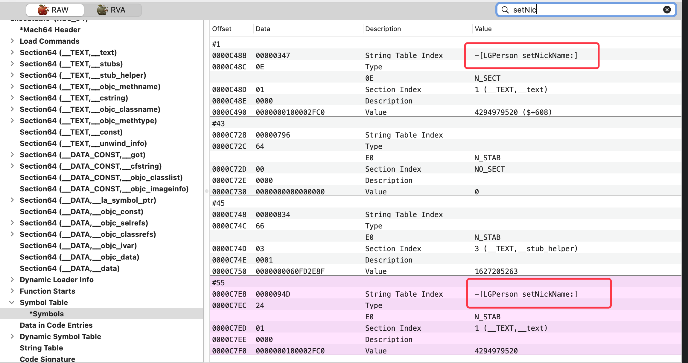

## 补充与零散知识点

### 1、objc 源码中 `struct` 中的 `friend` 是表示什么意义

```C++
struct class_data_bits_t {
    friend objc_class;
 //... 
}
```

C++ 友元类

一个类 A 可以将另一个类 B 声明为自己的友元，类 B 的所有成员函数就都可以访问类 A 对象的私有成员

此处可理解为 `objc_class` 中的所有成员和函数都能访问 `class_data_bits_t` 的私有成员


### 2、为什么对象 ISA 和类地址不一样，类 ISA 与元类地址一样

#### 现象

```objc
//main函数代码
LGPerson *p = [[LGPerson alloc] init];
```

其后断点打印

```shell
(lldb) x/4gx p
0x10128c5b0: 0x011d800100008885 0x0000000000000000
0x10128c5c0: 0x0000000000000000 0x00000001000040b0
(lldb) p/x LGPerson.class
(Class) $1 = 0x0000000100008880 LGPerson
(lldb) p/x 0x011d800100008885 & 0x00007ffffffffff8
(long) $2 = 0x0000000100008880
(lldb) p (Class)$2
(Class) $3 = LGPerson
(lldb) p class_isMetaClass($3)
(BOOL) $8 = NO        # 验证此处 LGPerson 非元类
```

此处可知 对象 p 的 ISA 为 `0x011d800100008885` 与 类地址 `0x0000000100008880` 有稍微不同，可以通过 ISA `&` 上掩码 `0x00007ffffffffff8` 得到类地址

```shell
(lldb) x/4gx LGPerson.class
0x100008880: 0x00000001000088a8 0x000000010036a140
0x100008890: 0x000000010128c600 0x0002805c00000003
(lldb) p/x 0x00000001000088a8 & 0x00007ffffffffff8
(long) $5 = 0x00000001000088a8
(lldb) p (Class)$5
(Class) $6 = 0x00000001000088a8
(lldb) p class_isMetaClass($6)
(BOOL) $7 = YES
```

此处查看可得类的 ISA 与元类地址都是 `0x00000001000088a8` 

#### 解释

- 对象 ISA 中不仅存储了类的信息，还存储了引用计数、散列表以及多个标志位，详情可查看 `ISA_BITFIELD` 的结构，一般是  `nonpointer isa ` 开启了指针优化 (详情查看 《3-4、Isa探索》)，因此不与类地址完全相同，通过掩码获取的指定位数的值即是类地址
- 类的 ISA 中没有对象 ISA 中所需的那些值，纯 ISA 指针，存储元类的地址，因此与元类地址一致


### 3、架构

- 真机架构：arm64
- 模拟器：    i386
- mac:           x86_64

`objc` 源码中的 `__LP64__`  指的是 Unix 和 Unix 类的系统(Linux, Mac OS X)


### 4、clang 生成的 .cpp 文件中 方法编码输出2次

#### 问题现象

 使用 `clang` 转换 `OC` 包含类声明代码时，其属性的 `set/get` 方法编码输出了两次，那这个是为什么，又能不能修正呢？

示例：

```C++
static struct /*_method_list_t*/ {
	unsigned int entsize;  // sizeof(struct _objc_method)
	unsigned int method_count;
	struct _objc_method method_list[32];
} _OBJC_$_INSTANCE_METHODS_LGPerson __attribute__ ((used, section ("__DATA,__objc_const"))) = {
	sizeof(_objc_method),
	32,
	{{(struct objc_selector *)"nickName", "@16@0:8", (void *)_I_LGPerson_nickName},
	{(struct objc_selector *)"setNickName:", "v24@0:8@16", (void *)_I_LGPerson_setNickName_},
   //...省略其他方法
   
// ---------  第二次输出 ----------
	{(struct objc_selector *)"nickName", "@16@0:8", (void *)_I_LGPerson_nickName},
	{(struct objc_selector *)"setNickName:", "v24@0:8@16", (void *)_I_LGPerson_setNickName_},
   //...省略其他方法
};

```

##### MachOView 查看符号表



使用 MachOView 查看可执行文件发现依然存在两个

#### 解释

当前存在本地符号和调试符号两种符号，造成 MachOView中查看到两个

修改 Xcode 配置中 

- `Target -- Build Settings -- Deployment Postprocessing` 配置项修改为 `YES` 
- `Target -- Build Settings -- Strip Style` 配置选择 `Debugging Symbols` 

此时 clean 一下(不 clean 容易查看到上次相同数据)再重新编译，再次使用 MachOView 查看可执行文件，此时就脱掉了调试符号，只剩下本地符号


不过 Xcode 设置无法对 .cpp中的 C++ 的代码起作用，如果想实现 cpp中进行脱符号，需要使用 clang 进行脱符号

#### Undo clang 脱符号

>  此脱符号相关问题在 强化班中应该都讲解过，在强化班总结后尝试补充 clang 脱符号语句

