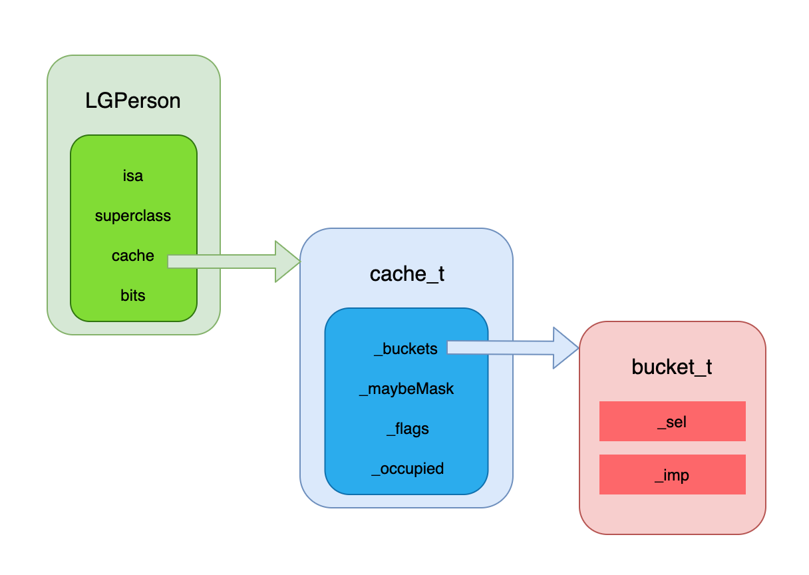

## cache_t 的底层分析

### 引文

在第4篇文章的分析中，我们对类中的 `bits` 成员变量进行了探索

```C++
struct objc_class : objc_object {
    //... 省略
  
    // Class ISA;
    Class superclass;
    cache_t cache;             // formerly cache pointer and vtable
    class_data_bits_t bits;    // class_rw_t * plus custom rr/alloc flags
  
//... 省略方法
}
```

当时计算偏移量时，暂时只计算了 `cache_t`  的大小，最终设置了 0x20 的偏移量。

此次我们就对 `cache_t` 进行下探索，从单词意义上是 `cache` 是缓存，那么这个缓存是怎么实现的呢？

此次探索的首要目的是搞清楚 `cahce` 是什么数据结构，最终能够画出 `cache_t` 的原理分析图

### 获取 cache

在分析 `bits` 时，通过对类地址偏移 `0x20` 获取到，此时获取 `cache` 则偏移 `0x10` 即可，输出查看下

```shell
(lldb) x/4gx LGPerson.class
0x100008880: 0x00000001000088a8 0x000000010036a140
0x100008890: 0x0000000100644c00 0x0002805c00000003
(lldb) p/x 0x100008890  # 0x100008880 + 0x10
(long) $1 = 0x0000000100008890
(lldb) p (cache_t *)$1   #类型强转
(cache_t *) $2 = 0x0000000100008890
(lldb) p *$2
(cache_t) $3 = {
  _bucketsAndMaybeMask = {
    std::__1::atomic<unsigned long> = {
      Value = 4301540352
    }
  }
   = {
     = {
      _maybeMask = {
        std::__1::atomic<unsigned int> = {
          Value = 3
        }
      }
      _flags = 32860
      _occupied = 2
    }
    _originalPreoptCache = {
      std::__1::atomic<preopt_cache_t *> = {
        Value = 0x0002805c00000003
      }
    }
  }
}
(lldb) 
```

查看源码对照下数据

```C++
struct cache_t {
private:
    explicit_atomic<uintptr_t> _bucketsAndMaybeMask;
    union {
        struct {
            explicit_atomic<mask_t>    _maybeMask;
#if __LP64__
            uint16_t                   _flags;
#endif
            uint16_t                   _occupied;
        };
        explicit_atomic<preopt_cache_t *> _originalPreoptCache;
    };
 //... 省略方法 
}
```

对照可验证 成员名称都对应上了

#### 提出疑问

当前的数据结构展示出来了，问题也来了

1、`cache_t` 作为缓存的数据结构，他缓存的什么数据？是缓存属性、缓存方法亦或缓存其他的东西，这就需要我们在探索中不断验证

2、再看当前的数据结构，那么在这些成员中，哪个是用于存储缓存数据的呢？根据成员名称辨别不出来，也没有注释指出，那么怎么办呢？

**分析：**

这时就要去查看源码中的功能方法来确认了，作为 `cache` 缓存在实现时一定对缓存结构进行了增删改查操作，那么我们就利用这一点寻找增删改查相关的方法，查看这些方法对哪个结构进行了操作，那么就可以验证哪个结构进行存储缓存数据了，同时还能查看下增删改查的什么数据，看看缓存的是什么数据

### 缓存容器结构

之后就在下面的方法中查找增删改查相关方法

```C++
void insert(SEL sel, IMP imp, id receiver);

//-----  insert -----

void cache_t::insert(SEL sel, IMP imp, id receiver)
{
    // ... 省略
  
    bucket_t *b = buckets();
    mask_t m = capacity - 1;
    mask_t begin = cache_hash(sel, m);
    mask_t i = begin;

    // Scan for the first unused slot and insert there.
    // There is guaranteed to be an empty slot.
    do {
        if (fastpath(b[i].sel() == 0)) {
            incrementOccupied();
            b[i].set<Atomic, Encoded>(b, sel, imp, cls());
            return;
        }
        if (b[i].sel() == sel) {
            // The entry was added to the cache by some other thread
            // before we grabbed the cacheUpdateLock.
            return;
        }
    } while (fastpath((i = cache_next(i, m)) != begin));

    bad_cache(receiver, (SEL)sel);
#endif // !DEBUG_TASK_THREADS
}

```

在 `insert` 方法中，注意到对 `bucket_t` 数据的操作，根据注释 `Scan for the first unused slot and insert there.`  以及其后的 `b[i].set<Atomic, Encoded>(b, sel, imp, cls());` ，可得出当前对 `bucket_t` 结构数据进行操作，那么当前缓存数据的数据结构应该是 `bucket_t` 了，同时缓存的数据大概率是插入的参数 `sel/imp` 

#### bucket_t 源码

那就去查看下 `bucket_t` 结构实现

```C++
struct bucket_t {
private:
    // IMP-first is better for arm64e ptrauth and no worse for arm64.
    // SEL-first is better for armv7* and i386 and x86_64.
#if __arm64__
    explicit_atomic<uintptr_t> _imp;
    explicit_atomic<SEL> _sel;
#else
    explicit_atomic<SEL> _sel;
    explicit_atomic<uintptr_t> _imp;
#endif

    // Compute the ptrauth signing modifier from &_imp, newSel, and cls.
    uintptr_t modifierForSEL(bucket_t *base, SEL newSel, Class cls) const {
        return (uintptr_t)base ^ (uintptr_t)newSel ^ (uintptr_t)cls;
    }

    // Sign newImp, with &_imp, newSel, and cls as modifiers.
    uintptr_t encodeImp(UNUSED_WITHOUT_PTRAUTH bucket_t *base, IMP newImp, UNUSED_WITHOUT_PTRAUTH SEL newSel, Class cls) const {
        if (!newImp) return 0;
#if CACHE_IMP_ENCODING == CACHE_IMP_ENCODING_PTRAUTH
        return (uintptr_t)
            ptrauth_auth_and_resign(newImp,
                                    ptrauth_key_function_pointer, 0,
                                    ptrauth_key_process_dependent_code,
                                    modifierForSEL(base, newSel, cls));
#elif CACHE_IMP_ENCODING == CACHE_IMP_ENCODING_ISA_XOR
        return (uintptr_t)newImp ^ (uintptr_t)cls;
#elif CACHE_IMP_ENCODING == CACHE_IMP_ENCODING_NONE
        return (uintptr_t)newImp;
#else
#error Unknown method cache IMP encoding.
#endif
    }

public:
    static inline size_t offsetOfSel() { return offsetof(bucket_t, _sel); }
    inline SEL sel() const { return _sel.load(memory_order_relaxed); }

#if CACHE_IMP_ENCODING == CACHE_IMP_ENCODING_ISA_XOR
#define MAYBE_UNUSED_ISA
#else
#define MAYBE_UNUSED_ISA __attribute__((unused))
#endif
    inline IMP rawImp(MAYBE_UNUSED_ISA objc_class *cls) const {
        uintptr_t imp = _imp.load(memory_order_relaxed);
        if (!imp) return nil;
#if CACHE_IMP_ENCODING == CACHE_IMP_ENCODING_PTRAUTH
#elif CACHE_IMP_ENCODING == CACHE_IMP_ENCODING_ISA_XOR
        imp ^= (uintptr_t)cls;
#elif CACHE_IMP_ENCODING == CACHE_IMP_ENCODING_NONE
#else
#error Unknown method cache IMP encoding.
#endif
        return (IMP)imp;
    }

    inline IMP imp(UNUSED_WITHOUT_PTRAUTH bucket_t *base, Class cls) const {
        uintptr_t imp = _imp.load(memory_order_relaxed);
        if (!imp) return nil;
#if CACHE_IMP_ENCODING == CACHE_IMP_ENCODING_PTRAUTH
        SEL sel = _sel.load(memory_order_relaxed);
        return (IMP)
            ptrauth_auth_and_resign((const void *)imp,
                                    ptrauth_key_process_dependent_code,
                                    modifierForSEL(base, sel, cls),
                                    ptrauth_key_function_pointer, 0);
#elif CACHE_IMP_ENCODING == CACHE_IMP_ENCODING_ISA_XOR
        return (IMP)(imp ^ (uintptr_t)cls);
#elif CACHE_IMP_ENCODING == CACHE_IMP_ENCODING_NONE
        return (IMP)imp;
#else
#error Unknown method cache IMP encoding.
#endif
    }

    template <Atomicity, IMPEncoding>
    void set(bucket_t *base, SEL newSel, IMP newImp, Class cls);
};
```

在 `bucket_t` 的结构体内部发现了 `_sel` 和 `_imp` 成员变量，同时根据此源码可得在一个 `bucket_t` 结构体中存储一组 `sel` 和 `imp`

现在可以确定缓存存储的确实是方法 `sel` 和 `imp` 了

#### 疑问总结和拓展

根据上述分析，提出的问题1已经进行了解答，存储的是方法 `SEL` 和 `IMP` 

既然缓存的是方法，那么肯定不能只能缓存一个，那么回到 `cache_t` ，此时对问题2 又进行了扩展

- `cache_t` 中的那个成员变量用于标识或存储 `buchet_t` 呢？
- 这个结构是怎样存储多个 `bucket_t` 和使用其中的数据的呢？

带着问题我们接下来进行探索

#### bucket_t 来源

首先就要找出是哪个成员变量存储了 `bucket_t` 相关的数据

怎么找呢？ 又回到源码的使用上去，在 `insert` 方法中肯定要获取到 `bucket_t` 数据，只要查看源码怎么获取的不就清楚了，那么来看下

```C++
void cache_t::insert(SEL sel, IMP imp, id receiver)
{
    // ... 省略
  
    bucket_t *b = buckets();
  
  // ... 省略
}
```

在 `insert` 方法中，使用 `buckets()` 获取到了 `bucket_t * ` ，那么来查看先 `buckets()` 的方法实现，点进去

```C++
struct bucket_t *cache_t::buckets() const
{
    uintptr_t addr = _bucketsAndMaybeMask.load(memory_order_relaxed); // [拓展2]
    return (bucket_t *)(addr & bucketsMask);
}
```

发现了对应的成员变量 `_bucketsAndMaybeMask` ，

此段代码操作读取 `_bucketsAndMaybeMask`  此成员变量的值赋值给 `uintptr_t addr` ，使用 `addr & bucketsMask` 并最终进行强转成 `bucket_t *` 

查看 `bucketsMask` 

```C++
// struct cache_t 中
#if CACHE_MASK_STORAGE == CACHE_MASK_STORAGE_OUTLINED // [拓展3]
    // _bucketsAndMaybeMask is a buckets_t pointer
    // _maybeMask is the buckets mask

    static constexpr uintptr_t bucketsMask = ~0ul;
```

当前环境 `CACHE_MASK_STORAGE` 策略为 `CACHE_MASK_STORAGE_OUTLINED` ，`bucketsMask` 就按如上取值： 非0，全F，当前环境 ul 8字节，十六进制下16个F

这里查看到注释 

```C++
    // _bucketsAndMaybeMask is a buckets_t pointer
    // _maybeMask is the buckets mask
```

表明 `_bucketsAndMaybeMask` 是 `buckets_t` 指针，此处使用的是 `buckets_t` ，那么应该是个类似指针集合或数组的，那么这个指针就是首地址了

这个理论是否正确稍后进行 `lldb` 输出验证

那么此时 `bucket_t` 的来源就有些明了了，是从 `_bucketsAndMaybeMask` 中加载了指针地址，那么这个指针地址指向的数据结构到底是怎么样的呢，接下来就探索 `bucket_t ` 的存储方式

#### bucket_t 存储方式

再次查看 `insert` 方法中对 `bucket_t` 的处理

```C++
void cache_t::insert(SEL sel, IMP imp, id receiver)
{
    // ... 省略
  
    bucket_t *b = buckets();
    mask_t m = capacity - 1;
    mask_t begin = cache_hash(sel, m);
    mask_t i = begin;

    // Scan for the first unused slot and insert there.
    // There is guaranteed to be an empty slot.
    do {
        if (fastpath(b[i].sel() == 0)) {
            incrementOccupied();
            b[i].set<Atomic, Encoded>(b, sel, imp, cls());
            return;
        }
        if (b[i].sel() == sel) {
            // The entry was added to the cache by some other thread
            // before we grabbed the cacheUpdateLock.
            return;
        }
    } while (fastpath((i = cache_next(i, m)) != begin));

    bad_cache(receiver, (SEL)sel);
#endif // !DEBUG_TASK_THREADS
}
```

此处声明了一个 `bucket_t *` 指针，在其后的 `do while` 循环中，使用到了 `b[i] ` 方式，这个就类似数组，使用首地址进行偏移获取后面的元素

那么当前是以数组方式存储么，再仔细查看索引的取值方式 `mask_t begin = cache_hash(sel, m);` 在获取开始索引时使用了 `cache_hash()` 函数，查看一下实现

```C++
// Class points to cache. SEL is key. Cache buckets store SEL+IMP.
// Caches are never built in the dyld shared cache.

static inline mask_t cache_hash(SEL sel, mask_t mask) 
{
    uintptr_t value = (uintptr_t)sel;
#if CONFIG_USE_PREOPT_CACHES
    value ^= value >> 7;
#endif
    return (mask_t)(value & mask);
}
```

进行了相关位运算，那么这个方法应该是一个 `hash` 算法，当前应当是以哈希表(Hashtable，又称 "散列")形式存储的，而 `bucket` 可以称为包含集合(哈希表)中元素的哈希桶，其存储相应的值数据，可以让集合(哈希表)中的搜寻和获取工作更容易、更快速 [参考1]

#### 总结

通过上面的两次探索，我们了解了 `bucket_t` 的来源和存储方式，那么汇总结论：

- `bucket_t` 是以散列表方式进行存储
-  `_bucketsAndMaybeMask`  作为一个指针数据，存储了指向散列表的指针，由于可以使用内存偏移方式获取其相关数据，那么类比数组，此指针也是 `bucket_t` 散列表的首地址


进行到这里，`cache_t` 的结构我们大致有了了解，那么绘图描绘一下当前的结构来更直观的展示下

### cache_t 结构粗略图




接下来我们就在 `lldb` 中实际验证下这些结构，目标是输出缓存的方法 `SEL` 与 `IMP`

### LLDB 输出验证

#### OC代码

```objc
// LGPerson.h
@interface LGPerson : NSObject

@property (nonatomic, copy) NSString *name;
@property (nonatomic) int age;
@property (nonatomic, strong) NSString *hobby;

- (void)saySomething;

@end

// LGPerson.m
@implementation LGPerson

- (instancetype)init{
    if (self = [super init]) {
        self.name = @"lgd";
    }
    return self;
}

- (void)saySomething{
    NSLog(@"%s",__func__);
}

@end
  
// main 函数
LGPerson *p  = [LGPerson alloc];
```

####  输出流程

首先获取 `cache_t`

```shell
(lldb) x/4gx LGPerson.class
0x100008428: 0x0000000100008450 0x000000010036a140
0x100008438: 0x0000000100362370 0x0000802800000000
(lldb) p/x 0x100008438
(long) $1 = 0x0000000100008438
(lldb) p (cache_t *)$1
(cache_t *) $2 = 0x0000000100008438
(lldb) p *$2
(cache_t) $3 = {
  _bucketsAndMaybeMask = {
    std::__1::atomic<unsigned long> = {
      Value = 4298515312
    }
  }
   = {
     = {
      _maybeMask = {
        std::__1::atomic<unsigned int> = {
          Value = 0
        }
      }
      _flags = 32808
      _occupied = 0
    }
    _originalPreoptCache = {
      std::__1::atomic<preopt_cache_t *> = {
        Value = 0x0000802800000000
      }
    }
  }
}
```

接下来要输出 `bucket` 相关的数据，查看 `cache_t` 源码的方法

```C++
// struct cache_t
public:
    // The following four fields are public for objcdt's use only.
    // objcdt reaches into fields while the process is suspended
    // hence doesn't care for locks and pesky little details like this
    // and can safely use these.
    unsigned capacity() const;
    struct bucket_t *buckets() const;
    Class cls() const;
```

发现有 `buckets()` 可以使用，试下

```shell
(lldb) p $3.buckets()
(bucket_t *) $4 = 0x0000000100362370
(lldb) p *$4
(bucket_t) $5 = {
  _sel = {
    std::__1::atomic<objc_selector *> = (null) {
      Value = (null)
    }
  }
  _imp = {
    std::__1::atomic<unsigned long> = {
      Value = 0
    }
  }
}
```

`buckets()` 方法取值没有问题，不过这个当前的 `sel` 和 `imp` 的值都没有值，怎么回事？？

##### 空值分析1

**分析一下：** 当前是缓存方法，额，缓存的方法，额，方法没调用应该不会缓存来着，那就来调用下方法

```shell
(lldb) p [p saySomething]
-[LGPerson saySomething] #打印出方法中的log
```

log 输出了，说明方法已经调用了，再次查看 `bucket_t` 数据

```shell
(lldb) x/4gx LGPerson.class
0x100008428: 0x0000000100008450 0x000000010036a140
0x100008438: 0x0000000101022110 0x0001802800000007
(lldb) p/x 0x100008438
(long) $9 = 0x0000000100008438
(lldb) p (cache_t *)$9
(cache_t *) $10 = 0x0000000100008438
(lldb) p *$10
(cache_t) $11 = {
  _bucketsAndMaybeMask = {
    std::__1::atomic<unsigned long> = {
      Value = 4311884048
    }
  }
   = {
     = {
      _maybeMask = {
        std::__1::atomic<unsigned int> = {
          Value = 7
        }
      }
      _flags = 32808
      _occupied = 1
    }
    _originalPreoptCache = {
      std::__1::atomic<preopt_cache_t *> = {
        Value = 0x0001802800000007
      }
    }
  }
}
```

可以发现这里的 `cache_t` 数据已经有变化了，对比 `$11` 与 `$3` ，可以明显发现

- 当前 `_maybeMask` 中的 `Value` 值为 7(区别与原数据 0)
- 当前 `_occupide` 的值为 1(区别与原数据 0)

> 至于这两个参数的意义稍后查看，当前输出验证为主

继续查看 `bucket` 

```shell
(lldb) p $11.buckets()
(bucket_t *) $12 = 0x0000000101022110
(lldb) p *$12
(bucket_t) $13 = {
  _sel = {
    std::__1::atomic<objc_selector *> = (null) {
      Value = (null)
    }
  }
  _imp = {
    std::__1::atomic<unsigned long> = {
      Value = 0
    }
  }
}
```

??? 还是空的，怎么回事

##### 空值分析2

**再分析一下：** 根据 `cache_t` 中的数据变化确定应该是存在数据的，为什么这里取不到呢？ 这里直接取的指针地址指向的数据，

- 根据我们在上面分析的 `bucket_t` 的存储结构，是可以使用首地址以及首地址偏移形式获取数据的
- 再考虑 `cache_t` 是以哈希表的形式存储的 `bucket_t` ，考虑哈希表的特性[参考1]，那么问题明确了，由于哈希表的存储方式与数组的顺序存储方式不同，其是根据哈希函数计算出的索引值进行存储的，那么就表明当前数据不在索引值 0 位置，在其他索引值的位置

那么在其他索引位置的值怎么获取呢？

根据数据结构的分析，在这里提供了两种获取方式

- 方式1 指针地址偏移，使用首地址偏移方式直接在指针后加1，获取对应的指针后取值
- 方式2 仿照 `insert` 函数内的实现，例如 `b[i].sel()` ，直接通过 `bucket_t *` 指针使用中括号取值(与数组的索引值取值方式一样 [拓展1])， 同时这里的 `sel()` 方法也提供了，能输出 `SEL` 

那么来验证下分析的结果

```shell
# 先使用方法1
(lldb) p *($12+1)
(bucket_t) $14 = {
  _sel = {
    std::__1::atomic<objc_selector *> = (null) {
      Value = (null)
    }
  }
  _imp = {
    std::__1::atomic<unsigned long> = {
      Value = 0
    }
  }
}
(lldb) p *($12+2)
(bucket_t) $15 = {
  _sel = {
    std::__1::atomic<objc_selector *> = (null) {
      Value = (null)
    }
  }
  _imp = {
    std::__1::atomic<unsigned long> = {
      Value = 0
    }
  }
}
(lldb) p *($12+3)
(bucket_t) $16 = {
  _sel = {
    std::__1::atomic<objc_selector *> = "" {
      Value = ""
    }
  }
  _imp = {
    std::__1::atomic<unsigned long> = {
      Value = 47160
    }
  }
}
```

此处 `$16` 的 Value 值不为空，那就查看下是什么方法

用什么方法查看呢，`insert` 方法中存在 `sel()` 函数，我们查看下源码

```C++
// struct bucket_t

public:
//... 省略方法
    inline SEL sel() const { return _sel.load(memory_order_relaxed); }
     
//... 省略方法
    inline IMP imp(UNUSED_WITHOUT_PTRAUTH bucket_t *base, Class cls) const {
        uintptr_t imp = _imp.load(memory_order_relaxed);
        if (!imp) return nil;
#if CACHE_IMP_ENCODING == CACHE_IMP_ENCODING_PTRAUTH
        SEL sel = _sel.load(memory_order_relaxed);
        return (IMP)
            ptrauth_auth_and_resign((const void *)imp,
                                    ptrauth_key_process_dependent_code,
                                    modifierForSEL(base, sel, cls),
                                    ptrauth_key_function_pointer, 0);
#elif CACHE_IMP_ENCODING == CACHE_IMP_ENCODING_ISA_XOR
        return (IMP)(imp ^ (uintptr_t)cls);
#elif CACHE_IMP_ENCODING == CACHE_IMP_ENCODING_NONE
        return (IMP)imp;
#else
#error Unknown method cache IMP encoding.
#endif
    }
```

在 `bucket_t` 结构体的方法中找到了 `sel()` 方法和 `imp()` 方法

```shell
(lldb) p $16.sel()
(SEL) $17 = "saySomething"

# UNUSED_WITHOUT_PTRAUTH bucket_t *base 参数不清楚传什么，使用 nil 
(lldb) p $16.imp(nil, LGPerson.class) 
(IMP) $18 = 0x0000000100003c10 (KCObjcBuild`-[LGPerson saySomething])
```

根据输出确认了确实是 `saySomething` 对象方法的缓存数据

##### 延伸1 使用方式2取值

再使用方式2取值试下，当前 `saySomething` 方法的索引值为3

```shell
# (lldb) p $11.buckets()
# (bucket_t *) $12 = 0x0000000101022110

(lldb) p $12[1]
(bucket_t) $19 = {
  _sel = {
    std::__1::atomic<objc_selector *> = (null) {
      Value = (null)
    }
  }
  _imp = {
    std::__1::atomic<unsigned long> = {
      Value = 0
    }
  }
}

(lldb) p $12[3]
(bucket_t) $20 = {
  _sel = {
    std::__1::atomic<objc_selector *> = "" {
      Value = ""
    }
  }
  _imp = {
    std::__1::atomic<unsigned long> = {
      Value = 47160  #与 $16 的值相同
    }
  }
}

(lldb) p $20.sel()
(SEL) $21 = "saySomething"
(lldb) p $20.imp(nil, LGPerson.class)
(IMP) $22 = 0x0000000100003c10 (KCObjcBuild`-[LGPerson saySomething])
```

输出结果一致，此方式也是没有问题的

#### buckets 相关验证

验证 `_bucketsAndMaybeMask` 是指向存储 `bucket_t` 数据散列表的首地址的指针数据

```shell
(lldb) x/4gx LGPerson.class
0x100008428: 0x0000000100008450 0x000000010036a140
0x100008438: 0x000000010070fd00 0x0001802800000007
(lldb) p/x 0x100008438
(long) $1 = 0x0000000100008438
(lldb) p (cache_t *)$1
(cache_t *) $2 = 0x0000000100008438
(lldb) p *$2
(cache_t) $3 = {
  _bucketsAndMaybeMask = {
    std::__1::atomic<unsigned long> = {
      Value = 4302372096
    }
  }
   = {
     = {
      _maybeMask = {
        std::__1::atomic<unsigned int> = {
          Value = 7
        }
      }
      _flags = 32808
      _occupied = 1
    }
    _originalPreoptCache = {
      std::__1::atomic<preopt_cache_t *> = {
        Value = 0x0001802800000007
      }
    }
  }
}

(lldb) p/x 4302372096
(long) $4 = 0x000000010070fd00
(lldb) p $3.buckets()
(bucket_t *) $5 = 0x000000010070fd00
```

对比 `$4` 和 `$5` 地址相同，就验证了 `_bucketsAndMaybeMask` 是指向存储 `bucket_t` 数据散列表的首地址的指针数据


## 参考

### 参考1

[Linux内核中的hash与bucket][http://www.nowamagic.net/academy/detail/3008086]


## 拓展

### 拓展1  b[i]形式取值

使用 `b[i]` 形式取值例如：`$12[1]` ， 是否意味着 `b` 是一个数组呢？

解析： 不正确， 这种形式的取值本质上是内存平移一个单位。 数组使用此方式获取值其实也是使用内存平移来获取的

在此 bucke_t 相关数据中 `$12[1]` 获取的 `bucket_t` 即是 `$​12 + 1` 偏移后指针指向的值

### 拓展2 .load(memory_order_relaxed)

在 `buckets()` 方法中看到这个方法使用，很多位置都用到了 `load` 这个方法稍微介绍下

```C++
struct bucket_t *cache_t::buckets() const
{
    uintptr_t addr = _bucketsAndMaybeMask.load(memory_order_relaxed);
    return (bucket_t *)(addr & bucketsMask);
}
```

使用 C++ 相关的解释

模板类 `std::atomic` 中封装的操作方法

```C++
T load (memory_order sync = memory_order_seq_cst) const volatile noexcept;
T load (memory_order sync = memory_order_seq_cst) const noexcept;
```

读取被封装的值，参数 `sync` 设置内存序(Memory Order)

针对上面示例方法解释

```C++
// 读取 _bucketsAndMaybeMask 对象的值
_bucketsAndMaybeMask.load(memory_order_relaxed);
```

参考链接：

[C++11 并发指南六(  类型详解二 std::atomic )](https://www.cnblogs.com/haippy/p/3301408.html)

### 拓展3 不同架构下的  CACHE_MASK_STORAGE

首先查看源码

```C++
#define CACHE_MASK_STORAGE_OUTLINED 1
#define CACHE_MASK_STORAGE_HIGH_16 2
#define CACHE_MASK_STORAGE_LOW_4 3
#define CACHE_MASK_STORAGE_HIGH_16_BIG_ADDRS 4

#if defined(__arm64__) && __LP64__
#if TARGET_OS_OSX || TARGET_OS_SIMULATOR
#define CACHE_MASK_STORAGE CACHE_MASK_STORAGE_HIGH_16_BIG_ADDRS
#else
#define CACHE_MASK_STORAGE CACHE_MASK_STORAGE_HIGH_16
#endif
#elif defined(__arm64__) && !__LP64__
#define CACHE_MASK_STORAGE CACHE_MASK_STORAGE_LOW_4
#else
#define CACHE_MASK_STORAGE CACHE_MASK_STORAGE_OUTLINED
#endif

```

不同架构下策略定义不同

#### ` __arm64__  && __LP64__`

>  LP64 指的是 LP64数据模型，Unix 和 Unix 类的系统(Linux / MacOS 系统) 均使用此数据模型
>
> 32位环境涉及"ILP32"数据模型，是因为C数据类型为32位的int、long、指针。而64位环境使用不同的数据模型，此时的long和指针已为64位，故称作"LP64"数据模型。
>
> 参考：[数据模型(LP32 ILP32 LP64 LLP64 ILP64)][https://www.cnblogs.com/lsgxeva/p/7614856.html]

##### TARGET_OS_OSX || TARGET_OS_SIMULATOR

在 `arm64 && LP64` 下的OSX 系统下或者 模拟器情况下使用 `CACHE_MASK_STORAGE_HIGH_16_BIG_ADDRS`

> undo:  使用M1版 Mac 验证是否是大端，此处是指大端么？

> 我这里根据源码解读的是 `BIG_ADDRS` 表示地址较大时，对比 `CACHE_MASK_STORAGE_HIGH_16_BIG_ADDRS` 与 `CACHE_MASK_STORAGE_HIGH_16` 发现后者存在必须为0的 `maskZeroBits` 占据高位， 那么 `bucketsMask` 的值要比前者小很多
>
> 有可能是 OSX 和 模拟器处理的数据比较大

此类型下 `cache_t` 中的相关静态变量赋值

```C++
#elif CACHE_MASK_STORAGE == CACHE_MASK_STORAGE_HIGH_16_BIG_ADDRS
    static constexpr uintptr_t maskShift = 48;
    static constexpr uintptr_t maxMask = ((uintptr_t)1 << (64 - maskShift)) - 1;
    static constexpr uintptr_t bucketsMask = ((uintptr_t)1 << maskShift) - 1;
    
    static_assert(bucketsMask >= MACH_VM_MAX_ADDRESS, "Bucket field doesn't have enough bits for arbitrary pointers.");
```

根据源码可知 `bucketsMask` 使用 低48的位置， 留给 `cache_mask` 的位置就是 高16位

##### else

上述条件的 `else` 条件下，策略为 `CACHE_MASK_STORAGE_HIGH_16`

```C++
#elif CACHE_MASK_STORAGE == CACHE_MASK_STORAGE_HIGH_16
    // _bucketsAndMaybeMask is a buckets_t pointer in the low 48 bits
    // _maybeMask is unused, the mask is stored in the top 16 bits.

    // How much the mask is shifted by.
    static constexpr uintptr_t maskShift = 48;

    // Additional bits after the mask which must be zero. msgSend
    // takes advantage of these additional bits to construct the value
    // `mask << 4` from `_maskAndBuckets` in a single instruction(操作).
    static constexpr uintptr_t maskZeroBits = 4;

    // The largest mask value we can store.
    static constexpr uintptr_t maxMask = ((uintptr_t)1 << (64 - maskShift)) - 1;
    
    // The mask applied to `_maskAndBuckets` to retrieve the buckets pointer.
    static constexpr uintptr_t bucketsMask = ((uintptr_t)1 << (maskShift - maskZeroBits)) - 1;
    
    // Ensure we have enough bits for the buckets pointer.
    static_assert(bucketsMask >= MACH_VM_MAX_ADDRESS,
            "Bucket field doesn't have enough bits for arbitrary pointers.");

#if CONFIG_USE_PREOPT_CACHES
    static constexpr uintptr_t preoptBucketsMarker = 1ul;
#if __has_feature(ptrauth_calls)
    // 63..60: hash_mask_shift
    // 59..55: hash_shift
    // 54.. 1: buckets ptr + auth
    //      0: always 1
    static constexpr uintptr_t preoptBucketsMask = 0x007ffffffffffffe;
    static inline uintptr_t preoptBucketsHashParams(const preopt_cache_t *cache) {
        uintptr_t value = (uintptr_t)cache->shift << 55;
        // masks have 11 bits but can be 0, so we compute
        // the right shift for 0x7fff rather than 0xffff
        return value | ((objc::mask16ShiftBits(cache->mask) - 1) << 60);
    }
#else
    // 63..53: hash_mask
    // 52..48: hash_shift
    // 47.. 1: buckets ptr
    //      0: always 1
    static constexpr uintptr_t preoptBucketsMask = 0x0000fffffffffffe;
    static inline uintptr_t preoptBucketsHashParams(const preopt_cache_t *cache) {
        return (uintptr_t)cache->hash_params << 48;
    }
#endif
#endif // CONFIG_USE_PREOPT_CACHES
```

此时  `cache_mask` 的位置依然是 高16位，但是其后的 4位必须是0，看注释是 `msgSend` 进行了 `mask << 4` 使用

```C++
// msgSend takes advantage of these additional bits to construct the value `mask << 4` from `_maskAndBuckets` in a single instruction(操作).
```

至于后面的 `CONFIG_USE_PREOPT_CACHES` ，遇到了再分析

##### `__arm64__ && !__LP64__`

arm64架构下同时非 LP64数据模型下使用 `CACHE_MASK_STORAGE_LOW_4`

```C++
#elif CACHE_MASK_STORAGE == CACHE_MASK_STORAGE_LOW_4
    // _bucketsAndMaybeMask is a buckets_t pointer in the top 28 bits
    // _maybeMask is unused, the mask length is stored in the low 4 bits

    static constexpr uintptr_t maskBits = 4;
    static constexpr uintptr_t maskMask = (1 << maskBits) - 1;
    static constexpr uintptr_t bucketsMask = ~maskMask;
    static_assert(!CONFIG_USE_PREOPT_CACHES, "preoptimized caches not supported");
#else
```

非 LP64数据模型，应该是 32位环境，此时低 4位作为 `cache_mask` ，高 28位用来作为 `bucketsMask` ， 注释也写的比较明白

##### else

最后的大致就是 非 `arm64` 下，当前使用的非M1版Mac就属于此，使用策略 `CACHE_MASK_STORAGE_OUTLINED`

```C++
#if CACHE_MASK_STORAGE == CACHE_MASK_STORAGE_OUTLINED
    // _bucketsAndMaybeMask is a buckets_t pointer
    // _maybeMask is the buckets mask

    static constexpr uintptr_t bucketsMask = ~0ul;
    static_assert(!CONFIG_USE_PREOPT_CACHES, "preoptimized caches not supported");
```

这个在正文中分析过了
