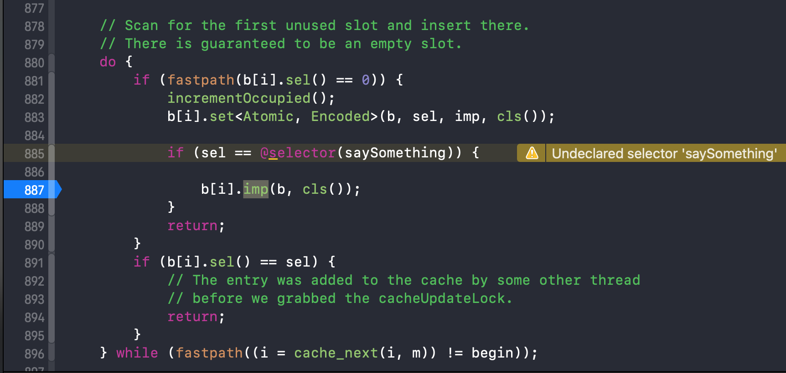
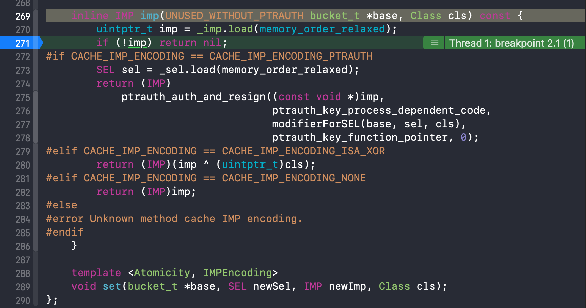

## 重写源码探索方法

### 引文

在探索源码的过程中，经常遇到源码无法运行调试的问题，这个时候面对结构和逻辑复杂的源码，不仅阅读困难，而且也无法确定自身理解的是否正确，这个时候就引出了 -- **重写源码探索方法**

此方法的核心是 **在可运行的工程中，按照源码结构进行重写，重写时简化结构，最终运行进行输出验证**

接下来就举个例子: 以 `cache_t` 的缓存方法输出为目的，进行重写源码探索

### 缓存方法输出源码探索

#### 工程配置

1、新建工程

Xcode --  shift+cmd+N 新建 macOS -- Command Line Tool 工程

2、类创建

新增 `LGDPerson` 类，声明与实现

```objc
// LGDPerson.h
@interface LGDPerson : NSObject

@property (nonatomic, copy) NSString *name;
@property (nonatomic, strong) NSString *nickName;

- (void)say1;
- (void)say2;
- (void)say3;
- (void)say4;
- (void)say5;
- (void)say6;
- (void)say7;

+ (void)sayHappy;

@end
  
// LGDPerson.m
- (void)say1{
    NSLog(@"LGDPerson say : %s",__func__);
}
- (void)say2{
    NSLog(@"LGDPerson say : %s",__func__);
}
- (void)say3{
    NSLog(@"LGDPerson say : %s",__func__);
}
- (void)say4{
    NSLog(@"LGDPerson say : %s",__func__);
}
- (void)say5{
    NSLog(@"LGDPerson say : %s",__func__);
}
- (void)say6{
    NSLog(@"LGDPerson say : %s",__func__);
}
- (void)say7{
    NSLog(@"LGDPerson say : %s",__func__);
}


+ (void)sayHappy{
    NSLog(@"LGDPerson say : %s",__func__);
}
```

main 函数声明

```objc
// main.m
#import <Foundation/Foundation.h>
#import "LGDPerson.h"
#import <objc/runtime.h>

int main(int argc, const char * argv[]) {
    @autoreleasepool {
        // insert code here...
        
        LGDPerson *p = [LGDPerson alloc];
        Class pclass = p.class;
        
        NSLog(@"Hello, World!");
    }
    return 0;
}
```

#### 重写源码结构

我们要获取 `cache_t` 中的数据，由于 `cache_t` 在 `objc_class` 中，所以首先要处理 `objc_class`

##### objc_class

```C++
struct objc_class : objc_object {
  objc_class(const objc_class&) = delete;
  objc_class(objc_class&&) = delete;
  void operator=(const objc_class&) = delete;
  void operator=(objc_class&&) = delete;
    // Class ISA;
    Class superclass;
    cache_t cache;             // formerly cache pointer and vtable
    class_data_bits_t bits;  
  
  //...省略方法
}
```

首先对 `objc_class` 进行重写

- 重命名名称，加上前缀 `lgd_` 与系统的结构进行区分
- 简化去掉所有方法，只保留成员变量
- 移除继承，同时要添加继承结构中的成员变量

> 如果未添加继承父类结构中的成员变量，可能会导致强转时数据映射出错，导致数据异常，在后面输出时验证

简化后代码

```C++
struct lgd_objc_class {
    Class isa;
    Class superclass;
    cache_t cache;             // formerly cache pointer and vtable
    class_data_bits_t bits;
}
```

此时存在两个报错，缺少 `cache_t` 和 `class_data_bits_t` 类型，那么接下来添加一下这两种类型

##### cache_t

```C++
struct cache_t {
    explicit_atomic<uintptr_t> _bucketsAndMaybeMask; 
    union {
        struct {
            explicit_atomic<mask_t>    _maybeMask; 
#if __LP64__
            uint16_t                   _flags; 
#endif
            uint16_t                   _occupied; 
        };
        explicit_atomic<preopt_cache_t *> _originalPreoptCache; 
    };
  
  //...省略方法
}
```

同样操作

- 重命名名称，加上前缀 `lgd_` 与系统的结构进行区分
- 简化去掉所有方法，只保留成员变量

```C++
struct lgd_cache_t {
    explicit_atomic<uintptr_t> _bucketsAndMaybeMask;
    union {
        struct {
            explicit_atomic<mask_t>    _maybeMask;
#if __LP64__
            uint16_t                   _flags;
#endif
            uint16_t                   _occupied;
        };
        explicit_atomic<preopt_cache_t *> _originalPreoptCache; 
    };
}
```

- 此时存在 `explicit_atomic`  报错，这个在以前探索过只是个泛型扩展，那么直接简化移除，只使用内部的类型
- 针对 `union` 联合体，由于其内部成员共用同一块内存，那么只保留一个成员即可，先保留结构体这一部分，有需要再进行变动
- `__LP64__` 宏在当前环境 MacOS下为 `YES` ，那么宏判断也直接简化掉
- `mask_t` 类型在当前工程中未声明，源码查看如下，直接使用 `uint32_t` 替换

```C++
#if __LP64__
typedef uint32_t mask_t;  // x86_64 & arm64 asm are less efficient with 16-bits
#else
typedef uint16_t mask_t;
#endif
```

简化后

```C++
struct lgd_cache_t {
    uintptr_t _bucketsAndMaybeMask;
    struct {
        uint32_t                   _maybeMask;
        uint16_t                   _flags;
        uint16_t                   _occupied;
    };
};
```

- 此处对于结构体嵌套没有必要，那就直接移除嵌套，放在外部

简化最终结果

```C++
struct lgd_cache_t {
    uintptr_t                  _bucketsAndMaybeMask;
    uint32_t                   _maybeMask;
    uint16_t                   _flags;
    uint16_t                   _occupied;
};
```

此时的 `objc_class` 则修改为

```C++
struct lgd_objc_class {
    Class isa;
    Class superclass;
    struct lgd_cache_t cache;  // 此处报错 Must use 'struct' tag to refer to type 'lgd_cache_t'  因此添加 struct 
    class_data_bits_t bits;
}
```

接下来处理  `class_data_bits_t` 

##### class_data_bits_t

```C++
struct class_data_bits_t {
    friend objc_class;

    // Values are the FAST_ flags above.
    uintptr_t bits;
 // ... 省略方法 
}
```

同样操作

- 重命名名称，加上前缀 `lgd_` 与系统的结构进行区分
- 简化去掉所有方法，只保留成员变量
- 友元类 `friend` 也可以简化掉

简化成

```C++
struct lgd_class_data_bits_t {
    uintptr_t bits;
};
```

此时 `objc_class` 则更新为

```C++
struct lgd_objc_class {
    Class isa;
    Class superclass;
    struct lgd_cache_t cache;             // formerly cache pointer and vtable
    struct lgd_class_data_bits_t bits;
};
```

最后为了输出缓存方法，还需要对存储方法的结构 `bucket_t` 进行重写

##### bucket_t

```C++
struct bucket_t {
private:
    // IMP-first is better for arm64e ptrauth and no worse for arm64.
    // SEL-first is better for armv7* and i386 and x86_64.
#if __arm64__
    explicit_atomic<uintptr_t> _imp;
    explicit_atomic<SEL> _sel;
#else
    explicit_atomic<SEL> _sel;
    explicit_atomic<uintptr_t> _imp;
#endif
 //... 省略方法 
}
```

同样操作

- 重命名名称，加上前缀 `lgd_` 与系统的结构进行区分
- 简化去掉所有方法，只保留成员变量
- 宏判断，当前是 mac 类型，直接使用 else 语句后的代码
- 简化 `explicit_atomic` 泛型

结果

```C++
struct lgd_bucket_t {
    SEL _sel;
    uintptr_t _imp;
};
```

- 针对 `uintptr_t _imp;` ，为了不在输出时再强转，可以直接替换成  `IMP` 类型

最终定型

```C++
struct lgd_bucket_t {
    SEL _sel;
    IMP _imp;
};
```

那么怎么从 `cache_t` 中获取 `bucket_t` 呢？

在 `cache_t`  源码中存在 `buckets()` 方法来获取 

```C++
struct bucket_t *buckets() const;

// ---- buckets() ----
struct bucket_t *cache_t::buckets() const
{
    uintptr_t addr = _bucketsAndMaybeMask.load(memory_order_relaxed);
    return (bucket_t *)(addr & bucketsMask);
}

// -----  bucketsMask -----
static constexpr uintptr_t bucketsMask = ~0ul; 
// 无符号长整型取反
```

根据这段方法实现，`_bucketsAndMaybeMask` 从内存中取值，最后 `&` 全为1 的 `bucketsMask` ，当前 `bucket_t` 已经替换为 `lgd_bucket_t` ，那么此时我们简化逻辑，就直接使用 `struct lgd_bucket_t *` 来直接对 `_bucketsAndMaybeMask` 进行强转，因此 `lgd_cache_t` 修改为

```C++
struct lgd_cache_t {
    struct lgd_bucket_t        *_bukets;
    uint32_t                   _maybeMask;
    uint16_t                   _flags;
    uint16_t                   _occupied;
};
```

到这里源码结构的重写就基本完成了，完整展示下重写的全部源码

##### 完整重写结构

```C++
struct lgd_bucket_t {
    
    SEL _sel;
    IMP _imp;
};

struct lgd_cache_t {
    struct lgd_bucket_t        *_bukets;
    uint32_t                   _maybeMask;
    uint16_t                   _flags;
    uint16_t                   _occupied;
};

struct lgd_class_data_bits_t {
    uintptr_t bits;
};

struct lgd_objc_class {
    Class isa;
    Class superclass;
    struct lgd_cache_t cache;             
    struct lgd_class_data_bits_t bits;
};
```

接下来我们进行输出代码的编写

#### 输出语句

首先我们调用一个方法来添加缓存数据

```objc
// main函数
LGDPerson *p = [LGDPerson alloc];
Class pclass = p.class;
[p say1];
```

接下来由于我们从类对象 `pclass` 中获取数据，那么就需要对 `pclass` 进行强转，强转成我们重写的类型，才能取出数据

```objc
struct lgd_objc_class *lgd_class = (__bridge struct lgd_objc_class *)(pclass);
// (__bridge struct lgd_objc_class *) 可由系统补全
```

之后测试下数据能否正常输出

```objc
NSLog(@"%hu --- %u", lgd_class->cache._occupied,lgd_class->cache._maybeMask);
```

> %u   表示数据按十进制无符号整型数输入或输出
>
> %hu 代表以 unsigned short格式输出整数

运行工程进行输出

```shell
 LGDPerson say : -[LGDPerson say1]
 1 --- 3
 Hello, World!
```

1---3 这个数据具体什么意思稍后在《6-3》中进行详细分析

当前有一个方法调用了，缓存方法个数为1个，这个数据是没问题的

##### 异常验证

此时我们验证下上面提到的缺少继承成员导致的数据异常

注释掉 `lgd_objc_class` 中的 `Class isa;` 成员变量，再次运行 

```shell
LGDPerson say : -[LGDPerson say1]
0 --- 7361536
Hello, World!
```

输出 `7361536` 这个异常大的数据

##### 输出全部方法

接下来我们输出哈希表中的全部缓存方法

```C++
        for (int i = 0; i < lgd_class->cache._maybeMask; i++) {
            
            struct lgd_bucket_t bucket = lgd_class->cache._bukets[i];
            NSLog(@"%@ --- %p",NSStringFromSelector(bucket._sel),bucket._imp);
        }
```

> %p 输出指针

输出结果

```she
(null) --- 0x0
say1 --- 0xbb60
(null) --- 0x0
```

看到了 `say1` 方法，其他两个为空数据

那我们再调用方法，增加缓存方法数量

```shell
 # 2个方法
 LGDPerson say : -[LGDPerson say1]
 LGDPerson say : -[LGDPerson say2]
 2 --- 3
 (null) --- 0x0
 say1 --- 0xbb98
 say2 --- 0xbb48
```

增加到3个方法时，进行了扩容，同时覆盖了原有的数据，这是为什么呢，稍后在《6-3》中进行详细探索

```shell
 # 3个方法
 LGDPerson say : -[LGDPerson say1]
 LGDPerson say : -[LGDPerson say2]
 LGDPerson say : -[LGDPerson say3]
 1 --- 7
 say3 --- 0xbb40
 (null) --- 0x0
 (null) --- 0x0
 (null) --- 0x0
 (null) --- 0x0
 (null) --- 0x0
 (null) --- 0x0
```


### 总结

上面案例验证成功，不过有些上帝视角，很多地方都是通过 `cache_t` 已验证的结论进行的尝试，在应对其他源码时，首页要仔细阅读源码逻辑，同时要大胆尝试，小心验证，多次试错才会达到此案例效果

此方法的优势

- 源码无法调试时，可以使用此方式进行调试 (要大胆尝试，小心验证)

- `lldb` 调试有时候改动数据时，在重新运行后需要执行从头到尾的流程，此方式就直接修改代码，运行输出验证即可，代码流程都写好了
- 小规模取样，对源码和底层结构加深理解


### 问题汇总

在此次探索和输出验证过程中，我们对 `cache_t` 加深了理解，同时发现了几个问题需要我们探索

1. `1---3`  在增加2个方法调用后变成了 `1---7`
2. `1---7`  中输出了多个 `(null) --- 0x0` ，同时找不到前两个方法了，只有 `say3`

#### 延伸问题

3. 类方法的缓存存在哪里？当前进行 `[LGDPerson sayHappy];` 类方法调用，使用当前代码未输出类方法
4. 父类 `NSObject` 的  `init` 方法为什么也在此处缓存

当使用 `LGDPerson *p = [[LGDPerson alloc] init];` 进行初始化对象时，注释掉所有方法调用，输出结果发现 `init` 方法也可以输出

```shell
 1 --- 3
 (null) --- 0x0
 (null) --- 0x0
 init --- 0x7ffe203a64e1
```

输出 `SEL` 的 `IMP` 描述[拓展1]

```shell
(lldb) p (IMP)(0x7ffe203a64e1 ^ (uintptr_t)[LGDPerson class]) 
# 也可以用 pclass 代替 [LGDPerson class]
(IMP) $0 = 0x00007fff203ae601 (libobjc.A.dylib`-[NSObject init])
```


## 拓展

### 拓展1 输出 `SEL` 的 `IMP` 描述

#### 目标

在非源码工程环境输出 `IMP` 的详细描述的方法的探索

即输出类似  `say3 --- 0xbb40` 中 `oxbb40` 对应的 `IMP` 的详细

#### 查看源码

首先我们在 《6-1》中探索到了在源码环境下 `bucket_t` 通过 `sel()` 和 `imp()` 相关方法进行了 `SEL` 和 `IMP` 的描述输出，可惜很多方法无法在非源码环境下调用，那么查看源码的根本实现看能否绕过源码直接进行输出呢

```C++
struct bucket_t {
  // ... 省略成员变量和部分方法
public:
    static inline size_t offsetOfSel() { return offsetof(bucket_t, _sel); }
    inline SEL sel() const { return _sel.load(memory_order_relaxed); }

#if CACHE_IMP_ENCODING == CACHE_IMP_ENCODING_ISA_XOR
#define MAYBE_UNUSED_ISA
#else
#define MAYBE_UNUSED_ISA __attribute__((unused))
#endif
    inline IMP rawImp(MAYBE_UNUSED_ISA objc_class *cls) const {
        uintptr_t imp = _imp.load(memory_order_relaxed);
        if (!imp) return nil;
#if CACHE_IMP_ENCODING == CACHE_IMP_ENCODING_PTRAUTH
#elif CACHE_IMP_ENCODING == CACHE_IMP_ENCODING_ISA_XOR
        imp ^= (uintptr_t)cls;
#elif CACHE_IMP_ENCODING == CACHE_IMP_ENCODING_NONE
#else
#error Unknown method cache IMP encoding.
#endif
        return (IMP)imp;
    }

    inline IMP imp(UNUSED_WITHOUT_PTRAUTH bucket_t *base, Class cls) const {
        uintptr_t imp = _imp.load(memory_order_relaxed);
        if (!imp) return nil;
#if CACHE_IMP_ENCODING == CACHE_IMP_ENCODING_PTRAUTH
        SEL sel = _sel.load(memory_order_relaxed);
        return (IMP)
            ptrauth_auth_and_resign((const void *)imp,
                                    ptrauth_key_process_dependent_code,
                                    modifierForSEL(base, sel, cls),
                                    ptrauth_key_function_pointer, 0);
#elif CACHE_IMP_ENCODING == CACHE_IMP_ENCODING_ISA_XOR
        return (IMP)(imp ^ (uintptr_t)cls);
#elif CACHE_IMP_ENCODING == CACHE_IMP_ENCODING_NONE
        return (IMP)imp;
#else
#error Unknown method cache IMP encoding.
#endif
    }

    template <Atomicity, IMPEncoding>
    void set(bucket_t *base, SEL newSel, IMP newImp, Class cls);
};
```

#### 源码输出

首先在源码环境进行尝试，可行的话再去非源码工程使用

当前源码环境下使用的 `bucket_t` 数据为

```shell
(lldb) p $12[3]
(bucket_t) $20 = {
  _sel = {
    std::__1::atomic<objc_selector *> = "" {
      Value = ""
    }
  }
  _imp = {
    std::__1::atomic<unsigned long> = {
      Value = 47160
    }
  }
}
(lldb) p $20.sel()
(SEL) $21 = "saySomething"
(lldb) p $20.imp(nil, LGPerson.class)
(IMP) $22 = 0x0000000100003c10 (KCObjcBuild`-[LGPerson saySomething])
```

##### sel()

首先查看 `sel()` 方法

```C++
    inline SEL sel() const { return _sel.load(memory_order_relaxed); }
```

根据实现是 `_sel` 成员变量调用了 `load()` 方法，入参为 `memory_order_relaxed` 是 `memory_order` 的枚举值

```C++
typedef enum memory_order {
  memory_order_relaxed = __mo_relaxed,
  memory_order_consume = __mo_consume,
  memory_order_acquire = __mo_acquire,
  memory_order_release = __mo_release,
  memory_order_acq_rel = __mo_acq_rel,
  memory_order_seq_cst = __mo_seq_cst,
} memory_order;
```

那么在 `lldb` 使用一下

```shell
(lldb) p $20._sel.load(memory_order_relaxed)
error: <user expression 43>:1:15: use of undeclared identifier 'memory_order_relaxed'
$20._sel.load(memory_order_relaxed)
```

看来传参不正确，那么仿照 `imp()` 参数传入 `nil` 试下

```shell
(lldb) p $20._sel.load(nil)
error: <user expression 44>:1:15: cannot initialize a parameter of type 'std::__1::memory_order' with an rvalue of type 'long'
$20._sel.load(nil)
              ^~~
<lldb wrapper prefix>:11:13: expanded from here
#define nil (__null)
            ^~~~~~~~
```

这里出现了提示，需要 `std::__1::memory_order` 此类型的数据，那么我们按照此类型来尝试

```shell
(lldb) p $20._sel.load(std::__1::memory_order_relaxed)
error: <user expression 37>:1:25: no member named 'memory_order_relaxed' in namespace 'std::__1'
$20._sel.load(std::__1::memory_order_relaxed)
              ~~~~~~~~~~^
(lldb) p $20._sel.load(std::__1::memory_order::memory_order_relaxed)
(objc_selector *) $34 = ""
(lldb) p (SEL)$20._sel.load(std::__1::memory_order::memory_order_relaxed)
(SEL) $35 = "saySomething"
```

发现此处是 `namespace` 命名空间 `std::__1::memory_order` 后面使用 `::` 命名空间方式拼接参数枚举值 `memory_order_relaxed` 就可行了

接下来看下 `imp()` 方法

##### imp()

```C++
    inline IMP imp(UNUSED_WITHOUT_PTRAUTH bucket_t *base, Class cls) const {
        uintptr_t imp = _imp.load(memory_order_relaxed);
        if (!imp) return nil;
#if CACHE_IMP_ENCODING == CACHE_IMP_ENCODING_PTRAUTH
        SEL sel = _sel.load(memory_order_relaxed);
        return (IMP)
            ptrauth_auth_and_resign((const void *)imp,
                                    ptrauth_key_process_dependent_code,
                                    modifierForSEL(base, sel, cls),
                                    ptrauth_key_function_pointer, 0);
#elif CACHE_IMP_ENCODING == CACHE_IMP_ENCODING_ISA_XOR
        return (IMP)(imp ^ (uintptr_t)cls);
#elif CACHE_IMP_ENCODING == CACHE_IMP_ENCODING_NONE
        return (IMP)imp;
#else
#error Unknown method cache IMP encoding.
#endif
    }
```

###### uintptr_t imp

此处发现 `uintptr_t imp = _imp.load(memory_order_relaxed);` 的获取方式可以使用 `sel()` 探索出的方式

那先输出一下

```shell
(lldb) p (IMP)$20._imp.load(std::__1::memory_order::memory_order_relaxed)
(IMP) $36 = 0x000000000000b838 (0x000000000000b838)
```

看起来大致是可行的

###### return

再查看 return 返回的，这里存在三种方式

1、第一种使用了宏，查看下

```C++
#define ptrauth_auth_and_resign(__value, __old_key, __old_data, __new_key, __new_data) __value
```

这里直接就返回 value，根据代码，这不是直接返回 `(const void *)imp` 了么，看来不太行

2、查看第二种  `(IMP)(imp ^ (uintptr_t)cls)`  ，这里使用 `imp` 异或了类地址，那就尝试使用下

```shell
(lldb) p (IMP)(0x000000000000b838 ^ (uintptr_t)LGPerson.class)
(IMP) $37 = 0x0000000100003c10 (KCObjcBuild`-[LGPerson saySomething])
```

竟然打印出来了

分析下这种方式能不能在非源码环境用：使用到了 `IMP` 和 `Class` 的地址，没有用到源码函数的方法和成员，那应该没问题

现在就回到非源码环境尝试下

#### 非源码工程输出

使用方法： `(IMP)(imp ^ (uintptr_t)cls)`

话不多说，一切尽在输出

```shell
# 当前调用方法 init 和 say1 
LGDPerson say : -[LGDPerson say1]
 2 --- 3
 (null) --- 0x0
 say1 --- 0xbb98
 init --- 0x7ffe203a64e9
 
(lldb)  p (IMP)(0xbb98 ^ (uintptr_t)[LGDPerson class])
(IMP) $0 = 0x0000000100003970 (CMDTest`-[LGDPerson say1] at LGDPerson.m:12)
(lldb) p (IMP)(0x7ffe203a64e9 ^ (uintptr_t)[LGDPerson class])
(IMP) $1 = 0x00007fff203ae601 (libobjc.A.dylib`-[NSObject init])
```

ok，没问题，输出了 `IMP` 的详细描述

### 拓展2  imp ^ (uintptr_t)cls

#### 问题描述

此处为什么使用 `(IMP)(imp ^ (uintptr_t)cls)` 进行异或就能输出 `IMP` 的详细描述？

#### 源码分析

当前 `imp()` 方法源码

```C++
    inline IMP imp(UNUSED_WITHOUT_PTRAUTH bucket_t *base, Class cls) const {
        uintptr_t imp = _imp.load(memory_order_relaxed);
        if (!imp) return nil;
#if CACHE_IMP_ENCODING == CACHE_IMP_ENCODING_PTRAUTH
        SEL sel = _sel.load(memory_order_relaxed);
        return (IMP)
            ptrauth_auth_and_resign((const void *)imp,
                                    ptrauth_key_process_dependent_code,
                                    modifierForSEL(base, sel, cls),
                                    ptrauth_key_function_pointer, 0);
#elif CACHE_IMP_ENCODING == CACHE_IMP_ENCODING_ISA_XOR
        return (IMP)(imp ^ (uintptr_t)cls);
#elif CACHE_IMP_ENCODING == CACHE_IMP_ENCODING_NONE
        return (IMP)imp;
#else
#error Unknown method cache IMP encoding.
#endif
    }
```

以宏定义判断进行区分不同的行为，查看下宏定义

```C++
// Determine how the method cache stores IMPs.
#define CACHE_IMP_ENCODING_NONE 1 // Method cache contains raw IMP.
#define CACHE_IMP_ENCODING_ISA_XOR 2 // Method cache contains ISA ^ IMP.
#define CACHE_IMP_ENCODING_PTRAUTH 3 // Method cache contains ptrauth'd IMP.

#if __PTRAUTH_INTRINSICS__
// Always use ptrauth when it's supported.
#define CACHE_IMP_ENCODING CACHE_IMP_ENCODING_PTRAUTH
#elif defined(__arm__)
// 32-bit ARM uses no encoding.
#define CACHE_IMP_ENCODING CACHE_IMP_ENCODING_NONE
#else
// Everything else uses ISA ^ IMP.
#define CACHE_IMP_ENCODING CACHE_IMP_ENCODING_ISA_XOR
#endif
```

此处的注释很清晰，这个宏定义就是区分 `method cache` 存储 `IMPs` 的方式

下面的宏定义赋值也很清晰

- 存在指针认证 (`ptrauth`)时，总数使用指针认证方式。(该方式在 `arm64e` 架构中使用，当前存在于 A12以及以上处理器）
- 32-bit ARM uses no encoding
- 其他类型均使用  `ISA ^ IMP ` 方式

那么我们明白了，当前使用 `ISA ^ IMP` 是一种在编码 `ENCODING` 时使用的算法，那么这个算法具体是以什么样的方式实现的，来探索一下

#### 算法分析

当前查看的是 `imp()` 方法，即是 `getter` 类型方法，获取方法。那么应该存在对应的 `setter` 方法，来找一下看看

在 `struct bucket_t ` 结构体的底部，找到方法声明，点进去查看实现

```C++
template <Atomicity, IMPEncoding>
void set(bucket_t *base, SEL newSel, IMP newImp, Class cls);


#if __arm64__

template<Atomicity atomicity, IMPEncoding impEncoding>
void bucket_t::set(bucket_t *base, SEL newSel, IMP newImp, Class cls)
{
    ASSERT(_sel.load(memory_order_relaxed) == 0 ||
           _sel.load(memory_order_relaxed) == newSel);

    static_assert(offsetof(bucket_t,_imp) == 0 &&
                  offsetof(bucket_t,_sel) == sizeof(void *),
                  "bucket_t layout doesn't match arm64 bucket_t::set()");

    uintptr_t encodedImp = (impEncoding == Encoded
                            ? encodeImp(base, newImp, newSel, cls)
                            : (uintptr_t)newImp);

    // LDP/STP guarantees that all observers get
    // either imp/sel or newImp/newSel
    stp(encodedImp, (uintptr_t)newSel, this);
}

#else

template<Atomicity atomicity, IMPEncoding impEncoding>
void bucket_t::set(bucket_t *base, SEL newSel, IMP newImp, Class cls)
{
    ASSERT(_sel.load(memory_order_relaxed) == 0 ||
           _sel.load(memory_order_relaxed) == newSel);

    // objc_msgSend uses sel and imp with no locks.
    // It is safe for objc_msgSend to see new imp but NULL sel
    // (It will get a cache miss but not dispatch to the wrong place.)
    // It is unsafe for objc_msgSend to see old imp and new sel.
    // Therefore we write new imp, wait a lot, then write new sel.
    
    uintptr_t newIMP = (impEncoding == Encoded
                        ? encodeImp(base, newImp, newSel, cls)
                        : (uintptr_t)newImp);

    if (atomicity == Atomic) {
        _imp.store(newIMP, memory_order_relaxed);
        
        if (_sel.load(memory_order_relaxed) != newSel) {
#ifdef __arm__
            mega_barrier();
            _sel.store(newSel, memory_order_relaxed);
#elif __x86_64__ || __i386__
            _sel.store(newSel, memory_order_release);
#else
#error Don't know how to do bucket_t::set on this architecture.
#endif
        }
    } else {
        _imp.store(newIMP, memory_order_relaxed);
        _sel.store(newSel, memory_order_relaxed);
    }
}

#endif
```

虽然不同架构下有区别，不过都存在与我们查找的编码有关的方法 `encodeImp()` , 那么查看下其具体实现

```C++
    // Sign newImp, with &_imp, newSel, and cls as modifiers.
    uintptr_t encodeImp(UNUSED_WITHOUT_PTRAUTH bucket_t *base, IMP newImp, UNUSED_WITHOUT_PTRAUTH SEL newSel, Class cls) const {
        if (!newImp) return 0;
#if CACHE_IMP_ENCODING == CACHE_IMP_ENCODING_PTRAUTH
        return (uintptr_t)
            ptrauth_auth_and_resign(newImp,
                                    ptrauth_key_function_pointer, 0,
                                    ptrauth_key_process_dependent_code,
                                    modifierForSEL(base, newSel, cls));
#elif CACHE_IMP_ENCODING == CACHE_IMP_ENCODING_ISA_XOR
        return (uintptr_t)newImp ^ (uintptr_t)cls;
#elif CACHE_IMP_ENCODING == CACHE_IMP_ENCODING_NONE
        return (uintptr_t)newImp;
#else
#error Unknown method cache IMP encoding.
#endif
    }
```

在这里看到了相同的宏定义 `CACHE_IMP_ENCODING` ，同时其对应的三种状态都在这里进行了区分，根据方法名 `encodeImp` 应该是在这里对 `IMP` 进行了编码

那么与其对应的 `imp()` 函数中，进行的应该是一一对应的解码操作

##### 总结

稍微汇总下

- 当前编解码操作的对象是 `IMP`，是一个 `uintptr_t` 类型(长整型)的数据。(根据其存储结构 `explicit_atomic<uintptr_t> _imp;` 也进行了验证)
- 在 `bucket_t::set` 方法中进行 `encodeImp` 操作，进行 `(uintptr_t)newImp ^ (uintptr_t)cls` 异或操作编码，得到的值进行了存储
- 在 `imp()` 中获取 `IMP` 输出时，再次进行了异或操作 `(IMP)(imp ^ (uintptr_t)cls)` 

根据上面的运算逻辑，可知此算法逻辑应用了异或的 **自反** 的这条运算法则即 `a ^ b ^ a = b` 

而使用 `(uintptr_t)cls` 进行异或操作，`(uintptr_t)cls` 类似加盐操作的盐，至于为什么选用这个就不得而知了(猜测 `IMP` 是归属于 `cls` 的所以使用)

#### 调试验证

由于当前 `objc` 源码可编译，那么可以进行调试验证下

##### 调试代码

###### OC 代码

```objc
LGPerson *p  = [LGPerson alloc];
[p saySomething];
```

此处调试验证自定义方法 `saySomething` 的 `IMP` 相关逻辑

###### 源码代码

> 由于所有的方法在调用的时候都会按此缓存流程执行，而系统方法在工程运行时有大量调用，那么在调试时就需要添加调试代码来过滤系统方法或者定位指定调试代码，这样不仅节省时间更不容易出错

在 `cache_t::insert` 方法的  `do while` 循环中添加 `if` 判断语句来捕获指定方法 `saySomething` 的插入操作完成后的状态

```C++
    // Scan for the first unused slot and insert there.
    // There is guaranteed to be an empty slot.
    do {
        if (fastpath(b[i].sel() == 0)) {
            incrementOccupied();
            b[i].set<Atomic, Encoded>(b, sel, imp, cls());
            
          //----新增语句----
            if (sel == @selector(saySomething)) {
                
                b[i].imp(b, cls());
            }
          //----新增结束----
            return;
        }
        if (b[i].sel() == sel) {
            // The entry was added to the cache by some other thread
            // before we grabbed the cacheUpdateLock.
            return;
        }
    } while (fastpath((i = cache_next(i, m)) != begin));
```

在此状态下，调用 `imp(UNUSED_WITHOUT_PTRAUTH bucket_t *base, Class cls)` 方法，其存在两个参数，仿照上面的 `set(bucket_t *base, SEL newSel, IMP newImp, Class cls)` 方法进行传值

- `bucket_t *base` 就与 `set` 方法相同，直接传入 b
- `Class cls` 也相同，直接传入 `cls()` 
- 至于使用 `b[i]` 来调用，则同样仿照 `b[i].sel()` ，由于 `sel()` 与 `imp()` 是同级别的都归属于 `bucket_t` 的方法，那么应该都使用 `b[i]` 来调起

在此方法位置添加断点，则可以准确捕获自定义的方法 `saySomething` 的插入操作完成后的数据而不受系统方法的影响

##### 调试行为

在新增的判断中添加断点



直接运行，完全无需考虑系统方法(不用像以前一样先过掉断点或取消断点，在断点跳转调用方法后再打开断点)

断点捕获后，查看输出

```shell
(lldb) p cls()
(Class) $0 = LGPerson
(lldb) p sel
(SEL) $1 = "saySomething"
```

当前类是 `LGPerson` ，当前 `sel` 是 `saySomething`

接着进入 `imp()` 方法打下断点



先向下执行一步，断点就来到了  `return (IMP)(imp ^ (uintptr_t)cls);` ，验证了当前使用异或来编码

此时进行打印输出来看下 `imp` 相关的值

```shell
(lldb) p imp
(uintptr_t) $2 = 49112
(lldb) p (IMP)(imp ^ (uintptr_t)cls);
(IMP) $3 = 0x00000001000039d0 (KCObjcBuild`-[LGPerson saySomething])

(lldb) p imp ^ (uintptr_t)cls
(unsigned long) $4 = 4294982096
(lldb) p (IMP)4294982096
(IMP) $6 = 0x00000001000039d0 (KCObjcBuild`-[LGPerson saySomething])

(lldb) p 4294982096 ^ (uintptr_t)cls
(unsigned long) $5 = 49112
```

- 当前存储的 `imp` 数据为  `49112` 
- 使用存储的 `imp` 数据异或 `(uintptr_t)cls` 进行解码，得到编码前的 `imp` 数据为 `4294982096` ，强转成 `IMP` 类型可输出地址和所属类型
- 使用编码前数据 `4294982096` 异或 `(uintptr_t)cls` 得到存储的数据 `49112`

验证了分析总结的算法逻辑


