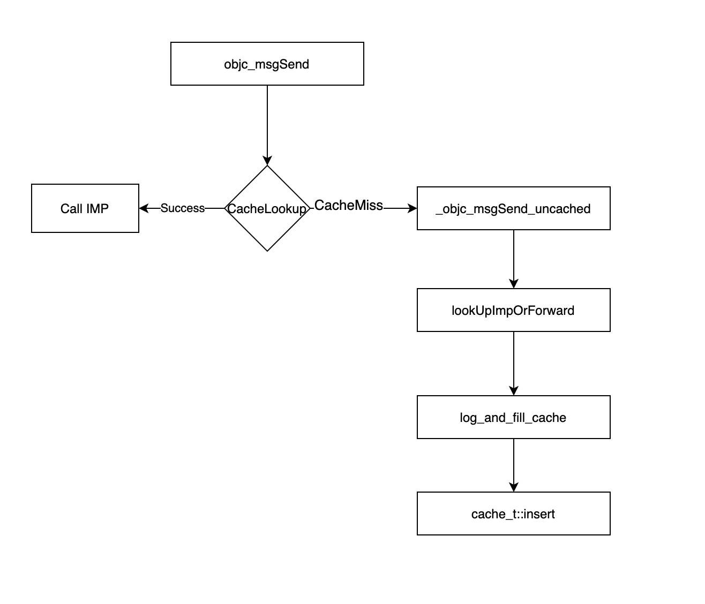

## cache 流程分析

### 引文

在第6篇章时，通过 `cache_t` 源码中的 `insert()` 方法探索了缓存插入的流程，但是 `insert()` 之前的流程是什么样的，又是谁调起了 `insert` 方法呢，都不得而知，那就去探索一下

### 探索方法

#### 搜索关键字设置

那么怎么探索呢，先搜索下 `insert` 方法，函数调用应该带有括号，就再加上个左括号 `insert(` 按此内容进行搜索，搜索结果当然是很多

#### 筛选搜索结果

接下来进行筛选搜索结果，找出相关的方法调用，由于当前的 `insert` 方法，其完整方法为 `void insert(SEL sel, IMP imp, id receiver);` 拥有三个参数，那么排除掉不足三个参数的调用，和其他声明类的实现，找到了两个方法调用，分别为：

-  `log_and_fill_cache` 中

```C++
/***********************************************************************
* log_and_fill_cache
* Log this method call. If the logger permits it, fill the method cache.
* cls is the method whose cache should be filled. 
* implementer is the class that owns the implementation in question.
**********************************************************************/
static void
log_and_fill_cache(Class cls, IMP imp, SEL sel, id receiver, Class implementer)
{
#if SUPPORT_MESSAGE_LOGGING
    if (slowpath(objcMsgLogEnabled && implementer)) {
        bool cacheIt = logMessageSend(implementer->isMetaClass(), 
                                      cls->nameForLogging(),
                                      implementer->nameForLogging(), 
                                      sel);
        if (!cacheIt) return;
    }
#endif
    cls->cache.insert(sel, imp, receiver);
}

```

- `lookupMethodInClassAndLoadCache` 中

```C++
/***********************************************************************
* lookupMethodInClassAndLoadCache.
* Like lookUpImpOrForward, but does not search superclasses.
* Caches and returns objc_msgForward if the method is not found in the class.
**********************************************************************/
IMP lookupMethodInClassAndLoadCache(Class cls, SEL sel)
{
    IMP imp;

    // fixme this is incomplete - no resolver, +initialize - 
    // but it's only used for .cxx_construct/destruct so we don't care
    ASSERT(sel == SEL_cxx_construct  ||  sel == SEL_cxx_destruct);

    // Search cache first.
    //
    // If the cache used for the lookup is preoptimized,
    // we ask for `_objc_msgForward_impcache` to be returned on cache misses,
    // so that there's no TOCTOU race between using `isConstantOptimizedCache`
    // and calling cache_getImp() when not under the runtime lock.
    //
    // For dynamic caches, a miss will return `nil`
    imp = cache_getImp(cls, sel, _objc_msgForward_impcache);

    if (slowpath(imp == nil)) {
        // Cache miss. Search method list.

        mutex_locker_t lock(runtimeLock);

        if (auto meth = getMethodNoSuper_nolock(cls, sel)) {
            // Hit in method list. Cache it.
            imp = meth->imp(false);
        } else {
            imp = _objc_msgForward_impcache;
        }

        // Note, because we do not hold the runtime lock above
        // isConstantOptimizedCache might flip, so we need to double check
        if (!cls->cache.isConstantOptimizedCache(true /* strict */)) {
            cls->cache.insert(sel, imp, nil);
        }
    }

    return imp;
}
```

这两个方法中都存在调用，那么回到我们当前的方法调用时进行的方法缓存上来，当前调用方法时执行的方法缓存是执行的哪个语句呢，那就只能通过运行源码来确认下

#### 源码运行确认

首先我们要确认当前的缓存会执行上面我们找到的两处代码之一

万一都不走呢，所以还是先在 `void cache_t::insert(SEL sel, IMP imp, id receiver)` 方法中添加断点，来使用 `bt` 查看堆栈信息验证下

当前断点流程设置在调用 `saySomething` 方法后，再开启 `cache::insert` 内部的断点

```shell
(lldb) bt
* thread #1, queue = 'com.apple.main-thread', stop reason = breakpoint 2.1
    frame #0: 0x00000001002f593c libobjc.A.dylib`cache_t::insert(this=0x0000000100008448, sel="saySomething", imp=(KCObjcBuild`-[LGPerson saySomething]), receiver=0x00000001007679a0)(), objc_object*) at objc-cache.mm:831:9
    frame #1: 0x000000010031374a libobjc.A.dylib`log_and_fill_cache(cls=LGPerson, imp=(KCObjcBuild`-[LGPerson saySomething]), sel="saySomething", receiver=0x00000001007679a0, implementer=LGPerson)(), objc_selector*, objc_object*, objc_class*) at objc-runtime-new.mm:6305:16
    frame #2: 0x00000001003122d2 libobjc.A.dylib`lookUpImpOrForward(inst=0x00000001007679a0, sel="saySomething", cls=LGPerson, behavior=3) at objc-runtime-new.mm:6505:9
  * frame #3: 0x00000001002eab9b libobjc.A.dylib`_objc_msgSend_uncached at objc-msg-x86_64.s:1153
    frame #4: 0x0000000100003a22 KCObjcBuild`main(argc=1, argv=0x00007ffeefbff4b8) at main.m:38:9 [opt]
    frame #5: 0x00007fff2056e621 libdyld.dylib`start + 1
    frame #6: 0x00007fff2056e621 libdyld.dylib`start + 1
```

根据 `frame #1` 中的输出信息以及断点左侧的堆栈信息，都能很明确的定位到 `log_and_fill_cache` 函数的调用

再追溯 `log_and_fill_cache` 的调用，堆栈信息向下寻找是 `lookUpImpOrForward`  以及 `_objc_msgSend_uncached` 这个感觉像是消息转发流程

再查找下其他的验证信息，在 `objc-cache.mm` 源码文件的顶部的注释中得到一些信息

```C++
/***********************************************************************
 * Method cache locking (GrP 2001-1-14)
 *
 * For speed, objc_msgSend does not acquire any locks when it reads 
 * method caches. Instead, all cache changes are performed so that any 
 * objc_msgSend running concurrently with the cache mutator will not 
 * crash or hang or get an incorrect result from the cache. 
 *
 * When cache memory becomes unused (e.g. the old cache after cache 
 * expansion), it is not immediately freed, because a concurrent 
 * objc_msgSend could still be using it. Instead, the memory is 
 * disconnected from the data structures and placed on a garbage list. 
 * The memory is now only accessible to instances of objc_msgSend that 
 * were running when the memory was disconnected; any further calls to 
 * objc_msgSend will not see the garbage memory because the other data 
 * structures don't point to it anymore. The collecting_in_critical
 * function checks the PC of all threads and returns FALSE when all threads 
 * are found to be outside objc_msgSend. This means any call to objc_msgSend 
 * that could have had access to the garbage has finished or moved past the 
 * cache lookup stage, so it is safe to free the memory.
 *
 * All functions that modify cache data or structures must acquire the 
 * cacheUpdateLock to prevent interference from concurrent modifications.
 * The function that frees cache garbage must acquire the cacheUpdateLock 
 * and use collecting_in_critical() to flush out cache readers.
 * The cacheUpdateLock is also used to protect the custom allocator used 
 * for large method cache blocks.
 *
 * Cache readers (PC-checked by collecting_in_critical())
 * objc_msgSend*
 * cache_getImp
 *
 * Cache readers/writers (hold cacheUpdateLock during access; not PC-checked)
 * cache_t::copyCacheNolock    (caller must hold the lock)
 * cache_t::eraseNolock        (caller must hold the lock)
 * cache_t::collectNolock      (caller must hold the lock)
 * cache_t::insert             (acquires lock)
 * cache_t::destroy            (acquires lock)
 *
 * UNPROTECTED cache readers (NOT thread-safe; used for debug info only)
 * cache_print
 * _class_printMethodCaches
 * _class_printDuplicateCacheEntries
 * _class_printMethodCacheStatistics
 *
 ***********************************************************************/
```

看到其中的 `Cache readers` 的相关方法，其中有 `objc_msgSend*` ，此方法进行了缓存的读取，查看下 `objc_msgSend` 的汇编实现代码

```assembly
// objc-msg-x86_64.s 文件中的源码
/********************************************************************
 *
 * id objc_msgSend(id self, SEL	_cmd,...);
 * IMP objc_msgLookup(id self, SEL _cmd, ...);
 *
 * objc_msgLookup ABI:
 * IMP returned in r11
 * Forwarding returned in Z flag
 * r10 reserved for our use but not used
 *
 ********************************************************************/
	
	.data
	.align 3
	.globl _objc_debug_taggedpointer_classes
_objc_debug_taggedpointer_classes:
	.fill 16, 8, 0
	.globl _objc_debug_taggedpointer_ext_classes
_objc_debug_taggedpointer_ext_classes:
	.fill 256, 8, 0

	ENTRY _objc_msgSend
	UNWIND _objc_msgSend, NoFrame

	GetIsaCheckNil NORMAL		// r10 = self->isa, or return zero
	CacheLookup NORMAL, CALL	// calls IMP on success

	GetIsaSupport NORMAL
	NilTestReturnZero NORMAL

// cache miss: go search the method lists
LCacheMiss:
	// isa still in r10
	jmp	__objc_msgSend_uncached

	END_ENTRY _objc_msgSend

	
	ENTRY _objc_msgLookup

	GetIsaCheckNil NORMAL		// r10 = self->isa, or return zero IMP
	CacheLookup NORMAL, LOOKUP	// returns IMP on success

	GetIsaSupport NORMAL
	NilTestReturnIMP NORMAL

// cache miss: go search the method lists
LCacheMiss:
	// isa still in r10
	jmp	__objc_msgLookup_uncached

	END_ENTRY _objc_msgLookup

	
	ENTRY _objc_msgSend_fixup
	int3
	END_ENTRY _objc_msgSend_fixup

	
	STATIC_ENTRY _objc_msgSend_fixedup
	// Load _cmd from the message_ref
	movq	8(%a2), %a2
	jmp	_objc_msgSend
	END_ENTRY _objc_msgSend_fixedup
```

分析此汇编源码

- 在首个 `CacheLookup NORMAL, CALL	// calls IMP on success` 语句执行时，根据备注是成功调起 IMP
- 之后在缓存未命中时，在其下的 `cache miss` 备注下的 `LCacheMiss:`  的首个语句即是 `jmp	__objc_msgSend_uncached` ，根据其后的 `IMP` 返回成功，此处的 `__objc_msgSend_uncached` 即是执行的在上面 `bt` 的堆栈顺序进行的 `cache_t::insert`

> `LCacheMiss` 在 `CacheLookup` 的汇编源码中进行 jmp
>
> ```assembly
> /////////////////////////////////////////////////////////////////////
> //
> // CacheLookup	return-type, caller
> //
> // Locate the implementation for a class in a selector's method cache.
> //
> // Takes: 
> //	  $0 = NORMAL, FPRET, FP2RET, STRET
> //	  $1 = CALL, LOOKUP, GETIMP
> //	  a1 or a2 (STRET) = receiver
> //	  a2 or a3 (STRET) = selector
> //	  r10 = class to search
> //
> // On exit: r10 clobbered
> //	    (found) calls or returns IMP in r11, eq/ne set for forwarding
> //	    (not found) jumps to LCacheMiss, class still in r10
> //
> /////////////////////////////////////////////////////////////////////
> ```

通过此次分析的结果，`cache_t::insert` 的调用就有了一个源头

### 流程总结

画个图梳理下




此处源头是 `objc_msgSend` ，那么 `objc_msgSend` 是个什么流程呢，接下来就进行探索一下

