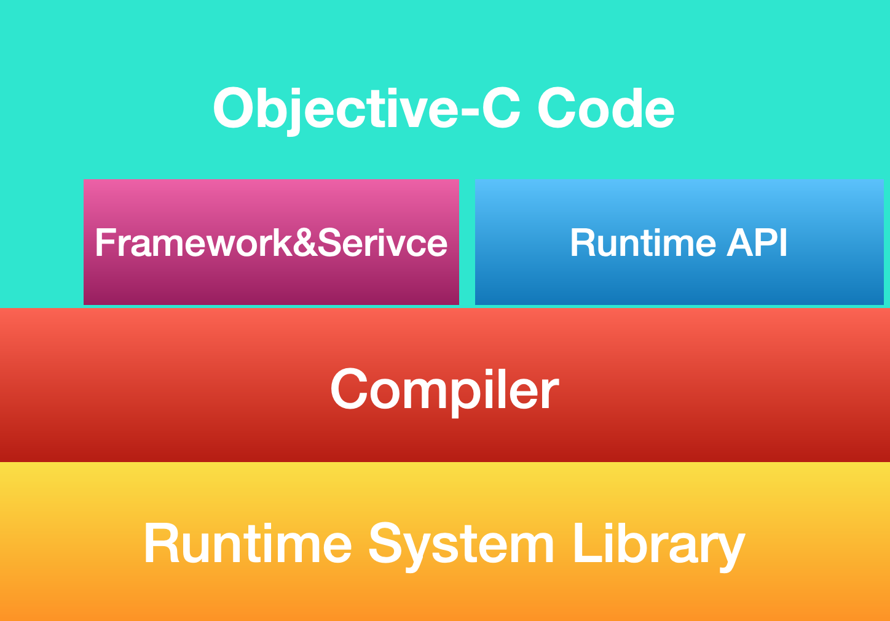
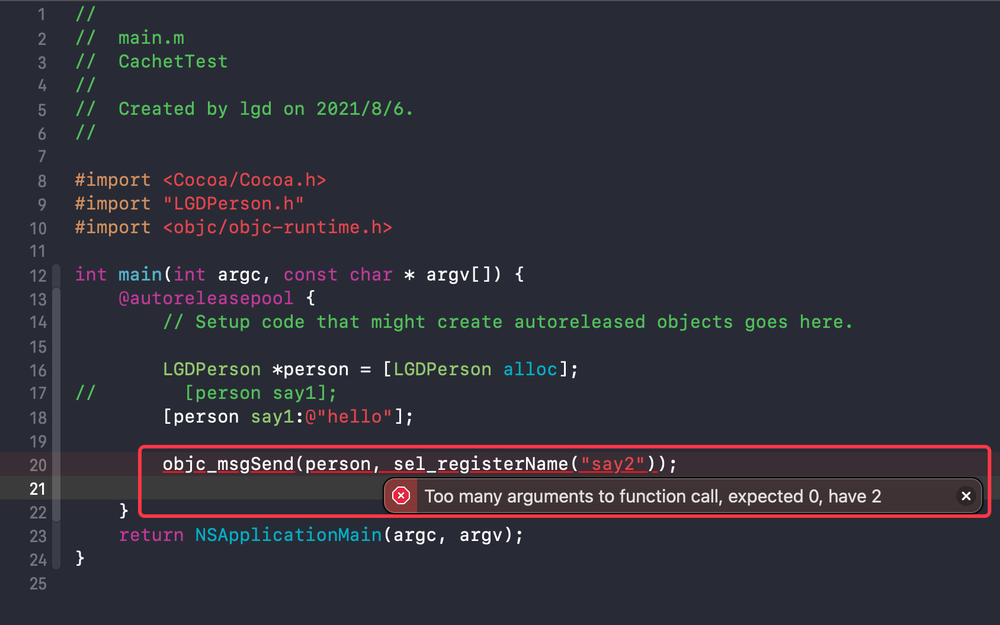
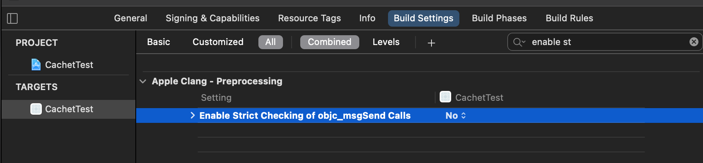

## Runtime简析

### 概念

Runtime 运行时，对应与编译时状态

#### 编译时

正在编译的时候，就是编译器把源代码翻译成机器能识别的代码

> 当然只是一般意义上这么说，实际上可能只是翻译成某个中间状态的语言

编译时就是做一些翻译工作，有包括词法分析、语法分析之类的过程，比如有没有写错关键字。如果存在错误，编译器就会进行提示，包括 warning 或者 errors 信息等，这时的这些错误就称作编译时错误，这个过程中做的类型检查就称作编译时类型检查或静态类型检查(所谓静态就是没有把代码放到内存中运行起来，只是作为文本进行扫描)

> 编译时还分配内存的说法是错误的

#### 运行时

通俗的讲就是代码运行起来了，被装载到内存中去了。只有代码从磁盘装载到内存中，代码才变成“活的”。而运行时类型检查与编译时类型检查不同，是在内存中做些操作和判断

### 版本

Runtime有两个版本，一个 `Legacy` 版本(早期版本)，一个`Modern` 版本(现行版本)

- 早期版本对应的编程接口：`Objective-C 1.0` 。用于 `Objective_C 1.0` , 32位的 `Mac OSX` 的平台上
- 现行版本对应的编程接口：`Objective-C 2.0` 。用于 `iPhone` 程序和 `Mac OSX 10.5` 以及以后的系统中的 64 位程序 

#### 官方文档

[Apple Documentation][https://developer.apple.com/documentation/] -- Documentation Archive -- 搜索 Runtime

```tex
Legacy and Modern Versions

There are two versions of the Objective-C runtime—“modern” and “legacy”. The modern version was introduced with Objective-C 2.0 and includes a number of new features. The programming interface for the legacy version of the runtime is described in Objective-C 1 Runtime Reference; the programming interface for the modern version of the runtime is described in Objective-C Runtime Reference.

The most notable new feature is that instance variables in the modern runtime are “non-fragile”:

In the legacy runtime, if you change the layout of instance variables in a class, you must recompile classes that inherit from it.
In the modern runtime, if you change the layout of instance variables in a class, you do not have to recompile classes that inherit from it.
In addition, the modern runtime supports instance variable synthesis for declared properties (see Declared Properties in The Objective-C Programming Language).

Platforms

iPhone applications and 64-bit programs on OS X v10.5 and later use the modern version of the runtime.

Other programs (32-bit programs on OS X desktop) use the legacy version of the runtime.
```

[Objective-C Runtime Programming Guide][https://developer.apple.com/library/archive/documentation/Cocoa/Conceptual/ObjCRuntimeGuide/Introduction/Introduction.html]

[Runtime Versions and Platforms][https://developer.apple.com/library/archive/documentation/Cocoa/Conceptual/ObjCRuntimeGuide/Articles/ocrtVersionsPlatforms.html]

### 发起方式

Runtime 的三种发起方式

- OC 方法调用   例  [person eat];
- NSObject 调起相关 API 例如 `isKindOfClass`
- 底层 API 调用 例如 `class_getInstanceSize`

**所在层级**

使用图像结构来展示下三种实现方式所在的层级结构



> 图像来源 LGCooci

- OC方法调用方式归属与 `Objective-C Code` 层级
- NSObject 调起的 API 归属于 `Framework&Service` 这个层级
- 底层 API 调用则归属于 `Runtime API` 
- 均由底层的编译器和运行时系统库提供支持和实现，同时编译器作为中间层隔绝了系统库与外层

#### 底层实现方式探究

了解了层级结构后，就进行实操落地，查看下 `Runtime` 方法的编译器实现

##### 方法调用的实现

在 `main.m` 的 main 函数中新增代码

```objc
LGDPerson *person = [LGDPerson alloc];
[person say1];
```

使用 `clang` 查看其实现  `clang -rewrite-objc main.m -o main.cpp`

```C++
// main.cpp 中 main函数内部 
LGDPerson *person = ((LGDPerson *(*)(id, SEL))(void *)objc_msgSend)((id)objc_getClass("LGDPerson"), sel_registerName("alloc"));
((void (*)(id, SEL))(void *)objc_msgSend)((id)person, sel_registerName("say1"));
```

可以看到其实现方式是使用的第三种方式底层的API

编译后上层代码都进行了解释，解析对应方法的实现：

1. `alloc` 的实现

- 调用方法 `objc_msgSend()`，两个参数 `(id, SEL)`
- 第一个参数 `objc_getClass("LGDPerson")` 
- 第二个参数 `sel_registerName("alloc")` 

2. `say1` 的实现

- 调用方法 `objc_msgSend()`，两个参数 `(id, SEL)`
- 第一个参数 `(id)person`
- 第二个参数 `sel_registerName("say1")` 

总结下这两个实现，方法调用在底层都是进行的消息发送，使用  `objc_msgSend()`，传递两个参数，第一个是消息接收者 `id` ，第二个是 `IMP` [参考1]

当前使用的是无参数的方法调用，那带有参数的方法的实现也需要查看下

##### 带参数的方法调用

修改 OC 代码

```objc
// LGDPerson
- (void)say1:(NSString *)sth;

- (void)say1:(NSString *)sth
{
    
}

// main 函数
        LGDPerson *person = [LGDPerson alloc];
        [person say1:@"hello"];
```

再次 clang 后，查看实现

```C++
((void (*)(id, SEL, NSString * _Nonnull))(void *)objc_msgSend)((id)person, sel_registerName("say1:"), (NSString *)&__NSConstantStringImpl__var_folders_8b_mwh30d9s60bd8ql1k9j0v4440000gn_T_main_bffbb5_mi_0);
```

可以看到新增了 `NSString * ` 类型参数

此时再次微调总结：

方法调用在底层都是进行的消息发送，其依赖的函数结构为`objc_msgSend(消息的接受者, 消息的主体(SEL + 参数))` 

##### 手动验证

上面总结了方法调用的实现，那么接下来再手动验证下，既然其本质上是消息发送，那么使用消息发送调起对应的方法应该是没有问题的

```objc
// LGDPerson
- (void)say2;
- (void)say2{
    NSLog(@"LGDPerson say : %s",__func__);
}
```

新增了 `say2` 方法，接下来使用 `objc_msgSend()` 接口进行发送消息

```objc
objc_msgSend(person, sel_registerName("say2"));
```

> 需要引入头文件 <objc/ objc-runtime.h>

编译后报错，错误信息如下，表明是参数过多



此时需要修改配置  `Enable Strict Checking of objc_msgSend Calls` 为 `NO` 来允许多个参数的接收

> 根据这个配置名称，看来 严格消息发送调用方法检查 只允许一个参数



修改后编译成功，运行下进行输出

```shell
LGDPerson say : -[LGDPerson say2]
```

验证成功，总结的结论无误

**带参数形式**

至于带参数形式，也试下

```objc
// LGDPerson.m
- (void)say1:(NSString *)sth
{
    NSLog(@"LGDPerson say : %s + sth : %@",__func__, sth);

}

//main.m
objc_msgSend(person, sel_registerName("say1:"), @"world");
```

也正常输出了

```shell
LGDPerson say : -[LGDPerson say1:] + sth : world
```

### 拓展

研究了普通形式的方法调用，拓展下其他奇奇怪怪的调用

#### 拓展1  子类调用父类方法

探索下父类方法存在子类方法不存在时，消息发送的实现，是否会使用 `objc_msgSendSuper` 直接发送给父类呢

##### OC 代码

在 `LGDPerson` 类文件中直接添加了一个子类，无任何方法

```objc
// LGDPerson.h
@interface LGDTeacher : LGDPerson

@end
// LGDPerson.m
@implementation LGDTeacher

@end
```

在 `main` 函数中调用 `LGDPerson` 的 `say2` 方法

```objc
LGDTeacher *teacher = [LGDTeacher alloc];
[teacher say2];
```

编译和执行都没啥问题，`clang` 一下查看实现

```C++
        LGDTeacher *teacher = ((LGDTeacher *(*)(id, SEL))(void *)objc_msgSend)((id)objc_getClass("LGDTeacher"), sel_registerName("alloc"));
        ((void (*)(id, SEL))(void *)objc_msgSend)((id)teacher, sel_registerName("say2"));
```

依然是传递的当前对象作为消息接受者，并没有直接发给父类，也没有使用 `objc_msgSendSuper` 函数来发送消息，那么能不能直接使用 `objc_msgSendSuper` 来直接把消息发给父类，来调起父类方法呢，来尝试下

##### objc_msgSendSuper 使用

首先，先查看下 `objc_msgSendSuper` 是不是发送消息给父类的

```C++
// <objc/message.h>
/** 
 * Sends a message with a simple return value to the superclass of an instance of a class.
 * 
 * @param super A pointer to an \c objc_super data structure. Pass values identifying the
 *  context the message was sent to, including the instance of the class that is to receive the
 *  message and the superclass at which to start searching for the method implementation.
 * @param op A pointer of type SEL. Pass the selector of the method that will handle the message.
 * @param ...
 *   A variable argument list containing the arguments to the method.
 * 
 * @return The return value of the method identified by \e op.
 * 
 * @see objc_msgSend
 */
OBJC_EXPORT id _Nullable
objc_msgSendSuper(struct objc_super * _Nonnull super, SEL _Nonnull op, ...)
    OBJC_AVAILABLE(10.0, 2.0, 9.0, 1.0, 2.0);
```

在 `<objc/message.h>` 文件中找到的上述注释，证实该方法确实可以发送给父类

同时观察到首个参数变更为 `objc_super` 结构体，查看注释

```tex
@param super A pointer to an \c objc_super data structure. 
Pass values identifying the context the message was sent to, including the instance of the class that is to receive the message and the superclass at which to start searching for the method implementation.
```

根据注释描述，其包含一个消息的接受者对象，和想要从其位置开始搜索的父类

找一下 `objc_super` 结构体的实现

```C++
/// Specifies the superclass of an instance. 
struct objc_super {
    /// Specifies an instance of a class.
    __unsafe_unretained _Nonnull id receiver;

    /// Specifies the particular superclass of the instance to message. 
#if !defined(__cplusplus)  &&  !__OBJC2__
    /* For compatibility with old objc-runtime.h header */
    __unsafe_unretained _Nonnull Class class;
#else
    __unsafe_unretained _Nonnull Class super_class;
#endif
    /* super_class is the first class to search */
};
```

非 `__OBJC2__` 的可以不看，那么其成员变量就是 `id receiver` 和 `Class super_class` ，是和注释描述的一致

那么来使用下，当前使用 `teacher` 对象调起父类 `say2` 方法

```objc
// main函数 接上 teacher 的代码
  struct objc_super lgd_objc_super;
  lgd_objc_super.receiver = teacher;
  lgd_objc_super.super_class = [LGDTeacher class];

  objc_msgSendSuper(&lgd_objc_super, @selector(say2));
```

此处的 `super_class` 根据在上面的查看，是搜索的开始位置，那么就 `LGDTeacher` / `LGDPerson` / `NSObject` 都尝试下使用

- 使用 `LGDTeacher` 或 `LGDPerson` 时，都正常输出打印结果
- 使用 `NSObject` 时，崩溃报错：`reason: '-[LGDTeacher say2]: unrecognized selector sent to instance` ，找不到方法

根据上述运行结果，`objc_super` 结构体的 `super_class` 参数设置的是搜索的起始类，向其父类方向进行查找

##### 小结

那么针对 `[teacher say2]; ` 方法的直接调用，就相当于 `super_class` 传入 `LGDTeacher` 进行一层一层的查找，在其父类 `LGDPerson` 查找到 `say2` 方法，进行了消息发送

体会下这个查找流程，对 `msgSend` 就有了初步体会

##### 拓展中的拓展

有大佬在使用 `[super xxx]` 发现其 `clang` 转换的代码中使用了 `objc_msgSendSuper` ，来查看下

OC代码实现

在 main 函数上面添加

```objc
@interface LGDPerson1 : NSObject

- (void)say2;

@end

@implementation LGDPerson1

- (void)say2{
    NSLog(@"LGDPerson say : %s",__func__);
}
@end

@interface LGDTeacher1 : LGDPerson1

@end

@implementation LGDTeacher1
- (void)say2 {
    
    [super say2];
}
@end
```

`clang` 一下，查看 cpp

```C++
// @implementation LGDTeacher1

static void _I_LGDTeacher1_say2(LGDTeacher1 * self, SEL _cmd) {

    ((void (*)(__rw_objc_super *, SEL))(void *)objc_msgSendSuper)((__rw_objc_super){(id)self, (id)class_getSuperclass(objc_getClass("LGDTeacher1"))}, sel_registerName("say2"));
}

// @end
```

这里的结构体 `_rw_objc_super` 实现 `(__rw_objc_super){(id)self, (id)class_getSuperclass(objc_getClass("LGDTeacher1"))}` 就如我们上面分析描述的一样


## 参考

### 参考1 `sel_registerName` 

```C++
/** 
 * Registers a method with the Objective-C runtime system, maps the method 
 * name to a selector, and returns the selector value.
 * 
 * @param str A pointer to a C string. Pass the name of the method you wish to register.
 * 
 * @return A pointer of type SEL specifying the selector for the named method.
 * 
 * @note You must register a method name with the Objective-C runtime system to obtain the
 *  method’s selector before you can add the method to a class definition. If the method name
 *  has already been registered, this function simply returns the selector.
 */
OBJC_EXPORT SEL _Nonnull sel_registerName(const char * _Nonnull str)
    OBJC_AVAILABLE(10.0, 2.0, 9.0, 1.0, 2.0);
```

根据注释可以了解到期返回 SEL 对应的函数指针，即是 IMP