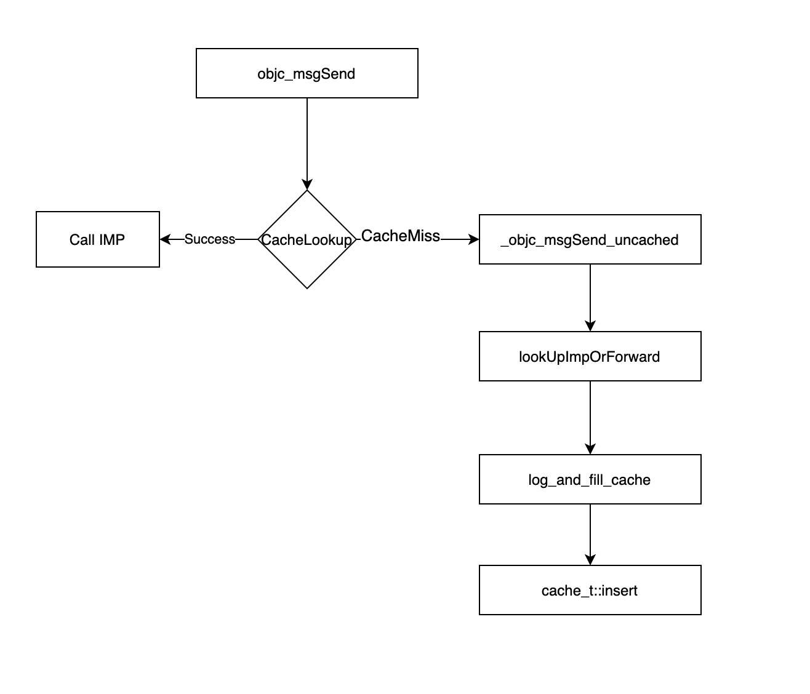

## objc_msgSend源码查探

### 引文

作为 `Runtime` 中的核心方法 `objc_msgSend` 其源码实现还是需要仔细查看分析下的。 由于 `Runtime` 是使用 C++/汇编 编写的一套 API，那么 `objc_msgSend` 的实现方式也应该是 C++ 或汇编实现的

### 定位 objc_msgSend 源码

首先要定位 `objc_msgSend` 所在的系统库

在普通的 Xcode 工程使用查看汇编方式确定

- 在方法调用行打上断点，由于方法调用即是消息转发，所以 `objc_msgSend` 一定会被调用
- 打开 `Debug -- Debug Workflow -- Always Show Disassembly`
- 运行工程，断点捕获

```assembly
->  0x1006f1ce2 <+50>:  movq   -0x18(%rbp), %rax
    0x1006f1ce6 <+54>:  movq   0x47cb(%rip), %rsi        ; "say2"
    0x1006f1ced <+61>:  movq   %rax, %rdi
    0x1006f1cf0 <+64>:  callq  *0x30a(%rip)              ; (void *)0x00007fff203efd00: objc_msgSend
```

- 在 `objc_msgSend` 所在行打断点，跳转断点
- `ctl` + 点击 `step into` 按钮，进入

```assembly
libobjc.A.dylib`objc_msgSend:
->  0x7fff203efd00 <+0>:   testq  %rdi, %rdi
    0x7fff203efd03 <+3>:   je     0x7fff203efd78            ; <+120>
    0x7fff203efd06 <+6>:   testb  $0x1, %dil
    0x7fff203efd0a <+10>:  jne    0x7fff203efd83            ; <+131>
    # 后续省略...
```

可得到是在 `libobjc.A.dylib` 中的，那么接下来就去 `objc` 源码工程中查看一下

#### objc 源码中查找

搜索 `objc_msgSend` 

在 `message.h` 中查到 `objc_msgSend` 的接口声明，但是点不进去，看来要么就是没开源，要么就是汇编实现的

查看到在 `objc-msg-arm.s` 等汇编文件中搜索到，当前手机是 `arm64` 架构，就查看 `objc-msg-arm64.s` 中的实现了

在其内部定位到 `ENTRY _objc_msgSend` 进入 `objc_msgSend` ，找到入口，那么查看下代码

```assembly
	ENTRY _objc_msgSend
	UNWIND _objc_msgSend, NoFrame

	cmp	p0, #0			// nil check and tagged pointer check
#if SUPPORT_TAGGED_POINTERS
	b.le	LNilOrTagged		//  (MSB tagged pointer looks negative)
#else
	b.eq	LReturnZero
#endif
	ldr	p13, [x0]		// p13 = isa
	GetClassFromIsa_p16 p13, 1, x0	// p16 = class
LGetIsaDone:
	// calls imp or objc_msgSend_uncached
	CacheLookup NORMAL, _objc_msgSend, __objc_msgSend_uncached

#if SUPPORT_TAGGED_POINTERS
LNilOrTagged:
	b.eq	LReturnZero		// nil check
	GetTaggedClass
	b	LGetIsaDone
// SUPPORT_TAGGED_POINTERS
#endif

LReturnZero:
	// x0 is already zero
	mov	x1, #0
	movi	d0, #0
	movi	d1, #0
	movi	d2, #0
	movi	d3, #0
	ret

	END_ENTRY _objc_msgSend
```

那么就开始逐句分析

### 汇编源码分析

#### cmp	p0, #0

> cmp 比较功能， 把一个寄存器的内容和另一个寄存器的内容或立即数进行比较。但不存储结果，只是正确的更改标志。一般CMP做完判断后会进行跳转，后面通常会跟上B指令！
>
> - `b.le` 判断上面cmp的值是小于等于 执行标号，否则直接往下走
> - `b.eq` 等于 执行地址 否则往下

其注释 `// nil check and tagged pointer check` 

此处的 `p0` 等同于 x0 寄存器[参考1]，其中存储着首个参数，消息接收者对象地址

此句代码如注释所示，进行空值判断和 `tagged pointer` 判断

其下的 `b` 类型跳转语句，`tagged pointer` 类型暂时不管

`b.eq  LReturnZero` 空值时跳转 `LReturnZero` ，查看其实现和注释，返回 0，x0 寄存器也置为 0 了。此时消息接收者为 nil，因此直接返回 0

非0情况直接执行后续代码

#### ldr p13, [x0]

> p13 = x0栈内存中的值

x0 是当前的消息接收者

其注释 `// p13 = isa`  。对象的地址即是是其 `isa` 的地址，指针指向的值的首地址即是 `isa` 的值，因此此处 `p13` 寄存器存储的就是 `isa` 的值

#### GetClassFromIsa_p16 p13, 1, x0	

搜索 `GetClassFromIsa_p16`

```assembly
/********************************************************************
 * GetClassFromIsa_p16 src, needs_auth, auth_address
 * src is a raw isa field. Sets p16 to the corresponding class pointer.
 * The raw isa might be an indexed isa to be decoded, or a
 * packed isa that needs to be masked.
 *
 * On exit:
 *   src is unchanged
 *   p16 is a class pointer
 *   x10 is clobbered
 ********************************************************************/
 #if SUPPORT_INDEXED_ISA
	.align 3
	.globl _objc_indexed_classes
_objc_indexed_classes:
	.fill ISA_INDEX_COUNT, PTRSIZE, 0
#endif
 
 .macro GetClassFromIsa_p16 src, needs_auth, auth_address /* note: auth_address is not required if !needs_auth */

#if SUPPORT_INDEXED_ISA
	// Indexed isa
	mov	p16, \src			// optimistically set dst = src
	tbz	p16, #ISA_INDEX_IS_NPI_BIT, 1f	// done if not non-pointer isa
	// isa in p16 is indexed
	adrp	x10, _objc_indexed_classes@PAGE
	add	x10, x10, _objc_indexed_classes@PAGEOFF
	ubfx	p16, p16, #ISA_INDEX_SHIFT, #ISA_INDEX_BITS  // extract index
	ldr	p16, [x10, p16, UXTP #PTRSHIFT]	// load class from array
1:

#elif __LP64__
.if \needs_auth == 0 // _cache_getImp takes an authed class already
	mov	p16, \src
.else
	// 64-bit packed isa
	ExtractISA p16, \src, \auth_address
.endif
#else
	// 32-bit raw isa
	mov	p16, \src

#endif

.endmacro
```

`.macro` 定义了一个宏

>  `SUPPORT_INDEXED_ISA` 根据 《Isa探索》中的分析，对应的架构是 `armv7k or arm64_32` 

查看 `__LP64__` 判断对应代码

首先查看 `\needs_auth == 0 ` 判断，根据其后的注释 `_cache_getImp takes an authed class already` 已经认证过了，这个不了解怎样认证过了，那么就默认未认证，执行 else 语句

##### ExtractISA p16, \src, \auth_address

搜索其实现，在非指针验证(ptrauth)时

```C++
.macro ExtractISA
	and    $0, $1, #ISA_MASK
.endmacro
```

> and 执行按位与

此处指令执行，把 `$1 & ISA_MASK` 的值存入 `$0` ，此时

- `$0` 是入参 `p16` ；

- `$1` 是入参 `\src`，`\src` 此时是 `GetClassFromIsa_p16` 的入参 `p13` ，就等同于 `isa` 
- 与上掩码操作在 《Isa 探索》中也进行了分析，与上后取得的 Class 类的地址
- 把类的地址存入 `$0` ，等同于 `p16` 当前存入了 Class 类的地址

与`GetClassFromIsa_p16` 的注释 `// p16 = class` 相同，即 p16 的值是 isa 进行 mask 之后得到的类的地址

##### 那么为什么要获取 Class 呢？

通过上面指令分析，通过传入的消息接受者对象获取到对象所属的类的地址，那么为什么要获取其类地址呢？

当前的 `objc_msgSend` 是在分析 `cache` 时发现的前置步骤，其后续是进行缓存读取和查找流程(如下图)，那么根据之前对 `cache` 的分析，其缓存的是方法，而 `cache` 数据是从类地址中获取到的，这下就清楚了

##### 总结一下

总结一下：`objc_msgSend` 通过传入的消息接收者对象的 ISA 进行与掩码的与操作，获取类的地址，通过类地址获取 `cache` 中缓存的方法数据，来执行其后的缓存查找流程

#### CacheLookup 

此后就进入了缓存查找流程，对应了 《cache 流程分析》中最后的流程图



## 参考

### 参考1 p0

在 `arm64-asm,h` 中找到了 `p0` 的相关解释

```C++
#if __LP64__
// true arm64

#define SUPPORT_TAGGED_POINTERS 1
#define PTR .quad
#define PTRSIZE 8
#define PTRSHIFT 3  // 1<<PTRSHIFT == PTRSIZE
// "p" registers are pointer-sized
#define UXTP UXTX
#define p0  x0
#define p1  x1
#define p2  x2
#define p3  x3
#define p4  x4
#define p5  x5
#define p6  x6
#define p7  x7
#define p8  x8
#define p9  x9
#define p10 x10
#define p11 x11
#define p12 x12
#define p13 x13
#define p14 x14
#define p15 x15
#define p16 x16
#define p17 x17

// true arm64
#else
// arm64_32

#define SUPPORT_TAGGED_POINTERS 0
#define PTR .long
#define PTRSIZE 4
#define PTRSHIFT 2  // 1<<PTRSHIFT == PTRSIZE
// "p" registers are pointer-sized
#define UXTP UXTW
#define p0  w0
#define p1  w1
#define p2  w2
#define p3  w3
#define p4  w4
#define p5  w5
#define p6  w6
#define p7  w7
#define p8  w8
#define p9  w9
#define p10 w10
#define p11 w11
#define p12 w12
#define p13 w13
#define p14 w14
#define p15 w15
#define p16 w16
#define p17 w17

// arm64_32
#endif
```

p0 就等同于 64位下的 x0 或者 32位下的 w0