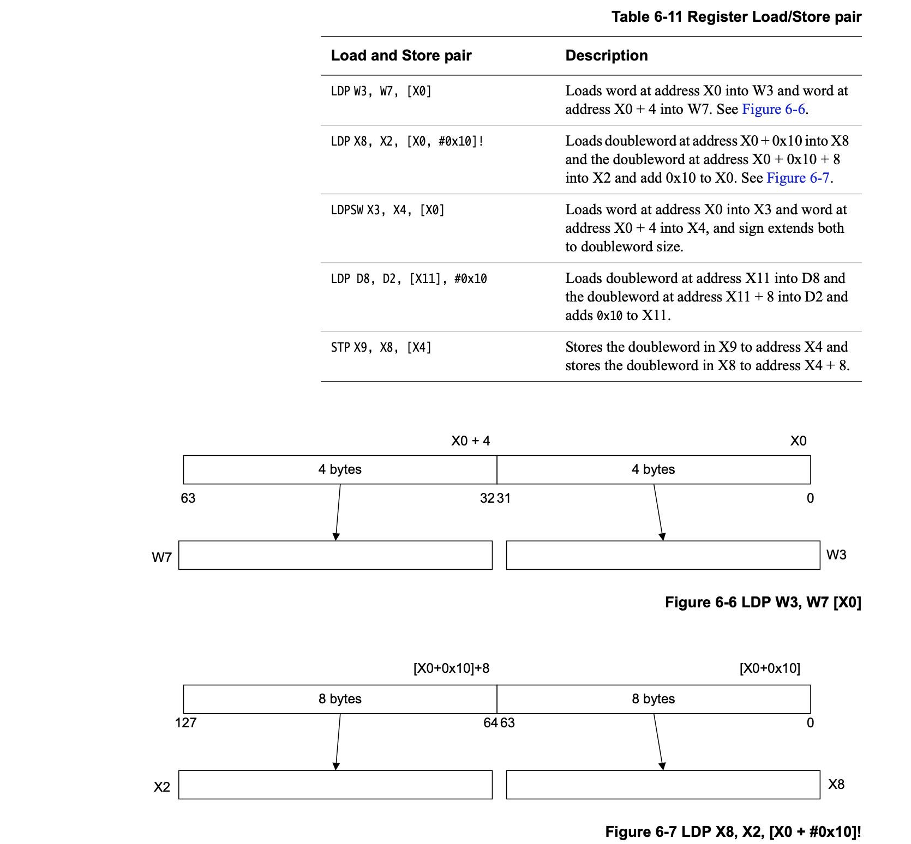

## cache_t  arm64 流程补充

### 引文

在 《6-3、cache_t源码分析》中主要应对当前源码的运行环境 Mac(x86_64架构) 进行的，但是 App 都是在真机环境，当前主流 (arm64) 下运行的，其流程存在部分出入，还是要进行了解下 

> 新版本 M1版本 Mac 运行起来应该和手机一样，都是 arm64

本文应对照 《6-3、cache_t源码分析》阅读，省略相同流程，只针对区分架构的步骤进行补充

### insert 流程(arm64 版本)

#### 首次缓存-初始化逻辑

```C++
if (slowpath(isConstantEmptyCache())) {
    // Cache is read-only. Replace it.
    if (!capacity) capacity = INIT_CACHE_SIZE;
    reallocate(oldCapacity, capacity, /* freeOld */false);
}
```

其中 `capacity` 赋值为 2 (1 << 1) ，理由也在下面备注好了， `since a large number of classes, especially metaclasses, have very few imps, and we support the ability to fill 100% of the cache before resizing`

```C++
INIT_CACHE_SIZE      = (1 << INIT_CACHE_SIZE_LOG2),

//  ---- INIT_CACHE_SIZE_LOG2 ----
#if CACHE_END_MARKER || (__arm64__ && !__LP64__)
    // When we have a cache end marker it fills a bucket slot, so having a
    // initial cache size of 2 buckets would not be efficient when one of the
    // slots is always filled with the end marker. So start with a cache size
    // 4 buckets.
    INIT_CACHE_SIZE_LOG2 = 2,
#else   //执行此部分逻辑
    // Allow an initial bucket size of 2 buckets, since a large number of
    // classes, especially metaclasses, have very few imps, and we support
    // the ability to fill 100% of the cache before resizing.
    INIT_CACHE_SIZE_LOG2 = 1,
#endif
```

##### CACHE_END_MARKER 宏

 `CACHE_END_MARKER` 在手机的 `arm64` 架构下定义为0

```C++
#elif __arm64__ && __LP64__

// objc_msgSend has lots of registers available.
// Cache scan decrements. No end marker needed.
#define CACHE_END_MARKER 0
```

##### allocateBuckets(mask_t newCapacity)

在 `cache_t::insert` 的首次缓存流程中，其初始化逻辑存在开辟内存方法 `reallocate` 函数，其内部进行 `newBuckets` 开辟时，调用 `bucket_t *cache_t::allocateBuckets(mask_t newCapacity)` 方法进行开辟，此处存在架构区分

```C++
#if CACHE_END_MARKER

//... 省略

#else

bucket_t *cache_t::allocateBuckets(mask_t newCapacity)
{
    if (PrintCaches) recordNewCache(newCapacity);

    return (bucket_t *)calloc(bytesForCapacity(newCapacity), 1);
}

#endif
```

此判断条件 `CACHE_END_MARKER` 此时为 0， 执行 else 中代码

- `PrintCaches` Cache打印输出相关的，不看了
- `(bucket_t *)calloc(bytesForCapacity(newCapacity), 1);`  开辟了内存空间

```C++
size_t cache_t::bytesForCapacity(uint32_t cap)
{
    return sizeof(bucket_t) * cap;
}
```

其中使用了 `bucket_t` 的大小，根据其成员 `SEL` 和 `IMP` ，大小应该为 16 字节，`lldb`输出验证下

```shell
(lldb) p sizeof(bucket_t)
(unsigned long) $31 = 16
```

那就应该是开辟 `16 * capacity` 大小的内存空间

> 此处无 `End marker` 标识插入，与 x86_64 架构不同

##### setBucketsAndMask

当前 `reallocate` 方法中的调用实现代码 `setBucketsAndMask(newBuckets, newCapacity - 1);`

`setBucketsAndMask` 函数实现存在多个宏判断下的不同实现，查看 `arm64` 架构真机的条件下的实现

根据宏订阅 `CACHE_MASK_STORAGE` 的类型，当前真机下应该是 `CACHE_MASK_STORAGE_HIGH_16` 类型

```C++
// ----  CACHE_MASK_STORAGE ---
#if defined(__arm64__) && __LP64__
#if TARGET_OS_OSX || TARGET_OS_SIMULATOR
#define CACHE_MASK_STORAGE CACHE_MASK_STORAGE_HIGH_16_BIG_ADDRS
#else
#define CACHE_MASK_STORAGE CACHE_MASK_STORAGE_HIGH_16
#endif
#elif defined(__arm64__) && !__LP64__
#define CACHE_MASK_STORAGE CACHE_MASK_STORAGE_LOW_4
#else
#define CACHE_MASK_STORAGE CACHE_MASK_STORAGE_OUTLINED
#endif
```

因此选择此部分代码执行

```C++
#elif CACHE_MASK_STORAGE == CACHE_MASK_STORAGE_HIGH_16 || CACHE_MASK_STORAGE == CACHE_MASK_STORAGE_HIGH_16_BIG_ADDRS

void cache_t::setBucketsAndMask(struct bucket_t *newBuckets, mask_t newMask)
{
    uintptr_t buckets = (uintptr_t)newBuckets;
    uintptr_t mask = (uintptr_t)newMask;

    ASSERT(buckets <= bucketsMask);
    ASSERT(mask <= maxMask);

    _bucketsAndMaybeMask.store(((uintptr_t)newMask << maskShift) | (uintptr_t)newBuckets, memory_order_relaxed);
    _occupied = 0;
}

mask_t cache_t::mask() const
{
    uintptr_t maskAndBuckets = _bucketsAndMaybeMask.load(memory_order_relaxed);
    return maskAndBuckets >> maskShift;
}

```

此处的 `maskShift` 又要查看在 `cahce_t` 中当前宏定义判断下的定义

```C++
#elif CACHE_MASK_STORAGE == CACHE_MASK_STORAGE_HIGH_16
    // _bucketsAndMaybeMask is a buckets_t pointer in the low 48 bits
    // _maybeMask is unused, the mask is stored in the top 16 bits.

    // How much the mask is shifted by.
    static constexpr uintptr_t maskShift = 48;

    // Additional bits after the mask which must be zero. msgSend
    // takes advantage of these additional bits to construct the value
    // `mask << 4` from `_maskAndBuckets` in a single instruction.
    static constexpr uintptr_t maskZeroBits = 4;

    // The largest mask value we can store.
    static constexpr uintptr_t maxMask = ((uintptr_t)1 << (64 - maskShift)) - 1;
    
    // The mask applied to `_maskAndBuckets` to retrieve the buckets pointer.
    static constexpr uintptr_t bucketsMask = ((uintptr_t)1 << (maskShift - maskZeroBits)) - 1;
    
    // Ensure we have enough bits for the buckets pointer.
    static_assert(bucketsMask >= MACH_VM_MAX_ADDRESS,
            "Bucket field doesn't have enough bits for arbitrary pointers.");

 // 省略 CONFIG_USE_PREOPT_CACHES
```

此处的代码结合 `maskShift` 定义以及其注释看就很清晰了

分析核心语句：`_bucketsAndMaybeMask.store(((uintptr_t)newMask << maskShift) | (uintptr_t)newBuckets, memory_order_relaxed);`  

- 首先进行 `((uintptr_t)newMask << maskShift) | (uintptr_t)newBuckets` ，对此或操作拆解成两部分分析
  - 左移操作部分：此时 `newMask` 就是下面函数 `cache_t::mask()` 获取的 `mask` 即是 `_maybeMask`，根据 `maskShift` 和 `_maybeMask` 的注释可知，`_maybeMask` 存储在偏移 `maskShift(48)` 的位置，因此此处左移 48 位就存放正确了
  - 或操作部分： 用 `_maybeMask` 或上  `newBuckets` (存放在低48位的`buckets_t` ) 就组成了真正的 `_bucketsAndMaybeMask` 数据
- 最后把或操作后的 `uintptr_t` 类型数据进行了存储 `store`

此时初始化逻辑就完成了，返回 `insert` 函数流程继续进行

#### 非首次缓存-插入逻辑

```C++
    mask_t newOccupied = occupied() + 1; 
    unsigned oldCapacity = capacity(), capacity = oldCapacity;
//... 省略首次
    else if (fastpath(newOccupied + CACHE_END_MARKER <= cache_fill_ratio(capacity))) {
        // Cache is less than 3/4 or 7/8 full. Use it as-is.
    }
#if CACHE_ALLOW_FULL_UTILIZATION
    else if (capacity <= FULL_UTILIZATION_CACHE_SIZE && newOccupied + CACHE_END_MARKER <= capacity) {
        // Allow 100% cache utilization for small buckets. Use it as-is.
    }
#endif
    else {
        capacity = capacity ? capacity * 2 : INIT_CACHE_SIZE;
        if (capacity > MAX_CACHE_SIZE) {
            capacity = MAX_CACHE_SIZE;
        }
        reallocate(oldCapacity, capacity, true);
    }
```

第一个 `else if`  的逻辑在 `《6-3、cache_t源码分析》- else if 2` 小节进行分析过了，不再分析

##### else if 2

第二个 `else if ` 在 `CACHE_ALLOW_FULL_UTILIZATION` 宏判断下 

```C++
#elif __arm64__ && __LP64__

// objc_msgSend has lots of registers available.
// Cache scan decrements. No end marker needed.
#define CACHE_END_MARKER 0

// Allow 87.5% fill ratio in the fast path for all cache sizes.
// Increasing the cache fill ratio reduces the fragmentation and wasted space
// in imp-caches at the cost of potentially increasing the average lookup of
// a selector in imp-caches by increasing collision chains. Another potential
// change is that cache table resizes / resets happen at different moments.
static inline mask_t cache_fill_ratio(mask_t capacity) {
    return capacity * 7 / 8;
}

// Allow 100% cache utilization for smaller cache sizes. This has the same
// advantages and disadvantages as the fill ratio. A very large percentage
// of caches end up with very few entries and the worst case of collision
// chains in small tables is relatively small.
// NOTE: objc_msgSend properly handles a cache lookup with a full cache.
#define CACHE_ALLOW_FULL_UTILIZATION 1

#else
#error unknown architecture
#endif
```

此时 `CACHE_END_MARKER 0` 

分析判断语句 `capacity <= FULL_UTILIZATION_CACHE_SIZE && newOccupied + CACHE_END_MARKER <= capacity` 

查看 `FULL_UTILIZATION_CACHE_SIZE ` 

```C++
// 枚举值
FULL_UTILIZATION_CACHE_SIZE_LOG2 = 3,
FULL_UTILIZATION_CACHE_SIZE = (1 << FULL_UTILIZATION_CACHE_SIZE_LOG2),
```

根据此枚举值，`FULL_UTILIZATION_CACHE_SIZE` 值为 8 

此处判断语句就可以翻译为  `capacity <= 8 && newOccupied <= capacity`

- 此情况再加上 `else if 1` 中的逻辑在此判断之前执行，就对应了其注释 `// Allow 100% cache utilization for small buckets. Use it as-is.`  允许当前缓存方法添加后缓存容器充满；

- 同时此注释中的 `for small buckets` 也证实了判断条件 `capacity <= 8 ` ，只有容量小于 8 的 `small buckets` 允许填满，之后再进行扩容后依旧只执行 `else if 1` 中的 `Cache is less than 3/4 or 7/8 full` 的扩容条件判断，无法再次进入此判断语句了
- 此 `capacity <= 8 ` 的情况，根据初始化的分析，首次开辟为 `2` ，根据扩容逻辑为原来的 2 倍，那么此 `else if` 最多执行 3 次，在容量为 `2/4/8` 时可以允许当前缓存容器存满，之后就要在指定的负载因子 (7/8) 时进行扩容了 (此处是不是也考虑到由于 2、4 乘上负载因子会有小数，所以存满再扩容)

#### 后续逻辑

##### cache_hash

之后获取 `buckets()`  `mask_t begin = cache_hash(sel, m);`  通过 `cache_hash()` 方法来计算初始索引位置

```C++
// Class points to cache. SEL is key. Cache buckets store SEL+IMP.
// Caches are never built in the dyld shared cache.

static inline mask_t cache_hash(SEL sel, mask_t mask) 
{
    uintptr_t value = (uintptr_t)sel;
#if CONFIG_USE_PREOPT_CACHES  //arm64真机环境为 1
    value ^= value >> 7;
#endif
    return (mask_t)(value & mask);
}

// ----  CONFIG_USE_PREOPT_CACHES ----
#if defined(__arm64__) && TARGET_OS_IOS && !TARGET_OS_SIMULATOR && !TARGET_OS_MACCATALYST
#define CONFIG_USE_PREOPT_CACHES 1
#else
#define CONFIG_USE_PREOPT_CACHES 0
#endif
```

真机环境下 `CONFIG_USE_PREOPT_CACHES` 为 1，执行了 `value ^= value >> 7 ` 这个位运算，这个算法的含义不得而知，不过最后的结果由于是通过 `value & mask` 进行的，所以返回值必定不超过 `mask` 的值。 那么当前的位运算就暂时理解为一种算法即可

##### do-while

之后的 `do-while` 循环赋值流程

```C++
    // Scan for the first unused slot and insert there.
    // There is guaranteed to be an empty slot.
    do {
        if (fastpath(b[i].sel() == 0)) {
            incrementOccupied();
            b[i].set<Atomic, Encoded>(b, sel, imp, cls());
            return;
        }
        if (b[i].sel() == sel) {
            // The entry was added to the cache by some other thread
            // before we grabbed the cacheUpdateLock.
            return;
        }
    } while (fastpath((i = cache_next(i, m)) != begin));
```

此处的 `cache_next()` 的真机环境区分在  `《6-3、cache_t源码分析》- do while` 小节进行分析过，不再赘述

还有一处真机下的区分即是 `set()` 方法，查看其实现

```C++
#if __arm64__

template<Atomicity atomicity, IMPEncoding impEncoding>
void bucket_t::set(bucket_t *base, SEL newSel, IMP newImp, Class cls)
{
    ASSERT(_sel.load(memory_order_relaxed) == 0 ||
           _sel.load(memory_order_relaxed) == newSel);

    static_assert(offsetof(bucket_t,_imp) == 0 &&
                  offsetof(bucket_t,_sel) == sizeof(void *),
                  "bucket_t layout doesn't match arm64 bucket_t::set()");

    uintptr_t encodedImp = (impEncoding == Encoded
                            ? encodeImp(base, newImp, newSel, cls)
                            : (uintptr_t)newImp);

    // LDP/STP guarantees that all observers get
    // either imp/sel or newImp/newSel
    stp(encodedImp, (uintptr_t)newSel, this);
}

#else

template<Atomicity atomicity, IMPEncoding impEncoding>
void bucket_t::set(bucket_t *base, SEL newSel, IMP newImp, Class cls)
{
    ASSERT(_sel.load(memory_order_relaxed) == 0 ||
           _sel.load(memory_order_relaxed) == newSel);

    // objc_msgSend uses sel and imp with no locks.
    // It is safe for objc_msgSend to see new imp but NULL sel
    // (It will get a cache miss but not dispatch to the wrong place.)
    // It is unsafe for objc_msgSend to see old imp and new sel.
    // Therefore we write new imp, wait a lot, then write new sel.
    
    uintptr_t newIMP = (impEncoding == Encoded
                        ? encodeImp(base, newImp, newSel, cls)
                        : (uintptr_t)newImp);

    if (atomicity == Atomic) {
        _imp.store(newIMP, memory_order_relaxed);
        
        if (_sel.load(memory_order_relaxed) != newSel) {
#ifdef __arm__
            mega_barrier();
            _sel.store(newSel, memory_order_relaxed);
#elif __x86_64__ || __i386__
            _sel.store(newSel, memory_order_release);
#else
#error Don't know how to do bucket_t::set on this architecture.
#endif
        }
    } else {
        _imp.store(newIMP, memory_order_relaxed);
        _sel.store(newSel, memory_order_relaxed);
    }
}

#endif
```

> 注意不要被第二个方法中的 `__arm__` 迷惑，这个是针对 arm32 位的，与当前的真机 arm64 不符

那么聚焦于 `__arm64__` 下的函数实现，移除断言，核心代码如下：

```C++
    uintptr_t encodedImp = (impEncoding == Encoded
                            ? encodeImp(base, newImp, newSel, cls)
                            : (uintptr_t)newImp);

    // LDP/STP guarantees that all observers get
    // either imp/sel or newImp/newSel
    stp(encodedImp, (uintptr_t)newSel, this);
```

调用传入的 `template<Atomicity atomicity, IMPEncoding impEncoding>` 对应值为  `<Atomic, Encoded>`  因此进行 `encodeImp()` 执行

###### encodeImp()

`encodeImp()` 方法在 `《6-2、重写源码探索方法》的拓展2` 中提及，其核心进行了 `Imp` 的编码操作

```C++
    // Sign newImp, with &_imp, newSel, and cls as modifiers.
    uintptr_t encodeImp(UNUSED_WITHOUT_PTRAUTH bucket_t *base, IMP newImp, UNUSED_WITHOUT_PTRAUTH SEL newSel, Class cls) const {
        if (!newImp) return 0;
#if CACHE_IMP_ENCODING == CACHE_IMP_ENCODING_PTRAUTH
        return (uintptr_t)
            ptrauth_auth_and_resign(newImp,
                                    ptrauth_key_function_pointer, 0,
                                    ptrauth_key_process_dependent_code,
                                    modifierForSEL(base, newSel, cls));
#elif CACHE_IMP_ENCODING == CACHE_IMP_ENCODING_ISA_XOR
        return (uintptr_t)newImp ^ (uintptr_t)cls;
#elif CACHE_IMP_ENCODING == CACHE_IMP_ENCODING_NONE
        return (uintptr_t)newImp;
#else
#error Unknown method cache IMP encoding.
#endif
    }
```

其宏定义的相关判断

```C++
// Determine how the method cache stores IMPs.
#define CACHE_IMP_ENCODING_NONE 1 // Method cache contains raw IMP.
#define CACHE_IMP_ENCODING_ISA_XOR 2 // Method cache contains ISA ^ IMP.
#define CACHE_IMP_ENCODING_PTRAUTH 3 // Method cache contains ptrauth'd IMP.

#if __PTRAUTH_INTRINSICS__
// Always use ptrauth when it's supported.
#define CACHE_IMP_ENCODING CACHE_IMP_ENCODING_PTRAUTH
#elif defined(__arm__)
// 32-bit ARM uses no encoding.
#define CACHE_IMP_ENCODING CACHE_IMP_ENCODING_NONE
#else
// Everything else uses ISA ^ IMP.
#define CACHE_IMP_ENCODING CACHE_IMP_ENCODING_ISA_XOR
#endif
```

此时真机环境下的执行又被分成两种

- A12处理器之前的旧机型，由于不存在 `ptrauth` 指针验证，因此执行的 `CACHE_IMP_ENCODING_ISA_XOR` 进行异或 Class (参考 `《6-2、重写源码探索方法》的拓展2` 的分析)
- A12处理器之后的机型，存在 `ptrauth`  (参考 `《4-2、类的结构初探》的拓展2- ptrauth_calls` 小节)，执行 `CACHE_IMP_ENCODING_PTRAUTH` 条件判断下的语句 

那么来分析下对应的语句

 `ptrauth_auth_and_resign(newImp, ptrauth_key_function_pointer, 0, ptrauth_key_process_dependent_code, modifierForSEL(base, newSel, cls));`

首先是  `ptrauth_auth_and_resign()` 函数，由于函数实现没有公开，则

```C++
// ptrauth.h 中
/* Authenticate a pointer using one scheme and resign it using another.

   If the result is subsequently authenticated using the new scheme, that
   authentication is guaranteed to fail if and only if the initial
   authentication failed.

   The value must be an expression of pointer type.
   The key must be a constant expression of type ptrauth_key.
   The extra data must be an expression of pointer or integer type;
   if an integer, it will be coerced to ptrauth_extra_data_t.
   The result will have the same type as the original value.

   This operation is guaranteed to not leave the intermediate value
   available for attack before it is re-signed.

   Do not pass a null pointer to this function. A null pointer
   will not successfully authenticate. */
#define ptrauth_auth_and_resign(__value, __old_key, __old_data, __new_key, __new_data) \
  __builtin_ptrauth_auth_and_resign(__value, __old_key, __old_data, __new_key, __new_data)

//  ptrauth_key 枚举值
typedef enum {
  ptrauth_key_asia = 0,
  ptrauth_key_asib = 1,
  ptrauth_key_asda = 2,
  ptrauth_key_asdb = 3,

//...省略其他

  /* The key used to sign C function pointers.
     The extra data is always 0. */
  ptrauth_key_function_pointer = ptrauth_key_process_independent_code,

  /* The key used to sign return addresses on the stack.
     The extra data is based on the storage address of the return address.
     On ARM64, that is always the storage address of the return address plus 8
     (or, in other words, the value of the stack pointer on function entry) */
  ptrauth_key_return_address = ptrauth_key_process_dependent_code,

//...省略其他

  /* Other pointers signed under the ABI use private ABI rules. */

} ptrauth_key;
```

**ptrauth_auth_and_resign()** 方法参数

- __value：newImp   `an expression of pointer type` 
- __old_key：ptrauth_key_function_pointer  `a constant expression of type ptrauth_key`
- __old_data：0   `The extra data must be an expression of pointer or integer type; if an integer, it will be coerced(迫使) to ptrauth_extra_data_t`
- __new_key：ptrauth_key_process_dependent_code, 
- __new_data：modifierForSEL(base, newSel, cls)

```C++
    // Compute the ptrauth signing modifier(修饰语) from &_imp, newSel, and cls.
    uintptr_t modifierForSEL(bucket_t *base, SEL newSel, Class cls) const {
        return (uintptr_t)base ^ (uintptr_t)newSel ^ (uintptr_t)cls;
    }
```

其核心解释为 `Authenticate a pointer using one scheme and resign it using another`  ，验证旧的方案并使用新的方案进行重签

对比 `imp()` 方法实现的代码， `old_key/old_data/new_key/new_data` 这四个参数正好与 `encodImp()` 相反， 通过数据的 `re-sign`(重签) 共同组成了编码与解码这一对应的流程

```C++
    inline IMP imp(UNUSED_WITHOUT_PTRAUTH bucket_t *base, Class cls) const {
        uintptr_t imp = _imp.load(memory_order_relaxed);
        if (!imp) return nil;
#if CACHE_IMP_ENCODING == CACHE_IMP_ENCODING_PTRAUTH
        SEL sel = _sel.load(memory_order_relaxed);
        return (IMP)
            ptrauth_auth_and_resign((const void *)imp,
                                    ptrauth_key_process_dependent_code,
                                    modifierForSEL(base, sel, cls),
                                    ptrauth_key_function_pointer, 0);
#elif CACHE_IMP_ENCODING == CACHE_IMP_ENCODING_ISA_XOR
        return (IMP)(imp ^ (uintptr_t)cls);
#elif CACHE_IMP_ENCODING == CACHE_IMP_ENCODING_NONE
        return (IMP)imp;
#else
#error Unknown method cache IMP encoding.
#endif
    }
```

###### stp()

编码完成后，就要执行后续

```C++
    // LDP/STP guarantees that all observers get
    // either imp/sel or newImp/newSel
    stp(encodedImp, (uintptr_t)newSel, this);
```

搜索 `stp()` 函数实现

```C++
#if __arm64__

// Pointer-size register prefix for inline asm
# if __LP64__
#   define p "x"  // true arm64
# else
#   define p "w"  // arm64_32
# endif

// Use atomic double-word instructions to update cache entries.
// This requires cache buckets not cross cache line boundaries.
static ALWAYS_INLINE void
stp(uintptr_t onep, uintptr_t twop, void *destp)
{
    __asm__ ("stp %" p "[one], %" p "[two], [%x[dest]]"
             : "=m" (((uintptr_t *)(destp))[0]),
               "=m" (((uintptr_t *)(destp))[1])
             : [one] "r" (onep),
               [two] "r" (twop),
               [dest] "r" (destp)
             : /* no clobbers */
             );
}

static ALWAYS_INLINE void __unused
ldp(uintptr_t& onep, uintptr_t& twop, const void *srcp)
{
    __asm__ ("ldp %" p "[one], %" p "[two], [%x[src]]"
             : [one] "=r" (onep),
               [two] "=r" (twop)
             : "m" (((const uintptr_t *)(srcp))[0]),
               "m" (((const uintptr_t *)(srcp))[1]),
               [src] "r" (srcp)
             : /* no clobbers */
             );
}

#undef p
#endif
```

这很明显是转换成了 `stp/ldp`  汇编指令进行了存取 [参考1]

此处就可以理解为使用 `stp` 指令把 `encodedImp, (uintptr_t)newSel` 这两个参数的地址存入 `this` (当前调用函数的对象)，即是 `b[i]` 的指针地址，根据指针的大小，应该是其指向的首个 8 字节和下一个 8 字节存储当前的 `IMP` 和 `SEL` 数据的地址

至此就完成了核心的 `set()` 方法

##### bad_cahche

之后的就是如果最终在 `do while` 循环中未找到位置存储，执行到循环之下了，那么就 `bad_cache(receiver, (SEL)sel);` 了

### 结语

至此，整个 `cache_t` 的 `insert` 流程在 `arm64` 架构下的执行流程就分享完成了，本文主要对 `arm64` 下有变动的部分进行分析探索，整体流程还需结合旧文 `《6-3、cache_t源码分析》` 的 `x86` 流程中的部分公共逻辑

## 参考

### 参考1 STP/LDP

 查看 arm64下 指令相关文档 `ARM® Cortex®-A Series Version: 1.0 Programmer’s Guide for ARMv8-A` -- 6.3.5 小节中

```tex
In A64 code, there are the Load Pair (LDP) and Store Pair (STP) instructions. Unlike the A32 LDRD and STRD instructions, any two integer registers can be read or written. Data is read or written to or from adjacent memory locations. The addressing mode options provided for these instructions are more restrictive than for other memory access instructions. LDP and STP instructions can only use a base register with a scaled 7-bit signed immediate value, with optional pre- or post-increment. Unaligned accesses are possible for LDP and STP, unlike the 32-bit LDRD and STRD.
```



参考地址：

[你猜 为什么**A64**为什么没有**LDM**和**STM**指令了，而是用**LDP**跟**STP**呢？ ][https://www.jianshu.com/p/62ea9cfecf80]


