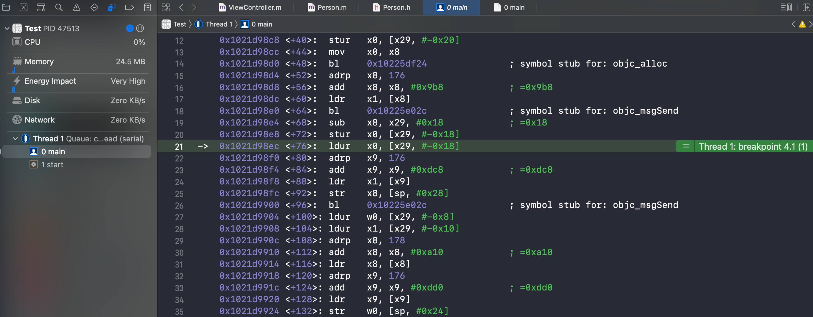
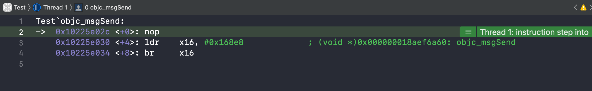

## objc_msgSend 流程汇编真机查看

使用普通工程，使用断点和 `Debug - Debug Workflow - Always Show Disassembly` 显示汇编调试工具，来进行 `objc_msgSend` 流程的展示

### 测试代码

`Person` 类

```objc
@interface Person : NSObject

- (void)say1;
- (void)say2;
- (void)say3;
- (void)say4;
- (void)say5;

@end

@implementation Person
- (void)say1
{
    
}
- (void)say2
{
    
}

- (void)say3
{
    
}

- (void)say4
{
    
}

- (void)say5
{
    
}
@end
```

`main.m`

```objc
int main(int argc, char * argv[]) {
    @autoreleasepool {
        
        Person *person = [[Person alloc] init];
        
        [person say1];
        [person say1];
        [person say2];
        [person say3];
        [person say4];
        [person say5];
        
        return UIApplicationMain(argc, argv, nil, NSStringFromClass([AppDelegate class]));
    }
}
```

在真机上运行

### 定位汇编代码

#### 断点

在  `[person say1];` 行添加断点

在真机运行断点捕捉到后，设置 `Debug - Debug Workflow - Always Show Disassembly` 显示汇编代码



使用 `ctrl + Step into` 进行向下执行语句，跳转至 `objc_msgSend` 语句



控制台输出确认当前目标方法

```shell
(lldb) register read x1
      x1 = 0x000000010225f2a1  "say1"
```

符合当前断点要执行的方法，继续 `ctrl + Step into` 向下跳转，进入 `objc_msgSend` 的动态汇编实现

### 动态汇编代码

根据 `class8` 相关汇编代码可知，由于架构不同导致执行的汇编代码存在差异，此时首先使用 `and  x16, x13, #ISA_MASK` 语句中的 `ISA_MASK` 的值来判定版本，其值对比源码[参考1] 中的值，在真机中当前测得两种，根据 `__has_feature(ptrauth_calls)` 是否为真，来区分

#### 异常问题

##### 异常问题描述

在使用 **iPhoneXs iOS13.7 / iPhoneXs Max iOS13.4.1**  进行真机运行时，动态汇编代码中的 ` ISA_MASK = 0xffffffff8` ，对比源码[参考1]时，发现执行的是 `!__has_feature(ptrauth_calls)` 的条件分支

在使用 **iPhoneXs Max iOS15.4.1 / iPhoneXs Max iOS 15.4.1** 进行真机运行时，动态汇编代码中的 `ISA_MASK = 0x7ffffffffffff8` ，对比源码[参考1]时，发现执行的是 `__has_feature(ptrauth_calls)` 的条件分支

##### 分析 

`__has_feature(ptrauth_calls)` 的解析参考《4-2》拓展部分

- `ptrauth_calls` 根据官方文档描述，其应对在 `arm64e`架构 `A12`以及以上处理器，此时 `iPhoneXs/iPhoneXs Max` 是符合该硬件条件的

- `__has_feature(x)` 指的是 Clang 编译器和 当前语言标准的规格支持 x

- 根据上述问题描述的现象，那么可得出猜测结论：

  > ~~在 `iOS13` 系统时，Clang编译器或当前语言标准的规格不支持 `ptrauth_calls`~~ 

  此结论后续真机中进行持续验证，orz 在结论中证实推导结论对比环境不同，结论失效

##### 结论

根据之后的源码对比发现 `iPhoneXs iOS13.7` 执行的是 `objc4-787.1` 以及之前版本的 `objc` 源码逻辑，与当前的 `__has_feature(ptrauth_calls)` 判断条件无关

那么上述猜测结论应是无法推导得出，非同一环境下的不适合按此对比

### 真机动态汇编代码分析

#### __has_feature(ptrauth_calls) 条件分支时

当前机型为：**iPhone12mini iOS14.1**

```assembly
libobjc.A.dylib`objc_msgSend:
    # x0 对象
->  0x1ab307960 <+0>:   cmp    x0, #0x0                  ; =0x0 
    0x1ab307964 <+4>:   b.le   0x1ab307a24               ; <+196>
    0x1ab307968 <+8>:   ldr    x13, [x0]
    # class = isa & ISA_MASK
    0x1ab30796c <+12>:  and    x16, x13, #0x7ffffffffffff8 
    0x1ab307970 <+16>:  xpacd  x16
    
    # CacheLookup
    0x1ab307974 <+20>:  mov    x15, x16
     # cache_t = isa + 0x10
    0x1ab307978 <+24>:  ldr    x11, [x16, #0x10]
     # CONFIG_USE_PREOPT_CACHES
      # 0x1ab3079d8 = LLookupPreopt\Function、w11末尾非零跳转
    0x1ab30797c <+28>:  tbnz   w11, #0x0, 0x1ab3079d8    ; <+120>
      # buckets = cache_t & bucketsMask
    0x1ab307980 <+32>:  and    x10, x11, #0xffffffffffff
      # x12 = (_cmd ^ (_cmd >> 7)) & mask  索引值计算
       # x12 = _cmd ^ (_cmd >> 7)
    0x1ab307984 <+36>:  eor    x12, x1, x1, lsr #7
       # x12 = x12 & mask // mask = cache_t >> 48 
    0x1ab307988 <+40>:  and    x12, x12, x11, lsr #48
     # CONFIG_USE_PREOPT_CACHES-endif
     
     # x13 = x12对应偏移索引值位置的 bucket_t
      # x13 = buckets + x12 * 16
    0x1ab30798c <+44>:  add    x13, x10, x12, lsl #4
     # 递减循环查找逻辑 
      #1
       #x17 = imp, x9 = sel, {imp, sel} = *bucket--
    0x1ab307990 <+48>:  ldp    x17, x9, [x13], #-0x10
       # 结合 b.ne 对比 sel != _cmp , 缓存是否命中
    0x1ab307994 <+52>:  cmp    x9, x1 
    0x1ab307998 <+56>:  b.ne   0x1ab3079a8               ; <+72>
    
      #2 CacheHit
        # x10 = buckets ^ SEL 
    0x1ab30799c <+60>:  eor    x10, x10, x1
        # x10 = buckets ^ SEL ^ isa  即 modifierForSEL(base, sel, cls)
    0x1ab3079a0 <+64>:  eor    x10, x10, x16
        # 跳转imp, 同时使用 x10 进行指针验证(pointer authentication) 即 ptrauth_auth_and_resign
    0x1ab3079a4 <+68>:  brab   x17, x10
    
      #3
       # if sel == 0 {uncahed}
    0x1ab3079a8 <+72>:  cbz    x9, 0x1ab307d60           ; _objc_msgSend_uncached
       # 结合 b.hs 判断 bucket_t >= buckets 地址是否大于首地址来继续或结束循环
    0x1ab3079ac <+76>:  cmp    x13, x10
    0x1ab3079b0 <+80>:  b.hs   0x1ab307990               ; <+48>
     # x13 < x10 超出 buckets的首位，当前首轮循环结束
     
     # 获取 buckets 最后一个索引值的 bucket_t
      # x13 = buckets + (cache_t >> 48) * 16 
    0x1ab3079b4 <+84>:  add    x13, x10, x11, lsr #44
     # 获取 首次定位的 bucket_t, 再次对比到时容器全部查询过一遍，结束循环
       #x12 = buckets + x12 * 16
    0x1ab3079b8 <+88>:  add    x12, x10, x12, lsl #4
     # 第二次递减循环查找逻辑 
      #4
    0x1ab3079bc <+92>:  ldp    x17, x9, [x13], #-0x10
    0x1ab3079c0 <+96>:  cmp    x9, x1
       # x9 == x1 时命中缓存，跳转 CacheHit
    0x1ab3079c4 <+100>: b.eq   0x1ab30799c               ; <+60>
       # 结合下一句的 ne 判断 if (x9 != 0)
    0x1ab3079c8 <+104>: cmp    x9, #0x0                  ; =0x0 
       # 结合 b.hi 可得 if (x13 > x12) {继续循环} 
    0x1ab3079cc <+108>: ccmp   x13, x12, #0x0, ne
    0x1ab3079d0 <+112>: b.hi   0x1ab3079bc               ; <+92>
       # else {buchets 全部遍历完成未命中，跳转 uncached}
    0x1ab3079d4 <+116>: b      0x1ab307d60               ; _objc_msgSend_uncached
    
    #LLookupPreopt\Function
    0x1ab3079d8 <+120>: and    x10, x11, #0x7ffffffffffffe
    0x1ab3079dc <+124>: autdb  x10, x16
    0x1ab3079e0 <+128>: adrp   x9, 221280
    0x1ab3079e4 <+132>: add    x9, x9, #0xd1a            ; =0xd1a 
    0x1ab3079e8 <+136>: sub    x12, x1, x9
    0x1ab3079ec <+140>: lsr    x17, x11, #55
    0x1ab3079f0 <+144>: lsr    w9, w12, w17
    0x1ab3079f4 <+148>: lsr    x17, x11, #60
    0x1ab3079f8 <+152>: mov    x11, #0x7fff
    0x1ab3079fc <+156>: lsr    x11, x11, x17
    0x1ab307a00 <+160>: and    x9, x9, x11
    0x1ab307a04 <+164>: ldr    x17, [x10, x9, lsl #3]
    0x1ab307a08 <+168>: cmp    x12, w17, uxtw
    0x1ab307a0c <+172>: b.ne   0x1ab307a18               ; <+184>
    0x1ab307a10 <+176>: sub    x17, x16, x17, lsr #32
    0x1ab307a14 <+180>: br     x17
    0x1ab307a18 <+184>: ldursw x9, [x10, #-0x8]
    0x1ab307a1c <+188>: add    x16, x16, x9
    0x1ab307a20 <+192>: b      0x1ab307978               ; <+24>
    0x1ab307a24 <+196>: b.eq   0x1ab307a48               ; <+232>
    0x1ab307a28 <+200>: and    x10, x0, #0x7
    0x1ab307a2c <+204>: asr    x11, x0, #55
    0x1ab307a30 <+208>: cmp    x10, #0x7                 ; =0x7 
    0x1ab307a34 <+212>: csel   x12, x11, x10, eq
    0x1ab307a38 <+216>: adrp   x10, 303104
    0x1ab307a3c <+220>: add    x10, x10, #0x7e0          ; =0x7e0 
    0x1ab307a40 <+224>: ldr    x16, [x10, x12, lsl #3]
    0x1ab307a44 <+228>: b      0x1ab307974               ; <+20>
    
    0x1ab307a48 <+232>: mov    x1, #0x0
    0x1ab307a4c <+236>: movi   d0, #0000000000000000
    0x1ab307a50 <+240>: movi   d1, #0000000000000000
    0x1ab307a54 <+244>: movi   d2, #0000000000000000
    0x1ab307a58 <+248>: movi   d3, #0000000000000000
    0x1ab307a5c <+252>: ret    
```

本段汇编源码对应  `objc4-818.2` 版本源码的  `objc-msg-arm64.s` 文件中的汇编源码

> 备注：<+40>  为断点位置，当前执行完成上一行代码，当前行未执行

##### 首个 say1 断点分析

当前真机执行到首个 `[self say1]` 时使用控制台输出验证流程为

```shell
## 第一个 say1
(lldb) register read x1
      x1 = 0x0000000102e6c774  "say1"
      
# <+28> tdnz 末尾为0，不执行 LLookupPreopt\Function
(lldb) register read w11
     w11 = 0x81f083c0
(lldb) register read x11
     x11 = 0x0001000281f083c0 
# x11 = cache_t = mask|buckets
# mask = 0x0001 容器最后一个索引位置，当前容器容量为2
# buckets = 0x000281f083c0

# <+40>
(lldb) register read x11
     x11 = 0x0001000281f083c0 
(lldb) register read x12
     x12 = 0x0000000100e30afa
     
# <+44>
 #计算索引值
 # 0x0001000281f083c0 >> 48 = 0x1  // mask = cache_t >> 48
 # 0x0000000100e30afa & 0x1 = 0xa & 0x1 = 1010 & 0001 = 0x0
(lldb) register read x12
     x12 = 0x0000000000000000
     
# <+48> 索引值为0，当前bucket_t即为buckets首地址
(lldb) register read x10
     x10 = 0x0000000281f083c0
(lldb) register read x13
     x13 = 0x0000000281f083c0
     
# <+52> x13 取出{imp, sel} 后自减 0x10
(lldb) register read x13
     x13 = 0x0000000281f083b0
  # x9 = sel  
(lldb) register read x9
      x9 = 0x00000001e148be1a 
  # 当前首次调用方法，容器中已存在一个数据？探究下
      
# <+56> x9 != x1 跳转 0x1ab3079a8
# <+72> 0x1ab3079a8  cbz x9 != 0 继续向下执行
# <+80>  x13 < x10 继续向下执行
(lldb) register read x13
     x13 = 0x0000000281f083b0
(lldb) register read x10
     x10 = 0x0000000281f083c0

# <+88> 查找最后一个索引值的bucket_t
(lldb) register read x11
     x11 = 0x0001000281f083c0
 # 计算 bucket_t 地址
 #0x0001000281f083c0 >> 48 = 0x1
 #1 * 16 = 0x10
 #x10(0x0000000281f083c0) + 0x10 =  0x0000000281f083d0

(lldb) register read x13
     x13 = 0x0000000281f083d0
     
# <+92> x12 首次循环定位索引位置bucket_t
(lldb) register read x12
     x12 = 0x0000000281f083c0

# <+96> x13 取出{imp, sel} 后自减 0x10
(lldb) register read x13
     x13 = 0x0000000281f083c0
(lldb) register read x9
      x9 = 0x0000000000000000
# x9 != x1 继续向下执行
# <+104> x9 = 0 执行至 <+116> 0x1ab307d60 uncached

# 此流程确认当前 buckets 容器数据如下：
#  0x0000000281f083c0 - 0x00000001e148be1a // init
#  0x0000000281f083d0 - 0x0000000000000000 
```

###### 问题及分析

- 使用 `ptrauth_calls` 的机型，依然未执行 `LLookupPreopt\Function` 相关逻辑，遗留问题：`LLookupPreopt\Function` 逻辑什么状况下执行

- 针对 mask 参考 `《6-3、cache_t源码分析》 reallocate() 小节` 中的 `setBucketsAndMask` 函数的分析，可知 `mask` 存储的是 （`bukect_t` 容器的容量 - 1），即最后一个索引位置

- `<+52> ` 断点位置，首次查询容器数据时存在一个缓存数据，探究下该数据是什么，为什么在首次缓存方法前存入？

  查看了一下代码，发现在 `say1` 之前进行了 `init` 在 `init` 位置打断点，发现在 `alloc` 后存在一个 `symbol stub for: objc_msgSend` ，使用断点进入内部发现

  ```shell
  (lldb) register read x1
        x1 = 0x00000001e148be1a 
  ```

  与查到的 `x9` 相同，那就是 `init` 方法先进行了缓存

- 针对首个方法的 `objc_msgSend` ，发现其动态汇编与其后的不同，并非执行当前的 `CacheLookup` 这一流程，探究下

  根据 《6-3、Cache_t源码分析》所述，首个方法应该执行的是 `reallocate()` 进行空间开辟

###### warning 此处对首个msgSend需更详细探究

后续探究总结消息发送完整流程

##### 第二个 say1 断点分析

当前真机执行到第二个 `[self say1]` 时流程为

```shell
## 第二个say1
# —— 之前部分与 say1相同

# <+96> x13 自减 0x10
(lldb) register read x13
     x13 = 0x0000000281f083c0
(lldb) register read x9
      x9 = 0x0000000102e6c774  "say1"
# x9 = x1  跳转  <+60> 0x1ab30799c CacheHit
# <+68>
(lldb) register read x10
     x10 = 0x0000000281ffc124

# 之后下一跳转进入 say1 方法，在方法中
(lldb) register read x17
     x17 = 0x7d64188102dd9c14 (0x0000000102dd9c14) Test`-[Person say1] at Person.m:14
   # 注意此处 brab 指令并不会把认证后地址写入目标寄存器，此处的 x17为之前 <+96> 步骤与 x9 同时存入的 imp 数据

# 此流程确认当前 buckets 容器数据如下：
#  0x0000000281f083c0 - 0x00000001e148be1a // init
#  0x0000000281f083d0 - 0x0000000102e6c774 "say1"
```

##### 第一个 say2 断点分析

```shell
## 第一个say2
(lldb) register read x1
      x1 = 0x0000000102e6c779  "say2"

# <+28> tdnz 末尾为0，不执行 LLookupPreopt\Function
(lldb) register read w11
     w11 = 0x81f083c0
(lldb) register read x11
     x11 = 0x0001000281f083c0

# <+40>
(lldb) register read x11
     x11 = 0x0001000281f083c0
(lldb) register read x12
     x12 = 0x0000000100e30af7

# <+44>
 # 计算索引值
 # 0x0001000281f083c0 >> 48 = 0x1
 # 0x0000000100e30af7 & 0x1 = 0x7 & 0x1 = 0111 & 0001 = 0x1
(lldb) register read x12
     x12 = 0x0000000000000001
# 索引值的变化追溯至 x1 地址的变化

# <+48> 索引值为1，当前bucket_t即为buckets首地址偏移1个步长
(lldb) register read x10
     x10 = 0x0000000281f083c0
(lldb) register read x13
     x13 = 0x0000000281f083d0

# <+52> x13 取出{imp, sel} 后自减 0x10
(lldb) register read x13
     x13 = 0x0000000281f083c0
(lldb) register read x9
      x9 = 0x0000000102e6c774  "say1"

# <+56> x9 != x1 跳转 0x1ab3079a8
# <+72> 0x1ab3079a8  cbz x9 != 0 继续向下执行
# <+80> x13 >= x10  跳转 0x1ab307990(<+48>) 进行循环
(lldb) register read x13
     x13 = 0x0000000281f083c0
(lldb) register read x10
     x10 = 0x0000000281f083c0

# <+48>  循环中 第2遍
(lldb) register read x10
     x10 = 0x0000000281f083c0
(lldb) register read x13
     x13 = 0x0000000281f083c0
# <+52> x13 取出{imp, sel} 后自减 0x10
(lldb) register read x13
     x13 = 0x0000000281f083b0
(lldb) register read x9
      x9 = 0x00000001e148be1a 

# <+56> x9 != x1 跳转 0x1ab3079a8
# <+72> 0x1ab3079a8  cbz x9 != 0 继续向下执行
# <+80> x13 < x10 继续向下执行
(lldb) register read x13
     x13 = 0x0000000281f083b0
(lldb) register read x10
     x10 = 0x0000000281f083c0

# <+88> 查找最后一个索引值的bucket_t
(lldb) register read x11
     x11 = 0x0001000281f083c0
 #计算 
 # 0x0001000281f083c0 >> 48 = 0x1
 # 1 * 16 = 0x10
 # x10(0x0000000281f083c0) + 0x10 =  0x0000000281f083d0
(lldb) register read x13
     x13 = 0x0000000281f083d0
# <+92> x12 首次循环定位索引1位置bucket_t 与 x13相同
(lldb) register read x12
     x12 = 0x0000000281f083d0

# <+96> x13 取出{imp, sel} 后自减 0x10
(lldb) register read x13
     x13 = 0x0000000281f083c0
(lldb) register read x9
      x9 = 0x0000000102e6c774  "say1"
# x9 != x1 继续向下执行
# <+104> x9 != 0 继续向下执行
# <+108> x13 < x12 继续向下执行
# <+116> 0x1ab307d60 uncached

# 此流程确认当前 buckets 容器数据如下：
#  0x0000000281f083c0 - 0x00000001e148be1a // init
#  0x0000000281f083d0 - 0x0000000102e6c774 "say1"
# buckets 已满
```

##### 第一个 say3 断点分析

```shell
## 第一个say3
(lldb) register read x1
      x1 = 0x0000000102e6c77e  "say3"

# <+28> tdnz 末尾为0，不执行 LLookupPreopt\Function
(lldb) register read x11
     x11 = 0x0003000280a68000
(lldb) register read w11
     w11 = 0x80a68000
# x11 = cache_t = mask|buckets
# mask = 0x0003 容器最后一个索引位置，当前容器容量为4，与之前不同，容器进行扩容了
# buckets = 0x000280a68000 

# <+40>
(lldb) register read x11
     x11 = 0x0003000280a68000
(lldb) register read x12
     x12 = 0x0000000100e30af0

# <+44>
 # 计算索引值
 # 0x0003000280a68000 >> 48 = 0x3
 # 0x0000000100e30af0 & 0x3  = 0x0
(lldb) register read x12
     x12 = 0x0000000000000000

# <+48> 索引值为0，当前bucket_t即为buckets首地址
(lldb) register read x13
     x13 = 0x0000000280a68000
(lldb) register read x10
     x10 = 0x0000000280a68000

# <+52> x13 取出{imp, sel} 后自减 0x10
(lldb) register read x13
     x13 = 0x0000000280a67ff0
(lldb) register read x9
      x9 = 0x0000000000000000

# <+56> x9 != x1 跳转 0x1ab3079a8
# <+72> 0x1ab3079a8  cbz x9 = 0 跳转 0x1ab307d60 uncached

```

###### buckets 容器变化分析

此流程确认当前 buckets 容器数据如下：

  `0x0000000280a68000 - 0x0000000000000000 `

索引值为0数据为空，与say2断点时的 buckets 容器的地址和首个数据均不同，同时 `mask` 变更为 `0x0003` ，对应容器容量变为4，是 buckets 进行了扩容

扩容根据 《6-3、Cache_t源码分析》 中的分析，**扩容清空了旧数据**，同时查看扩容逻辑对比当前真机环境情况

- 扩容前，首次初始化时 `INIT_CACHE_SIZE = (1 << 1) = 2` ，容器容量为 `2`  

  ```C++
  INIT_CACHE_SIZE      = (1 << INIT_CACHE_SIZE_LOG2),
  
  //  ---- INIT_CACHE_SIZE_LOG2 ----
  #if CACHE_END_MARKER || (__arm64__ && !__LP64__)
   //...
  #else
      // Allow an initial bucket size of 2 buckets, since a large number of
      // classes, especially metaclasses, have very few imps, and we support
      // the ability to fill 100% of the cache before resizing.
      INIT_CACHE_SIZE_LOG2 = 1,
  #endif
  ```

- 扩容逻辑

  ```C++
    MAX_CACHE_SIZE_LOG2  = 16,
    MAX_CACHE_SIZE       = (1 << MAX_CACHE_SIZE_LOG2),
  
  //扩容逻辑代码
    capacity = capacity ? capacity * 2 : INIT_CACHE_SIZE;
    if (capacity > MAX_CACHE_SIZE) {
        capacity = MAX_CACHE_SIZE;
    }
    reallocate(oldCapacity, capacity, true);
  ```

  根据源码可知扩容后容器大小为 4

  根据当前日志分析，当前方法 `say3` 会插入到容器的首位位置

  后续可通过日志验证容器大小和 `say3` 位置

- 扩容时机

  首次扩容时机，参考上文注释 `to fill 100% of the cache before resizing` 填充满后再进行扩容

  之后的当前真机环境的非首次的扩容时机，参考 `《6-3、Cache_t源码分析》- else if 2 ` 小节可知当前扩容条件判断为

  ```swift
  //源码伪代码直译版本
  if occupied <= capacity * (7 / 8) {
    //插入空位
  } else if capacity <= 8 && occupied <= capacity {
    //插入空位
  } else {
    //扩容
  }
  
  //转换一下判断条件
  if capacity <= 8 && occupied <= capacity {
    //插入空位
  } else if occupied <= capacity * (7 / 8) {
    //插入空位
  } else {
    //扩容
  }
  ```

  > 总结为：真机环境下，容量不大于8时，可全部填满后再扩容；容量大于8时，填充至超出 (7 / 8) 容量后进行扩容

  当前代码套用该逻辑判断，需要再填充3个方法后，再下一次填充时扩容为容量大小为8的容器

###### warning 此处探究下扩容的动态汇编源码

扩容逻辑需要执行 `cache.insert()` 方法，需要在方法查找流程后进行，当前中间流程未分析，此探究延后到方法查找流程完成分析后

##### 第一个 say4 断点分析

```shell
## 第一个say4
(lldb) register read x1
      x1 = 0x0000000102e6c783  "say4"

# <+28> tdnz 末尾为0，不执行 LLookupPreopt\Function 
(lldb) register read x11
     x11 = 0x0003000280a68000
(lldb) register read w11
     w11 = 0x80a68000
 # 与 say3 相同

# <+40>
(lldb) register read x11
     x11 = 0x0003000280a68000
(lldb) register read x12
     x12 = 0x0000000100e30a0c

# <+44>
 # 计算索引值
 # 0x0003000280a68000 >> 48 = 0x3
 # 0x0000000100e30a0c & 0x3  = 0xc & 0x3 = 0100 & 0011 = 0x0
(lldb) register read x12
     x12 = 0x0000000000000000

# <+48> 索引值为0，当前bucket_t即为buckets首地址
(lldb) register read x13
     x13 = 0x0000000280a68000
(lldb) register read x10
     x10 = 0x0000000280a68000

# <+52> x13 取出{imp, sel} 后自减 0x10
(lldb) register read x13
     x13 = 0x0000000280a67ff0
(lldb) register read x9
      x9 = 0x0000000102e6c77e  "say3"

# <+56> x9 != x1 跳转 0x1ab3079a8
# <+72> 0x1ab3079a8  cbz x9 != 0 继续向下执行
# <+80> x13 < x10 继续向下执行
(lldb) register read x13
     x13 = 0x0000000280a67ff0
(lldb) register read x10
     x10 = 0x0000000280a68000

# <+88> 查找最后一个索引值的bucket_t
(lldb) register read x11
     x11 = 0x0003000280a68000
 # 计算 
 # 0x0003000280a68000 >> 48 = 0x3
 # 3 * 16 = 0x30
 # x10(0x0000000280a68000) + 0x30 =  0x0000000280a68030
(lldb) register read x13
     x13 = 0x0000000280a68030

# <+92> x12 首次循环定位索引0位置bucket_t相同
(lldb) register read x12
     x12 = 0x0000000280a68000

# <+96> x13 取出{imp, sel} 后自减 0x10
(lldb) register read x13
     x13 = 0x0000000280a68020
(lldb) register read x9
      x9 = 0x0000000102e6c779  "say2"
# <+100> x9 != x1 继续向下执行
# <+104> x9 != 0 继续向下执行
# <+108> x13 > x12 跳转 循环首部 0x1ab3079bc(+92)

# <+92>  循环第二次
# <+96>  x13 取出{imp, sel} 后自减 0x10
(lldb) register read x13
     x13 = 0x0000000280a68010
(lldb) register read x9
      x9 = 0x0000000000000000
# <+100> x9 != x1 继续向下执行
# <+104> x9 == 0 向下执行
# <+116> 跳转 0x1ab307d60 uncached

# 当前容器存储位置
# 0x0000000280a68000  — 0x0000000102e6c77e  "say3"
# 0x0000000280a68020  —  0x0000000000000000
# 0x0000000280a68030  —  0x0000000102e6c779  "say2"
```

由于首次循环定位的索引值为0，因此首个循环只进行了首地址索引位置数据查询

第二次循环定位的容器末尾索引值为 3，因此当前容器容量为 4，符合 `say3` 中扩容后容器大小的分析，在地址从末尾向前偏移一个步长后找到空位，因此当前日志中并未对 `0x0000000280a68010` 位置的数据进行查看，大概率也为空位，当前只插入了 `say2、say3` 两个数据 

##### 第一个 say5 断点分析

```shell
## 第一个say5
(lldb) register read x1
      x1 = 0x0000000102e6c788  "say5"

# <+28> tdnz 末尾为0，不执行 LLookupPreopt\Function 
(lldb) register read x11
     x11 = 0x0003000280a68000
(lldb) register read w11
     w11 = 0x80a68000
# 与 say3/say4 的 x11(cache_t) 相同，与 say1/say2 不同

# <+40>
(lldb) register read x11
     x11 = 0x0003000280a68000
(lldb) register read x12
     x12 = 0x0000000100e30a07

# <+44>
 # 计算索引值
 # 0x0003000280a68000 >> 48 = 0x3
 # 0x0000000100e30a07 & 0x3 = 0x7 & 0x3 = 0111 & 0011 = 0x3
(lldb) register read x12
     x12 = 0x0000000000000003

# <+48> 索引值为3，当前bucket_t即为buckets首地址偏移3个步长
(lldb) register read x13
     x13 = 0x0000000280a68030
(lldb) register read x10
     x10 = 0x0000000280a68000

# <+52> x13 取出{imp, sel} 后自减 0x10
(lldb) register read x13
     x13 = 0x0000000280a68020
(lldb) register read x9
      x9 = 0x0000000102e6c779  "say2"

# <+56> x9 != x1 跳转 0x1ab3079a8
# <+72> 0x1ab3079a8  cbz x9 != 0 继续向下执行
# <+80> x13 > x10 跳转 0x1ab307990 (+48)
(lldb) register read x13
     x13 = 0x0000000280a68020
(lldb) register read x10
     x10 = 0x0000000280a68000

# <+48>  循环第2次
# <+52> x13 取出{imp, sel} 后自减 0x10
(lldb) register read x13
     x13 = 0x0000000280a68010
(lldb) register read x9
      x9 = 0x0000000102e6c783  "say4"
# <+56> x9 != x1 跳转 0x1ab3079a8
# <+72> 0x1ab3079a8  cbz x9 != 0 继续向下执行
# <+80 > x13 > x10 跳转 0x1ab307990 (+48)
(lldb) register read x13
     x13 = 0x0000000280a68010
(lldb) register read x10
     x10 = 0x0000000280a68000

# <+48>  循环第3次
# <+52> x13 取出{imp, sel} 后自减 0x10
(lldb) register read x13
     x13 = 0x0000000280a68000
(lldb) register read x9
      x9 = 0x0000000000000000
# <+56> x9 != x1 跳转 0x1ab3079a8
# <+72> 0x1ab3079a8  cbz x9 = 0 跳转 0x1ab307d60 uncached

# 当前容器存储数据
# 0x0000000280a68010  — 0x0000000000000000
# 0x0000000280a68020 — 0x0000000102e6c783  "say4"
# 0x0000000280a68030 — 0x0000000102e6c779  "say2"
```

当前容器首次循环时，算法计算得出的索引值为 3，未遍历完循环就找到空位，因此未遍历首地址 `0x0000000280a68000` 的数据，结合 `say4` 断点分析可知，当前容器存储数据结构为

```shell
# 当前容器存储数据
# 0x0000000280a68000  — 0x0000000102e6c77e  "say3"
# 0x0000000280a68010  — 0x0000000000000000
# 0x0000000280a68020 — 0x0000000102e6c783  "say4"
# 0x0000000280a68030 — 0x0000000102e6c779  "say2"
```

由于当前容器容量为4，小于8，因此在真机运行情况下，扩容逻辑为 `fill 100% ` 填充满后再进行，因此当前在索引值 1 位置插入 `say5`，不进行扩容，可通过之后的再次调用 `say5` 方法验证

##### 第二个 say5 断点分析

```shell
## 第二个say5
# -- 之前均与首个 say5断点相同 
# <+48>  循环第3次
# <+52> x13 取出{imp, sel} 后自减 0x10
(lldb) register read x13
     x13 = 0x0000000280a68000
(lldb) register read x9
      x9 = 0x0000000102e6c788  "say5"
# <+56> x9 = x1  向下执行
# <+60> CacheHit
# <+68>
(lldb) register read x10
     x10 = 0x0000000280a9c218

# 之后下一跳转进入 say5 方法，在方法中
(lldb) register read x17
     x17 = 0x1273710102dd9c64 (0x0000000102dd9c64) Test`-[Person say5] at Person.m:34
   # 注意此处 brab 指令并不会把认证后地址写入目标寄存器，此处的 x17为之前 <+52> 步骤与 x9 同时存入的 imp 数据

# 当前容器存储数据
# 0x0000000280a68010  — 0x0000000102e6c788  "say5"
# 0x0000000280a68020 — 0x0000000102e6c783  "say4"
# 0x0000000280a68030 — 0x0000000102e6c779  "say2"
```

遍历至 `0x0000000280a68000` 位置前就查找到 `say5` 方法，缓存命中就跳转方法实现了

根据之前的分析情况，当前容器存储数据情况为

```shell
# 当前容器存储数据
# 0x0000000280a68000  — 0x0000000102e6c77e  "say3"
# 0x0000000280a68010  — 0x0000000102e6c788  "say5"
# 0x0000000280a68020 — 0x0000000102e6c783  "say4"
# 0x0000000280a68030 — 0x0000000102e6c779  "say2"
```


#### 另外机型系统环境

当前机型： **iPhoneXs iOS13.7**

```assembly
libobjc.A.dylib`objc_msgSend:
->  0x1a48e6a60 <+0>:   cmp    x0, #0x0                  ; =0x0 
    # x0 <= 0 则跳转 0x1a48e6ae0<+128>
    0x1a48e6a64 <+4>:   b.le   0x1a48e6ae0               ; <+128>
    0x1a48e6a68 <+8>:   ldr    x13, [x0]
    # class = isa & ISA_MASK
    0x1a48e6a6c <+12>:  and    x16, x13, #0xffffffff8
    # cache_t = isa + 0x10
    0x1a48e6a70 <+16>:  ldr    x11, [x16, #0x10]
    
    # CACHE_MASK_STORAGE_HIGH_16_BIG_ADDRS
     # buckets = cache_t & bucketsMask
    0x1a48e6a74 <+20>:  and    x10, x11, #0xffffffffffff
     # x12 = _cmd & mask
    0x1a48e6a78 <+24>:  and    x12, x1, x11, lsr #48
    #endif
    
    # x12 = x12对应偏移索引值位置的 bucket_t
     # x12 = buckets + x12 * 16
    0x1a48e6a7c <+28>:  add    x12, x10, x12, lsl #4
    # x17 = imp, x9 = sel, {imp, sel} = *bucket
    0x1a48e6a80 <+32>:  ldp    x17, x9, [x12]
    
    # 第一轮循环
    # 1
     # 结合 b.ne 对比 sel != _cmp , 缓存是否命中
    0x1a48e6a84 <+36>:  cmp    x9, x1
     # 不等跳转 0x1a48e6a98<+56>
    0x1a48e6a88 <+40>:  b.ne   0x1a48e6a98               ; <+56>
    
    # CacheHit
     # x12 = buckets ^ SEL 
    0x1a48e6a8c <+44>:  eor    x12, x12, x1
     # x12 = buckets ^ SEL ^ isa  即 modifierForSEL(base, sel, cls)
    0x1a48e6a90 <+48>:  eor    x12, x12, x16
     # 跳转imp, 同时使用 x12 进行指针验证(pointer authentication) 即 ptrauth_auth_and_resign
    0x1a48e6a94 <+52>:  brab   x17, x12
    
    # 2
     # if sel == 0 {uncahed}
    0x1a48e6a98 <+56>:  cbz    x9, 0x1a48e6de0           ; _objc_msgSend_uncached
     # 结合 b.eq 判断 bucket_t == buckets 地址是等于首地址来继续或结束当前循环
    0x1a48e6a9c <+60>:  cmp    x12, x10
    0x1a48e6aa0 <+64>:  b.eq   0x1a48e6aac               ; <+76>
     # x17 = imp, x9 = sel, {imp, sel} = *--bucket
    0x1a48e6aa4 <+68>:  ldp    x17, x9, [x12, #-0x10]!
     # 跳转 <+36> 对比 x9 是否命中
    0x1a48e6aa8 <+72>:  b      0x1a48e6a84               ; <+36>
        
    # 3
     # 获取 buckets 最后一个索引值的 bucket_t
      # x12 = buckets + (cache_t >> 48) * 16 
    0x1a48e6aac <+76>:  add    x12, x12, x11, lsr #44
    # x17 = imp, x9 = sel, {imp, sel} = *bucket
    0x1a48e6ab0 <+80>:  ldp    x17, x9, [x12]
      
    # 第二轮循环
    # 1
    # 结合 b.ne 对比 sel != _cmp , 缓存是否命中
    0x1a48e6ab4 <+84>:  cmp    x9, x1
    0x1a48e6ab8 <+88>:  b.ne   0x1a48e6ac8               ; <+104>
        
    # CacheHit
      # x12 = buckets ^ SEL
    0x1a48e6abc <+92>:  eor    x12, x12, x1
      # x12 = buckets ^ SEL ^ isa  即 modifierForSEL(base, sel, cls)
    0x1a48e6ac0 <+96>:  eor    x12, x12, x16
      # 跳转imp, 同时使用 x12 进行指针验证(pointer authentication) 即 ptrauth_auth_and_resign
    0x1a48e6ac4 <+100>: brab   x17, x12
        
    # 2
     # if sel == 0 {uncahed}
    0x1a48e6ac8 <+104>: cbz    x9, 0x1a48e6de0           ; _objc_msgSend_uncached
     # 结合 b.eq 判断 bucket_t == buckets 地址是等于首地址来继续或结束循环 (注意此处对首个循环已循环过的成员依然进行遍历)
    0x1a48e6acc <+108>: cmp    x12, x10
     # bucket_t = buckets  跳转 uncached
    0x1a48e6ad0 <+112>: b.eq   0x1a48e6adc               ; <+124>
     # x17 = imp, x9 = sel, {imp, sel} = *--bucket
    0x1a48e6ad4 <+116>: ldp    x17, x9, [x12, #-0x10]!
     # 循环跳转 <+84> 判断 x9 是否命中
    0x1a48e6ad8 <+120>: b      0x1a48e6ab4               ; <+84>
    
    0x1a48e6adc <+124>: b      0x1a48e6de0               ; _objc_msgSend_uncached
    
    # <+4> x0 <= 0 跳转，x0 = 0 跳转 0x1a48e6b18<+184>, 小于0则执行后续的 tagged pointer 逻辑
    0x1a48e6ae0 <+128>: b.eq   0x1a48e6b18               ; <+184>
     
    # LNilOrTagged:
     # _objc_debug_taggedpointer_classes@PAGE = 321550 即加载 tagged pointer 主表
    0x1a48e6ae4 <+132>: adrp   x10, 321550
     # _objc_debug_taggedpointer_classes@PAGEOFF = #0x5c0
    0x1a48e6ae8 <+136>: add    x10, x10, #0x5c0          ; =0x5c0 
     # x0 前4位保存 tagged pointer 的索引，因此右移 60 位获取该索引
    0x1a48e6aec <+140>: lsr    x11, x0, #60
     # 通过 x11 里的索引 * 2^3，对 x10 进行偏移获取查找的条目
    0x1a48e6af0 <+144>: ldr    x16, [x10, x11, lsl #3]
     # _OBJC_CLASS_$___NSUnrecognizedTaggedPointer@PAGE = 321550
    0x1a48e6af4 <+148>: adrp   x10, 321550
     # _OBJC_CLASS_$___NSUnrecognizedTaggedPointer@PAGEOFF = #0x528
    0x1a48e6af8 <+152>: add    x10, x10, #0x528          ; =0x528 
     # 对比 x10 与 x16
    0x1a48e6afc <+156>: cmp    x10, x16
     # x10 != x16 跳转 <+16>
    0x1a48e6b00 <+160>: b.ne   0x1a48e6a70               ; <+16>
    
     # extra tagged
      # _objc_debug_taggedpointer_ext_classes@PAGE = 321550
    0x1a48e6b04 <+164>: adrp   x10, 321550
      # _objc_debug_taggedpointer_ext_classes@PAGEOFF = #0x640
    0x1a48e6b08 <+168>: add    x10, x10, #0x640          ; =0x640 
      # 加载扩展类的索引 x0 从52位开始，提取8位，保存到 x11
    0x1a48e6b0c <+172>: ubfx   x11, x0, #52, #8
      # 通过 x11 里的索引 * 2^3，对 x10 进行偏移获取查找的条目
    0x1a48e6b10 <+176>: ldr    x16, [x10, x11, lsl #3]
      # 跳转 <+16>
    0x1a48e6b14 <+180>: b      0x1a48e6a70               ; <+16>
    
    0x1a48e6b18 <+184>: mov    x1, #0x0
    0x1a48e6b1c <+188>: movi   d0, #0000000000000000
    0x1a48e6b20 <+192>: movi   d1, #0000000000000000
    0x1a48e6b24 <+196>: movi   d2, #0000000000000000
    0x1a48e6b28 <+200>: movi   d3, #0000000000000000
    0x1a48e6b2c <+204>: ret       
```

对照源码可知，其对应的 `objc4-787.1` 以及之前版本的 `objc-msg-arm64.s` 文件中对应的源码，与 `__has_feature(ptrauth_calls)`  判断条件无关

此版本源码[参考2]不再进行详细解析，解析参考 [objc_msgSend的汇编理解](https://www.jianshu.com/p/a0ed19d2bf94/)


##### 首个 say1 断点分析

当前真机执行到首个 `[self say1]` 断点时使用控制台单步执行时，输出验证流程

```shell
## 第一个 say1
(lldb) register read x1
      x1 = 0x000000010416f289  "say1"

# <+0>
(lldb) register read x0
      x0 = 0x0000000281568000

# <+16>
(lldb) register read x16
     x16 = 0x0000000102fa4570  (void *)0x000000010419c548: Person

# <+24>
(lldb) register read x11
     x11 = 0x000300028023c040
 # mask = 0x0003  当前容器大小为 4

(lldb) register read x10
     x10 = 0x000000028023c040

# <+28>
 # 计算
 # 0x000300028023c040 >> 48 = 0x3
 # 0x3 & 0x000000010416f289 = 0x3 & 0x9 = 0011 & 1001 = 0x1
(lldb) register read x12
     x12 = 0x0000000000000001

# <+32>
(lldb) register read x10
     x10 = 0x000000028023c040
(lldb) register read x12
     x12 = 0x000000028023c050

# <+36>
(lldb) register read x9
      x9 = 0x0000000000000000
#  <+40> x9 != x1  跳转  0x1a48e6a98  <+56>
#  <+56> x9 = 0  跳转 uncached
```

根据 `cache_t(x11) ` 地址可知 `mask = 0x0003`  当前容器大小为 4，可以确认当前首次开辟空间为4

##### 第二个 say1 断点分析

```shell
## 第二个 say1
(lldb) register read x1
      x1 = 0x000000010416f289  "say1"

# — 之前与 第一个say1 相同
# <+36>
(lldb) register read x12
     x12 = 0x000000028023c050
(lldb) register read x9
      x9 = 0x000000010416f289  "say1"

# <+40> x9 = x1 继续向下执行 CacheHit
# <+52>
(lldb) register read x12
     x12 = 0x00000002802cf7a9

# 跳转到方法内部
(lldb) register read x17
     x17 = 0xb4687981040dccc4 (0x00000001040dccc4) Test`-[Person say1] at Person.m:14
 # 注意此处 brab 指令并不会把认证后地址写入目标寄存器，此处的 x17为之前 <+36> 步骤与 x9 同时存入的 imp 数据
```

##### 第一个 say2 断点分析

```shell
## 第一个 say2
(lldb) register read x1
      x1 = 0x000000010416f28e  "say2"

# <+24>
(lldb) register read x11
     x11 = 0x000300028023c040
(lldb) register read x10
     x10 = 0x000000028023c040

# <+28>
 # 计算
 # 0x000300028023c040 >> 48 = 0x3
 # 0x3 & 0x000000010416f28e = 0x3 & 0xe = 0011 & 1110 = 0x2
(lldb) register read x12
     x12 = 0x0000000000000002

# <+32>
(lldb) register read x10
     x10 = 0x000000028023c040
(lldb) register read x12
     x12 = 0x000000028023c060

# <+36>
(lldb) register read x9
      x9 = 0x00000001e15712ba
(lldb) register read x17
     x17 = 0x6b6a5701a48e651c (0x00000001a48e651c) libobjc.A.dylib`-[NSObject init]

#  <+40> x9 != x1  跳转  0x1a48e6a98  <+56>
#  <+56> x9 != 0  继续向下执行
#  <+60> x12 != x10 继续向下执行
(lldb) register read x12
     x12 = 0x000000028023c060
(lldb) register read x10
     x10 = 0x000000028023c040

# <+72> x17 = imp, x9 = sel, {imp, sel} = *--bucket 自减，后续跳转 <+36>
(lldb) register read x9
      x9 = 0x000000010416f289  "say1"
(lldb) register read x17
     x17 = 0xb4687981040dccc4 (0x00000001040dccc4) Test`-[Person say1] at Person.m:14

# <+36> 循环第2次执行此
#  <+40> x9 != x1  跳转  0x1a48e6a98  <+56>
#  <+56> x9 != 0  继续向下执行
#  <+60> x12 != x10 继续向下执行
(lldb) register read x10
     x10 = 0x000000028023c040
(lldb) register read x12
     x12 = 0x000000028023c050

# <+72> x17 = imp, x9 = sel, {imp, sel} = *--bucket 自减，后续跳转 <+36>
(lldb) register read x9
      x9 = 0x0000000000000000
(lldb) register read x17
     x17 = 0x0000000000000000

# <+36> 循环第3次执行此
#  <+40> x9 != x1  跳转  0x1a48e6a98  <+56>
#  <+56> x9 = 0  跳转 uncached

# 当前容器数据为
# 0x000000028023c040 — 0x0000000000000000
# 0x000000028023c050 — 0x000000010416f289  "say1"
# 0x000000028023c060 — 0x00000001e15712ba  // [NSObject init]

```

此次使用输出 `x17 (imp)` 方式验证了首个方法存入的是 `[NSObject init]` 方法的缓存数据

##### 第一个 say3 断点分析

```shell
# 第一个 say3
(lldb) register read x1
      x1 = 0x000000010416f293  "say3"

# <+24>
(lldb) register read x11
     x11 = 0x000300028023c040
# mask = 0x0003  当前容器大小为 4

(lldb) register read x10
     x10 = 0x000000028023c040

# <+28>
 # 计算
 # 0x000300028023c040 >> 48 = 0x3
 # 0x3 & 0x000000010416f293 = 0x3 & 0x3 = 0x3
(lldb) register read x12
     x12 = 0x0000000000000003

# <+32>
(lldb) register read x10
     x10 = 0x000000028023c040
(lldb) register read x12
     x12 = 0x000000028023c070

# <+36>
(lldb) register read x9
      x9 = 0x0000000000000000

#  <+40> x9 != x1  跳转  0x1a48e6a98  <+56>
#  <+56> x9 = 0  跳转 uncached

# 当前容器数据为
# 0x000000028023c070 — 0x0000000000000000
```

##### 第一个 say4 断点分析

```shell
## 第一个 say4
(lldb) register read x1
      x1 = 0x000000010416f298  "say4"

# <+24>
(lldb) register read x16
     x16 = 0x000000010419c570  (void *)0x000000010419c548: Person
(lldb) register read x11
     x11 = 0x0007000283970000
# mask = 0x0007  buckets 容量变为 7
(lldb) register read x10
     x10 = 0x0000000283970000

# <+28>
 # 计算
 # 0x0007000283970000 >> 48 = 0x7
 # 0x7 & 0x000000010416f298 = 0x7 & 0x8 = 0111 & 1000 = 0x0
(lldb) register read x12
     x12 = 0x0000000000000000

# <+32>
(lldb) register read x10
     x10 = 0x0000000283970000
(lldb) register read x12
     x12 = 0x0000000283970000

# <+36>
(lldb) register read x9
      x9 = 0x0000000000000000
#  <+40> x9 != x1  跳转  0x1a48e6a98  <+56>
#  <+56> x9 = 0  跳转 uncached

# 当前容器数据为
# 0x0000000283970000 — 0x0000000000000000
```

根据 `cache_t(x11) ` 地址可知 `mask = 0x0007`  当前容器大小为 8，可以确认当前当前进行了扩容，容器大小由 4 变为 8

> 暂不探究此版本的扩容逻辑

##### 第一个 say5 断点分析

```shell
## 第一个 say5
(lldb) register read x1
      x1 = 0x000000010416f29d  "say5"

# <+24>
(lldb) register read x11
     x11 = 0x0007000283970000
(lldb) register read x10
     x10 = 0x0000000283970000

# <+28>
 # 计算
 # 0x0007000283970000 >> 48 = 0x7
 # 0x7 & 0x000000010416f29d = 0x7 & 0xd = 0111 & 1101 = 101 = 0x5
(lldb) register read x12
     x12 = 0x0000000000000005

# <+32>
(lldb) register read x10
     x10 = 0x0000000283970000
(lldb) register read x12
     x12 = 0x0000000283970050

# <+36>
(lldb) register read x9
      x9 = 0x0000000000000000

#  <+40> x9 != x1  跳转  0x1a48e6a98  <+56>
#  <+56> x9 = 0  跳转 uncached

# 当前容器数据为
# 0x0000000283970050 — 0x0000000000000000
```

后续需再填入多个方法直至满足扩容条件，便不再尝试进行

##### 第二个 say5 断点分析

```shell
## 第二个 say5
(lldb) register read x1
      x1 = 0x000000010416f29d  "say5"
# — 之前与第一个 say5 一样
# <+36>
(lldb) register read x9
      x9 = 0x000000010416f29d  "say5"

# <+40> x9 = x1 继续向下执行 CacheHit
# <+52>
(lldb) register read x12
     x12 = 0x00000002839837bd

# 跳转到方法内部
(lldb) register read x17
     x17 = 0x4b259a01040dcd14 (0x00000001040dcd14) Test`-[Person say5] at Person.m:34

# 当前容器数据为
# 0x0000000283970050 — 0x000000010416f29d  "say5"
```


## 参考

### 参考1  ISA_MASK

```C++
#if SUPPORT_PACKED_ISA
# if __arm64__
// ARM64 simulators have a larger address space, so use the ARM64e
// scheme even when simulators build for ARM64-not-e.
#   if __has_feature(ptrauth_calls) || TARGET_OS_SIMULATOR
#     define ISA_MASK        0x007ffffffffffff8ULL
// 省略其他项
#   else
#     define ISA_MASK        0x0000000ffffffff8ULL
// 省略其他项
#   endif

# elif __x86_64__
// 省略非真机
# else
#   error unknown architecture for packed isa
# endif

// SUPPORT_PACKED_ISA
#endif
```

### 参考2 ObjC源码 

`ObjC4-787.1` 版本源码 `objc-msg-arm64.s` 文件

#### CacheLookup 相关源码

```assembly
/********************************************************************
 *
 * CacheLookup NORMAL|GETIMP|LOOKUP <function>
 *
 * Locate the implementation for a selector in a class method cache.
 *
 * When this is used in a function that doesn't hold the runtime lock,
 * this represents the critical section that may access dead memory.
 * If the kernel causes one of these functions to go down the recovery
 * path, we pretend the lookup failed by jumping the JumpMiss branch.
 *
 * Takes:
 *	 x1 = selector
 *	 x16 = class to be searched
 *
 * Kills:
 * 	 x9,x10,x11,x12, x17
 *
 * On exit: (found) calls or returns IMP
 *                  with x16 = class, x17 = IMP
 *          (not found) jumps to LCacheMiss
 *
 ********************************************************************/

#define NORMAL 0
#define GETIMP 1
#define LOOKUP 2

// CacheHit: x17 = cached IMP, x12 = address of cached IMP, x1 = SEL, x16 = isa
.macro CacheHit
.if $0 == NORMAL
	TailCallCachedImp x17, x12, x1, x16	// authenticate and call imp
.elseif $0 == GETIMP
	mov	p0, p17
	cbz	p0, 9f			// don't ptrauth a nil imp
	AuthAndResignAsIMP x0, x12, x1, x16	// authenticate imp and re-sign as IMP
9:	ret				// return IMP
.elseif $0 == LOOKUP
	// No nil check for ptrauth: the caller would crash anyway when they
	// jump to a nil IMP. We don't care if that jump also fails ptrauth.
	AuthAndResignAsIMP x17, x12, x1, x16	// authenticate imp and re-sign as IMP
	ret				// return imp via x17
.else
.abort oops
.endif
.endmacro

.macro CheckMiss
	// miss if bucket->sel == 0
.if $0 == GETIMP
	cbz	p9, LGetImpMiss
.elseif $0 == NORMAL
	cbz	p9, __objc_msgSend_uncached
.elseif $0 == LOOKUP
	cbz	p9, __objc_msgLookup_uncached
.else
.abort oops
.endif
.endmacro

.macro JumpMiss
.if $0 == GETIMP
	b	LGetImpMiss
.elseif $0 == NORMAL
	b	__objc_msgSend_uncached
.elseif $0 == LOOKUP
	b	__objc_msgLookup_uncached
.else
.abort oops
.endif
.endmacro

.macro CacheLookup
	//
	// Restart protocol:
	//
	//   As soon as we're past the LLookupStart$1 label we may have loaded
	//   an invalid cache pointer or mask.
	//
	//   When task_restartable_ranges_synchronize() is called,
	//   (or when a signal hits us) before we're past LLookupEnd$1,
	//   then our PC will be reset to LLookupRecover$1 which forcefully
	//   jumps to the cache-miss codepath which have the following
	//   requirements:
	//
	//   GETIMP:
	//     The cache-miss is just returning NULL (setting x0 to 0)
	//
	//   NORMAL and LOOKUP:
	//   - x0 contains the receiver
	//   - x1 contains the selector
	//   - x16 contains the isa
	//   - other registers are set as per calling conventions
	//
LLookupStart$1:

	// p1 = SEL, p16 = isa
	ldr	p11, [x16, #CACHE]				// p11 = mask|buckets

#if CACHE_MASK_STORAGE == CACHE_MASK_STORAGE_HIGH_16
	and	p10, p11, #0x0000ffffffffffff	// p10 = buckets
	and	p12, p1, p11, LSR #48		// x12 = _cmd & mask
#elif CACHE_MASK_STORAGE == CACHE_MASK_STORAGE_LOW_4
	and	p10, p11, #~0xf			// p10 = buckets
	and	p11, p11, #0xf			// p11 = maskShift
	mov	p12, #0xffff
	lsr	p11, p12, p11				// p11 = mask = 0xffff >> p11
	and	p12, p1, p11				// x12 = _cmd & mask
#else
#error Unsupported cache mask storage for ARM64.
#endif


	add	p12, p10, p12, LSL #(1+PTRSHIFT)
		             // p12 = buckets + ((_cmd & mask) << (1+PTRSHIFT))

	ldp	p17, p9, [x12]		// {imp, sel} = *bucket
1:	cmp	p9, p1			// if (bucket->sel != _cmd)
	b.ne	2f			//     scan more
	CacheHit $0			// call or return imp
	
2:	// not hit: p12 = not-hit bucket
	CheckMiss $0			// miss if bucket->sel == 0
	cmp	p12, p10		// wrap if bucket == buckets
	b.eq	3f
	ldp	p17, p9, [x12, #-BUCKET_SIZE]!	// {imp, sel} = *--bucket
	b	1b			// loop

3:	// wrap: p12 = first bucket, w11 = mask
#if CACHE_MASK_STORAGE == CACHE_MASK_STORAGE_HIGH_16
	add	p12, p12, p11, LSR #(48 - (1+PTRSHIFT))
					// p12 = buckets + (mask << 1+PTRSHIFT)
#elif CACHE_MASK_STORAGE == CACHE_MASK_STORAGE_LOW_4
	add	p12, p12, p11, LSL #(1+PTRSHIFT)
					// p12 = buckets + (mask << 1+PTRSHIFT)
#else
#error Unsupported cache mask storage for ARM64.
#endif

	// Clone scanning loop to miss instead of hang when cache is corrupt.
	// The slow path may detect any corruption and halt later.

	ldp	p17, p9, [x12]		// {imp, sel} = *bucket
1:	cmp	p9, p1			// if (bucket->sel != _cmd)
	b.ne	2f			//     scan more
	CacheHit $0			// call or return imp
	
2:	// not hit: p12 = not-hit bucket
	CheckMiss $0			// miss if bucket->sel == 0
	cmp	p12, p10		// wrap if bucket == buckets
	b.eq	3f
	ldp	p17, p9, [x12, #-BUCKET_SIZE]!	// {imp, sel} = *--bucket
	b	1b			// loop

LLookupEnd$1:
LLookupRecover$1:
3:	// double wrap
	JumpMiss $0

.endmacro
```

#### objc_msgSend 相关源码

```assembly
/********************************************************************
 *
 * id objc_msgSend(id self, SEL _cmd, ...);
 * IMP objc_msgLookup(id self, SEL _cmd, ...);
 * 
 * objc_msgLookup ABI:
 * IMP returned in x17
 * x16 reserved for our use but not used
 *
 ********************************************************************/

#if SUPPORT_TAGGED_POINTERS
	.data
	.align 3
	.globl _objc_debug_taggedpointer_classes
_objc_debug_taggedpointer_classes:
	.fill 16, 8, 0
	.globl _objc_debug_taggedpointer_ext_classes
_objc_debug_taggedpointer_ext_classes:
	.fill 256, 8, 0
#endif

	ENTRY _objc_msgSend
	UNWIND _objc_msgSend, NoFrame

	cmp	p0, #0			// nil check and tagged pointer check
#if SUPPORT_TAGGED_POINTERS
	b.le	LNilOrTagged		//  (MSB tagged pointer looks negative)
#else
	b.eq	LReturnZero
#endif
	ldr	p13, [x0]		// p13 = isa
	GetClassFromIsa_p16 p13		// p16 = class
LGetIsaDone:
	// calls imp or objc_msgSend_uncached
	CacheLookup NORMAL, _objc_msgSend

#if SUPPORT_TAGGED_POINTERS
LNilOrTagged:
	b.eq	LReturnZero		// nil check

	// tagged
	adrp	x10, _objc_debug_taggedpointer_classes@PAGE
	add	x10, x10, _objc_debug_taggedpointer_classes@PAGEOFF
	ubfx	x11, x0, #60, #4
	ldr	x16, [x10, x11, LSL #3]
	adrp	x10, _OBJC_CLASS_$___NSUnrecognizedTaggedPointer@PAGE
	add	x10, x10, _OBJC_CLASS_$___NSUnrecognizedTaggedPointer@PAGEOFF
	cmp	x10, x16
	b.ne	LGetIsaDone

	// ext tagged
	adrp	x10, _objc_debug_taggedpointer_ext_classes@PAGE
	add	x10, x10, _objc_debug_taggedpointer_ext_classes@PAGEOFF
	ubfx	x11, x0, #52, #8
	ldr	x16, [x10, x11, LSL #3]
	b	LGetIsaDone
// SUPPORT_TAGGED_POINTERS
#endif

LReturnZero:
	// x0 is already zero
	mov	x1, #0
	movi	d0, #0
	movi	d1, #0
	movi	d2, #0
	movi	d3, #0
	ret

	END_ENTRY _objc_msgSend


	ENTRY _objc_msgLookup
	UNWIND _objc_msgLookup, NoFrame
	cmp	p0, #0			// nil check and tagged pointer check
#if SUPPORT_TAGGED_POINTERS
	b.le	LLookup_NilOrTagged	//  (MSB tagged pointer looks negative)
#else
	b.eq	LLookup_Nil
#endif
	ldr	p13, [x0]		// p13 = isa
	GetClassFromIsa_p16 p13		// p16 = class
LLookup_GetIsaDone:
	// returns imp
	CacheLookup LOOKUP, _objc_msgLookup

#if SUPPORT_TAGGED_POINTERS
LLookup_NilOrTagged:
	b.eq	LLookup_Nil	// nil check

	// tagged
	adrp	x10, _objc_debug_taggedpointer_classes@PAGE
	add	x10, x10, _objc_debug_taggedpointer_classes@PAGEOFF
	ubfx	x11, x0, #60, #4
	ldr	x16, [x10, x11, LSL #3]
	adrp	x10, _OBJC_CLASS_$___NSUnrecognizedTaggedPointer@PAGE
	add	x10, x10, _OBJC_CLASS_$___NSUnrecognizedTaggedPointer@PAGEOFF
	cmp	x10, x16
	b.ne	LLookup_GetIsaDone

LLookup_ExtTag:	
	adrp	x10, _objc_debug_taggedpointer_ext_classes@PAGE
	add	x10, x10, _objc_debug_taggedpointer_ext_classes@PAGEOFF
	ubfx	x11, x0, #52, #8
	ldr	x16, [x10, x11, LSL #3]
	b	LLookup_GetIsaDone
// SUPPORT_TAGGED_POINTERS
#endif

LLookup_Nil:
	adrp	x17, __objc_msgNil@PAGE
	add	x17, x17, __objc_msgNil@PAGEOFF
	ret

	END_ENTRY _objc_msgLookup

	
	STATIC_ENTRY __objc_msgNil

	// x0 is already zero
	mov	x1, #0
	movi	d0, #0
	movi	d1, #0
	movi	d2, #0
	movi	d3, #0
	ret
	
	END_ENTRY __objc_msgNil


	ENTRY _objc_msgSendSuper
	UNWIND _objc_msgSendSuper, NoFrame

	ldp	p0, p16, [x0]		// p0 = real receiver, p16 = class
	// calls imp or objc_msgSend_uncached
	CacheLookup NORMAL, _objc_msgSendSuper

	END_ENTRY _objc_msgSendSuper

	// no _objc_msgLookupSuper

	ENTRY _objc_msgSendSuper2
	UNWIND _objc_msgSendSuper2, NoFrame

	ldp	p0, p16, [x0]		// p0 = real receiver, p16 = class
	ldr	p16, [x16, #SUPERCLASS]	// p16 = class->superclass
	CacheLookup NORMAL, _objc_msgSendSuper2

	END_ENTRY _objc_msgSendSuper2

	
	ENTRY _objc_msgLookupSuper2
	UNWIND _objc_msgLookupSuper2, NoFrame

	ldp	p0, p16, [x0]		// p0 = real receiver, p16 = class
	ldr	p16, [x16, #SUPERCLASS]	// p16 = class->superclass
	CacheLookup LOOKUP, _objc_msgLookupSuper2

	END_ENTRY _objc_msgLookupSuper2


.macro MethodTableLookup
	
	SAVE_REGS

	// lookUpImpOrForward(obj, sel, cls, LOOKUP_INITIALIZE | LOOKUP_RESOLVER)
	// receiver and selector already in x0 and x1
	mov	x2, x16
	mov	x3, #3
	bl	_lookUpImpOrForward

	// IMP in x0
	mov	x17, x0

	RESTORE_REGS

.endmacro

	STATIC_ENTRY __objc_msgSend_uncached
	UNWIND __objc_msgSend_uncached, FrameWithNoSaves

	// THIS IS NOT A CALLABLE C FUNCTION
	// Out-of-band p16 is the class to search
	
	MethodTableLookup
	TailCallFunctionPointer x17

	END_ENTRY __objc_msgSend_uncached


	STATIC_ENTRY __objc_msgLookup_uncached
	UNWIND __objc_msgLookup_uncached, FrameWithNoSaves

	// THIS IS NOT A CALLABLE C FUNCTION
	// Out-of-band p16 is the class to search
	
	MethodTableLookup
	ret

	END_ENTRY __objc_msgLookup_uncached


	STATIC_ENTRY _cache_getImp

	GetClassFromIsa_p16 p0
	CacheLookup GETIMP, _cache_getImp

LGetImpMiss:
	mov	p0, #0
	ret

	END_ENTRY _cache_getImp
```


