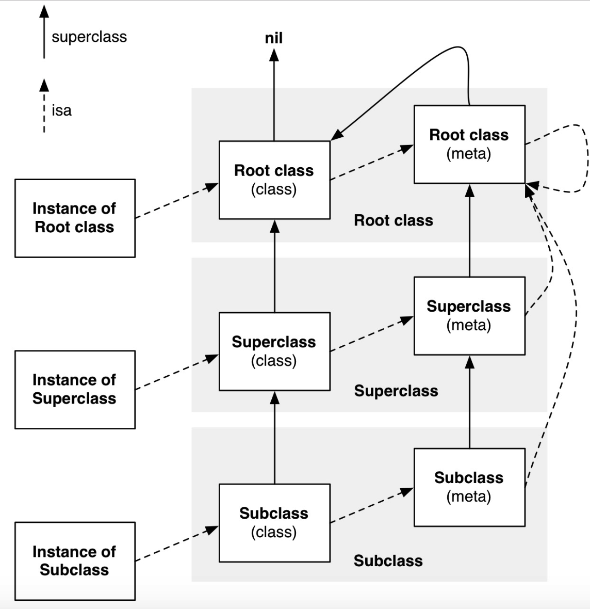

# 慢速查找流程实例

使用慢速查找流程实例，巩固和加深对流程的理解

普通的流程实现的方法调用就不过多描述

- 调用自身实现实例方法
- 调用父类实现实例方法
- 调用自身实现类方法


## 举例1

在 `NSObject+LGD` 类目中新增实例方法

```objc
@interface NSObject (LGD)
- (void)sayEasy;
@end

@implementation NSObject (LGD)

- (void)sayEasy{
    NSLog(@"%s",__func__);
}

@end
```

引用此类目，在 `main` 函数中使用继承自 `NSObject` 的类调用 `sayEasy` 方法

```objc
[LGD sayEasy];
```

### 问题

此时能否输出结果？

### 分析

- 类方法调用，即是查找其元类的实例方法

- 根据慢速查找流程，在元类的方法列表未查询到时，会递归查询其父类直至 `nil` 

根据如下的 `isa 流程图`  所示，



对照上述流程梳理 `[LGD sayEasy];`  方法调用的流程

- 首先查找 `LGD` 元类的方法列表，未查询到 `sayEasy` 方法
- 接着查找在 `LGD` 元类的父类的方法列表，最终查询至根元类，而根元类的父类指向了根类，当前类的根类即为 `NSObject` 
- 此时 `NSObject` 的类目实现了 `sayEasy` 方法，因此可在方法列表查询到，跳转调用此方法，进行了输出

### 验证

运行验证，输出日志

```shell
-[NSObject(LGD) sayEasy]
```

